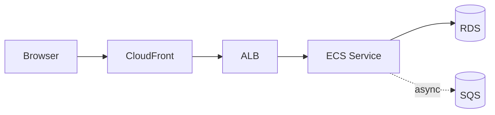

# How to read this repo

> **One-line summary.** Pick the directory that matches your question, then read the file. Every page follows the same shape so you can skim consistently.

## TL;DR
- Service pages tell you what a single AWS service is, when to use it, and what it costs you to misuse.
- Pattern pages are vendor-neutral building blocks (caching, sharding, sagas) cast onto AWS.
- Interview designs are full system design problems with capacity math and deep dives — written like a whiteboard session.
- Reference architectures are "how you'd actually build this at work," written like a runbook.
- Every page starts with a TL;DR and a "when to use / when NOT to use" pair. If you only read those two, you're 80% of the way there.

## The directory map

```
docs/
├── 00-getting-started/     ← you are here
├── 01-services/            ← one file per AWS service, grouped by category
├── 02-patterns/            ← reusable building blocks (caching, sharding, sagas...)
├── 03-interview-designs/   ← classic system design problems, AWS-mapped
├── 04-reference-architectures/  ← production-shaped blueprints
└── 05-well-architected/    ← deep-dives on the six pillars
```

The other top-level folders aren't reading material:

- `diagrams/python/` — Python source for code-rendered architecture diagrams.
- `images/` — the rendered PNG outputs.
- `scripts/` — `new_page.sh`, `render_diagrams.sh`, `validate_mermaid.sh`.
- `.github/` — CI workflows and issue/PR templates.

## How to pick the right section

| Your question | Read |
|---|---|
| "What's the difference between SQS and SNS?" | `docs/01-services/integration-messaging/` |
| "How should I do idempotent writes?" | `docs/02-patterns/idempotency.md` |
| "Design TinyURL on AWS." | `docs/03-interview-designs/url-shortener.md` |
| "Give me a serverless REST API blueprint." | `docs/04-reference-architectures/serverless-rest-api.md` |
| "What does AWS mean by 'Reliability'?" | `docs/05-well-architected/reliability.md` |

If the question crosses sections, start with the interview design or reference architecture page and let it route you to the services it depends on.

## How a page is structured

Every page in `01-services/`, `03-interview-designs/`, and `04-reference-architectures/` opens with:

1. **One-line summary** (in a blockquote, right under the title).
2. **TL;DR** — 3–5 bullets you can paste into a Slack message.
3. **When to use it / When NOT to use it** — two short lists.

After that:

- **Service pages** are short (600–1200 words). They cover key concepts, pricing model, quotas, common pitfalls, and what they pair well with. No requirements or architecture sections — they're documenting one service.
- **Interview designs** are long (1500–3500 words). They cover functional/non-functional requirements, capacity estimates, an AWS-mapped high-level architecture diagram, data model, API design, 2–4 deep dives on the hard parts, AWS services used, cost shape, failure modes, and trade-offs.
- **Reference architectures** are medium (1000–2500 words). Same template as interview designs, but framed as "how would I actually build this on Monday" rather than "how would I whiteboard this in an interview."

See `CONTRIBUTING.md` in the repo root for the canonical template.

## How to read a diagram

Diagrams come in two flavors:

- **Mermaid** — fenced code blocks that GitHub renders inline. Use these for request flows, sequences, state machines, and ERDs. A flowchart with `LR` direction shows data flowing left-to-right; arrows are solid for synchronous calls and dashed for asynchronous (queue, event, fire-and-forget).
- **Python `diagrams`** — committed as both the `.py` source and the rendered `.png`. These are used for AWS architecture diagrams that need official AWS icons. The `.png` is what you see in the markdown; the `.py` lives in `diagrams/python/<category>/<slug>.py` so you can read or edit the source.

A small worked example you'll see often:



The dashed arrow tells you the ECS service doesn't wait for SQS — it enqueues and moves on.

## How to read trade-offs

Every interview design and reference architecture page has a **Trade-offs & Alternatives** section. It exists because the canonical answer to most system design questions is "it depends, and here's what it depends on." If a page doesn't make the trade-offs explicit, it's incomplete — open an issue.

Where it's relevant, the page calls out non-AWS alternatives at the component level (Kafka instead of Kinesis, Postgres on EC2 instead of RDS, Cassandra instead of DynamoDB). That's intentional — you should know the AWS-native answer and what you're giving up by taking it.

## Accuracy expectations

AWS deprecates and renames services often. Pages note status changes at the top — for example, services that are closed to new customers (CodeCommit, Cloud9, QLDB at various points) say so up front. Quantitative claims (latency, throughput, quotas, price) are either verified against current AWS docs or omitted with a link out. If you spot a stale number or a renamed service, open a [correction issue](../../.github/ISSUE_TEMPLATE/correction.md).

## How to contribute

`scripts/new_page.sh <kind> <slug>` scaffolds a page from the right template. See `CONTRIBUTING.md` for the full process, the page template, diagram conventions, the local pre-commit setup, and the DCO sign-off requirement.

## Further reading
- [System design primer](system-design-primer.md) — vocabulary you'll see on every page in this repo.
- [AWS mental model](aws-mental-model.md) — Regions, AZs, edge, IAM, shared responsibility.
- [`CONTRIBUTING.md`](../../CONTRIBUTING.md) — the canonical page template.
