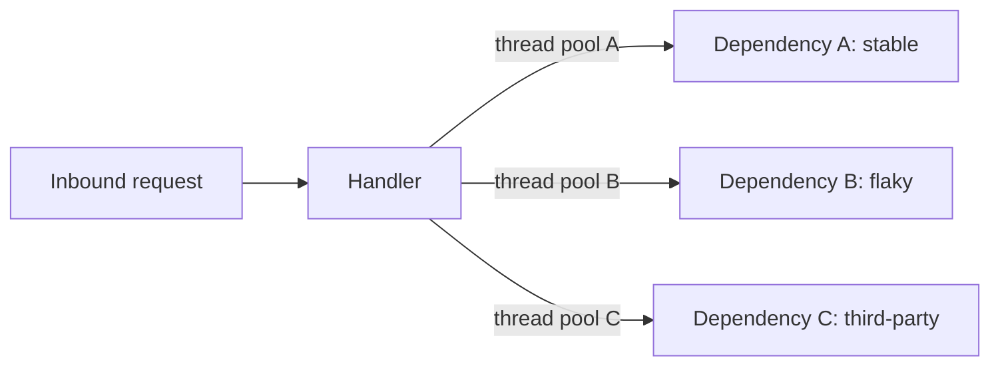

# Bulkhead

> **One-line summary.** Isolate resources (thread pools, connection pools, queues) per dependency so one slow / failing dependency can't starve the whole service. The "watertight compartment" of distributed systems.

## TL;DR
- Borrowed from ship design: a leak in one compartment doesn't sink the ship.
- Per-dependency thread pools / connection pools / semaphores: a slow downstream's blocked threads stay in *its* pool, not the global pool.
- Per-tenant / per-customer resource caps in multi-tenant systems: one tenant can't starve others.
- Pairs naturally with [circuit-breaker](circuit-breaker.md) (decides whether to call) and [rate-limiting](rate-limiting.md) (caps inbound rate).
- The single most-overlooked pattern in production incidents — "we had circuit breakers" rarely saves a service whose connection pool is already exhausted by the time the breaker trips.

## When to use it
- Services calling multiple downstreams with different reliability profiles.
- Multi-tenant systems where one tenant's bad behavior must not affect others.
- Services with shared queues / thread pools / connection pools that could starve.
- ECS / EKS workloads where one container shouldn't be able to exhaust node-level shared resources.

## When NOT to use it
- Single-dependency services — there's nothing to isolate from.
- Trivially-parallel workloads with no shared resources.
- Tiny throughput services where the additional configuration outweighs the benefit.

## How it works

### Per-dependency thread pools

If Dependency B becomes slow / unresponsive, pool B fills with stuck calls. **Pool A and C are unaffected.** Pool B's exhaustion just means calls to B fail fast (or queue); other dependencies remain reachable.

Without bulkheads, all three calls share the global pool. B's slowness exhausts the pool; A and C calls can't get a thread.

### Per-tenant resource caps
A multi-tenant SaaS reads from a shared DB. Cap concurrent queries per tenant (per-tenant connection pool, per-tenant rate limit). One tenant's heavy load can't starve others.

### Process / instance isolation
The strongest bulkhead: separate processes / pods / accounts entirely. AWS account-per-environment, ECS task-per-tenant, namespace-per-team in EKS.

## Key concepts

**Bulkhead size.** Each pool / quota has a fixed size. Too small: legitimate load is throttled even when the dependency is healthy. Too big: pool exhaustion still possible. Size pools based on **dependency latency × expected concurrency × safety margin** (Little's Law).

**Failure mode when bulkhead exhausts.** Two options:
- **Reject** — fail fast (default for bounded queues / semaphores).
- **Queue with timeout** — wait briefly, then fail.

Reject is usually right; queueing inside a bulkhead defeats its fail-fast purpose.

**Thread pool vs semaphore.** Thread pool isolation = separate OS threads, separate context switches, more overhead, more memory. Semaphore isolation = same thread pool, cap concurrent requests via a semaphore; no isolation if a request blocks indefinitely. Thread pools provide stronger isolation; semaphores are cheaper.

**Connection pool isolation.** Apps share a database connection pool. A slow query holds a connection. Solution: separate pools per query class / per dependency, with per-pool limits.

**Per-tenant fairness vs aggregate cap.** Per-tenant quota = strict fairness, possibly under-utilized capacity. Weighted-share = better utilization, less predictable per-tenant.

**Static bulkheads vs adaptive concurrency.** Static = fixed pool sizes. Adaptive (Netflix's concurrency-limits, AIMD-based libraries) = adjust pool size based on observed latency / errors. Static is simpler; adaptive handles changing conditions better.

## AWS-native implementations

| Layer | Bulkhead option |
|---|---|
| Application (thread pools) | Resilience4j Bulkhead (Java), Polly Bulkhead Isolation (.NET), custom semaphore pools |
| Connection pools | HikariCP per-target, pgbouncer per-pool, RDS Proxy per-app-role |
| Lambda concurrency isolation | **Reserved concurrency** per function — caps one function's concurrency to protect others sharing the account concurrency pool |
| ECS / EKS resource isolation | Per-container CPU / memory limits; per-pod resource requests/limits in Kubernetes |
| Queue isolation | **Per-tenant SQS queues** (vs one shared queue); per-priority queues for high vs low priority work |
| Account-level bulkhead | AWS Organizations with per-environment / per-team accounts — the strongest isolation |
| Per-tenant DynamoDB | Per-tenant table partitions (sharding); on-demand capacity to prevent one tenant's throttle from affecting another |

### Lambda reserved concurrency as bulkhead
Without reserved concurrency, all functions share the account concurrency pool (default 1,000). One runaway function uses all 1,000 → other functions throttle. Setting **reserved concurrency** per function carves out a guaranteed slice. **Setting reserved concurrency to 0** is also a kill switch — disables the function entirely.

## Common pitfalls

- **Global thread pool serving all dependencies.** Worst-case scenario; one slow dependency starves the rest.
- **Pool sized for happy path.** Under load, the pool is the bottleneck even when the dependency is healthy. Size for peak + headroom.
- **Pool exhaustion = silent error.** When the pool's full, do clients get a clear error? Or do they just see a timeout? Make the rejection observable.
- **No metric on pool utilization.** "We hit pool limit" should be a metric you watch. Without it, you don't know if the bulkhead is helping or starving.
- **Per-tenant quotas without monitoring per-tenant usage.** Adjust per-tenant caps based on observed legitimate use, not gut feel.
- **Lambda concurrency without reserved per-function.** All functions share the pool; a misbehaving function starves the rest.
- **Bulkhead but no circuit breaker.** The pool fills with stuck requests because no one's saying "stop calling this dependency." Combine the two.
- **Static pools when load is varying 10×.** Adaptive concurrency adapts; static needs over-provisioning for safety. Trade complexity for flexibility.
- **Bulkhead at the wrong granularity.** Per-Region pool when the slow thing is per-tenant doesn't help. Match isolation granularity to failure granularity.

## Trade-offs & Alternatives

- **Bulkhead vs circuit breaker.** Different problems. Bulkhead isolates resources; breaker stops calling a failing dependency. Use both.
- **Bulkhead vs per-instance scaling.** "Just scale the service" doesn't solve resource contention within an instance — one slow dependency still starves other dependencies' threads. Bulkhead first; scale to handle volume.
- **Thread pool vs semaphore.** Thread pool = stronger isolation, more overhead. Semaphore = lighter, less protection. Most production setups use thread pools for high-risk dependencies, semaphores for everything else.
- **Per-tenant accounts (strongest) vs per-tenant queues vs per-tenant rate limits (weakest).** Move up the strength scale as risk and contention grow.

## Common pitfalls (architectural)

- **No chaos testing of bulkheads.** A bulkhead "exists" but you've never verified it works under real failure. Use **AWS FIS** to inject latency / errors against a specific dependency and confirm the bulkhead isolates.
- **Bulkheads added after the incident.** Like circuit breakers, the failure mode that requires them happens before they're built. Build them proactively.

## Further reading
- *Release It!*, Michael Nygard — original framing of the bulkhead pattern in distributed systems.
- ["Caching challenges and strategies", Amazon Builders' Library](https://aws.amazon.com/builders-library/caching-challenges-and-strategies/) — bulkheads are mentioned in the cache-protection sections.
- [Resilience4j Bulkhead](https://resilience4j.readme.io/docs/bulkhead).
- [Polly Bulkhead Isolation (.NET)](https://github.com/App-vNext/Polly/wiki/Bulkhead).
- [Lambda reserved concurrency docs](https://docs.aws.amazon.com/lambda/latest/dg/configuration-concurrency.html).
- [Netflix concurrency-limits library](https://github.com/Netflix/concurrency-limits) — adaptive bulkheading.
