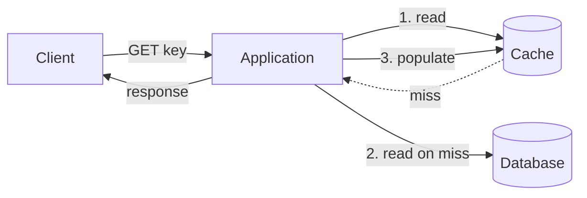

# Caching strategies

> **One-line summary.** Faster reads, lower database load, lower cost — at the price of consistency complexity and cache-invalidation pain.

## TL;DR
- Three classic patterns: **cache-aside (lookaside)**, **read-through**, **write-through** / **write-behind**. Each handles a different read / write workload shape.
- The two hard problems are **invalidation** (when to remove or update cached entries) and **cold-start / stampede** (what happens when many requests miss simultaneously).
- TTL + jitter is the single highest-leverage safety net. It bounds staleness automatically and prevents synchronized eviction.
- AWS pairings: **ElastiCache** (Valkey / Redis OSS / Memcached) for application caches, **DAX** for transparent DynamoDB caching, **CloudFront** for HTTP / asset caching, **DynamoDB On-Demand** + **DAX** combo for hot key smoothing.
- Cache only where measurement shows a benefit. A cache without metrics is a silent source of stale-data bugs.

## When to use it
- Read-heavy workloads where the same data is fetched many times.
- High-latency upstream stores (multi-Region DBs, third-party APIs).
- Hot-key smoothing for write-heavy NoSQL tables.
- HTTP / static-asset delivery via a CDN.

## When NOT to use it
- Strictly consistent reads required on every request — cache adds eventual consistency you don't want.
- Workloads with no read repetition (every request unique).
- Tiny scale where the operational cost of the cache > the savings.

## How it works

### 1. Cache-aside (lookaside) — the default

App owns the cache logic — read cache, fall back to DB on miss, populate cache. Standard pattern for Redis / Valkey / Memcached.

### 2. Read-through
The cache sits *in front of* the DB; misses are resolved by the cache itself (via a loader function). Simpler app code; less flexible. Common with embedded caches (Caffeine, Guava) and some managed caches.

### 3. Write-through
Every write goes through the cache, which writes to the DB synchronously before responding. Cache always consistent with DB; writes are slower.

### 4. Write-behind (write-back)
Writes hit the cache and acknowledge immediately; the cache flushes to the DB asynchronously. Fastest writes; risk of data loss on cache failure.

### 5. Refresh-ahead
Cache proactively refreshes entries before TTL expiry. Used for predictable hot keys to avoid latency spikes when entries expire.

## Key concepts

**TTL (Time To Live).** Every cached entry expires after N seconds. The simplest invalidation. Pair with **jitter** (random ±10%) to prevent synchronized expiry causing thundering herds.

**Eviction policies.** When the cache is full, what gets removed?
- **LRU** (Least Recently Used) — the default. Right for typical web workloads.
- **LFU** (Least Frequently Used) — better for power-law distributions.
- **TTL-based** — evict expired entries first.
- **No eviction** (Redis `noeviction`) — fails writes when full. Almost always wrong for caches.

**Cache key design.** Include all variants that change the result: user-ID, locale, currency, A/B test bucket. A poorly designed key conflates results across users.

**Cache stampede / thundering herd.** When a hot key expires, every request misses simultaneously, hammering the DB.

Mitigations:
- **Request coalescing** — only one in-flight request per key fetches from DB; others wait.
- **Probabilistic early expiration** — refresh "early" with increasing probability as TTL approaches.
- **Staggered TTLs** with jitter.
- **Warming** during deploy or via background refresh.

**Invalidation strategies:**
- **TTL** — accept staleness up to TTL.
- **Write-through invalidation** — invalidate / update cache on every DB write.
- **Event-driven invalidation** — DB change events (DynamoDB Streams, CDC) propagate to cache.
- **Cache busting via versioned keys** — change the key (`user:42:v2`) instead of invalidating.

**Cache locality** — Memcached / Redis cluster distribute keys via consistent hashing. Hot keys can land on one node; mitigate by replicating hot keys across multiple keys (`hot_key:1`, `hot_key:2`).

## AWS-native implementations

| Use case | AWS service |
|---|---|
| Application data cache (KV / lists / pub-sub) | [ElastiCache for Valkey](../01-services/database/elasticache.md) (recommended) or Redis OSS / Memcached |
| DynamoDB transparent cache | [DAX](../01-services/database/dynamodb.md) |
| Durable Redis (cache + system of record) | [MemoryDB](../01-services/database/memorydb.md) |
| HTTP / asset CDN | [CloudFront](../01-services/networking/cloudfront.md) |
| API Gateway response cache | API Gateway REST API caching |
| In-process function cache | Lambda extension caching for [Secrets Manager / Parameter Store](../01-services/security-identity/parameter-store.md) |
| Read-replica cache for relational | [RDS](../01-services/database/rds.md) / [Aurora](../01-services/database/aurora.md) read replicas (different pattern; see [read-replicas-vs-caching](read-replicas-vs-caching.md)) |

## Common pitfalls

- **`noeviction` policy in production.** Memory fills → writes fail. Use `allkeys-lru` for caches.
- **No TTL.** Cached data stale forever, evicted at random.
- **Hot keys.** A single key everyone reads = single-shard CPU bottleneck. Replicate hot keys across multiple keys / nodes.
- **Cache stampede on deploy.** Cold cache + production traffic = DB overload. Warm caches before traffic shift; use request coalescing.
- **Caching personalized responses with the wrong key.** Two users see each other's data. Include user-ID / session in the cache key.
- **Caching writes "for performance" without write-through.** App caches a value it just wrote; another instance reads stale data. Either write-through or invalidate-after-write.
- **Big-object caches.** A 1 MB payload in Redis wastes memory; sometimes the right cache is "the result of the upstream computation," not "the raw upstream response."
- **No metrics.** Cache hit ratio, eviction rate, memory pressure. Without these, you don't know if the cache is working.

## Trade-offs & Alternatives

- **Cache vs read replica.** Caches answer "this exact query has been asked recently;" read replicas answer "any query at a slightly stale point in time." See [read-replicas-vs-caching](read-replicas-vs-caching.md).
- **Application cache vs DB query cache.** Application cache (Redis) is more flexible and more work; DB query cache (e.g., Aurora cluster cache, MySQL query cache — deprecated upstream) is transparent but limited.
- **Local (in-process) vs distributed cache.** Local caches are faster (no network); distributed caches are coherent across instances. Most production apps use both layered (local for sub-ms, distributed for cross-instance coherence).
- **Cache vs precompute.** If the answer rarely changes, precompute and store the answer directly (materialized view, denormalized table) — no cache needed.

## Further reading
- ["Caching challenges and strategies", Amazon Builders' Library](https://aws.amazon.com/builders-library/caching-challenges-and-strategies/).
- *Designing Data-Intensive Applications*, Martin Kleppmann, Chapter 5 (Replication).
- [ElastiCache best practices](https://docs.aws.amazon.com/AmazonElastiCache/latest/red-ug/BestPractices.html).
- [DynamoDB Accelerator (DAX) docs](https://docs.aws.amazon.com/amazondynamodb/latest/developerguide/DAX.html).
- ["Cache stampede" — Wikipedia and the probabilistic-early-expiration paper](https://en.wikipedia.org/wiki/Cache_stampede).
