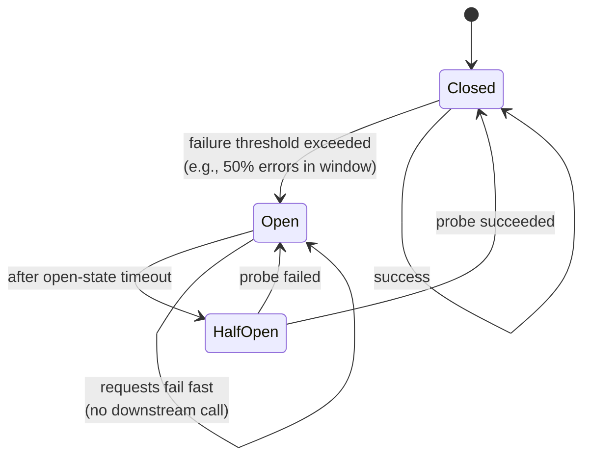

# Circuit breaker

> **One-line summary.** When a downstream is failing, stop calling it for a window. Fail fast, give the downstream room to recover, prevent cascading failure.

## TL;DR
- A three-state machine — **closed** (normal), **open** (failing fast, not calling downstream), **half-open** (probing to see if downstream recovered).
- Designed for **synchronous** calls — async work with retries / DLQs is a different shape (queues *are* the buffer).
- The point isn't to "fix" the downstream — it's to (a) stop pouring more requests onto a struggling dependency, and (b) free the caller's resources (threads, connection pool slots) so unrelated work keeps moving.
- Pairs naturally with **timeouts**, **retries with backoff**, **bulkheads**, **fallbacks** (cached / default responses).
- AWS-native: most service SDKs include adaptive retry / circuit-breaker-like behavior; for service-mesh circuit-breakers, **VPC Lattice** / **App Mesh** (closing) / **ECS Service Connect**; libraries: **Resilience4j** (Java), **Polly** (.NET), **pybreaker** (Python).

## When to use it
- Sync RPC / HTTP / gRPC calls to dependencies you can't trust to always be healthy.
- Calls to third-party APIs (payment providers, vendor APIs, social-login providers).
- DB / cache calls when the DB is slow enough to threaten thread starvation.
- Aggregating responses from many backends — break the chain for the dead one rather than letting it hang the whole composite response.

## When NOT to use it
- Async / queue-based work — backpressure / DLQs are the right tools.
- Calls within the same process — circuit-break the downstream call, not the in-process function.
- Workloads where falling back to "fail fast" is worse than waiting — pure-bursty downstream where a slow response is still better than no response.
- Very-low-volume calls — not enough signal to detect failure.

## How it works

- **Closed** — all requests go through. Track success / failure rate over a sliding window.
- **Failure threshold exceeded** (e.g., error rate > 50% over last 60 seconds with at least 20 calls) → trip to **Open**.
- **Open** — for a fixed timeout (e.g., 30 seconds), reject all requests immediately (fail-fast, no network call).
- **After timeout**, transition to **Half-open** — allow one (or a small number) of probe requests through.
- Probe success → **Closed** (recover); probe failure → back to **Open** with another timeout.

### Per-instance vs distributed
- **Per-instance circuit breakers** are the norm — each application instance maintains its own state. Simple, fast, no extra dependencies.
- **Distributed circuit breakers** share state across instances (Redis / DynamoDB). More accurate at low volumes per instance; adds a dependency.

## Key concepts

**Failure threshold.** What counts as "failure"? Time-outs, HTTP 5xx, connection errors. Application-level errors (HTTP 4xx) are usually not breaker-tripping — they're business errors, not dependency failures.

**Window and counting.** Two common shapes:
- **Sliding-window count** — last N requests.
- **Sliding-window time** — last N seconds.

Combined: "open if error rate > X% over the last Y seconds with a minimum of Z requests."

**Slow-call threshold.** Sometimes a downstream isn't returning errors but is responding very slowly. Resilience4j and similar libraries also trip on slow-call ratios (e.g., open if > 50% of recent calls took > 1 second).

**Open-state timeout.** How long to stay open before probing. Too short = repeatedly hammering a recovering dependency. Too long = users wait unnecessarily. Common range: 10–60 seconds; adapt based on the dependency's recovery profile.

**Half-open probe count.** Most libraries allow N concurrent probes; if all succeed, close. Single-probe is conservative; many-probe is faster recovery.

**Fallback.** What happens when the breaker is open? Options:
- **Error** — fail fast with a 503 or domain-specific error.
- **Cached response** — last known good (good for read-mostly traffic).
- **Default value** — e.g., recommendations service down → return popular items.
- **Degrade UX** — hide the failing feature.

**Bulkhead pairing.** A circuit breaker prevents cascading failure *if* the caller's resources (threads, connection pool slots) are released when the breaker is open. Combine with [bulkheads](bulkhead.md) (per-dependency thread pools / queues).

## AWS-native implementations

| Layer | Option |
|---|---|
| App-level (Java) | **Resilience4j**, **Hystrix** (deprecated; use Resilience4j) |
| App-level (.NET) | **Polly** |
| App-level (Python) | **pybreaker**, **circuitbreaker** |
| App-level (Go) | **sony/gobreaker** |
| Service mesh | **VPC Lattice**, **ECS Service Connect**, **App Mesh** (closing 2026-09-30 — see [App Mesh](../01-services/networking/app-mesh.md)) |
| SDK-level retry / breaker | AWS SDKs include adaptive retry with backoff (similar effect for AWS-service calls) |
| API Gateway | Use throttling + integration timeouts; for full breaker semantics, wrap in Lambda with a breaker library |

## Common pitfalls

- **No bulkhead.** Breaker opens but the calling thread is still blocked waiting on a slow request that never got cancelled. Combine with thread / connection-pool isolation and request timeouts.
- **Breaker on the same connection pool as healthy work.** A slow downstream consumes all connections; even an open breaker doesn't free in-flight ones. Per-dependency pools.
- **Threshold too sensitive.** Trip on every blip; flapping. Set thresholds high enough to absorb normal jitter.
- **Threshold too tolerant.** Half the traffic erroring before opening = downstream death by stampede. Bias toward earlier opening.
- **No fallback strategy.** Open breaker + naive error = user-visible failure. Define what "degraded" looks like for each dependency.
- **Distributed state for what could be local.** Shared breaker state across instances adds a dependency and isn't usually necessary.
- **Treating 4xx as failure.** A `400 Bad Request` is a client bug, not a dependency problem. Trip on connection errors, timeouts, and 5xx.
- **Reset only after manual intervention.** Breakers should self-heal via half-open probes. Manual-reset breakers are pages-at-3-AM.
- **Counting circuit-breaker rejections in your error metrics.** "100% errors" because the breaker is open is technically true but uninformative. Tag breaker-driven rejections separately.
- **No metrics on breaker state.** When did it open? How long was it open? Without metrics, you don't know if the breaker is helping or hurting.

## Trade-offs & Alternatives

- **Breaker vs retry-and-hope.** Naive retries amplify the load on a struggling downstream. Breakers + retries combine: breaker decides whether to call at all; retry handles transient blips within healthy windows.
- **Breaker vs queue-based backpressure.** Queues absorb bursts; breakers fail fast. Use queues for async work; breakers for sync.
- **Library breaker vs service-mesh breaker.** Library is precise per-call but per-language. Service mesh applies uniformly but with coarser granularity. Many setups use both.
- **Breaker vs rate limiter.** Different problems. Rate limiter caps *your* outbound rate (you're the source of load); breaker stops calling a *failing* downstream (you're protecting yourself and the dependency).

## Common pitfalls (architectural)

- **Circuit-breaker as the only resilience tool.** Resilience is layered: timeouts + retries with backoff + breakers + bulkheads + fallbacks + idempotency + chaos testing. Any single tool alone is brittle.
- **No chaos testing.** Breakers only matter when downstreams fail. Without injecting failures, you don't know if the breaker actually works. Use **AWS Fault Injection Service (FIS)**.

## Further reading
- ["Avoiding insurmountable queue backlogs", Amazon Builders' Library](https://aws.amazon.com/builders-library/avoiding-insurmountable-queue-backlogs/).
- *Release It!*, Michael Nygard — the canonical reference for stability patterns (circuit breaker, bulkhead, timeout, retry, fail fast).
- [Resilience4j docs](https://resilience4j.readme.io/).
- [Polly docs (.NET)](https://www.thepollyproject.org/).
- [AWS Fault Injection Service (FIS)](https://docs.aws.amazon.com/fis/) — for testing circuit breakers under real failure injection.
