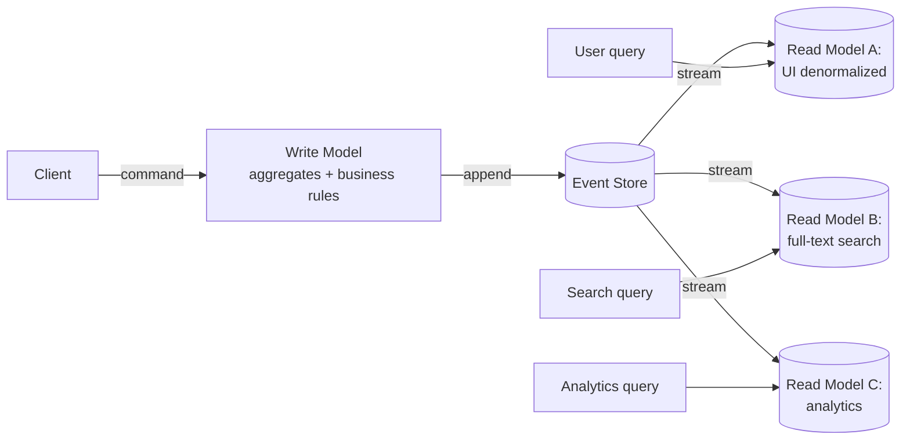
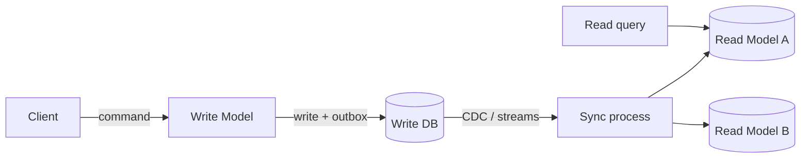

# CQRS (Command Query Responsibility Segregation)

> **One-line summary.** Separate the model that writes data from the model that reads it. Optimize each independently — write model for business rules and consistency; read models for query shape and latency.

## TL;DR
- Two distinct models, optionally two distinct stores. Commands mutate the write model; queries read from one or many read models (projections).
- Strongest pairing: **CQRS + event sourcing** (write model emits events; read models project from the event stream). Also works without event sourcing — outbox + CDC keeps read models in sync.
- The point: a single CRUD model serves writes (need consistency, validation) and reads (need denormalization, joins, search) badly. Splitting lets each be good at its job.
- Trade-off: more moving parts, eventual consistency between write and read, more sophisticated deployment / ops.
- AWS-native: **DynamoDB** (write model with consistent writes) + **DynamoDB Streams** → projections in **OpenSearch / Aurora / Redshift / S3 + Athena**. Or **Aurora write** + **CDC via DMS** to read models.

## When to use it
- Read and write workloads have very different shapes (write = small transactional updates, read = analytical or full-text search).
- Multiple read use cases need different denormalizations (user-facing UI vs analytics vs compliance).
- Domain has rich business logic on writes that benefits from a focused model.
- Already adopting event sourcing — CQRS comes naturally.

## When NOT to use it
- Simple CRUD workloads where one model serves both.
- Read-mostly workloads where caching gets you 95% of the benefit.
- Tight read-after-write consistency requirements (the eventual consistency of separate read models won't fit).
- Tiny systems — the operational overhead isn't justified.

## How it works

### CQRS with event sourcing (the classic pairing)

Write side: commands → aggregates → events. Read side: projections subscribe to the event stream and maintain denormalized read models.

### CQRS without event sourcing (lighter-weight)

Write side: standard CRUD with a transactional outbox. Read models maintained from CDC / outbox stream. No event-sourced history; just denormalized views over current state.

## Key concepts

**Command.** A request to change state. May be rejected (validation failures). Examples: `CreateOrder`, `CancelSubscription`, `TransferFunds`. Imperative, returns success / failure.

**Query.** A read. Always succeeds (modulo errors). Returns data. Never mutates.

**Write model (command model).** Owns business logic and consistency. Often a domain model (DDD aggregates). Storage optimized for transactional integrity.

**Read model (query model).** Denormalized view tailored to a specific query. Often eventually consistent vs the write model. Multiple read models per write model.

**Projection.** The process that updates a read model from the write-side event / change stream. Typically a Lambda / consumer that reads the stream and applies updates.

**Eventual consistency window.** Between write commit and read-model update, there's a lag (ms to seconds). The system as a whole is eventually consistent; the write model is strongly consistent within itself.

**Read-after-write.** A user makes a change and immediately queries the read model — and may see stale data. Mitigations:
- Have the UI optimistically show the new state while the projection catches up.
- For the same-user same-write read, query the write model directly (or wait for confirmation that the projection is up to date).
- Use a session-bound "last write timestamp" to gate reads.

## AWS-native implementations

### DynamoDB + Streams + projections
- **Write model:** DynamoDB with single-table design + conditional writes for transactional consistency per aggregate.
- **Streams:** DynamoDB Streams capture every change.
- **Projections (Lambda consumers):**
  - **OpenSearch** for full-text / faceted search.
  - **Aurora (relational)** for ad-hoc analytical queries / reporting.
  - **S3 + Athena** for analytics / data lake.
  - **Another DynamoDB table** for a different access pattern (e.g., a per-user activity feed).
- **Outbox pattern** for events to other bounded contexts.

### Aurora + DMS + projections
- **Write model:** Aurora MySQL / PostgreSQL for the OLTP transactional model.
- **DMS / Aurora Zero-ETL** ships changes to:
  - **Redshift** for analytics.
  - **OpenSearch** for search.
  - **S3** for the lakehouse / archival.
- Operational reads still go to the Aurora write model (or read replicas) when consistency matters.

### Event-sourced CQRS on DynamoDB
- **Event store table:** `(aggregate_id, sequence_number, payload)`.
- **Streams + projections** as above.
- Snapshot table for fast aggregate loading.
- See [event-sourcing](event-sourcing.md) for details.

## Common pitfalls

- **CQRS for everything.** Not every aggregate needs CQRS. Use it where the read/write shape differs meaningfully.
- **Coupling read models to specific UI screens.** Read models should serve a *query pattern*, not a specific UI revision. Otherwise UI changes cascade into read-model rebuilds.
- **No read-after-write strategy.** Users immediately see stale data; trust erodes. Hide the eventual consistency window with UI tricks or selective consistent reads.
- **Read models that fall behind during incidents.** A projection consumer lagging by hours = stale dashboards. Alarm on consumer lag.
- **Synchronous projection on the write path.** "Update the projection in the same transaction as the write" recreates the dual-write problem the outbox solves. Always async via stream / outbox.
- **No rebuild strategy.** When you add a new field or fix a bug in the projection, you need to rebuild. Plan replays from the event store / change history.
- **Treating the write model as the only-correct view.** Read models can be correct for *their* purpose; the write model isn't always the right answer for every read.

## Trade-offs & Alternatives

- **CQRS vs read replicas.** Read replicas serve the *same schema* as the writer (just stale). CQRS serves *different schemas* tailored to query needs. Read replicas for "scale reads;" CQRS for "different query shapes."
- **CQRS vs caching.** Caches sit in front of a single model. CQRS materializes different models. Both can coexist.
- **CQRS without event sourcing.** Lighter-weight: standard CRUD on the write side, CDC / outbox to maintain read models. Loses the audit history.
- **CQRS with event sourcing.** Full power, more complexity. Worth it when audit matters and the domain is rich.
- **Single-model CRUD.** The default. When read and write shapes are similar enough, CQRS is overkill.

## Common pitfalls (architectural)

- **Treating CQRS as a system-wide architecture.** It's a per-bounded-context pattern. Some bounded contexts benefit; others don't.
- **No clear ownership of projections.** Who fixes a broken projection? Without a team owner, projections rot.
- **No replay tooling.** When a projection is wrong, you need to rebuild it. Build replay / backfill tooling from day one.
- **Two databases without enforcing the asymmetry.** Devs write reads against the write model "for convenience," undermining the split. Make the write model unavailable for reads at the network / IAM layer.

## Further reading
- ["CQRS", Martin Fowler](https://martinfowler.com/bliki/CQRS.html).
- *Implementing Domain-Driven Design*, Vaughn Vernon.
- ["Pattern: CQRS", microservices.io](https://microservices.io/patterns/data/cqrs.html).
- [DynamoDB CQRS event store pattern (AWS blog)](https://aws.amazon.com/blogs/database/build-a-cqrs-event-store-with-amazon-dynamodb/).
- *Designing Data-Intensive Applications*, Martin Kleppmann.
- Related repo pages: [event-sourcing](event-sourcing.md), [outbox](outbox.md).
