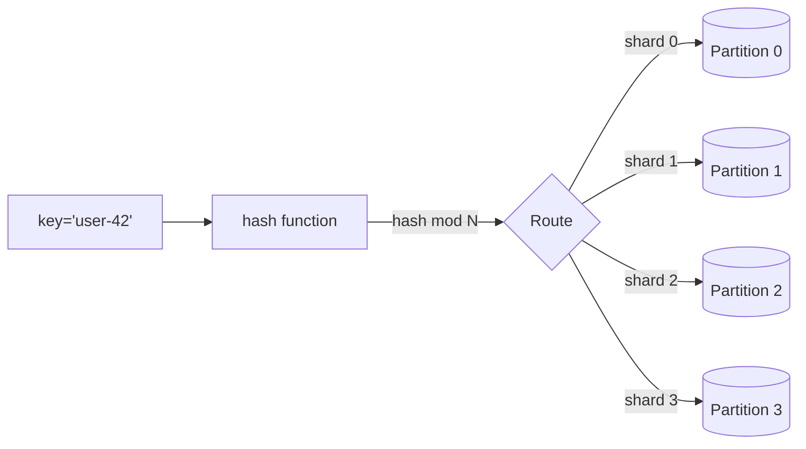

# Data partitioning / sharding

> **One-line summary.** Split data across nodes / partitions by a key so the workload distributes evenly. The fundamental scaling lever for any storage system beyond a single host.

## TL;DR

- Three classic strategies: **hash-based** (consistent hashing — most common), **range-based** (sorted by key — good for range scans, prone to hotspots), and **directory-based** (lookup table — flexible but adds a hop).
- The hard problems are **hot keys / hot partitions**, **rebalancing** when partitions are added/removed, and **secondary-index access patterns** that don't align with the partition key.
- AWS-native: **DynamoDB partitions** (auto-managed via partition key), **Aurora Limitless** (sharded PostgreSQL with one endpoint), **Kinesis shards** (partition key chooses shard), **Redis Cluster slots** (hash slots across nodes).
- Pick the partition key by **access pattern**, not by "the most-used column." A poor key is the single biggest cause of NoSQL performance disasters.
- Cross-partition transactions / queries are expensive — design to keep related data on the same partition where possible.

## When to use it

- Datasets too large for a single host's storage / RAM / CPU.
- Throughput too high for a single host (>10K writes/sec, >100K reads/sec — engine-dependent).
- Workloads where horizontal scaling is the only realistic path (most internet-scale workloads).
- Multi-tenant systems where tenant isolation matters (tenant-ID as partition key).

## When NOT to use it

- Datasets that fit on one host with headroom — a single primary + read replicas is simpler.
- Workloads where the query pattern crosses partitions on every read — defeats the point.
- Tiny systems where the operational overhead exceeds the benefit.

## How it works

### Hash-based partitioning

- Hash the key (`hash(user_id)`), take modulo (or use consistent hashing) to pick a partition.
- Even distribution if keys are uniform.
- Adding / removing partitions reshuffles most keys (mitigated by **consistent hashing** — only a fraction of keys move).

### Range-based partitioning

- Keys ordered; partitions cover ranges (`a-d` → P0, `e-h` → P1, etc.).
- Efficient range scans (good for time-series, alphabetical lookups).
- Hot ranges if data is non-uniformly distributed (everyone's signing up today → today's range is hot).

### Directory-based (lookup) partitioning

- Maintain a `(key → partition)` directory (often in ZooKeeper / etcd / Redis).
- Maximum flexibility — move any key to any partition without rehashing.
- Adds a lookup hop; the directory is itself a scaling concern.

### Consistent hashing

- Hash the key onto a circular space; hash the partition IDs to the same space.
- A key belongs to the next partition clockwise.
- Adding a partition redistributes only the keys between its position and the next — minimal churn.
- Used by Cassandra, DynamoDB internally, Memcached client-side, Redis Cluster.

## Key concepts

**Partition key.** The attribute hashed / ranged to choose a partition. Picks should distribute load *and* keep related queries on one partition.

**Composite / compound key.** Many systems support `(partition_key, sort_key)`. Partition key picks the shard; sort key orders within. DynamoDB's PK+SK is canonical.

**Hot partition / hot key.** One key (or a small subset) sees disproportionate traffic. A "celebrity user's tweet" hammers their partition. Mitigations:

- **Sharding the hot key** — append a random suffix (`celebrity:1`, `celebrity:2`, …), spread writes, aggregate reads.
- **Read replicas** for the hot partition (DAX in front of DynamoDB).
- **Pre-aggregation** — don't read raw data on the hot path; read precomputed counts.
- **Cache** for the hot key.

**Rebalancing.** When partitions are added (scale-out) or removed (scale-in), data has to move. Strategies:

- **Resharding** (full reshuffle — Cassandra, custom systems). Slow, disruptive.
- **Consistent hashing** (incremental movement).
- **Pre-allocation** (start with N "virtual partitions" mapped to M physical nodes; reassign virtual partitions when scaling). Used by DynamoDB internally.

**Secondary indexes.** A query that doesn't include the partition key has to fan out across all partitions (scatter-gather). Mitigations:

- **Global Secondary Indexes (GSIs)** — DynamoDB's term for a second physical table indexed differently.
- **Inverted indexes / projections** — maintain a denormalized view in OpenSearch / Elasticsearch.
- **Materialized views** via [CQRS](cqrs.md) projections.

**Cross-partition transactions.** Generally hard. DynamoDB `TransactWriteItems` works across items (and tables) but caps at 100 items / 4 MB. Sharded SQL (Aurora Limitless) supports cross-shard SQL transactions with caveats. **Saga pattern** is the loose alternative for cross-partition workflows.

**Range scans across partitions.** `SELECT * WHERE timestamp BETWEEN X AND Y` on a hash-partitioned table → scatter-gather. If range scans are the dominant access pattern, range-partition; if not, the cost is occasional.

## AWS-native implementations

| System | Partitioning model |
|---|---|
| **DynamoDB** | Hash partitioning by partition key; auto-managed under the hood (10 GB per partition, ~3K RCU / 1K WCU per partition baseline) |
| **Aurora** | Single-writer; Aurora Limitless adds sharded PostgreSQL with one endpoint |
| **RDS** | Single-writer; manual sharding via app-level routing |
| **Kinesis Data Streams** | Hash partitioning by partition key into shards |
| **Kafka / MSK** | Hash partitioning by key into partitions per topic |
| **OpenSearch** | Hash + range across indices and shards |
| **Redshift** | Distribution key + sort key (similar to PK + SK but for analytics) |
| **ElastiCache Redis Cluster** | Hash slots (16,384) across nodes |
| **MemoryDB** | Same as Redis Cluster |
| **Neptune** | Single-writer; reads scale via replicas |
| **DocumentDB** | Same Aurora-style architecture as Aurora; sharded via Elastic Clusters |
| **S3** | Auto-partitioned by prefix internally; can hit per-prefix request rate limits (3,500 PUT / 5,500 GET per second per prefix) — design prefixes to spread load |

### DynamoDB partition-key design (canonical)

- **High cardinality** — at least as many unique values as you expect partitions.
- **Even distribution of access** — not "category" if 90% of reads are for one category.
- **Aligned with query patterns** — the partition key must appear in every query (or use a GSI).

Bad: `partition_key = order_status` (4 distinct values, "pending" gets all the traffic).

Good: `partition_key = customer_id, sort_key = order_id` (cardinality = customer count; access pattern aligned).

## Common pitfalls

- **Low-cardinality partition key.** Hot partition forever. The classic NoSQL bug.
- **Hot keys ignored.** A single popular item drowns one shard. Detect with metrics; mitigate with cache / sharding the hot key.
- **Cross-partition transactions assumed cheap.** They're not. Design to keep related data on one partition.
- **Scatter-gather queries.** Every query hits every partition. Use GSIs or projections for the access patterns the partition key doesn't cover.
- **Reshuffle storm.** Adding a node redistributes all keys (without consistent hashing). Plan capacity for the reshuffle window.
- **No DAX / no cache for hot DynamoDB items.** Single-item hot reads can saturate the partition's RCU. Front with DAX or Redis.
- **Range partitioning by timestamp without rotation.** Today's partition is always hot. Pre-create future partitions; rotate writes.
- **Cross-shard JOINs in app code.** Slow and complex. Pre-join via projections or push the join into the analytics layer.
- **Partition key chosen for "what makes sense to humans" not "what matches the queries."** Optimize for access patterns.
- **Skipping `Partition projection`** on Athena over partitioned S3 — Athena's partition listing scans the catalog, slow at scale. Partition projection computes from a template.

## Trade-offs & Alternatives

- **Hash vs range.** Hash = even distribution, bad for range scans. Range = great for range scans, prone to hotspots. Hybrid (hash-by-shard + range-within-shard) is common.
- **Sharded relational vs NoSQL.** Sharded SQL preserves ACID and joins (at cost / complexity). NoSQL embraces partitioning by design and constrains the data model accordingly.
- **Vertical scaling vs sharding.** Always scale vertically first — simpler. Shard when the largest single host won't fit the load.
- **Per-tenant partitions vs shared partitions.** Per-tenant: strong isolation, possible under-utilization. Shared: better utilization, noisy-neighbor risk. Hybrid: shared by default, dedicated for top-N tenants.

## Common pitfalls (architectural)

- **Partition key chosen at design time, never revisited.** Workload shifts (one feature becomes 10× more popular); the original key is now wrong. Build telemetry to spot when a partition strategy is failing.
- **No re-sharding plan.** Eventually the partition count or key shape needs to change. Plan for it; tools and runbooks before you need them.
- **One partition strategy across the whole system.** Different aggregates benefit from different strategies. Per-table / per-aggregate decisions.

## Further reading

- *Designing Data-Intensive Applications*, Martin Kleppmann, Chapter 6 (Partitioning).
- ["The DynamoDB Book", Alex DeBrie](https://www.dynamodbbook.com/) — the canonical reference for DynamoDB partition design.
- [Consistent hashing — Wikipedia](https://en.wikipedia.org/wiki/Consistent_hashing).
- [DynamoDB partition design docs](https://docs.aws.amazon.com/amazondynamodb/latest/developerguide/bp-partition-key-design.html).
- [Aurora Limitless](https://docs.aws.amazon.com/AmazonRDS/latest/AuroraUserGuide/limitless.html).
- ["Choosing the Right DynamoDB Partition Key", AWS Database Blog](https://aws.amazon.com/blogs/database/choosing-the-right-dynamodb-partition-key/).
