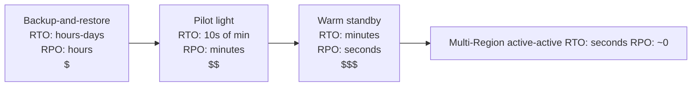

# Disaster recovery strategies

> **One-line summary.** Four canonical AWS DR tiers — backup-and-restore, pilot light, warm standby, multi-Region active-active — trading cost against RTO/RPO. Pick the tier whose recovery times match the business need.

## TL;DR
- **RTO** (Recovery Time Objective) = how long you're allowed to be down. **RPO** (Recovery Point Objective) = how much data you're allowed to lose.
- Four tiers, each ~10× more expensive than the previous and ~10× lower RTO/RPO: **backup-and-restore** (RTO: hours–days), **pilot light** (RTO: tens of minutes), **warm standby** (RTO: minutes), **multi-Region active-active** (RTO: seconds).
- The right tier comes from the business — what does an hour of downtime cost? What does losing the last 5 minutes of data mean?
- AWS-native primitives: **AWS Backup** with cross-Region copy and Object Lock; **Aurora Global Database** / **DynamoDB Global Tables**; **MGN / AWS Elastic Disaster Recovery (DRS)**; **Route 53 Application Recovery Controller (ARC)**.
- **Untested DR is fiction.** Schedule drills; without them, the runbook fails on first use.

## When to use it
- Every production workload. The question isn't "do we need DR?" — it's "what RTO/RPO do we need?"
- Compliance regimes mandating DR (financial, healthcare, government).
- Workloads where Region-level events would be business-impacting.

## When NOT to use it
- True dev / test workloads where loss is acceptable — backup may be all you need.
- One-off scripts / prototypes.
- Workloads where multi-AZ within one Region satisfies the RTO (AZ failures handled by multi-AZ databases / multi-AZ ELB / etc. — Region-level DR isn't always required).

## The four tiers

Each tier is one step up the trade-off curve.

### 1. Backup-and-restore
- Backups continuously / scheduled to a target Region (AWS Backup cross-Region copy, S3 CRR).
- No standby infrastructure pre-built — recreate from IaC on failure.
- Restore from backup.
- **RTO**: hours to days (depends on backup size, restore speed, IaC stand-up time).
- **RPO**: backup frequency (typically hours).
- **Cost**: storage only (cheapest tier).
- **Right for**: non-critical workloads, compliance backups, "we'll deal with it if it happens" workloads.

### 2. Pilot light
- Data continuously replicated to the standby Region.
- Compute in the standby Region scaled to near-zero (minimum capacity).
- On failover: scale up compute, redirect traffic, promote standby DB.
- **RTO**: tens of minutes.
- **RPO**: minutes.
- **Cost**: replication + minimum compute (≈ 10-20% of primary).
- **Right for**: medium-priority workloads where minutes-to-an-hour of downtime is acceptable.

### 3. Warm standby
- Full stack running in the standby Region at reduced capacity.
- Replication continuous.
- On failover: scale up to peak; redirect traffic.
- **RTO**: minutes.
- **RPO**: seconds.
- **Cost**: full data layer + ~30-50% compute (often 50% of full primary cost).
- **Right for**: business-critical workloads where downtime is measured in minutes.

### 4. Multi-Region active-active
- Full stack in N Regions, all serving traffic.
- On Region failure: routing layer steers traffic away; surviving Regions handle the full load.
- **RTO**: seconds (failover is a routing change).
- **RPO**: ~0 with synchronous replication (e.g., DynamoDB MRSC), seconds with async (DynamoDB Global Tables, Aurora Global).
- **Cost**: N× single-Region cost + replication.
- **Right for**: workloads where seconds of unavailability is unacceptable globally.
- See [multi-region-active-active](multi-region-active-active.md) for depth.

## Key concepts

**RTO and RPO are business decisions.** They come from the cost of downtime and the cost of data loss — not from "what's technically possible."

**Cost cliffs.** Each tier roughly 10× the previous. The biggest cliff is between pilot light and warm standby (you're now paying for full standby data + meaningful standby compute). Multi-Region active-active is another cliff.

**RTO vs RPO are independent.** A backup-and-restore could have great RPO (hourly backups) but terrible RTO (manual restore). A warm standby could have great RTO (minutes) but poor RPO if replication is hourly. Match each to the business.

**Failover orchestration.** **Route 53 ARC** is the recommended primitive — atomic routing controls with safety rules. Manual runbooks at 3 AM fail; automation works.

**Cross-Region vs cross-AZ.** Multi-AZ within one Region covers the most common failure modes (free with most managed services). Cross-Region DR covers Region-scale events (rare; lower RPO when needed).

**Replication lag = RPO floor.** Async replication's RPO is the lag at the failure moment. Monitor lag; budget for the worst observed.

**Standby Region drift.** The "primary works, standby doesn't" failure mode. Cause: changes deploy to primary but not standby. Mitigation: deploy to both Regions on every change; run **ARC readiness checks** continuously.

**Drills.** A DR plan never executed is theatre. Schedule quarterly drills (game days). Use **AWS Fault Injection Service (FIS)** to inject Region-level failures and verify the procedure.

## AWS-native primitives by tier

### Backup-and-restore
- **AWS Backup** with cross-Region copy + Vault Lock + Object Lock (for ransomware resilience).
- **S3 Cross-Region Replication**.
- **EBS snapshot cross-Region copy**.
- **RDS / Aurora cross-Region snapshots**.
- **CloudFormation / CDK / Terraform** to recreate infra.

### Pilot light
- Data layer: **Aurora Global Database** (replica scaled small), **DynamoDB Global Tables**, **S3 CRR**, **ElastiCache Global Datastore**.
- Compute layer: Lambda (scale-to-zero), ECS / EKS at minimum replicas, EC2 ASG at min=0 or min=1.
- Routing: **Route 53** with health-check-driven failover or **ARC routing controls**.

### Warm standby
- All pilot-light primitives, plus standby compute kept at meaningful capacity.
- **MGN / DRS** for VM-level continuous replication of stateful workloads.
- **Auto Scaling** policies that ramp up standby on failover trigger.

### Multi-Region active-active
- See [multi-region-active-active](multi-region-active-active.md).

### Failover orchestration
- **Route 53 ARC** (recommended) — routing controls + safety rules + readiness checks + Region switch.
- **Route 53 failover routing** (DNS-based — slower failover due to TTL).
- **Global Accelerator** — anycast IP failover in seconds.

### Cyber-resilience layer
- **AWS Backup logically air-gapped vaults** — backups even a compromised root can't delete.
- **S3 Object Lock** — WORM retention on backups.
- **Cross-account** backup destination — compromised production can't touch the backup account.

## Common pitfalls

- **No defined RTO / RPO.** "We need DR" without numbers means you'll build the wrong tier. Get business sign-off on numbers.
- **Untested DR.** The first time you fail over for real is *not* during an incident. Schedule drills; treat drill failures as P1.
- **Tier mismatched to need.** Active-active for an internal admin tool is overkill; backup-only for a payment system is underkill.
- **Replication lag exceeds RPO.** Lag grows during peak load; no one notices until failover. Alarm on lag.
- **Standby Region not in IaC.** Manual config in standby drifts. Everything as code, deployed to both.
- **No fail-back plan.** After incident, going back to the original primary is also a failover. Plan and drill the fail-back.
- **Cyber-resilience as an afterthought.** Backups in the same account as production = ransomware-vulnerable. Air-gapped vaults + cross-account + Object Lock.
- **Quotas not pre-raised in standby Region.** Failover triggers; Lambda concurrency / EC2 vCPU quotas in the standby are below primary's. Scale-up fails. Pre-raise.
- **Failover triggers on minor issues.** False alarms cause unnecessary failovers, which cause real incidents. Tune the trigger thresholds.
- **No "did we recover correctly?" check.** After failover, verify that the system is actually serving correctly — health-check is necessary but not sufficient (data correctness, throughput, business KPI).

## Trade-offs & Alternatives

- **In-Region multi-AZ vs cross-Region.** Most failures are AZ-scale; multi-AZ covers them without cross-Region cost. Cross-Region for Region-scale events.
- **DR vs cyber-resilience.** Region-level outage is a different failure mode than ransomware / insider threat. Logically air-gapped vaults + Object Lock are the cyber-resilience layer (separate from DR tiering).
- **DR in-cloud vs cross-cloud.** Cross-cloud DR (AWS + GCP / Azure) is sometimes pursued for vendor risk; complexity and cost are high. AWS multi-Region is usually sufficient.
- **Active-passive vs active-active.** Active-passive is dramatically cheaper and simpler; active-active is for sub-second RTO globally.

## Common pitfalls (architectural)

- **DR plan that's a 50-page document.** No one reads it under stress. Distill to 1-2 pages of action items + the runbook automation that does the work.
- **No clear ownership.** Who calls the failover? Without a named on-call DRI, decisions happen by committee at 3 AM.
- **Treating "we have backups" as "we have DR."** Backups without rehearsed restore = aspirational DR.
- **Skipping cyber-resilience.** Ransomware can hit AWS accounts. Air-gapped vaults + cross-account backup + restore testing.

## Further reading
- [Disaster Recovery Workloads on AWS whitepaper](https://docs.aws.amazon.com/whitepapers/latest/disaster-recovery-workloads-on-aws/disaster-recovery-options-in-the-cloud.html).
- ["Reliability, constant work, and a good cup of coffee", Amazon Builders' Library](https://aws.amazon.com/builders-library/reliability-and-constant-work/).
- [AWS Resilience Hub](https://docs.aws.amazon.com/resilience-hub/) — assess workloads against RTO/RPO targets.
- [Route 53 ARC](https://docs.aws.amazon.com/r53recovery/latest/dg/what-is-route53-recovery.html).
- [AWS Elastic Disaster Recovery (DRS)](https://docs.aws.amazon.com/drs/).
- [AWS Backup logically air-gapped vaults](https://docs.aws.amazon.com/aws-backup/latest/devguide/logicallyairgappedvault.html).
- Related repo pages: [multi-region-active-active](multi-region-active-active.md), [multi-region-active-passive](multi-region-active-passive.md), [Reliability pillar](../05-well-architected/reliability.md).
