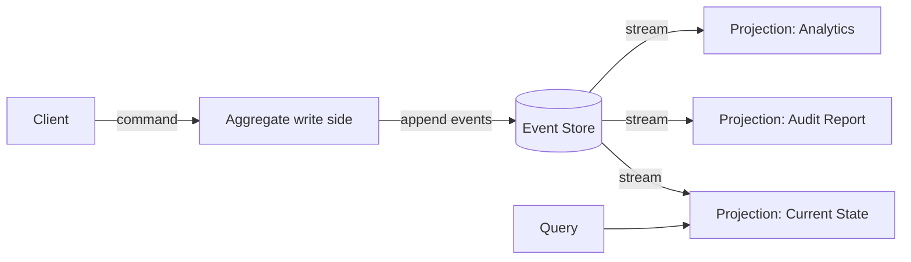

# Event sourcing

> **One-line summary.** Store every state change as an append-only event. Derive current state by replaying events. The event log is the source of truth.

## TL;DR
- Instead of "update the `account` row," append `MoneyDeposited(amount=100)` to the event log. Current balance = sum of all events.
- Full audit log built in: every change is preserved, timestamped, attributed.
- Pairs naturally with [CQRS](cqrs.md) (write side appends events; read side rebuilds projections), [saga](saga.md), and [outbox](outbox.md).
- Trade-offs: write code is simple and history is rich; read code is more complex (rebuilding projections); schema evolution is harder (old events live forever).
- AWS-native: **DynamoDB** for the event store, **DynamoDB Streams + Lambda** for projections, **Kinesis / MSK** when you need replayable global ordering, **EventBridge Archive** for cheaper long-term event retention.
- Don't event-source everything. Pick aggregates where audit / history / temporal queries actually matter (finance, healthcare, scheduling, inventory) and use CRUD for the rest.

## When to use it
- Workloads needing a full audit log (financial transactions, healthcare records, compliance-heavy domains).
- Domains where temporal queries are valuable ("what did the customer's account look like on 2024-03-15?").
- Workloads where business rules change and you want to recompute past decisions with the new rules.
- Complex domain models with rich behavior over time (the "DDD aggregates" sweet spot).

## When NOT to use it
- Simple CRUD workloads — adds complexity for no benefit.
- Workloads with mostly read traffic and limited domain modeling.
- Teams new to distributed systems — event sourcing has real depth; start with simpler patterns.
- Workloads where the event schema will need to change frequently and old events would be hard to migrate.

## How it works



1. Client sends a **command** (`Deposit(account, 100)`).
2. The aggregate loads its history from the event store, applies the command (validating against current state), and emits new events (`MoneyDeposited(100)`).
3. New events appended to the event store atomically.
4. Stream of events drives **projections** — denormalized read models (current balance, monthly summary, audit log).
5. Queries hit projections, not the event store directly.

### Reconstructing state
```python
def current_balance(account_id):
    events = event_store.load_events(account_id)
    balance = 0
    for event in events:
        if isinstance(event, MoneyDeposited):
            balance += event.amount
        elif isinstance(event, MoneyWithdrawn):
            balance -= event.amount
    return balance
```
At scale, this is expensive — every read replays history. Solutions: **snapshots** (periodically save the state, replay only events since the snapshot), **projections** (a separate read model that's updated incrementally).

## Key concepts

**Event.** An immutable fact about something that happened (`OrderPlaced`, `MoneyDeposited`, `UserSubscribed`). Past tense. Carries the data needed to reproduce the state change.

**Aggregate.** The unit of consistency. All events for one aggregate ID form an ordered sequence. Commands are validated within the aggregate's boundary.

**Event store.** Append-only ordered log. Partitioned by aggregate ID; events for one aggregate are strictly ordered.

**Projection.** A read model built from the event stream. Can be rebuilt from scratch by replaying all events. New projections can be created retroactively (capture insight that wasn't anticipated when the system was built).

**Snapshot.** Periodic state checkpoints (`account=42, balance=1500, last_event_seq=2401`). Avoid replaying from the beginning for every read; replay only from the latest snapshot.

**Schema evolution.** Old events live forever. Solutions:
- **Versioned events** — `OrderPlacedV1`, `OrderPlacedV2`. Handler logic supports both.
- **Upcasters** — transform old events into new shapes at read time.
- **Schema registries** — Glue Schema Registry / EventBridge Schema Registry with explicit version migrations.

**Commands vs events.** A command is a *request* (`PlaceOrder`); validation can reject it. An event is a *fact* (`OrderPlaced`); once written, it's permanent. Don't store commands; store events.

**Idempotency at the consumer.** Projections process events; the stream may deliver duplicates. Track last-processed event sequence per projection; skip already-processed.

## AWS-native implementations

### Event store on DynamoDB
The most common pattern:
- **Table:** `(PK = aggregate_id, SK = sequence_number, payload = JSON event)`.
- **Optimistic concurrency:** new event uses `sequence_number = last + 1` with conditional write `attribute_not_exists(SK)`. Two concurrent writers race; one wins, the other retries with the new last sequence.
- **TransactWriteItems** to atomically append multiple events (e.g., `MoneyTransferred` decomposes into `MoneyWithdrawn(account_a)` + `MoneyDeposited(account_b)`).
- **DynamoDB Streams** feed projections.

### Projections via DynamoDB Streams + Lambda
- Stream-triggered Lambda reads new events and updates downstream projection tables (DynamoDB, OpenSearch, Aurora, S3 for analytics).
- Track `last_sequence_processed` per projection to handle replays.

### Replayable global ordering via Kinesis / MSK
- Aggregates write to an event store *and* publish to Kinesis / Kafka.
- Subscribers replay from any offset for backfills, new projections, reanalysis.
- Pair with the [outbox pattern](outbox.md) to keep the event store and downstream stream in sync.

### EventBridge Archive for retention
- Archive all events on a bus to S3 for long-term storage.
- Replay via EventBridge Replay when needed (debugging, new projection, audit).

## Common pitfalls

- **Treating projections as the source of truth.** They're derived. The event store is canonical. Lose a projection? Rebuild from the event store.
- **No snapshot strategy for large aggregates.** Aggregates with thousands of events: every read replays everything. Snapshot every N events.
- **Event schema breaking changes without versioning.** Old events become unreadable. Always version events; design for forward compatibility.
- **Storing CRUD-style events.** `UserUpdated(field=email, value=new@x.com)` is a column change, not a domain event. Event-source meaningful business events (`UserChangedEmail` if that has business significance, not the row-level diff).
- **Cross-aggregate transactions.** Event sourcing is per-aggregate-atomic, not cross-aggregate. Cross-aggregate consistency is via sagas + eventual consistency. See [saga](saga.md).
- **One event store per microservice fragmented into many.** Each service owns its event store; events flow between services as integration events on a message bus.
- **Naive replays at scale.** Replaying years of events takes hours / days. Plan for it (parallelism, incremental backfill, projection-specific replay).
- **Forgetting GDPR / right-to-be-forgotten.** Immutable events conflict with deletion requests. Solutions: encrypt PII with per-user keys (delete the key = "forget" the user), or maintain an append-only "tombstone" log that projections respect.

## Trade-offs & Alternatives

- **Event sourcing vs CRUD.** CRUD = simple, lossy. ES = complex, full history. Choose per aggregate, not per system.
- **Event sourcing vs outbox.** The outbox pattern gives you reliable event publishing on top of CRUD state. ES makes the event log the primary store. Outbox is incremental adoption; ES is deeper.
- **Event sourcing vs CDC.** CDC captures *row-level* changes (column diffs); ES captures *business-level* events. CDC for replication; ES for audit + domain modeling.
- **Synchronous projection vs async.** Sync: query the event store and rebuild on every read (slow but always consistent). Async: maintain projections via streams (fast reads, eventual consistency). Almost always async.
- **Per-aggregate ordering vs global ordering.** Per-aggregate is easy and scales; global is hard and unnecessary for most domains.

## Common pitfalls (architectural)

- **Event-sourcing everything.** Adds complexity to aggregates that don't need it. Pick the bounded contexts where audit + history matter.
- **No tooling for replaying / debugging.** When something's wrong, you need to inspect the event stream for a specific aggregate. Build the tooling (CLI, dashboard) before you need it.
- **Treating events as integration contracts without versioning discipline.** Internal events are easier to evolve than integration events; be careful before publishing the same events both internally and to other services.

## Further reading
- *Implementing Domain-Driven Design*, Vaughn Vernon — ES alongside DDD.
- *Designing Data-Intensive Applications*, Martin Kleppmann, Chapter 11 (Stream Processing) and Chapter 12 (Future of Data Systems).
- ["Event Sourcing", Martin Fowler](https://martinfowler.com/eaaDev/EventSourcing.html).
- [EventStoreDB](https://www.eventstore.com/) — purpose-built event store (sometimes used alongside AWS).
- [DynamoDB event-sourcing patterns (AWS blog)](https://aws.amazon.com/blogs/database/build-a-cqrs-event-store-with-amazon-dynamodb/).
- [Pattern: Event sourcing, microservices.io](https://microservices.io/patterns/data/event-sourcing.html).
