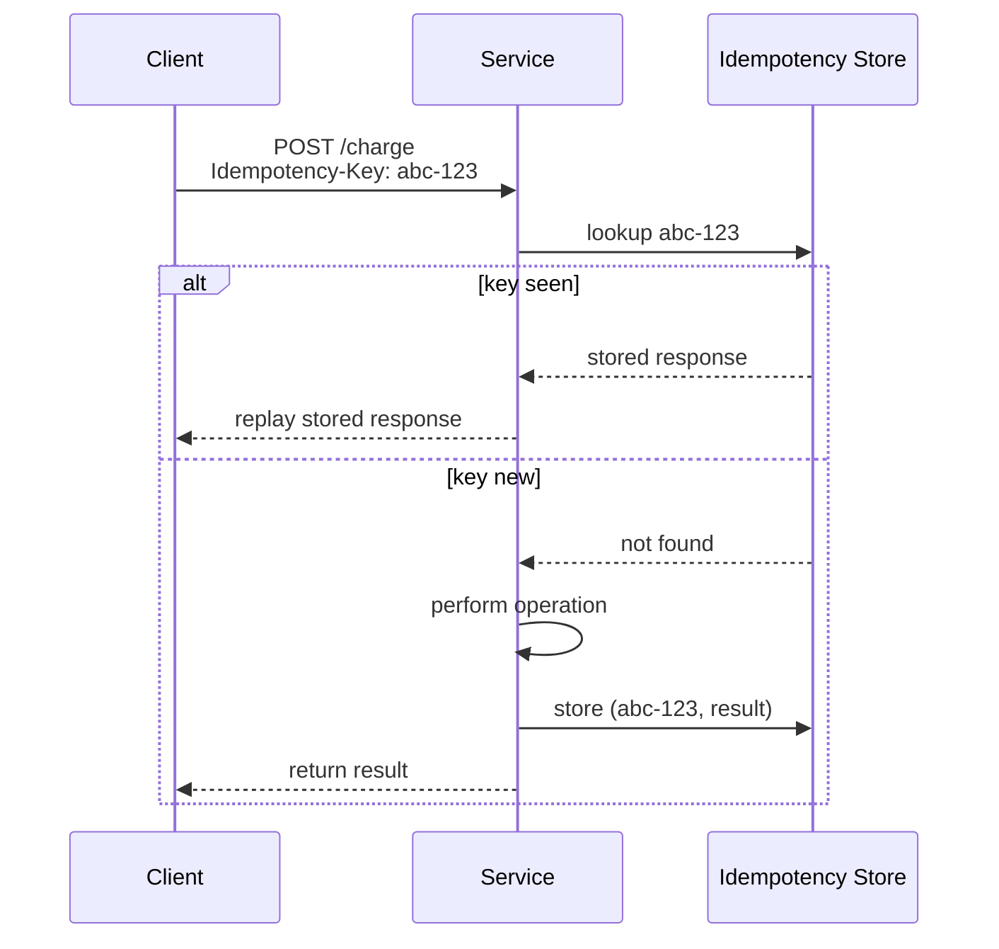

# Idempotency

> **One-line summary.** Doing it twice has the same effect as doing it once. The single most important property in a system where messages get retried (i.e., every distributed system).

## TL;DR
- If retries can cause duplicate side effects (charge a card twice, create two orders, send two notifications), the system isn't idempotent — and at-least-once messaging guarantees it *will* happen.
- Three primary techniques: **idempotency keys** (client supplies a unique ID per logical operation), **conditional writes** (`IF NOT EXISTS`, `If-Match` on version), **at-least-once + dedup table** (consumer tracks processed message IDs).
- AWS-native: **DynamoDB conditional writes** (the canonical idempotency primitive), **SQS FIFO deduplication windows** (5-minute), **Lambda Powertools idempotency utility**, **Step Functions exactly-once execution**.
- The single biggest sources of duplicate-processing bugs: retried HTTP requests, message-broker redeliveries, Lambda retries on async failure, and "rerun the cron job."
- Make idempotency a system requirement, not a per-handler decision. Every state-changing operation should be idempotent.

## When to use it
- Every state-changing API where retries are possible (which is every API in a distributed system).
- Webhook handlers (vendors retry until they get `2xx`).
- Message consumers (SQS, Kinesis, EventBridge — all at-least-once by default).
- Lambda async invocations (AWS retries failures).
- Batch jobs and scheduled tasks (operators rerun them).
- Payment processing, order placement, account creation, anything financial / legal.

## When NOT to use it
- Pure-read operations are already idempotent — no work needed.
- Operations where duplicate execution genuinely doesn't matter (a counter that's eventually consistent and bounded).
- Throwaway prototypes / one-off scripts.

## How it works

### 1. Idempotency key (the Stripe pattern)


Client generates a unique key per logical operation. Server stores `(key, result)` and replays the stored response on duplicate. Standard pattern; what Stripe / Square / most payment APIs use.

Key properties:
- **Client-supplied** — must be deterministic per logical operation (UUID per checkout attempt).
- **Server-stored** with TTL (24 hours typical, longer for financial).
- **Atomic** — write the result *with* the key, not separately.

### 2. Conditional writes (database-native)
- DynamoDB: `PutItem` with `ConditionExpression: attribute_not_exists(pk)`.
- RDBMS: `INSERT … ON CONFLICT DO NOTHING` (PostgreSQL), `INSERT IGNORE` (MySQL), or `MERGE`.
- S3: `If-None-Match: *` (won't overwrite); `If-Match: <etag>` (optimistic concurrency on update).
- Optimistic concurrency: track a `version` field; conditional update only succeeds at the expected version.

### 3. At-least-once + dedup table (consumer side)
- Consumer tracks every processed message ID in a TTL'd store (DynamoDB, Redis).
- On each message: check seen-set first; skip if seen.
- The downside is the **dedup window** — beyond TTL, you can re-process.

## Key concepts

**Idempotency vs commutativity.** Idempotent = same result if applied N times. Commutative = order doesn't matter. They're different — `INCR counter` is commutative but not idempotent (each call adds 1).

**Idempotency boundaries.** The operation is idempotent *up to the dedup window*. After the window, the system has no memory of the previous call. Match window to retry SLA + safety margin.

**Idempotency keys vs natural keys.** A natural key (order ID, transaction reference) often works as the idempotency key without the client supplying one — but clients may not have a natural ID for "I'm retrying the same request."

**Exactly-once execution.** Strictly, exactly-once is impossible across networks. What systems offer is at-least-once + idempotent processing = "effectively exactly once." That's what AWS Step Functions Standard, FIFO SQS within the dedup window, and Kafka exactly-once-semantics provide.

**Idempotency in async pipelines.** Each stage must be idempotent. A non-idempotent stage in the middle of a pipeline poisons the whole chain.

## AWS-native implementations

| Pattern | AWS option |
|---|---|
| Idempotency key store | [DynamoDB](../01-services/database/dynamodb.md) with conditional writes + TTL |
| Lambda idempotency wrapper | **AWS Lambda Powertools** idempotency utility (Python / Node / Java / .NET) — wraps your handler with DynamoDB-backed dedup |
| FIFO message dedup | [SQS FIFO](../01-services/integration-messaging/sqs.md) with `MessageDeduplicationId` (5-min window) |
| Exactly-once workflow | [Step Functions Standard](../01-services/integration-messaging/step-functions.md) (exactly-once state transitions) |
| Conditional object PUT | [S3](../01-services/storage/s3.md) with `If-None-Match` or `If-Match` |
| Optimistic-concurrency updates | DynamoDB conditional update with version attribute |
| Webhook delivery dedup | DynamoDB-backed dedup keyed on webhook event ID |

## Lambda Powertools idempotency

A wrapper that does most of the work:
```python
from aws_lambda_powertools.utilities.idempotency import idempotent

@idempotent
def lambda_handler(event, context):
    # this handler runs at-most-once per (event idempotency key)
    process(event)
```
Configures a DynamoDB table; the wrapper writes a record before the handler runs and atomically commits on success. Duplicates get the stored response.

## Common pitfalls

- **"Just check before write."** Read-then-write races. Use conditional / atomic operations.
- **Storing the idempotency key but not the response.** Duplicate retries get a different result than the first call (or an error). Store the response.
- **Dedup window too short.** Webhooks retry for days; a 5-minute window doesn't cover that.
- **Idempotency keys derived from request body.** Same body submitted from different sessions = collision. Use a UUID per logical operation.
- **Non-idempotent downstream side effects.** Your service handles the dedup; the third-party API call you make doesn't. Pass through the idempotency key when supported.
- **Forgetting Lambda async retries.** Lambda retries async invocations twice by default. Without idempotency, that's 3 executions per failure.
- **Counter or analytics events treated as idempotent.** `INCR daily_visits` is *not* idempotent. Use **EventBridge / Kinesis with dedup IDs** or aggregate from a deduped event log.
- **Idempotency tested with happy path only.** Most failures expose the bug. Chaos-test by injecting duplicates.
- **No cleanup of the idempotency store.** Without TTL, it grows forever. DynamoDB TTL or scheduled cleanup.

## Trade-offs & Alternatives

- **Idempotency key vs natural ID.** Natural IDs work when the client has one and it's globally unique. Otherwise client-generated UUID.
- **At-most-once vs at-least-once + idempotent.** At-most-once = data loss on failure (rarely what you want). At-least-once + idempotent = the standard.
- **Server-side vs client-side idempotency.** Server-side is more reliable (clients lie / lose their key store). Client retries with the same key, but server is the source of truth.
- **Synchronous vs eventual idempotency.** Synchronous (Stripe-style) returns the same result immediately. Eventual (event-sourced) replays the event; same end state, async.

## Common pitfalls (architectural)

- **Idempotency is per-handler in a non-idempotent system.** Whole-system idempotency requires every stage to be idempotent, plus a strategy for cross-stage dedup (idempotency key flows through the pipeline).
- **"We'll add idempotency later."** It's much harder to add to a live system than to design in. Add to every state-changing operation from day one.

## Further reading
- [Stripe's idempotency design](https://stripe.com/blog/idempotency).
- ["Reliability, constant work, and a good cup of coffee", Amazon Builders' Library](https://aws.amazon.com/builders-library/reliability-and-constant-work/).
- [AWS Lambda Powertools idempotency](https://docs.powertools.aws.dev/lambda/python/latest/utilities/idempotency/).
- [DynamoDB conditional expressions](https://docs.aws.amazon.com/amazondynamodb/latest/developerguide/Expressions.ConditionExpressions.html).
- [SQS FIFO deduplication](https://docs.aws.amazon.com/AWSSimpleQueueService/latest/SQSDeveloperGuide/FIFO-queues-exactly-once-processing.html).
