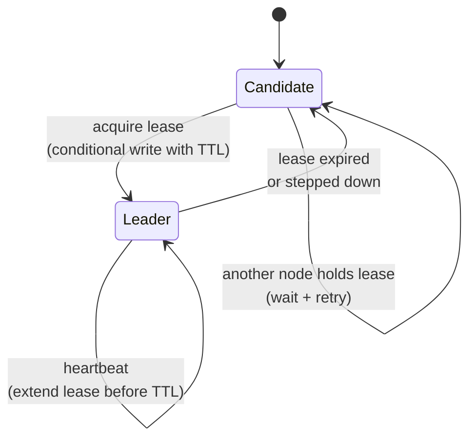

# Leader election

> **One-line summary.** Pick one node out of many to do work that can only be done once at a time — a cron, a singleton service, the writer in a replicated DB. Hand off cleanly when the leader fails.

## TL;DR
- The pattern for any singleton-style work in a distributed system: scheduled jobs, configuration management, primary database writes, cluster coordination.
- Three classic mechanisms: **distributed lock with TTL** (Redis / DynamoDB), **lease-based election with a coordinator** (etcd / Zookeeper / Consul), **consensus protocols** (Raft / Paxos — usually you consume them, not implement them).
- The hard problem is **fencing** — preventing a former leader (network-partitioned and unaware it lost the lease) from making conflicting writes after the new leader takes over.
- AWS-native: **DynamoDB conditional writes** for simple leader-election; **ECS service with `desiredCount=1`** for singleton workloads (with caveats); **AWS Step Functions** for stateful job singletons; **Route 53 ARC routing controls** for multi-Region active/passive failover.
- Prefer **at-most-one leader at a time** with safe fencing; prefer **work that's safe to duplicate** when possible (idempotency makes leader election less critical).

## When to use it
- Scheduled jobs that must run on exactly one node at a time.
- Cron-style work where double execution would cause problems (charging cards, sending notifications, ETL writes).
- Cluster coordinators (Kafka partition leaders, distributed-database primaries).
- Active/passive failover in multi-instance services.
- Distributed background workers where one node coordinates and others execute.

## When NOT to use it
- Work that's already idempotent and safe to duplicate — just let all nodes do it (cheaper, simpler).
- Workloads where a managed service handles singleton concerns for you (Kafka's controller, DynamoDB's writes, RDS Multi-AZ failover).
- Tiny one-off scripts — a single VM with a cron is fine.

## How it works

### Lease-based election with TTL


- One DynamoDB / Redis row represents the lease: `{leader: node-id, expires-at: T}`.
- Candidates compete to write with a condition `expires-at < now()`.
- Winner holds the lease until expiry.
- Leader heartbeats by extending the lease before it expires.
- If the leader dies, the lease expires and another candidate takes over within ~ttl seconds.

### Raft / Paxos consensus
- Multiple nodes vote; majority elects a leader.
- Used internally by etcd, Zookeeper, Consul, Cassandra, Kafka (KRaft), Aurora, DynamoDB.
- Usually consumed via a managed service rather than implemented from scratch.

### Pessimistic distributed lock
- A coordination service (Zookeeper, Consul, etcd, ElastiCache) holds the lock.
- Clients request the lock; one client wins.
- Lock is released on disconnect (ephemeral nodes in Zookeeper) or TTL expiry.

## Key concepts

**Lease.** A time-bounded grant of leadership. Renewable. If the leader dies, the lease expires and someone else becomes leader. Bounded staleness — at most `TTL` of "no leader" time.

**Fencing.** The hard part of leader election. Scenario:
1. Leader A acquires lease at T=0.
2. A is partitioned from the network at T=10.
3. A doesn't see the partition (long GC pause, kernel scheduler stall).
4. Lease expires at T=30; B becomes leader.
5. A's network heals at T=35; A still thinks it's the leader and tries to write.

Without fencing, both A and B might write — split-brain.

**Solutions:**
- **Fencing tokens** — each lease has a monotonically increasing ID. Downstream resources reject writes with stale tokens. (Required for correctness with any external resource the leader writes to.)
- **Heartbeat to downstream** — leader proves liveness by writing the lease ID to the resource on every operation.
- **Use a system that handles fencing natively** — DynamoDB conditional writes by version, RDBMS with version-based optimistic concurrency.

**Lease TTL choice.** Too short: spurious leader changes during normal jitter. Too long: long "no leader" windows on real failure. Common range: 10–30 seconds for high-availability systems; 60–300 seconds for less time-sensitive work.

**Heartbeat frequency.** Heartbeat at TTL/3 or TTL/4 to give multiple chances to renew before expiry.

**Split-brain detection.** Two nodes both think they're the leader. Solutions:
- Fencing tokens (the right answer).
- "Suicide pact" — node detects it can't reach the coordinator and steps down voluntarily.
- Quorum-based — leader needs ongoing majority confirmation.

## AWS-native implementations

### DynamoDB-based lease (simplest)
```python
def try_become_leader(table, node_id, ttl_seconds=30):
    now = time.time()
    try:
        table.update_item(
            Key={"id": "leader"},
            UpdateExpression="SET leader=:n, expiresAt=:t",
            ConditionExpression="attribute_not_exists(expiresAt) OR expiresAt < :now",
            ExpressionAttributeValues={
                ":n": node_id,
                ":t": now + ttl_seconds,
                ":now": now,
            },
        )
        return True
    except ClientError as e:
        if e.response["Error"]["Code"] == "ConditionalCheckFailedException":
            return False
        raise
```

Pair with a fencing token (a monotonically increasing field updated on each lease change). Heartbeat by updating `expiresAt`.

### ECS service with `desiredCount=1`
A single-task ECS service acts as a singleton. ECS replaces it if it dies. **Caveat**: during deploys / rolling updates, two tasks can briefly coexist. If exactly-one-at-a-time matters, use the deployment strategy carefully or wrap with explicit leader election.

### Step Functions Standard for singleton workflows
Standard workflows have exactly-once execution semantics. Pair with EventBridge Scheduler for scheduled singleton jobs.

### Route 53 ARC routing controls
For multi-Region active/passive: a routing control is a boolean ("Region X is the active one"). Atomically flip the control to fail over; the safety rules prevent both-active states.

### Kubernetes leader election (EKS)
Standard Kubernetes pattern — a `Lease` object in `coordination.k8s.io/v1`. Controllers use the leader-election machinery in `client-go` / equivalent libraries.

## Common pitfalls

- **No fencing.** Split-brain. The single most common bug in leader-election code.
- **Lease TTL = heartbeat interval.** One missed heartbeat = lost leadership. Heartbeat at TTL/3 or TTL/4.
- **Lock without TTL.** Process dies holding the lock; lock is held forever; no leader. Always TTL.
- **Race in "check then write".** Multiple candidates pass the check, all attempt to take leadership. Use atomic conditional write.
- **Leader work done synchronously in the heartbeat loop.** Long-running work stalls heartbeats; lease expires; another leader takes over while the original is mid-work. Heartbeat in a separate thread.
- **Reusing the lease ID for downstream tokens.** If you do, a process that lost leadership but doesn't know it can race against the new leader. Fencing tokens must increment monotonically across leadership changes.
- **Sweep-then-act assumptions.** "I just checked and I was leader" doesn't survive across the network call you're about to make. Check leader status atomically *with* the write.
- **Singleton for work that's safe to duplicate.** Idempotent work doesn't need leader election. Don't add a hard constraint when soft works.

## Trade-offs & Alternatives

- **Leader election vs idempotent work.** If the work is idempotent and bounded, just let all nodes do it — much simpler. Reserve leader election for genuinely-singleton work.
- **DynamoDB-based vs managed coordinator.** DynamoDB-based: simple, AWS-native, no extra infra. etcd / Zookeeper / Consul: richer features (ephemeral nodes, watches, hierarchical config), more infra to operate.
- **Lease-based vs consensus.** Lease is simpler but requires fencing tokens for correctness. Consensus (Raft / Paxos) handles safety internally but is much heavier.

## Common pitfalls (architectural)

- **"Just use a cron job on one box."** That one box is your single point of failure. Either accept it (small workloads) or build proper leader election.
- **Leader election plus per-leader manual config.** Configuration drift when the leader changes. Make leader-specific config code (env vars, IAM role, deployment manifest), not handwritten.

## Further reading
- ["Leader Election in Distributed Systems", Amazon Builders' Library](https://aws.amazon.com/builders-library/leader-election-in-distributed-systems/).
- *Designing Data-Intensive Applications*, Martin Kleppmann, Chapter 9 (Consistency and Consensus).
- ["How to do distributed locking", Martin Kleppmann's blog](https://martin.kleppmann.com/2016/02/08/how-to-do-distributed-locking.html) — on fencing.
- [Kubernetes leader election](https://kubernetes.io/docs/concepts/architecture/leases/).
- [Route 53 ARC routing controls](https://docs.aws.amazon.com/r53recovery/latest/dg/routing-control.html).
