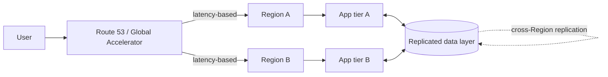

# Multi-region active-active

> **One-line summary.** Run the workload in multiple AWS Regions simultaneously, serving traffic from all of them. Highest availability, lowest user-latency globally, hardest to engineer.

## TL;DR
- "Active-active" means every Region serves production traffic at the same time. Region failure → routing layer steers traffic to surviving Regions; user impact is bounded by failover detection time.
- The hard problems are **data consistency across Regions** (writes happen in many places; conflicts are inevitable for traditional DBs), **session affinity** (a user mid-flow needs the same Region until they don't), and **cost** (you're paying for full capacity in every Region).
- AWS-native data layers: **DynamoDB Global Tables** (eventual; MRSC for strong), **Aurora Global Database** (one writer + read replicas — *not* multi-active for writes), **S3 Cross-Region Replication**, **ElastiCache Global Datastore**.
- AWS-native routing: **Route 53** (DNS-based, with latency / geolocation / failover policies), **Global Accelerator** (anycast IPs + Region-aware routing on the AWS backbone).
- **Use sparingly.** Active-passive ([see that page](multi-region-active-passive.md)) is dramatically cheaper and simpler; active-active is for workloads where seconds of unavailability is unacceptable globally.

## When to use it
- Global products with strict latency SLOs for users worldwide (gaming, video, real-time finance).
- Workloads where Region-level RTO is measured in seconds (not minutes).
- Regulatory data-residency requirements where data must live in the user's Region.
- High-traffic systems where one Region can't hold peak load.

## When NOT to use it
- Single-Region workloads serving a single geography — active-active multi-Region adds complexity for no benefit.
- Workloads where seconds-minutes of downtime is acceptable — **active-passive** is cheaper and simpler.
- Workloads where cross-Region data consistency is a hard requirement and you can't accept the constraints of MRSC / Spanner-class systems.

## How it works

- Routing layer (Route 53 / Global Accelerator) picks a Region per user / request based on latency, geography, or weights.
- Each Region runs a full stack (app tier + cache + DB).
- Data layer replicates cross-Region (eventually or strongly, depending on technology).
- On Region failure, the routing layer fails over to surviving Regions; the data layer absorbs the writes that didn't propagate.

## Key concepts

**Data consistency models across Regions:**

- **Eventually consistent** (DynamoDB Global Tables Standard, S3 CRR) — writes in one Region propagate to others within seconds. **Conflicts** possible (two Regions write the same key simultaneously); systems resolve via last-writer-wins or vector clocks.
- **Strongly consistent multi-Region** (DynamoDB MRSC Global Tables — see [DynamoDB](../01-services/database/dynamodb.md)) — synchronous replication to ≥1 other Region before write returns. Zero-RPO global reads. Restrictions: same account, exactly 3 Regions, no TTL / LSIs.
- **Single-writer multi-Region** (Aurora Global Database) — one Region writes, others are read-only replicas with seconds of lag. Failover promotes a replica to writer. Not truly active-active for writes.
- **Application-level multi-active** (CRDTs, dual-write with reconciliation) — application designs for conflict resolution. Highest engineering cost.

**Routing layer.**

- **Route 53 latency-based** — DNS resolves to the lowest-latency healthy Region. **Cons**: TTL-bound failover (DNS caching).
- **Route 53 geolocation** — based on resolver's geographic origin. Good for residency.
- **Route 53 failover** — primary / secondary, health-check driven.
- **Global Accelerator** — static anycast IPs; failover in seconds (no DNS TTL); traffic over the AWS backbone for lower jitter.
- **Application Recovery Controller (ARC) routing controls** — manual or automated atomic-flip controls with safety rules; the recommended primitive for orchestrated failover.

**Session affinity.** A user starts a transaction in Region A; mid-flow, the routing layer would send them to Region B. Problems:
- User's session state (shopping cart) may not have replicated yet.
- DB writes the user made may not be readable in B.

Mitigations:
- **Sticky routing** during sessions (cookie / token routes to the same Region).
- **Read-your-writes** consistency via session-bound DB pointer.
- **Centralized session store** (single-Region or replicated session DB).

**Conflict resolution.**

- **Last-writer-wins (LWW)** — simplest; loses data when timestamps tie or clocks skew.
- **Vector clocks / CRDTs** — application designs for merge-without-conflict.
- **Application-specific** — domain logic resolves conflicts (sum the counts, union the sets).
- **Avoid via affinity** — route a given key always to one Region.

**Per-Region capacity.** Each Region must handle peak load alone (Region failure shifts all traffic to others). Sizing: peak / (Regions − 1) per Region, with buffer.

**Cost.** Multi-Region active-active is ~N× single-Region cost (N = active Regions), plus replication bandwidth, plus per-Region capacity headroom.

## AWS-native implementations

### DynamoDB-backed (the easiest path)
- **DynamoDB Global Tables (Standard)** for eventually consistent multi-active.
- **MRSC Global Tables** for strongly consistent global reads (3-Region commitment).
- **Route 53 / Global Accelerator** for routing.
- **CloudFront** for static / cacheable content.

### Aurora-backed with active-active writes (harder)
- Aurora doesn't natively support multi-active writes.
- Patterns:
  - **Per-Region Aurora cluster** + app-level dual-write with conflict reconciliation (complex).
  - **Aurora Global Database** in active-active read mode + selective writes (writes go to the primary Region only — strictly speaking active-passive for writes).
  - **DynamoDB for cross-Region transactional state** + Aurora for analytical / non-Region-critical data.

### S3 multi-Region
- **S3 Multi-Region Access Points** — single global endpoint that routes requests to the nearest Region's bucket.
- **Cross-Region Replication** — async copy to a target Region.
- **S3 Replication Time Control (RTC)** for 15-min RPO SLA.

### Routing failover example
- **Route 53 latency-based** with health checks per Region.
- **ARC routing controls** for orchestrated multi-Region failover (manual flip during incidents, atomic, with safety rules).
- **Route 53 ARC zonal shift / autoshift** for single-AZ failures within a Region.

## Common pitfalls

- **Active-active when active-passive would do.** Active-active is ~N× the cost and dramatically more complex. Use it only when the SLO genuinely requires.
- **Single-writer database treated as multi-active.** Aurora Global Database has one writer; designing as if it's multi-writer breaks during failover. Know your data layer's actual capabilities.
- **No conflict-resolution strategy.** Eventually-consistent multi-active *will* see conflicts. LWW is the default; verify it's acceptable for your domain.
- **DNS TTL too long.** A 5-minute TTL means 5 minutes of failed user requests after failover. Lower TTL for routing records; consider Global Accelerator for sub-DNS failover.
- **Capacity sized for happy-path single-Region load.** Region failure doubles traffic on the survivor; if the survivor was at 80%, it can't handle it. Size for `peak / (N-1)`.
- **No session affinity.** Users bounce between Regions mid-flow; data may not be there yet.
- **Untested failover.** The first time you fail over to Region B is *not* during an incident. Schedule regular DR drills.
- **Application-level distributed-transaction logic homegrown.** Reinventing CRDTs / consensus. Use the data layer's primitives.
- **No region-tag in metrics.** Cross-Region observability is impossible without `region` as a dimension on every metric.

## Trade-offs & Alternatives

- **Active-active vs active-passive.** Active-passive: dramatically cheaper, simpler, slightly higher RTO. Active-active: lowest RTO, highest cost / complexity.
- **Synchronous vs eventually-consistent replication.** Sync: zero-RPO, high write latency (cross-Region RTT on every write). Async: low write latency, RPO = replication lag.
- **DynamoDB MRSC vs Spanner-class.** MRSC is the AWS-native option (3 Regions, strong consistency, account-bound). Spanner / CockroachDB / YugabyteDB are alternative globally-consistent stores at the cost of running them yourself.
- **Reactive vs proactive failover.** Reactive: fail over when a Region is detected unhealthy. Proactive (chaos engineering): regularly fail over to verify the path works.

## Common pitfalls (architectural)

- **No clear data ownership.** Which Region owns which writes? Per-key affinity ("writes for user X always go to Region A unless A is down") simplifies a lot.
- **Region failure mode under-defined.** "Region B is down" can mean many things — full outage, partial degradation, network partition with stale data. Define the failure modes the architecture handles.
- **Cross-Region cost not budgeted.** Replication bandwidth, request charges, additional storage. Multi-Region adds 30-50% on top of single-Region cost for most workloads.

## Further reading
- [DynamoDB Global Tables MRSC](https://docs.aws.amazon.com/amazondynamodb/latest/developerguide/V2globaltables_HowItWorks.html).
- [Aurora Global Database](https://docs.aws.amazon.com/AmazonRDS/latest/AuroraUserGuide/aurora-global-database.html).
- [Multi-Region failover (Route 53 ARC)](https://docs.aws.amazon.com/r53recovery/latest/dg/what-is-route53-recovery.html).
- [AWS Multi-Region Application Architecture whitepaper](https://docs.aws.amazon.com/whitepapers/latest/aws-multi-region-fundamentals/welcome.html).
- ["Reliability, constant work, and a good cup of coffee", Amazon Builders' Library](https://aws.amazon.com/builders-library/reliability-and-constant-work/).
- Related repo pages: [multi-region-active-passive](multi-region-active-passive.md), [disaster-recovery-strategies](disaster-recovery-strategies.md).
