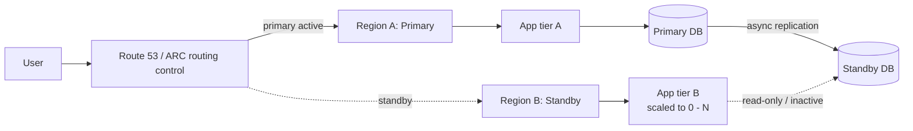

# Multi-region active-passive

> **One-line summary.** Run the workload in one Region; replicate data continuously to a standby Region. On primary failure, fail over to the standby. Cheaper and simpler than active-active; higher RTO.

## TL;DR
- "Active-passive": one Region is primary (serving traffic); one or more are passive (replicated data, scaled-down or zero compute). Failover converts the standby to primary.
- Three sub-flavors by warmth: **backup-and-restore** (no standby — restore from backup), **pilot light** (standby DB replicated, compute scaled to zero), **warm standby** (standby full stack at reduced capacity). The "warm standby → hot standby → active-active" continuum.
- AWS-native: **Aurora Global Database** (managed cross-Region async replication with planned-failover in ~1 min), **DynamoDB Global Tables** (multi-active under the hood, used active-passive), **S3 CRR**, **MGN / DRS** for server-level replication.
- **Route 53 ARC** is the recommended primitive for orchestrated failover — atomic routing controls + safety rules + readiness checks.
- The right choice for most "we need DR" requirements where RTO is measured in minutes-to-hours, not seconds.

## When to use it
- Workloads with strict RTO / RPO requirements that need cross-Region resilience.
- Compliance environments mandating geographic DR.
- Workloads where Region-level outage is rare enough that active-passive cost is acceptable.
- Most general business apps where active-active complexity isn't warranted.

## When NOT to use it
- Workloads needing seconds of RTO and sub-second user-impact globally — use **active-active**.
- Workloads where single-Region with strong AZ-level HA satisfies the RTO — multi-Region adds cost / operational overhead.
- Workloads where DR drills are never run — un-drilled DR is fiction.

## How it works

- Primary Region (A) serves all traffic.
- Standby Region (B) holds replicated data; compute is scaled down (pilot light) or running at reduced capacity (warm standby).
- Routing layer (Route 53 ARC routing control) points to A.
- On failure: flip the routing control to B; scale up compute in B; promote B's DB to writer.

## Key concepts

### Warmth levels (continuum)

**1. Backup-and-restore** — no standby. Data backed up to a target Region (S3 cross-Region replication, AWS Backup cross-Region copy). On failure: spin up infrastructure from IaC + restore data. **RTO**: hours to days. **RPO**: depends on backup frequency. **Cost**: minimal (storage only).

**2. Pilot light** — data replicated continuously to the standby Region; compute scaled to near-zero (a minimum baseline). On failover: scale up compute, redirect traffic. **RTO**: tens of minutes. **RPO**: minutes. **Cost**: replication + minimum compute.

**3. Warm standby** — full stack running in the standby Region at reduced capacity. On failover: scale up to peak; redirect traffic. **RTO**: minutes. **RPO**: seconds. **Cost**: full data layer + reduced compute layer (~30-50% of primary).

**4. Hot standby / active-active read** — full capacity in standby; receives some traffic (often reads). One step away from active-active.

### Routing & orchestration

**Route 53 ARC routing controls** — atomic, on/off controls hosted on a highly available cluster.
- **Routing controls** = boolean ("Region A active"). Flip the control to fail over.
- **Safety rules** = constraints ("only one Region active at a time" — prevents split-brain).
- **Readiness checks** = continuous monitoring that the standby Region is actually capable of taking traffic (quotas, capacity, replication lag).
- **Region switch** = the orchestration layer that combines all of the above for a managed planned-failover experience.

**Route 53 failover routing** — DNS-based; subject to DNS TTL caching. Faster to set up than ARC, slower to fail over.

**Global Accelerator** — anycast IP failover in seconds, no DNS TTL.

### Data layer options

**Aurora Global Database:**
- One primary Region (writes), up to 5 secondary Regions (read-only).
- Async replication; typical lag < 1 second.
- **Managed planned failover**: ~1 minute, no data loss (waits for replication to catch up).
- **Detach and promote** for unplanned failover: data loss = lag at the failure moment.

**DynamoDB Global Tables:**
- Multi-active under the hood, but typically used active-passive — direct writes to one Region.
- Eventual consistency; MRSC for strong (3-Region commitment).

**S3:**
- **Cross-Region Replication (CRR)** for async object replication.
- **S3 RTC** for 15-min RPO SLA.
- **Multi-Region Access Points** for unified endpoint.

**ElastiCache Global Datastore:**
- Multi-Region Redis / Valkey replication.
- Async; typical lag seconds.

**MGN / AWS Elastic Disaster Recovery (DRS):**
- Block-level continuous replication of EC2 instances to a target Region.
- **DRS** is the dedicated DR-flavor; MGN is the migration-flavor (similar tech, different use case).

### Compute layer

- **IaC** (CloudFormation / CDK / Terraform) ensures the standby Region's infra can be created or scaled up reliably.
- **Scaling policies** in the standby Region to ramp up on failover.
- **Container images / Lambda code** pre-deployed in both Regions.

### Failover procedure

A typical orchestrated failover:
1. **Detect** the primary is unhealthy (CloudWatch alarms, ARC readiness checks).
2. **Decide** to fail over (automatic via ARC, or manual via runbook).
3. **Flip the routing control** (ARC).
4. **Scale up standby compute** (Auto Scaling / Lambda concurrency / ECS desired count).
5. **Promote the standby DB** to writer (Aurora Global Database `failover` API).
6. **Verify readiness** (smoke tests).
7. **Communicate** to users / stakeholders.

A planned failover (drill, maintenance) is the same procedure with steps 1-2 replaced by "we decided to fail over now."

## Common pitfalls

- **Untested failover.** Replication shows "healthy" but the actual failover procedure has never been executed. Schedule quarterly drills.
- **Skipping readiness checks.** Failover triggers; standby has insufficient quota / capacity / cached config. Use ARC readiness checks to catch this before it bites.
- **DNS TTL too long.** A 5-minute TTL means 5 minutes of failed requests after failover. Use ARC routing controls or Global Accelerator instead of pure DNS failover.
- **Data loss not characterized.** RPO is "replication lag." Measure it; alarm on lag exceeding the RPO budget.
- **Standby region not in IaC.** Stand-up time during failover = manual config = mistakes. Everything in IaC, deployed to both Regions.
- **Cost surprise on warm standby.** Full data layer + half compute is real money. Pilot light is dramatically cheaper if the RTO budget allows.
- **No "fail back" plan.** After incident, going back to the original primary is also a failover — needs its own runbook, drill, and verification.
- **Split-brain via dual-active misconfiguration.** Routing flip plus stale primary still accepting traffic. ARC safety rules prevent the "both Regions active" state.
- **Per-account / per-Region quota mismatches.** Standby has lower quotas (Lambda concurrency, EC2 vCPUs, etc.); scale-up fails. Pre-raise quotas in the standby Region.
- **Replication lag not surfaced.** Lag exceeds RPO; no alarm. Wire a CloudWatch alarm on replication lag for every replicated resource.

## Trade-offs & Alternatives

- **Backup-and-restore vs pilot light vs warm standby.** Each tier ~10× the cost of the previous; ~10× lower RTO. Pick the tier whose RTO matches the business need.
- **Active-passive vs active-active.** Active-passive: simpler, cheaper, slower failover. Active-active: lowest RTO, highest cost / complexity. Active-passive is the right default for most workloads.
- **Aurora Global Database vs DynamoDB Global Tables.** Aurora: SQL, async replication, one writer at a time. DynamoDB: NoSQL, async or sync (MRSC), multi-active capable.
- **Cross-Region vs cross-AZ.** Cross-AZ HA covers the most common failure modes for free (RDS Multi-AZ, DynamoDB multi-AZ, ALB across AZs). Cross-Region is for the rarer Region-scale events.
- **DR via DRS vs MGN.** DRS for ongoing replication for DR purposes; MGN for one-time migration.

## Common pitfalls (architectural)

- **DR plan exists, no one's read it.** A plan that doesn't fit on one page and doesn't have an owner won't survive the incident.
- **No regional drills in change management.** Big deploys / config changes only ever happen in production primary. Standby Region drifts.
- **Operators not trained on the failover procedure.** Drills aren't just for the infra; the people need to know what to do.
- **No post-failover runbook.** "We failed over; now what?" Define monitoring, reduced-capacity warnings, when to fail back.

## Further reading
- [Disaster Recovery Strategies whitepaper, AWS](https://docs.aws.amazon.com/whitepapers/latest/disaster-recovery-workloads-on-aws/disaster-recovery-options-in-the-cloud.html).
- [Aurora Global Database failover](https://docs.aws.amazon.com/AmazonRDS/latest/AuroraUserGuide/aurora-global-database-disaster-recovery.html).
- [Route 53 Application Recovery Controller](https://docs.aws.amazon.com/r53recovery/latest/dg/what-is-route53-recovery.html).
- [AWS Elastic Disaster Recovery (DRS)](https://docs.aws.amazon.com/drs/).
- Related repo pages: [multi-region-active-active](multi-region-active-active.md), [disaster-recovery-strategies](disaster-recovery-strategies.md).
