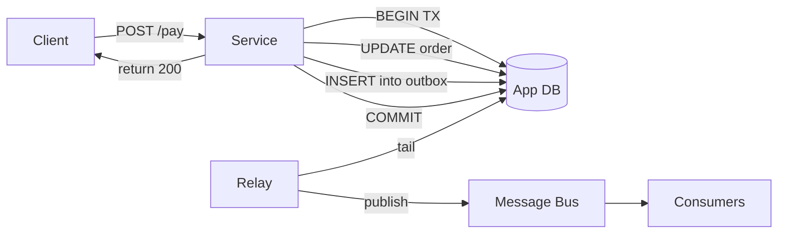

# Transactional outbox

> **One-line summary.** Atomically write a domain event to an "outbox" table in the same transaction as the business state change. A separate relay then publishes the events to a message bus. Solves the dual-write problem.

## TL;DR
- Without it: `update order; publish order-paid event` is two writes. If the publish fails (or the process crashes between them), the DB and the message bus diverge. With it: both writes happen in **one DB transaction**.
- The relay (a separate process, often **DynamoDB Streams + Lambda** or **DMS CDC + Kinesis**) reads the outbox and publishes downstream. At-least-once delivery + idempotent consumers means events are reliably propagated.
- Alternative names: **Transactional outbox**, **outbox pattern**, **dual-write avoidance via CDC**.
- AWS-native: **DynamoDB Streams** is the cleanest implementation; **Postgres logical replication / DMS CDC** for RDBMS sources; **Aurora Zero-ETL** for some downstream targets without an explicit outbox table.
- Pairs with [event-sourcing](event-sourcing.md), [CQRS](cqrs.md), and [saga](saga.md). The outbox is what makes those patterns reliable.

## When to use it
- Any service that needs to **change local state AND publish an event** atomically.
- Microservices integrating via events where dropping an event is unacceptable.
- Sagas / distributed transactions where each step must reliably emit its outcome.
- Read-model projections where the projection must never miss an upstream change.

## When NOT to use it
- The event is best-effort / nice-to-have (analytics that can lose 1%).
- The service has no local DB; it's a stateless transformation.
- Pure event-sourced systems where the event store *is* the system of record (the events are written first; the state is the projection).

## How it works



1. Service receives the request.
2. In **one transaction**: update business state (the order row) AND insert into the `outbox` table (the event payload).
3. Commit — both succeed atomically, or both fail atomically.
4. A separate **relay** tails the outbox (via CDC / streams) and publishes events to a message bus.
5. Consumers process events with at-least-once + idempotent handlers.

### The dual-write problem this solves
Without the outbox:
```python
update_order(order_id, status="paid")  # write 1
publish_event(...)  # write 2 — different system
```
If write 2 fails (network blip, message bus down) after write 1 commits, the DB says "paid" but no one downstream knows. The reverse scenario (publish succeeds, DB write fails) is symmetric.

With the outbox, both writes are inside **one** DB transaction. Either both happen or neither does. The relay reliably propagates committed events.

## Key concepts

**Outbox table.** Schema typically:
```sql
CREATE TABLE outbox (
  id            UUID PRIMARY KEY,
  aggregate_id  VARCHAR,
  event_type    VARCHAR,
  payload       JSONB,
  created_at    TIMESTAMPTZ,
  published_at  TIMESTAMPTZ NULL  -- relay marks after publish
);
```
The relay polls / tails for rows where `published_at IS NULL`, publishes, then updates `published_at`.

**Relay implementations:**
- **DynamoDB Streams + Lambda** — the gold standard on AWS. Streams capture changes; Lambda publishes to SNS / EventBridge / Kinesis. No polling, no separate relay process.
- **CDC tools (Debezium, AWS DMS)** — tail the source DB's transaction log; publish to Kafka / Kinesis. Best for RDBMS sources.
- **Polling relay** — a separate process polls the outbox table on a schedule. Simplest; adds latency and load on the DB.

**At-least-once + idempotency.** The relay can publish the same event twice (after a crash before marking `published_at`). Consumers MUST be idempotent. See [idempotency](idempotency.md).

**Ordering.** With per-aggregate ordering: publish events for the same `aggregate_id` in commit order. SQS FIFO with `MessageGroupId = aggregate_id`, Kafka with `key = aggregate_id`, Kinesis with `partitionKey = aggregate_id`.

**Outbox cleanup.** Published rows shouldn't accumulate forever. Two strategies:
- **Hard delete** after publish + retention window.
- **Soft delete** + scheduled cleanup.

For DynamoDB, **TTL** can auto-delete old outbox items.

**Inbox pattern (the consumer side).** When the consumer needs at-most-once processing, persist `(message_id, processed_at)` to an "inbox" table; check before processing. Combine with the outbox for end-to-end exactly-once-style semantics.

## AWS-native implementations

### DynamoDB Streams + Lambda (recommended)
Use DynamoDB as the app DB; write business state and the outbox event in the **same transaction** (`TransactWriteItems`). Stream captures both; Lambda processes the stream and publishes the event to SNS / EventBridge.

```python
dynamodb.transact_write_items(TransactItems=[
    {'Update': {'TableName': 'orders', 'Key': {...}, 'UpdateExpression': 'SET status = :paid', ...}},
    {'Put': {'TableName': 'outbox', 'Item': {'id': str(uuid4()), 'event_type': 'OrderPaid', 'payload': {...}}}},
])
# Lambda triggered by DynamoDB Streams reads the outbox insert and publishes to EventBridge
```

The DynamoDB Stream-driven relay is exactly-once *enough* (Lambda retries on failure; idempotency handles dups).

### Postgres / MySQL + Debezium / DMS CDC
For RDBMS sources, **DMS** tails the transaction log; downstream sink to Kinesis / MSK / S3 / SNS via Lambda. Debezium (self-managed Kafka Connect) is the open-source path. Both extract changes without polling the app DB.

### Aurora Zero-ETL → Redshift (specific case)
For analytical projection of operational data, Aurora Zero-ETL replicates changes to Redshift automatically — a managed outbox-like flow where the outbox table is implicit (the full Aurora change log).

## Common pitfalls

- **Two writes in app code instead of one transaction.** Defeats the purpose. The outbox insert must be in the same transaction as the business write.
- **Polling relay with no backoff.** Hammers the DB. Use CDC / streams where possible; if polling, batch + backoff.
- **No idempotency in consumers.** Relay republishes after crash; consumer processes twice. See [idempotency](idempotency.md).
- **Outbox grows forever.** Cleanup published rows. DynamoDB TTL; for SQL, scheduled `DELETE` jobs.
- **Lost ordering.** Multi-partition publish without a partition key = consumers see events out of order. Use `aggregate_id` as the partition key.
- **Publishing the entire row from CDC.** Sometimes works, sometimes leaks fields you didn't intend (`internal_score`, `legacy_flag`). Transform in the relay.
- **DynamoDB Streams' 24-hour retention.** Long downstream outages can lose events. Have a backfill plan (re-process from snapshots / event store).
- **Outbox row in a single shared table for the whole monolith.** Becomes a hot table with lock contention. Split per service / per aggregate.
- **Schema versioning skipped.** Events evolve; old consumers break. Include a version field; manage schema with Glue Schema Registry / EventBridge Schema Registry.

## Trade-offs & Alternatives

- **Outbox vs distributed transactions (2PC).** Two-phase commit doesn't compose across heterogeneous systems and is widely avoided. Outbox is the practical answer.
- **Outbox vs event sourcing.** Outbox = state + events emitted on change. Event sourcing = events are the source of truth; state is derived. Outbox is incremental adoption; ES is a deeper commitment. See [event-sourcing](event-sourcing.md).
- **Outbox vs change-data-capture-only.** Pure CDC (DMS / Debezium tailing the source table) doesn't require an outbox table — the CDC stream *is* the change feed. Downside: every column change is an event; you can't shape events business-meaningfully (a "user upgraded plan" event vs ten column-level updates).
- **Outbox + inbox for end-to-end exactly-once.** Outbox guarantees publish; inbox guarantees consume-once. Together they approximate exactly-once across the boundary.

## Common pitfalls (architectural)

- **Treating eventually-published events as immediately-available.** Relay latency is real (DynamoDB Streams: seconds; CDC: subsecond–seconds; polling: minutes). Downstream consumers might lag the producer. Design for that.
- **No DLQ on the relay.** A poison-pill event blocks all downstream processing. DLQ + alarm on DLQ depth.
- **Outbox events used as the system of record.** They're a change log, not history. If you need full history, consider event sourcing.

## Further reading
- ["Pattern: Transactional outbox", microservices.io](https://microservices.io/patterns/data/transactional-outbox.html).
- [Debezium docs](https://debezium.io/) — the canonical CDC implementation, often paired with outbox.
- ["Reliability, constant work, and a good cup of coffee", Amazon Builders' Library](https://aws.amazon.com/builders-library/reliability-and-constant-work/).
- [DynamoDB Streams docs](https://docs.aws.amazon.com/amazondynamodb/latest/developerguide/Streams.html).
- [DMS Change Data Capture](https://docs.aws.amazon.com/dms/latest/userguide/CHAP_Source.html).
- *Designing Data-Intensive Applications*, Martin Kleppmann, Chapter 11 (Stream Processing).
