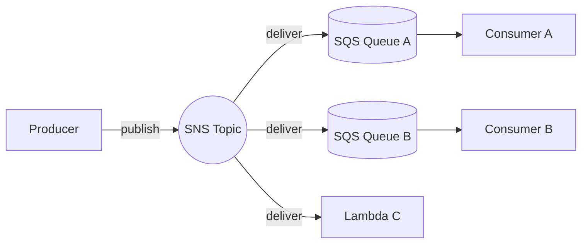
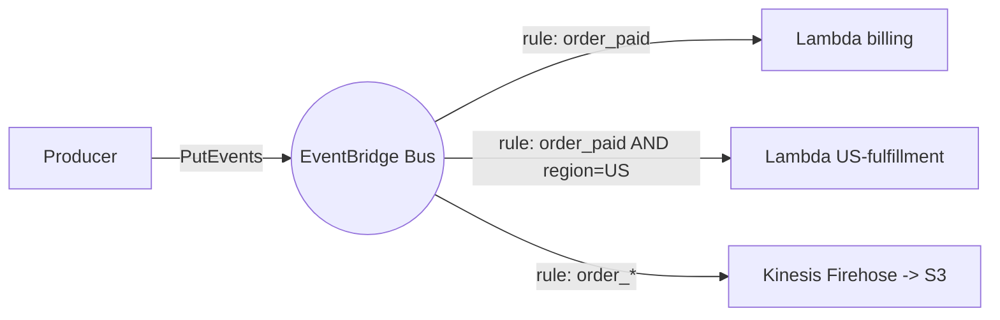

# Pub/Sub

> **One-line summary.** Decouple producers from consumers. Producers publish messages to a topic; subscribers (zero, one, or many) receive copies. The fundamental fanout primitive.

## TL;DR

- The right shape when one event needs to reach many independent consumers without producers knowing who they are.
- Three AWS-native flavors: **SNS** (lightweight pub/sub with filtering, mostly stateless), **EventBridge** (event bus with content-based rules and rich AWS-service targets), **Kinesis / MSK** (streaming pub/sub with offsets and replay).
- **SNS-to-SQS** is the canonical AWS pattern — SNS does fanout, each subscriber gets its own SQS queue for durable buffering and independent consumption.
- The big trade-offs: **at-least-once vs exactly-once** (almost always at-least-once + idempotent consumers), **ordering** (per-partition vs unordered), **persistence and replay** (streaming logs vs ephemeral notifications).
- Pub/sub doesn't *eliminate* coupling — it shifts it from sync API contracts to async message schemas. Schema governance (Glue Schema Registry, EventBridge Schema Registry) matters.

## When to use it

- One event has multiple interested consumers (order placed → fulfillment, billing, notification, analytics).
- You want producers to be unaware of consumers (add a new consumer without changing producer code).
- Cross-service async integration where sync coupling would create cascading failures.
- Mobile / web push fanout.
- Cross-account / cross-Region event distribution.

## When NOT to use it

- One producer, one consumer with simple buffering — use **SQS** directly.
- Workflows requiring state and branching — use **Step Functions**.
- Single-Region request-response — use direct API calls (with backpressure / circuit breakers).
- Ordered, replayable event logs at very high throughput — use **Kinesis / MSK** rather than SNS / EventBridge.

## How it works

### Canonical SNS-to-SQS fanout

- Producer publishes one message to SNS.
- SNS delivers to N subscribers (here: 2 SQS queues + 1 Lambda).
- Each consumer reads from its own queue / receives its own invocation — fully decoupled.
- If consumer B is down, SNS doesn't care; messages accumulate in queue B until B comes back.

### EventBridge bus with content-based routing

- Producer publishes JSON events to a custom EventBridge bus.
- Rules match on `source` / `detail-type` / arbitrary `detail` fields.
- One event can trigger many targets via separate rules.
- Targets: Lambda, Step Functions, SQS, SNS, Kinesis, ECS Task, API Gateway, cross-account / cross-Region buses, HTTP endpoints via API destinations.

## Key concepts

**Topic / bus** — the named pub/sub channel. SNS calls them topics; EventBridge calls them buses.

**Subscription / rule** — the binding from topic to consumer. SNS subscriptions can filter on message attributes; EventBridge rules filter on event payload content.

**Message attributes vs body.** SNS filters on attributes only; EventBridge filters on full event content. EventBridge is more flexible for routing.

**Delivery semantics.**

- **At-least-once** — every message eventually delivered, may duplicate. The AWS default for SNS, EventBridge, SQS, Kinesis.
- **At-most-once** — delivered ≤ 1 time; can lose. Rarely what you want.
- **Exactly-once** — impossible in general; achievable via at-least-once + idempotent consumers within a dedup window (FIFO SQS, Kafka EOS, Step Functions Standard).

**Ordering.**

- **Unordered** — SNS Standard, EventBridge, Kinesis across shards.
- **Per-key ordered** — SQS FIFO (per MessageGroupId), Kinesis (per partition key), Kafka (per partition).
- **Global ordering** — generally impossible at scale; available in single-partition Kinesis (limits throughput).

**Persistence and replay.**

- **Ephemeral notifications** — SNS / EventBridge default. If subscriber misses it (down, slow), it's gone (unless using DLQ).
- **Durable logs with offsets** — Kinesis / MSK / Kafka. Subscribers replay from past offsets.
- **EventBridge Archive + Replay** — bridge: archive events on a bus and replay later for debugging or recovery.

**Schemas.** As consumers proliferate, schema becomes the contract. **AWS Glue Schema Registry**, **EventBridge Schema Registry** discover schemas from events on a bus and generate SDK bindings for producers / consumers.

**DLQs.** Always wire a DLQ. Failed deliveries that aren't surfaced are silent outages.

## Choosing the AWS service

| Need | Use |
|---|---|
| Fanout to ≤ few targets, simple | **SNS** (with SQS per consumer) |
| Bus with content-based rules + many AWS-service targets | **EventBridge** custom bus |
| Cross-account / cross-Region routing with managed identity | **EventBridge** |
| SaaS event ingestion (Datadog, Auth0, MongoDB) | **EventBridge** partner buses |
| Ordered, replayable, partitioned stream | **Kinesis Data Streams** |
| Kafka API surface | **MSK** |
| Cron-style scheduled publishes | **EventBridge Scheduler** |
| One-source-one-target with filter + enrich | **EventBridge Pipes** |
| Mobile push (APNs / FCM) | **SNS** with platform applications |

See the individual service pages for depth: [SNS](../01-services/integration-messaging/sns.md), [SQS](../01-services/integration-messaging/sqs.md), [EventBridge](../01-services/integration-messaging/eventbridge.md), [Kinesis](../01-services/analytics/kinesis.md), [MSK](../01-services/analytics/msk.md).

## Common pitfalls

- **One topic per consumer.** Use one topic + per-subscription filtering. N topics = N producer changes when a new consumer appears.
- **No DLQ.** Failed deliveries vanish. Always DLQ + alarm.
- **Subscriber not idempotent.** At-least-once + non-idempotent consumer = duplicates corrupt state. See [idempotency](idempotency.md).
- **Synchronous coupling masquerading as pub/sub.** "Publish + wait for response" defeats the decoupling. If you need request/response, that's RPC.
- **Schema drift without governance.** Producers change the event shape; downstream consumers break silently. Use the Schema Registry.
- **Unbounded consumer fanout.** Adding 50 consumers means SNS delivers each message 50 times — billing scales linearly. Audit subscriber count.
- **FIFO topics with too many MessageGroupIds.** Throughput is per-group; over-partition the data and you saturate per-group quotas. Pick group IDs at the right granularity.
- **Cross-account subscriptions without resource policies.** Both sides must allow. Easy to miss.
- **Mixing pub/sub with persistent state.** A message arriving = an event happened. Don't treat the topic as the system of record; durable state lives in DynamoDB / RDS / event store.

## Trade-offs & Alternatives

- **SNS vs EventBridge.** SNS for simple fanout / push channels (SMS, mobile push). EventBridge for content-based routing with many AWS targets. Often layered: SNS topic → EventBridge bus for richer downstream.
- **Pub/Sub vs streaming.** Pub/sub (SNS / EventBridge) is push-based, ephemeral. Streaming (Kinesis / Kafka) is pull-based, replayable, partitioned. Streaming wins for event sourcing / replay; pub/sub wins for notifications.
- **In-process bus vs cross-service.** Within one service, a memory bus is fine. The moment you cross a service boundary, prefer a durable broker.

## Common pitfalls (architectural)

- **"We'll route everything through one mega-bus."** Single bus, all events, single point of governance failure. Use bounded contexts — one bus per domain / team.
- **No event-version strategy.** When the schema evolves, old consumers break. Plan version migrations (event version field, schema-registry-based compatibility checks).
- **No event audit log.** Pub/sub is fire-and-forget; without an audit log (Firehose → S3, CloudTrail, EventBridge Archive), you can't reconstruct "what events did consumer C see last Tuesday at 3 AM?"

## Further reading

- ["Avoiding fallback in distributed systems", Amazon Builders' Library](https://aws.amazon.com/builders-library/avoiding-fallback-in-distributed-systems/).
- *Designing Event-Driven Systems*, Ben Stopford.
- [EventBridge architecture patterns](https://serverlessland.com/event-driven-architecture/).
- [Choosing between SNS, SQS, and EventBridge](https://docs.aws.amazon.com/decision-guides/latest/messaging-services-on-aws-how-to-choose/messaging-services-on-aws-how-to-choose.html).
- *Designing Data-Intensive Applications*, Martin Kleppmann, Chapter 11 (Stream Processing).
