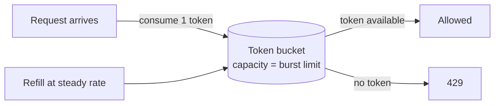

# Rate limiting

> **One-line summary.** Cap request rate per client / endpoint / resource. Protects downstream from being overwhelmed; protects shared infrastructure from a noisy tenant; protects you from runaway cost.

## TL;DR

- Three classic algorithms: **token bucket** (most popular), **leaky bucket**, **fixed / sliding window counter**. Each handles burst differently.
- Apply rate limits at multiple layers: edge (CloudFront / WAF), API gateway (API Gateway throttling), application (in-process), downstream-per-tenant (per-tenant quotas).
- Distributed rate limiting needs shared state (Redis / DynamoDB / ElastiCache) — local rate limiters across N hosts allow N× the intended rate.
- AWS-native: **WAF rate-based rules**, **API Gateway throttling + usage plans**, **DynamoDB / Valkey for custom limiters**. **AWS Verified Access**, **Cognito**, and per-service quotas all rate-limit implicitly.
- Communicate limits clearly via `429 Too Many Requests` + `Retry-After` + standard rate-limit headers. Silent rate limiting confuses every client.

## When to use it

- Public APIs serving multiple tenants — prevent one tenant from starving others.
- Per-user or per-IP abuse mitigation (signup spam, brute-force login, scraping).
- Cost protection on calls to expensive downstream services (LLMs, third-party APIs).
- Throttling background jobs to bounded throughput.
- Protecting downstream databases from spike-load.

## When NOT to use it

- Internal microservice traffic where you'd rather use **backpressure** (queue + auto-scale) than reject.
- Workloads where rejection causes worse cascading failures than slowdown.
- Tiny scale where the limiter's own complexity outweighs the protection.

## How it works

### Token bucket (the most-used algorithm)

- Bucket has **capacity** (max burst) and **refill rate** (steady state).
- Each request consumes one token.
- Empty bucket = reject (or queue with backpressure).
- Allows sustained-rate + bounded-burst behavior.

### Leaky bucket

- Requests fill a queue; queue drains at a fixed rate.
- Constant outflow regardless of input burst.
- Used for traffic shaping (smooth bursts into a steady stream).

### Fixed window counter

- Count requests in 1-minute / 1-hour windows; reset at window boundaries.
- Simple but allows "double burst" at window transition.

### Sliding window counter

- Hybrid of fixed window + weighted average across boundaries.
- More accurate, slightly more state.

### Sliding window log

- Store timestamp of every request; count entries in the last N seconds.
- Most accurate, most memory.

## Where to apply rate limits

| Layer | Purpose |
|---|---|
| **Edge (CDN / WAF)** | Volumetric / IP-based attacks before they reach origin |
| **API Gateway** | Per-API / per-method / per-API-key limits |
| **Service mesh / sidecar** | Per-service-to-service traffic |
| **Application** | Per-user / per-tenant business rules |
| **Downstream wrapper** | Protect a specific dependency (DB, LLM, third-party API) |

Layered limiters are normal; each catches what the next layer can't.

## Distributed rate limiting

Local rate limiters on N hosts allow N× the configured rate — fine for protecting one instance, not for protecting downstream.

Distributed-state options:

- **Redis / Valkey** with `INCR` + TTL or atomic Lua scripts. Most common.
- **DynamoDB** with conditional writes (`if attribute_exists`, atomic counters).
- **Token-bucket on Memcached** with `CAS` operations.
- **Built-in cloud services** — WAF rate-based rules, API Gateway throttling — manage state for you.

Trade-off: a shared store adds a network hop per request. For very tight latency budgets, a local + shared hybrid (local approximate counter, async sync) is sometimes the answer.

## AWS-native implementations

| Pattern | AWS option |
|---|---|
| Per-IP DDoS / abuse limiter | [WAF rate-based rules](../01-services/security-identity/waf.md) |
| Per-API-key quota + per-second / per-minute throttle | [API Gateway REST API usage plans](../01-services/networking/api-gateway.md) |
| Per-stage throttle (HTTP API) | API Gateway HTTP API throttling |
| Per-account service quota | AWS Service Quotas (managed across hundreds of services) |
| Custom application limiter | **ElastiCache for Valkey / Redis OSS** + atomic INCR / Lua script |
| Per-tenant DynamoDB quota | Custom limiter in app code with DynamoDB conditional writes |
| Lambda concurrency limit | Reserved concurrency / maximum concurrency on event source mapping |

## Common pitfalls

- **Local rate limiter, N instances, "where's my limit going?"** Multiply local by instance count = effective rate. Use distributed state.
- **Window-aligned reset.** Fixed-window limiters allow 2× burst at the boundary. Use sliding window or token bucket.
- **Silent rate limiting.** Returning the same error code for "rate limited" as for "internal error" confuses clients. Use `429 Too Many Requests` + `Retry-After` + standard `RateLimit-*` headers.
- **No client-side jitter on retry.** Synchronized retries from many clients re-create the spike. Always exponential backoff + jitter.
- **Limit shared across unequal tenants.** Big tenants drown small ones. Per-tenant quotas with weighted fairness.
- **No protection on the cheap path.** Limiters on `/orders` but not `/healthz` lets attackers DOS the cheap endpoints. Limit globally + per-endpoint.
- **Token bucket too big.** Allows long bursts that overload downstream. Size capacity for what downstream can absorb, not for user happiness.
- **No metrics on rate-limit hits.** "Limiter saved us" is invisible. Track hit rate per limiter / tenant / endpoint.

## Trade-offs & Alternatives

- **Reject vs queue.** Rate limit rejects; backpressure queues. Reject is honest at the API boundary; queue is right for async work. Don't queue what should be rejected — unbounded queues are silent failures.
- **Per-IP vs per-user.** IP limits catch unauthenticated abuse but miss CGNAT / proxies. User limits need auth. Often you want both layered.
- **Static limit vs adaptive.** Static is predictable; adaptive (load-aware) is more efficient but harder to debug. Most APIs start static.
- **Hard limit vs soft limit + monitor.** Hard = `429`. Soft = log and let through. Soft is useful while tuning a new limit.

## Common pitfalls (specific to AWS)

- **WAF rate-based rule with too-low threshold.** Triggers on real users (CDN scrapes, mobile multi-tabs). Tune from log data.
- **API Gateway burst limits ignored.** Default 5,000 req/s burst, 10,000 RPS account quota — easy to hit on a popular API. Raise pre-launch.
- **Lambda reserved concurrency as the rate limiter.** Works but blunt — caller sees throttled errors rather than `429`. Add an explicit rate limiter at the API boundary if client UX matters.

## Further reading

- ["Token bucket" — Wikipedia](https://en.wikipedia.org/wiki/Token_bucket).
- *Designing Data-Intensive Applications*, Martin Kleppmann (load balancing chapter).
- [WAF rate-based rules docs](https://docs.aws.amazon.com/waf/latest/developerguide/waf-rule-statement-type-rate-based.html).
- [API Gateway throttling docs](https://docs.aws.amazon.com/apigateway/latest/developerguide/api-gateway-request-throttling.html).
- [RateLimit headers RFC](https://datatracker.ietf.org/doc/draft-ietf-httpapi-ratelimit-headers/).
