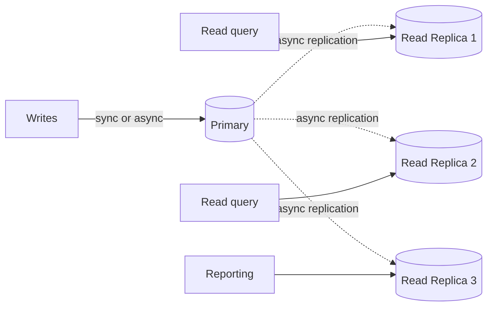
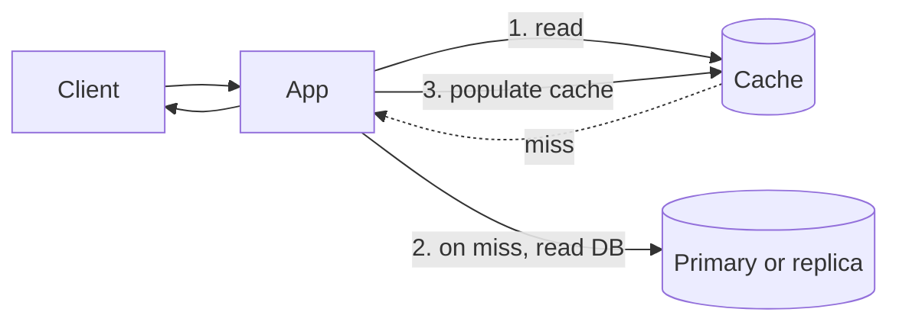

# Read replicas vs caching

> **One-line summary.** Two ways to scale reads: replicate the DB to more nodes (read replicas) or store frequently-fetched results in front (cache). Different problems, often used together.

## TL;DR
- **Read replicas** answer "any query at a slightly stale point in time" — same schema as the writer, asynchronous replication, transparent to most query patterns.
- **Caches** answer "this exact query I just asked has been asked recently" — denormalized, key-based, evicted by TTL / LRU, much higher hit rate for hot data.
- Trade-offs: read replicas are operationally simple (they're just another DB) but bound by per-replica capacity and add per-replica cost. Caches are dramatically cheaper per request but introduce invalidation and stampede problems.
- Most production systems use **both layered** — cache for hot data, read replicas for the long tail.
- AWS-native: **RDS / Aurora read replicas**, **Aurora multi-AZ DB cluster (readable standbys)**, **DynamoDB Global Tables (read replicas of a sort)**, **ElastiCache / DAX / CloudFront** for caching.

## When to use which

| Use read replicas when… | Use caching when… |
|---|---|
| Read traffic shape mirrors writes (varied queries) | A small subset of queries dominates traffic |
| Slight staleness (seconds) is acceptable | Slight staleness (seconds to minutes) is acceptable |
| Queries vary (ad-hoc reports, analytics) | Queries are repetitive (page view of the same product) |
| Schema-level access (joins, aggregates) | Key-based access (`get_user(42)`) |
| Per-tenant analytics / reporting workloads | Per-user / per-page hot data |
| You'd rather not invalidate manually | You can manage cache-coherence carefully |

## How they work

### Read replicas

- Primary handles writes; one or more read replicas are kept in sync via async replication.
- App routes reads to replicas (often via a separate connection string / cluster reader endpoint).
- Replicas are slightly stale (lag = replication delay, typically tens of ms to seconds).
- Failover: promote a replica to primary on failure.

### Cache (cache-aside example)

- Cache sits in front of (a subset of) DB queries.
- Miss → read from DB, populate cache.
- Hit → return immediately, no DB query.
- TTL / event-driven invalidation keeps cache fresh (with bounded staleness).

## Comparison in depth

### Latency profile

- **Read replica**: similar latency to primary (network + query cost). Maybe slightly different if the replica is in another AZ.
- **Cache**: typically sub-millisecond on hit; same as DB on miss.

Hit-rate matters a lot — a 99% hit-rate cache layer in front of a DB roughly serves the workload at cache speed.

### Throughput

- **Read replicas**: each replica handles up to one DB instance's throughput. Adding replicas scales linearly (until the writer becomes the bottleneck for replication).
- **Cache**: limited only by the cache cluster's CPU / network. Easy to scale to >1M req/s with sharded Redis / Valkey / Memcached.

### Cost

- **Read replicas**: per-replica-hour at DB instance prices. Expensive if many replicas needed.
- **Cache**: per-cache-node-hour at typically lower prices than DB instances. Plus much higher per-instance throughput.

For high-RPS read workloads, caching is dramatically cheaper.

### Consistency

- **Read replicas**: eventually consistent (replication lag). Within a single replica, reads are consistent with the replica's known state.
- **Cache**: bounded-stale via TTL. The invalidation problem (and its hard children — race conditions, stampedes, stale-after-write) is real. See [caching-strategies](caching-strategies.md).

### Query shape

- **Read replicas**: full SQL — joins, aggregations, ad-hoc.
- **Cache**: key-based only (unless you build a query cache, which has its own gotchas).

### Operational complexity

- **Read replicas**: managed by AWS (RDS / Aurora). Setup is "add a replica" in the console / Terraform. Operational profile = "another DB."
- **Cache**: managed by AWS (ElastiCache / DAX) for the infra. Operational profile = "another moving part" — invalidation strategy is your problem.

## AWS-native implementations

### Read replicas
- **RDS read replicas** — async replication; up to 15 per source (engine-dependent); promote-to-primary supported.
- **Aurora replicas** — share the same storage layer; replica lag typically tens of ms; up to 15 readers.
- **Aurora Multi-AZ DB cluster** — readable standbys (two), semi-synchronous, faster failover (~35 s).
- **Aurora Global Database** — cross-Region read replicas; lag typically < 1 s.
- **DynamoDB Global Tables** — multi-active under the hood; can be used as cross-Region read scale.

### Caches
- **ElastiCache** — Valkey / Redis OSS / Memcached. Cache-aside, read-through, write-through patterns.
- **MemoryDB** — Redis API + durable storage; for cache-that-must-not-lose-data scenarios.
- **DAX** — transparent caching for DynamoDB; sits in front of the table, eventually consistent.
- **CloudFront** — HTTP / asset CDN; the "cache" for public web traffic.
- **API Gateway response cache** — per-stage HTTP response cache for REST APIs.

## Common pitfalls

- **Treating cache and replica as interchangeable.** They solve different problems. Don't replace one with the other without considering the access pattern.
- **Cache without an invalidation plan.** Staleness becomes a feature you'll repeatedly explain to users. TTL is the safety net; explicit invalidation is the fast path.
- **Cache stampede on cold start.** Cold cache + production traffic = DB overload. Warm caches; use request coalescing.
- **Read replica with no lag monitoring.** Lag grows; reports show data from "5 minutes ago" without warning. Alarm on replication lag.
- **Routing all reads to replicas indiscriminately.** A read-after-write that lands on a stale replica → user sees their own write didn't happen. Use the writer (or sticky writer-bound session) for read-after-write paths.
- **Cache key explosion.** A user-id × locale × currency × A/B variant cache has cardinality explosion. Pick keys carefully.
- **Reaching for caching too early.** Without measurement, you'll cache the wrong things. Profile first.
- **Read replicas as the primary scaling lever for "we have too much load."** If 95% of the load is one popular query, a cache hits 95% of it; scaling replicas does the same work at higher cost.
- **Forgetting that read replicas pay for their own storage** (RDS read replicas — Aurora replicas share storage so cheaper).

## Trade-offs & Alternatives

- **Cache + read replica together.** The standard production setup. Cache absorbs hot traffic; replicas handle the long tail.
- **CQRS instead of either.** If the read pattern is fundamentally different from the write (e.g., full-text search, analytics), build a separate read model in OpenSearch / Redshift / S3 via [CQRS](cqrs.md). Read replicas don't help when the query shape doesn't match the schema.
- **Materialized views.** Precompute the query result and store it as a denormalized table. Specific kind of read model; works well for known aggregations.
- **More instance capacity vs caching vs replicas.** Sometimes the answer is "the database is too small." Right-size the primary before adding replicas.

## Common pitfalls (architectural)

- **Cache as the system of record.** Caches are designed to be lossy. If losing the cache loses business data, it's not a cache — it's a database. Use MemoryDB or DynamoDB instead.
- **Cache + replica + projection sprawl.** Three layers of caching all stale at different times produces customer support nightmares. Document the data flow; bound the staleness budget.

## Further reading
- ["Caching challenges and strategies", Amazon Builders' Library](https://aws.amazon.com/builders-library/caching-challenges-and-strategies/).
- *Designing Data-Intensive Applications*, Martin Kleppmann, Chapter 5 (Replication).
- Related repo pages: [caching-strategies](caching-strategies.md), [CQRS](cqrs.md), [data-partitioning-sharding](data-partitioning-sharding.md).
- [Aurora replication architecture](https://docs.aws.amazon.com/AmazonRDS/latest/AuroraUserGuide/Aurora.Overview.StorageReliability.html).
- [DAX](https://docs.aws.amazon.com/amazondynamodb/latest/developerguide/DAX.html).
- [ElastiCache best practices](https://docs.aws.amazon.com/AmazonElastiCache/latest/red-ug/BestPractices.html).
