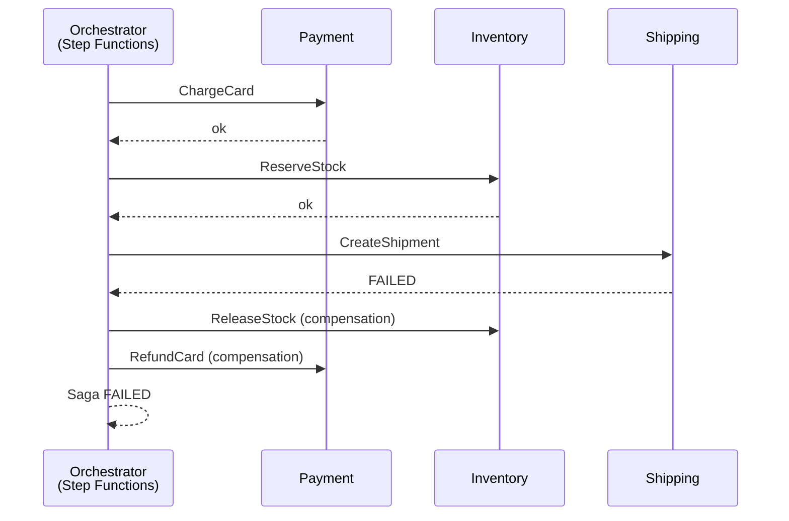
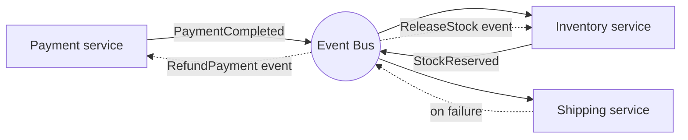

# Saga

> **One-line summary.** Implement long-running, multi-step business transactions as a sequence of local transactions with compensating actions for rollback. The distributed-systems answer to "we can't do 2PC."

## TL;DR
- A saga is a sequence of **local transactions**, each of which emits an event triggering the next. If any step fails, **compensating transactions** undo the prior steps.
- Two flavors: **orchestration** (a central coordinator drives the flow; easy to reason about) and **choreography** (each service reacts to events; loose coupling, harder to debug).
- AWS-native orchestration: **Step Functions** — first-class for sagas, with built-in retries, error handling, and parallel branches. Choreography: **EventBridge** / **SNS** + per-service event handlers.
- **Compensations are not rollbacks** — they're semantic undoes. "Refund the payment" not "DELETE FROM payments WHERE id=…".
- Pairs with [idempotency](idempotency.md), [outbox](outbox.md), and [event-sourcing](event-sourcing.md). Without idempotent steps and reliable event publishing, sagas are unreliable.

## When to use it
- Multi-service business transactions (place order: charge card + reserve inventory + ship + email).
- Workflows that can't (or shouldn't) live in one DB transaction.
- Long-running processes with manual approval steps.
- Distributed transactions where 2PC isn't an option.

## When NOT to use it
- Single-service transactions — use the DB transaction directly.
- Pure async fanout without coordination — use [pub-sub](pub-sub.md).
- Workflows where compensation is impossible (sending a notification you can't unsend — though even there, send-an-apology is a kind of compensation).
- Tiny one-off scripts.

## How it works

### Orchestration (recommended starting point)


A central state machine drives the flow. Each step is a service call; on failure, the orchestrator invokes the compensating steps in reverse order. Easier to debug, single place to change the flow.

### Choreography


No central coordinator. Each service publishes events; downstream services react. Loose coupling, harder to trace.

## Key concepts

**Local transaction.** Each saga step is an ACID transaction in *one* service's DB. Atomic locally; not atomic across the saga.

**Compensating transaction.** A semantic undo for the step. Not a rollback (the local transaction committed). Examples:
- `ChargeCard` → `RefundCharge`.
- `ReserveStock` → `ReleaseReservation`.
- `CreateShipment` → `CancelShipment`.
- `SendEmail` → `SendApologyEmail`.

**Reverse-order compensation.** Compensations run in reverse order of the forward steps. The saga must track which steps succeeded so it knows what to compensate.

**Idempotent steps.** Saga steps may be retried (Step Functions, EventBridge, Lambda all retry on failure). Each step must be safe to retry. See [idempotency](idempotency.md).

**Pivot point.** Some sagas have a step beyond which compensation isn't possible (the ship has left the warehouse). After the pivot, the saga is committed; failures handle differently (escalation, manual intervention).

**Saga state.** The orchestrator tracks current step + completed steps + saga ID. Persisted so it survives restarts. Step Functions handles this natively.

**Correlation ID.** Every event in the saga carries a correlation ID (saga ID) — essential for tracing and debugging.

## AWS-native implementations

### Step Functions (orchestration — recommended)
- **State machine** defines the saga: a sequence of `Task` states (each calling a service / Lambda / SDK action).
- **`Catch`** clauses route to compensating branches on error.
- **Retry policies** for transient failures (don't compensate on a network blip).
- **Standard workflows** for exactly-once execution semantics; **Express workflows** for high-RPS at-least-once.
- Built-in service integrations (200+ AWS SDK actions) mean steps often don't need a Lambda wrapper.

Example shape (high level):
```
Start → ChargeCard → ReserveStock → CreateShipment → Succeed
         catch        catch          catch
         ↓            ↓              ↓
         (none)       RefundCard     ReleaseStock → RefundCard → Fail
```

### EventBridge + per-service Lambda (choreography)
- Each service subscribes to relevant events; emits its own.
- Compensation events flow the same way.
- Use **correlation IDs** in every event for tracing.

### Hybrid
Orchestration for the main flow + EventBridge for cross-domain integration events. Most production sagas are some hybrid.

## Common pitfalls

- **Treating compensations as DB rollbacks.** The local transaction committed; you can't undo it. Compensations are *new* transactions doing the inverse effect.
- **Forgetting non-compensable steps.** "We sent the email — can't unsend it." Identify pivot points; after them, compensations are different (apology, support ticket, manual intervention).
- **Choreography by default.** Easier to start, way harder to debug. Orchestration first; switch to choreography when the flow grows out of one orchestrator.
- **No correlation IDs.** Sagas spanning services produce events in many CloudWatch Log Groups. Without correlation IDs, tracing one saga requires manual joining.
- **Non-idempotent steps.** A retried step double-charges / double-reserves. Idempotency keys on every step.
- **Compensating on transient failure.** A timeout doesn't mean the step failed; the request may have succeeded server-side and the response was lost. Retry first; compensate only on confirmed failure.
- **No saga-state persistence in custom orchestrators.** Custom orchestrators that lose their state on restart drop sagas mid-flight. Use Step Functions or persist orchestrator state to DynamoDB.
- **Cross-saga interleaving.** Two sagas affecting the same aggregate race; results depend on interleaving. Use aggregate-level locking or design sagas to be commutative.
- **No timeout / deadline on saga steps.** A step hung forever blocks the saga. Set per-step timeouts; treat timeouts as failures (with compensation).

## Trade-offs & Alternatives

- **Orchestration vs choreography.** Orchestration: easy to reason about; coupling at the orchestrator. Choreography: loose coupling; observability nightmare. Default to orchestration; move to choreography per service boundary as needed.
- **Saga vs 2PC.** 2PC is synchronous, blocking, doesn't compose across heterogeneous systems, and locks resources during the prepare phase. Saga is async, non-blocking, locally consistent. 2PC is rarely the right answer in modern systems.
- **Saga vs eventual-consistency-with-no-rollback.** For pure eventual-consistency fanout, no compensation is needed (events fire-and-forget). Sagas matter when the workflow must commit-or-rollback as a whole.
- **Step Functions vs Temporal / Cadence / custom.** Step Functions: AWS-managed, deep AWS integration. Temporal / Cadence: more code-driven (workflows in Java / Go), portable, more powerful for complex retries / signals. Step Functions is the right default; consider Temporal when its programming model matters.

## Common pitfalls (architectural)

- **No "manual intervention" path.** Sagas fail in ways the code can't handle. Build a path for an operator to mark a saga as resolved / re-try / escalate.
- **Saga as a god workflow.** A workflow with 30 steps spanning 10 services is hard to maintain. Decompose along bounded-context boundaries.
- **Treating compensation as optional.** It's not. Every step needs a compensation defined up-front, or you have to declare the step a pivot point.

## Further reading
- ["Pattern: Saga", microservices.io](https://microservices.io/patterns/data/saga.html).
- *Microservices Patterns*, Chris Richardson — full chapter on sagas.
- [Saga pattern in Step Functions (AWS workshop)](https://docs.aws.amazon.com/step-functions/latest/dg/sample-project-saga.html).
- ["The Saga Pattern", Caitie McCaffrey, 2015](https://www.youtube.com/watch?v=xDuwrtwYHu8) — the modern revival of the original 1987 Garcia-Molina / Salem paper.
- Related repo pages: [outbox](outbox.md), [idempotency](idempotency.md), [event-sourcing](event-sourcing.md).
