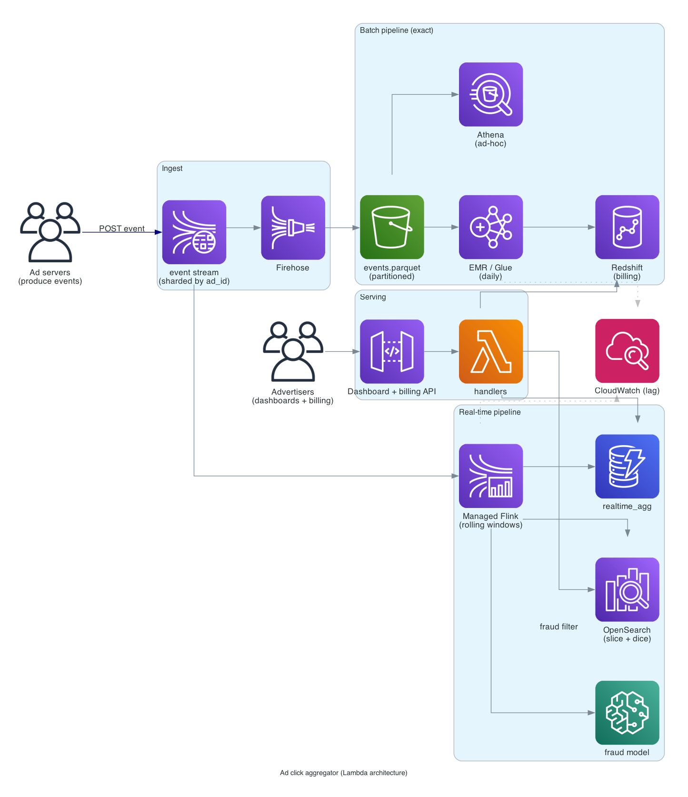

# Ad click aggregator

> **One-line summary.** Count ad impressions and clicks at billions / day; serve near-real-time dashboards to advertisers; deliver exact daily totals for billing. Combines streaming aggregation (real-time) with batch (exactness).

## TL;DR

- Two pipelines from the same input stream: **real-time** (Kinesis → Managed Apache Flink → DynamoDB / OpenSearch, seconds latency, slightly approximate) and **batch** (S3 + Athena / EMR, minutes-to-hours latency, exact totals).
- This is the **Lambda architecture** (the data-engineering term, not the AWS service) — real-time for dashboards, batch for billing-grade exactness.
- **Click ingestion** must absorb 1M+ events/sec at peak (a Super Bowl ad). **Kinesis Data Streams** or **MSK** is the buffer.
- **Aggregation dimensions**: by ad, advertiser, campaign, time-window, geo, demographic. Aggregating across many dimensions is the expensive part.
- The hardest parts: **fraud / invalid-click detection**, **late-arriving events** (a click from 2 hours ago via slow mobile network), and **exactly-once aggregation** despite at-least-once ingest.

## Functional Requirements

- Ingest impression + click events from ad-serving systems.
- Real-time aggregation: count per (ad, campaign, hour) within ~30 seconds.
- Batch aggregation: exact daily totals for billing.
- Fraud detection: filter invalid / bot clicks.
- Multi-dimensional rollups: per-ad, per-campaign, per-advertiser, per-geo, per-device.
- Real-time dashboards for advertisers.
- Daily reports + invoices for billing.

## Non-Functional Requirements

- **Throughput**: 1B events/day average; 10B at peak (live event); 1M events/sec burst.
- **Real-time latency**: dashboard updates within 30 seconds of click.
- **Batch latency**: daily totals available within 4 hours of end-of-day.
- **Accuracy**: real-time can be approximate (within 1%); batch must be exact.
- **Durability**: events never lost (loss = lost revenue).
- **Replay**: 30 days of events replayable for backfill / correction.

## Capacity Estimates

- 1B events/day = ~12K events/sec average, ~100K/sec sustained peak, ~1M/sec burst.
- Event size ~500 bytes → ~500 GB/day raw → ~30 TB/year (compressed).
- 30-day replay window: ~1.5 TB hot streaming buffer (Kinesis retention).
- Dimensional rollups: per-ad-per-hour table size: 100K ads × 24 hours = 2.4M rows/day → small.

## High-Level Architecture



Events flow:

1. Ad-serving infrastructure → **Kinesis Data Streams** (sharded by `ad_id`).
2. **Real-time pipeline**: **Managed Apache Flink** maintains per-window counts (1-min, 5-min, 1-hour rolling); writes to **DynamoDB** for low-latency dashboard reads + **OpenSearch** for searchable analytics.
3. **Batch pipeline**: Kinesis Data Firehose archives to **S3** as Parquet, partitioned by `(year, month, day, hour, ad_id_shard)`; **EMR / Glue / Athena** runs daily exact aggregations into **Redshift** for billing.
4. **Fraud detection**: a Flink job inspects every event for invalid signatures; flagged events go to a separate quarantine S3 path.

## Data Model

```mermaid
erDiagram
  EVENT {
    string event_id PK "uuid"
    string event_type "impression - click"
    string ad_id
    string campaign_id
    string advertiser_id
    string user_id_hash
    string device_id_hash
    string ip_hash
    string country
    string user_agent
    timestamp client_ts
    timestamp server_ts
    string signature "for fraud check"
  }
  REALTIME_AGG {
    string ad_id PK
    string window_key SK "1min - 5min - hour - day"
    int    impressions
    int    clicks
    timestamp last_updated
  }
  DAILY_REPORT {
    string ad_id PK
    string date SK "YYYY-MM-DD"
    int    impressions
    int    clicks
    decimal spend
    map    by_country
    bool   billed
  }
```

- **`events`** in Kinesis (hot stream) + S3 (archive in Parquet).
- **`realtime_agg`** in DynamoDB: serves dashboards.
- **`daily_report`** in Redshift: served to billing + advertiser portal.

## API Design

(Mostly internal pipeline; user-facing dashboards / billing.)

```
POST /v1/events       (from ad-serving infra)
  body: { "event_type": "click", "ad_id": "...", ... }
  → 202 Accepted

GET /v1/dashboards/realtime?ad_id=...&window=5min
  → 200 OK { "impressions": 12345, "clicks": 234, "ctr": 0.019 }

GET /v1/dashboards/historical?ad_id=...&date_range=2026-05-01..2026-05-18
  → 200 OK { "daily": [...] }

GET /v1/billing/invoices/:advertiser_id?month=2026-05
  → 200 OK { "events": ..., "spend": ..., "line_items": [...] }
```

## Deep Dives

### 1. Ingest reliability

Loss of clicks = loss of revenue. Must be at-least-once durable.

- Ad-serving infra → **Kinesis Data Streams** with explicit ack.
- Kinesis Producer Library (KPL) batches + retries.
- Per-shard ordering preserved by partitioning on `ad_id`.
- Kinesis retention 7 days (extendable to 365) — gives replay window.
- Parallel: events also written to S3 via **Kinesis Data Firehose** for durability beyond Kinesis retention.

### 2. Real-time aggregation (Managed Apache Flink)

Flink job:

- Reads from Kinesis stream.
- Keyed by `ad_id`.
- Maintains rolling windows (sliding 1-min, 5-min, 1-hour).
- Emits aggregates to DynamoDB on every window slide.

**Watermarks** handle event-time ordering — events can arrive late (mobile devices buffer locally then upload in bursts). Watermark `now - 5 minutes` means: any event with `client_ts < now - 5min` may have arrived; events later than that are "late" and added to a separate "late events" pipeline.

**State**: per-window counts stored in Flink state backend (S3-backed RocksDB checkpoint). On Flink restart, state is restored from checkpoint.

### 3. Late events and reconciliation

Real-time pipeline is approximate because late events arrive after the window has closed.

Batch pipeline reconciles:

- Daily job reads `events/2026-05-18/*.parquet` (the *exact* set of events for that date by `client_ts`).
- Computes exact totals per ad / per dimension.
- Updates `daily_report` table.
- Billing draws from `daily_report` — never real-time.

This is the **Lambda architecture** trade-off: real-time gives fast (approximate) feedback; batch gives slow (exact) ground truth.

(Newer **Kappa architecture** uses one stream pipeline with retroactive corrections. Conceptually cleaner; in practice many teams keep the dual pipeline for billing rigor.)

### 4. Fraud / invalid clicks

Invalid clicks are a massive fraction of the stream (industry estimates: 10-40% of clicks are fraud / bots).

Detection signals:

- **IP rate-limit**: an IP clicking the same ad 100x in 1 sec is invalid.
- **Device fingerprint**: same fingerprint clicking many ads in seconds.
- **Bot user-agents** / **datacenter IP ranges** — known-bad lists.
- **Click-impression ratio**: a click without a recent impression = invalid.
- **ML classifier**: SageMaker model scoring each event for fraud likelihood.

Pipeline:

- Flink fraud-detection job consumes the stream, scores each event, and either flags-in-place or writes to a separate "quarantine" S3 path.
- Aggregates exclude quarantined events; advertisers don't pay for them.
- The quarantine path is auditable; advertisers can dispute.

### 5. Dimensional rollups

Advertisers want to slice by:

- Ad / campaign / advertiser hierarchy.
- Time (hour / day / month / year).
- Geo (country / region / city).
- Device (mobile / desktop / tablet).
- Demographics (age band / gender — if collected).

Naive: pre-aggregate every combination → cardinality explosion.

Better: **OLAP cubes** via **Redshift** or **OpenSearch**. Pre-aggregate the most common dimensions; compute the rest on read.

For OpenSearch: each event indexed with all dimensions; aggregation queries (`GROUP BY country, device`) at query time.

For Redshift: per-ad per-day per-country table; advertisers query with `SUM(...) GROUP BY ...`.

### 6. Cost-per-click billing

For per-click ad pricing:

- `spend = exact_clicks × cpc`.
- `exact_clicks` from batch pipeline (post-fraud-removal).
- Daily report drives billing.
- Invoice generated end-of-month from daily reports.

Late events past a deadline (e.g., 7 days after the date) are dropped from billing — too late to bill. Notified to advertisers via the audit log.

### 7. Replay and backfill

"We had a bug in the fraud filter for May 1-5 — re-run with the fix."

- Source-of-truth events live in S3 (Parquet, partitioned by date).
- Backfill = run the batch pipeline on the affected date range with the fix.
- Updated `daily_report` rows overwrite previous; downstream billing recomputes.

For real-time recomputation:

- Flink **savepoint** + restart with new code reads from the source stream from a chosen checkpoint.
- Or use S3 → Flink as the source (treats S3 as a bounded stream) to re-process a date range.

## AWS Services Used

- **Kinesis Data Streams** — hot event ingest, partitioned by ad.
- **Kinesis Data Firehose** — archive to S3.
- **Managed Apache Flink** (Kinesis Data Analytics) — real-time aggregation + fraud detection.
- **DynamoDB** — real-time aggregates for dashboards.
- **OpenSearch** — searchable / sliceable analytics.
- **S3** — Parquet event archive.
- **EMR / Glue** — batch aggregation jobs.
- **Athena** — ad-hoc queries on S3 archives.
- **Redshift** — billing data warehouse.
- **API Gateway + Lambda** — dashboard + billing APIs.
- **SageMaker** — fraud detection model.
- **CloudWatch** — pipeline metrics, lag alarms.

## Cost Notes

At 1B events/day:

- **Kinesis Data Streams**: per-shard pricing; 100K events/sec needs ~100 shards → meaningful monthly cost.
- **Flink**: per-KPU pricing for the streaming jobs.
- **S3 + Athena**: storage + per-TB-scanned. Parquet compression brings down both.
- **Redshift**: provisioned cluster; cost depends on tier.
- **OpenSearch**: cluster size scales with index volume.

Levers:

- **Compression** — Parquet for batch, KPL aggregation for stream.
- **Redshift Serverless** for spiky billing workloads.
- **Cold-tier old events** to Glacier after billing reconciliation.

## Failure Modes & DR

- **Flink job failure**: checkpoint restart from S3; lag spike then recovery.
- **DynamoDB throttle on hot ad**: pre-shard hot ads ([distributed-counter](distributed-counter.md) pattern).
- **Region failure**: cross-Region Kinesis replication (DR Region runs a passive consumer).
- **Fraud filter false positive**: events incorrectly quarantined; dispute path + manual reinstatement.
- **Late event past deadline**: dropped from billing; logged; advertiser notified.

## Trade-offs & Alternatives

- **Lambda architecture vs Kappa**: Lambda (dual pipeline) is the production standard; Kappa is conceptually cleaner. Most billing-grade systems use Lambda.
- **Kinesis vs MSK**: Kinesis is simpler / AWS-native; MSK gives Kafka API + ecosystem. Both work.
- **DynamoDB vs Redshift for dashboards**: DynamoDB for per-ad real-time; Redshift for slice-and-dice multi-dim queries. Both used in parallel.
- **Flink vs Spark Streaming**: Flink has stronger event-time semantics; Spark Streaming has richer batch heritage. Flink is the modern default for streaming.
- **OpenSearch vs Druid / ClickHouse**: OpenSearch is AWS-managed; Druid / ClickHouse are purpose-built OLAP. OpenSearch is the path of least resistance.

## Further Reading

- "Lambda Architecture" — Nathan Marz (see his book *Big Data*, Manning).
- ["Designing an ad-click aggregator", System Design Primer-style writeups](https://github.com/donnemartin/system-design-primer).
- [Managed Apache Flink (formerly Kinesis Data Analytics) docs](https://docs.aws.amazon.com/managed-flink/).
- [Click fraud detection patterns, AWS blog](https://aws.amazon.com/blogs/big-data/).
- Related: [distributed-counter](distributed-counter.md), [real-time-leaderboard](real-time-leaderboard.md), [pub-sub pattern](../02-patterns/pub-sub.md).
