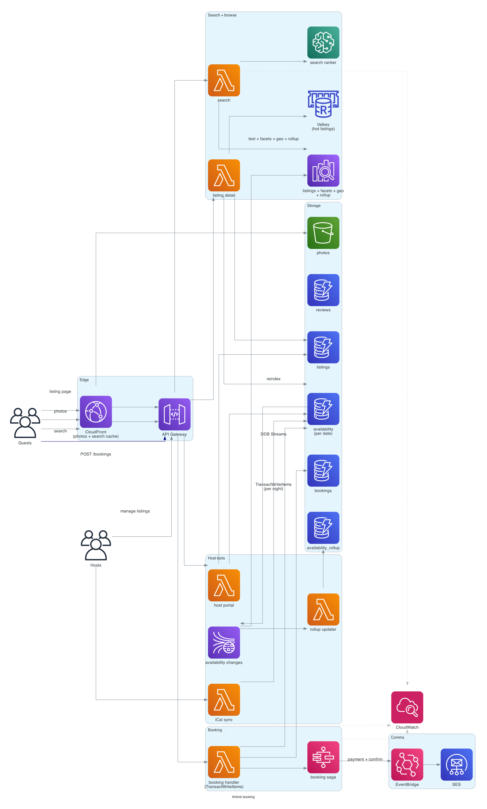

# Airbnb (booking / availability)

> **One-line summary.** Search for short-term rentals by location and date range, with dynamic pricing, no double-booking, host-guest messaging, and payment hold/release. The unique challenge is **availability + pricing search** across millions of listings with date-range constraints.

## TL;DR
- Catalog of listings indexed in **OpenSearch** with geo + faceted filters; availability stored in **DynamoDB** as per-listing per-date rows.
- **Search** is the hard part: "find listings in Paris available Jul 1-7 under $300/night sleeping 4." OpenSearch handles text + facets; availability join is expensive — typically pre-computed as a "minimum available price for next 30/60/90 days" rollup.
- **Booking** is similar shape to [ticketmaster](ticketmaster.md): conditional write on each requested night, all-or-nothing transaction; pay → confirm → notify host.
- **Dynamic pricing** is a per-listing ML model (occupancy, day-of-week, local events) suggesting prices to hosts; not real-time per query.
- **Messaging** between host and guest is a simpler [whatsapp-chat](whatsapp-chat.md).
- The hardest parts: **availability search at scale** (joining text relevance with calendar availability), **no double-booking** (race conditions on popular listings during instant-book), and **per-host inventory management** (overlapping listings, blocking dates manually).

## Functional Requirements
- Search listings by location, dates, guests, filters (price, amenities, type).
- View listing detail (photos, description, calendar, reviews).
- Book a listing for specific dates (instant book or request-to-book).
- Payment (held until check-in; released to host post-stay).
- Host-guest messaging.
- Reviews after stay.
- Host: list a property, set price + availability + house rules.
- (Out of scope for v1): Experiences, Plus, long-term stays.

## Non-Functional Requirements
- **Latency**: search p99 < 1 sec; listing page p99 < 500 ms; booking p99 < 3 sec.
- **Throughput**: 500K searches/sec at peak; 10K bookings/sec at peak.
- **Consistency**: never double-book; price quoted at booking time is what user pays.
- **Availability**: 99.99% on search; 99.999% on booking (revenue path).
- **Scale**: 10M+ listings worldwide.

## Capacity Estimates
- **Listings**: 10M × ~5 KB metadata = 50 GB (DynamoDB + OpenSearch).
- **Availability**: 10M listings × 365 days = 3.65B date rows.
- **Searches**: 500K/sec peak.
- **Bookings**: 10K/sec peak → 10K reservations/sec → 10K payment calls.
- **Photos**: 10M × ~20 photos × ~1 MB = 200 TB → S3 + CloudFront.

## High-Level Architecture



**Search path**: rider → CloudFront → API Gateway → Lambda (search) → OpenSearch (text + facet + geo) + DynamoDB (availability lookups for the filtered set) → return ranked results.

**Booking path**: API → Lambda → check availability in DynamoDB → conditional write to mark dates as `pending` → Step Functions runs booking saga (payment → final confirm → notify host).

**Catalog**: hosts manage via portal → Lambda → DynamoDB (listings, availability, pricing). DynamoDB Streams sync to OpenSearch + cache invalidation.

**Messaging**: WebSocket-based (like [whatsapp-chat](whatsapp-chat.md)) between guest and host.

## Data Model

```mermaid
erDiagram
  LISTING {
    string listing_id PK
    string host_id
    string title
    string description
    list   photos
    map    address "lat - lng - city - country"
    int    max_guests
    list   amenities
    decimal base_price_per_night
    string currency
    map    house_rules
    float  rating
    int    review_count
  }
  AVAILABILITY {
    string listing_id PK
    string date SK "YYYY-MM-DD"
    string status "available - booked - blocked"
    decimal price_override
    string booking_id "if booked"
  }
  AVAILABILITY_ROLLUP {
    string listing_id PK
    int    days_avail_next_30
    int    days_avail_next_60
    decimal min_price_next_30
    decimal min_price_next_60
    timestamp last_updated
  }
  BOOKING {
    string booking_id PK
    string listing_id
    string guest_id
    string check_in "YYYY-MM-DD"
    string check_out "YYYY-MM-DD"
    decimal total_price
    string status "pending - confirmed - cancelled - completed"
    string payment_intent_id
    timestamp created_at
  }
  MESSAGE {
    string thread_id PK "host_id + guest_id + listing_id hash"
    timestamp ts SK
    string sender_id
    string text
  }
  REVIEW {
    string listing_id PK
    string review_id SK
    string guest_id
    int    rating
    string text
    timestamp ts
  }
```

- **`listings`** — DynamoDB, PK = `listing_id`. Synced to OpenSearch via Streams.
- **`availability`** — DynamoDB. PK = `listing_id`, SK = `date`. 365 rows per listing.
- **`availability_rollup`** — DynamoDB. Precomputed "minimum available price next N days" for search filtering.
- **`bookings`** — DynamoDB; per-booking state.
- **`messages`** — DynamoDB; per-thread.

## API Design

```
GET /v1/search
  ?location=Paris&checkin=2026-07-01&checkout=2026-07-08&guests=4&price_max=300
  → 200 OK { "results": [...], "total": 1234, "facets": {...} }

GET /v1/listings/:id
  → 200 OK { "title": "...", "photos": [...], "min_available_price": ..., ... }

GET /v1/listings/:id/availability?from=2026-07-01&to=2026-07-31
  → 200 OK { "dates": { "2026-07-01": "available", ... } }

POST /v1/bookings
  body: { "listing_id": "...", "check_in": "...", "check_out": "...", "guests": 4 }
  Headers: Idempotency-Key: ...
  → 201 Created { "booking_id": "...", "status": "pending", "total_price": 1800 }

POST /v1/bookings/:id/pay
  body: { "payment_method_id": "..." }
  → 200 OK { "status": "confirmed" }

WebSocket events:
  { "type": "booking_confirmed", "booking_id": "..." }
  { "type": "message", "thread_id": "...", "text": "..." }
```

## Deep Dives

### 1. Availability search at scale
"Listings in Paris available Jul 1-7 under $300/night sleeping 4."

Naive: query OpenSearch for "Paris + 4 guests" → 100K listings → for each, query DynamoDB availability for 7 dates → too slow.

**Pre-computed availability rollup**:
- Background job (Lambda triggered by availability change) maintains `availability_rollup` per listing:
  - `days_avail_next_30`, `days_avail_next_60`, `days_avail_next_90`.
  - `min_price_next_30`, `min_price_next_60`, etc.
- OpenSearch document includes these fields.
- Search query: `(location=Paris AND amenities=... AND days_avail_next_60 >= 7 AND min_price_next_60 <= 300)` → narrows quickly.
- Then exact availability check on the top 50 results (DynamoDB per-date).

For arbitrary date ranges, the rollup doesn't help directly — fall back to per-listing availability check on the top N results. Acceptable when N is small after pre-filtering.

### 2. Booking transaction
Multiple nights in one booking → all must be available.

`TransactWriteItems` on DynamoDB:
```python
items = [
    {
        "Update": {
            "TableName": "availability",
            "Key": {"listing_id": L, "date": d},
            "UpdateExpression": "SET status = :pending, booking_id = :bid",
            "ConditionExpression": "status = :available",
            "ExpressionAttributeValues": {...},
        },
    }
    for d in check_in_to_checkout_dates(check_in, check_out)
]
ddb.transact_write_items(TransactItems=items + [create_booking_item])
```

All-or-nothing: if any date is already booked, the whole transaction fails; client gets `409 Conflict`.

DynamoDB transactions cap at 100 items → max ~100-night booking (more than enough).

### 3. Instant book vs request to book
- **Instant book**: booking immediately reserves dates + charges payment.
- **Request to book**: 24-hour window for host to accept. Dates held during the window; if host doesn't accept, dates released; if accepts, payment charges.

Both use the same state machine; instant book skips the host-approval state.

For "request to book," dates are in `pending` status (not `available`, not `booked`) during the window — competing bookings see them as unavailable. If host declines, status reverts to `available`.

### 4. Dynamic pricing (host-side, not real-time)
Hosts get pricing suggestions:
- Per-day forecasted occupancy probability.
- Local events (concerts, conferences) push prices up.
- Day-of-week patterns.
- Seasonal patterns.

ML pipeline (offline):
- Historical booking data → training data.
- SageMaker model per region per listing type.
- Predicts optimal price per (listing, date).
- Host opts into "Smart Pricing" → suggested prices auto-applied (with min/max guards).

Not real-time per search query. Prices are set hours/days in advance.

### 5. Search ranking
After filters, OpenSearch returns top N. Ranking signals:
- **Personalization**: similar to listings user has viewed / liked.
- **Quality**: rating, review count.
- **Conversion**: historical conversion rate (clicks → bookings).
- **Recency** of listing or recent reviews.
- **Geographic relevance**: distance from search center.

Trained ranker (SageMaker / Bedrock embeddings + re-ranker), invoked on candidates. See [recommendation-system](recommendation-system.md) for the broader pattern.

### 6. Cancellation policies and refunds
Each listing has a cancellation policy (flexible / moderate / strict). On cancellation:
1. Look up policy + booking date.
2. Compute refund (e.g., full refund 7 days before; 50% within 7 days; no refund within 24 hours).
3. Issue refund via [payment-system](payment-system.md).
4. Release dates back to `available`.
5. Notify host.

Edge cases: extenuating circumstances (death, natural disaster) — manual override path for trust & safety team.

### 7. Host calendar sync
Hosts often list on multiple platforms (Booking.com, VRBO). To prevent double-booking, support **iCal sync**:
- Host configures Airbnb to push availability to external iCal URL.
- Host configures Airbnb to import iCal URLs from other platforms.
- Background sync job (hourly) reconciles.

If a date is booked on Booking.com, Airbnb's calendar marks it `blocked` (different from `booked` — no booking_id, just unavailable).

### 8. Messaging
Host-guest messaging is a thread per (host, guest, listing). Same shape as [whatsapp-chat](whatsapp-chat.md) but with fewer concurrent connections (most users aren't actively chatting).

## AWS Services Used
- **CloudFront** — image / static delivery, search-result caching for popular queries.
- **API Gateway** — REST + WebSocket.
- **Lambda + ECS Fargate** — handlers (Fargate for sustained connections / heavy search).
- **DynamoDB** — listings, availability, bookings, messages.
- **OpenSearch** — search index with geo + faceted filters.
- **ElastiCache for Valkey** — hot listing cache, popular-search cache.
- **Kinesis Data Streams** — availability change events.
- **Step Functions** — booking saga.
- **SageMaker** — search ranking, dynamic pricing.
- **Bedrock** — listing description generation, review summarization.
- **S3 + CloudFront** — photos / videos.
- **EventBridge** — internal events (booking confirmed, cancelled, etc.).
- **SES + SNS** — notifications.
- **Cognito** — user auth.

## Cost Notes
At Airbnb scale:
- **OpenSearch** for search at 500K QPS: significant cluster cost.
- **CloudFront** for photos: massive egress.
- **DynamoDB** for availability table (3.65B rows): meaningful storage + read cost.
- **SageMaker** for ranking endpoints: per-hour cost.

Levers:
- **Cache search results** in CloudFront for popular queries (Paris dates) with short TTL.
- **Tier old availability data** (past dates) to S3 / cheaper storage.
- **OpenSearch UltraWarm** for older review data.

## Failure Modes & DR
- **OpenSearch lag during host update**: listing appears outdated in search briefly. Acceptable.
- **DynamoDB transaction failure during booking**: client retries with different dates / re-checks; partial failure rolls back automatically.
- **Payment gateway down**: booking remains `pending`; Step Functions retries; if persistent, alert host + guest.
- **Region failure**: DDB Global Tables + OpenSearch per-Region replicas; Route 53 failover.
- **Double-booking race**: prevented by transactional date-availability update.

## Trade-offs & Alternatives
- **Pre-computed rollup vs full join**: rollup is fast but only for common windows (30/60/90). Full join is exact but slow.
- **OpenSearch vs Postgres GIST for geo search**: OpenSearch scales better at high QPS; Postgres GIST works for smaller deployments.
- **Real-time pricing vs batch suggestions**: real-time is too expensive per search; batch suggestions to hosts is the production pattern.
- **iCal sync vs API integrations with competitors**: iCal is the lowest-common-denominator; some platforms have richer APIs but limited integration.
- **Strict / moderate / flexible cancellation policies vs per-listing custom**: standardized policies simplify the support burden; per-listing custom is more flexible but harder to communicate.

## Further Reading
- [Airbnb engineering blog — many posts on search, payments, scale](https://medium.com/airbnb-engineering).
- ["Designing Airbnb", System Design Primer](https://github.com/donnemartin/system-design-primer).
- [OpenSearch geo queries](https://opensearch.org/docs/latest/query-dsl/geo-and-xy/).
- Related: [ticketmaster](ticketmaster.md) (inventory consistency), [search-autocomplete](search-autocomplete.md), [recommendation-system](recommendation-system.md), [payment-system](payment-system.md).
