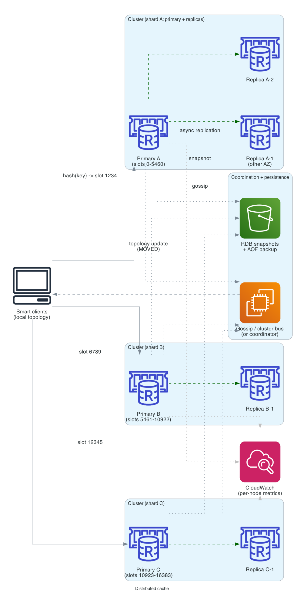
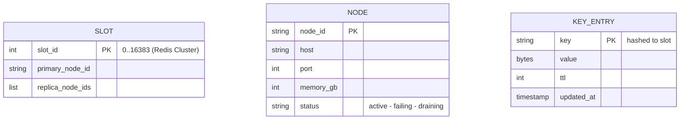

# Distributed cache

> **One-line summary.** Design a cluster-style in-memory key-value cache (à la Memcached / Redis Cluster). Consistent hashing for sharding, replication for HA, eviction policies, client-side smart routing, and graceful node add / remove.

## TL;DR
- Cluster of nodes; each stores a slice of the key space via **consistent hashing**.
- Clients route requests to the right node directly (no proxy / coordinator on the hot path).
- **Replication** (primary + replica per shard) for HA; failover on primary loss.
- **Eviction** policies (LRU / LFU / TTL) bound memory.
- **Cluster membership** (gossip / coordinator) propagates topology changes — without it, clients can't find new nodes after rebalance.
- AWS-native: most people *use* **ElastiCache** / **MemoryDB** / **DAX** rather than build this — but the question tests understanding of the components.
- The hardest parts: **consistent hashing with minimal data movement on rebalance**, **hot-key handling**, **cluster failover** with split-brain prevention, and **client-side resilience** (stale topology, partial failures).

## Functional Requirements
- `Get(key)`, `Put(key, value, ttl)`, `Delete(key)`.
- `Mget` / `Mput` for batch operations.
- TTL support.
- Atomic operations (INCR / DECR) for counters.
- Pub/sub (optional, but common in Redis-style designs).

## Non-Functional Requirements
- **Latency**: p99 < 1 ms for in-DC reads/writes.
- **Throughput**: 100K+ ops/sec per node; cluster scales linearly.
- **Availability**: 99.99% (single-AZ); 99.999% (multi-AZ with replicas).
- **Memory**: GBs to TBs across cluster; per-node from 16 GB to 700 GB.
- **Durability**: cache is *not* durable by default; survives node restarts via snapshots (Redis) or not at all (Memcached).

## Capacity Estimates
- 1 TB total cache, 100K ops/sec/node.
- 64 GB per node → 16 primary nodes + 16 replicas = 32 nodes.
- 1M total ops/sec serving ~1B requests/day.

## High-Level Architecture



A **client library** has the cluster topology cached locally. Given a key, it hashes to find the responsible shard and connects directly to the **primary node** for that shard. A **coordinator / cluster manager** (in Redis Cluster: the nodes themselves gossip; alternatively a separate coordinator like ZooKeeper / etcd) tracks membership and publishes topology updates. **Replica nodes** asynchronously replicate from primaries; on primary failure, a replica is promoted. **Snapshots** to S3 give crash recovery; AOF (append-only file) for stronger durability.

## Data Model



Cluster topology = mapping of slots to nodes. Redis Cluster uses 16,384 hash slots (`CRC16(key) % 16384`). Other systems use more granular consistent hashing rings.

## API Design

Wire protocol (Redis-compatible):
```
GET <key>
SET <key> <value> [EX <seconds>]
DEL <key>
INCR <key>
MGET <key1> <key2> ...
SUBSCRIBE <channel>
PUBLISH <channel> <message>
```

Cluster commands:
```
CLUSTER NODES         -> topology
CLUSTER SLOTS         -> slot ranges
CLUSTER COUNTKEYSINSLOT <slot>
MIGRATE ...           -> move slot to another node
```

## Deep Dives

### 1. Consistent hashing
Naive `hash(key) % N` requires rehashing all keys when N changes. Consistent hashing minimizes movement:
- Hash both keys and nodes onto a circular space (`[0, 2^32)` or `[0, 2^64)`).
- A key belongs to the next node clockwise.
- Adding a node: keys in the range "previous node → new node" move; rest stay.
- Removing a node: its keys move to the next node clockwise; rest stay.

**Virtual nodes**: each physical node maps to N virtual positions on the ring (e.g., 256). Smooths the distribution; reduces variance.

Redis Cluster uses a simpler **16,384 hash slot** approach: every key is `CRC16(key) % 16384`. Each node owns a range of slots. Easy to reason about; manual rebalance.

### 2. Replication and failover
**Primary + replica (1 + N)** per shard.
- Writes go to primary; replicate async to replicas.
- Reads can go to replicas (eventually consistent) or always primary (strict).
- On primary failure: a replica is promoted.

Async replication can lose acked writes on primary failure. For stronger guarantees, **semi-sync replication** (primary waits for at least one replica ack before responding) — used by MemoryDB.

**Failover detection** is the hard part:
- **Heartbeats** between nodes (gossip or coordinator).
- **Quorum vote** to declare a node failed — prevents split-brain (where two primaries both think they're active during a network partition).

### 3. Hot keys
A single key (`product:viral_item`) hit 100K times/sec lands all on one shard. Mitigations:
- **Client-side cache** in front of the distributed cache (local in-process cache, sub-µs reads).
- **Hot-key replication** — replicate the hot key to multiple shards; client picks one randomly. Trades extra memory for read scale.
- **Shard the hot key** — `(product:viral_item:1, product:viral_item:2, ...)`, picked round-robin. Loses atomicity per key; great for read-only counters.

### 4. Eviction policies
When the cache is full, what to evict?
- **`noeviction`** — fail writes. Almost always wrong.
- **`allkeys-lru`** — evict any least-recently-used. Default for general caches.
- **`allkeys-lfu`** — evict least-frequently-used. Better for power-law access patterns.
- **`volatile-lru`** / **`volatile-lfu`** / **`volatile-ttl`** — evict only TTL'd keys.
- **`volatile-random`**, **`allkeys-random`** — for special cases.

**LRU approximation**: tracking full LRU is expensive. Redis samples K random keys and evicts the LRU of them (`maxmemory-samples`). Higher samples = closer to true LRU, more CPU.

### 5. Snapshots and AOF
- **Snapshot (RDB in Redis)**: periodic in-memory dump to disk. Restore time: load entire dataset. Loss window: up to snapshot interval.
- **AOF (Append-Only File)**: log every mutation. Restore: replay AOF. Loss window: seconds. Performance: AOF fsync per write is slow; fsync every second is the compromise.

For pure caches, durability doesn't matter — cold start fine. For cache-as-system-of-record (MemoryDB), AOF + multi-AZ transaction log is critical.

### 6. Cluster topology updates
Adding / removing nodes shifts the slot mapping. Coordination:
- **Manual**: operator runs `CLUSTER ADDSLOTS` / `CLUSTER FORGET`; gradual migration.
- **Auto** (e.g., ElastiCache): managed scale; rebalances slots; clients reconnect.

**Client-side topology refresh**: clients cache the topology; refresh on `MOVED` / `ASK` responses (the node says "this key now belongs over there"). Smart clients use these errors as the topology-update signal.

### 7. Pub/sub (Redis-style)
- Channel-based: clients `SUBSCRIBE <channel>`; publishers `PUBLISH <channel> <msg>`.
- In a cluster, channels are not slot-aware by default. A `PUBLISH` is broadcast to all nodes; subscribers on any node receive.
- For higher fanout, use **sharded pub/sub** (channel hashes to slot; only that slot's subscribers receive). Loses cross-shard delivery; gains scale.

## AWS Services Used
In practice on AWS, you'd use a managed cluster:
- **ElastiCache for Valkey / Redis OSS** (recommended Valkey for new) — managed Redis Cluster with multi-AZ.
- **MemoryDB** — Redis API + durable multi-AZ transaction log; cache + system-of-record.
- **DAX** — DynamoDB-specific cache (microsecond, transparent).
- **EC2 / EKS** — self-hosted Redis / Memcached for special requirements.

For building this from scratch:
- **EC2 / Fargate** — cache nodes (memory-optimized instance types).
- **DynamoDB** — cluster topology metadata.
- **S3** — snapshots.
- **CloudWatch** — per-node metrics (hit rate, evictions, memory pressure).
- **EventBridge** — failure events.

## Cost Notes
For 1 TB cache cluster:
- 32 × `cache.r7g.large` (memory-optimized) ≈ a few thousand dollars/month on ElastiCache.
- Self-hosted on EC2 is comparable (slightly cheaper, more ops).
- **MemoryDB** ~3× ElastiCache for the durability layer.

Levers:
- **Graviton** instances (~20% cheaper).
- **Reserved instances** for steady-state clusters.
- **Right-size memory** — over-provisioning headroom is the most common waste.

## Failure Modes & DR
- **Single node failure**: replica promoted; ~5-10 second window of degraded availability for that shard.
- **AZ failure**: replicas in another AZ promoted; multi-AZ recovery.
- **Cluster partition**: gossip quorum prevents split-brain; minority partition stops accepting writes.
- **Hot key**: shard saturated; some requests fail. Detect via per-key metrics; apply hot-key sharding.
- **Cold start after cluster restart**: cache miss storm hits backend. Pre-warm cache; ramp clients gradually.

## Trade-offs & Alternatives
- **Build vs use ElastiCache / MemoryDB**: building is for interview / learning. Production: use managed.
- **Consistent hashing vs hash slots**: hash slots (Redis Cluster) are simpler; consistent hashing scales more smoothly with arbitrary node counts.
- **Async vs semi-sync replication**: async is faster, risks data loss. Semi-sync (MemoryDB) is safer, slower.
- **Memcached vs Redis**: Memcached is multi-threaded, simpler, no replication. Redis is single-threaded per shard, rich data types, replication. Redis is the modern default; Memcached for "I just need a fast key-value cache."
- **Client-side cache (L1) + distributed cache (L2)**: layered caching is standard in production for sub-µs reads.

## Further Reading
- ["Designing a key-value store", System Design Primer](https://github.com/donnemartin/system-design-primer).
- [Redis Cluster specification](https://redis.io/docs/reference/cluster-spec/).
- [Dynamo paper (consistent hashing)](https://www.allthingsdistributed.com/files/amazon-dynamo-sosp2007.pdf).
- [Memcached internals](https://memcached.org/).
- Related: [caching-strategies pattern](../02-patterns/caching-strategies.md), [data-partitioning-sharding pattern](../02-patterns/data-partitioning-sharding.md), [ElastiCache service page](../01-services/database/elasticache.md), [MemoryDB service page](../01-services/database/memorydb.md).
