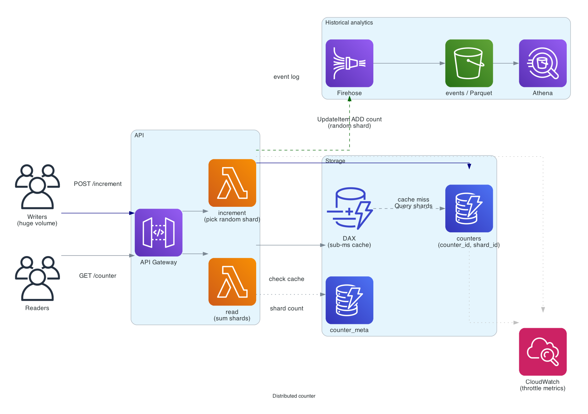

# Distributed counter

> **One-line summary.** A counter that increments at very high rate from many writers, with fast eventual or strong-consistency reads. The "view count," "vote tally," "like count," "metric" of every internet-scale app.

## TL;DR

- Naive `INCR counter` against one row serializes on a single shard — caps around 10K writes/sec per key at best. Hot counters break it.
- **Sharded counter**: split the logical counter into N physical shards; writers pick one at random; readers sum across all shards. Trades exact-real-time for unbounded write throughput.
- AWS-native: **DynamoDB** with `(counter_id, shard_id)` composite key; conditional / atomic updates per shard. For sub-ms reads at extreme scale, **DAX** or **ElastiCache** in front. For sum-over-time analytics (not real-time), aggregate from event streams (Firehose → S3 → Athena).
- For globally consistent counters across Regions, **DynamoDB MRSC Global Tables** — but accept the same hot-shard caveats.
- The hard parts are **read latency vs accuracy**, **counter resets / decrements**, and **cold-shard handling**.

## Functional Requirements

- `Increment(counter_id, by=1)` — atomic increment.
- `Decrement(counter_id, by=1)` — atomic decrement (optional; some counters are monotonic).
- `GetCount(counter_id)` — return current count (eventual or strongly consistent).
- `GetBucketedCount(counter_id, granularity)` — return count over time buckets (hourly, daily) for analytics.
- (Optional) Multi-key batch increment for efficiency.

## Non-Functional Requirements

- **Write throughput**: up to 1M increments/sec per counter (hot keys).
- **Write latency**: p99 < 20 ms.
- **Read latency**: p99 < 50 ms for approximate; < 200 ms for exact (sum-shards).
- **Accuracy**: typically eventual consistency is acceptable (view counts can lag by seconds). For some use cases (auction bids, billing units) exact is required.
- **Durability**: increments never lost.
- **Scale**: 10M distinct counters; aggregate billions of writes/day.

## Capacity Estimates

- 10M counters × ~100 writes/day average = 1B writes/day = 12K writes/sec average, 100K writes/sec peak.
- Hot counter: viral content might see 1M writes/sec sustained for hours.
- Reads dominate writes 10-100×: 10K-1M reads/sec across all counters.
- Storage: 10M counters × 16 shards × ~100 B = ~16 GB. Tiny.

The cold-counter case is easy; the hot-counter case dominates the design.

## High-Level Architecture



Writers call **API Gateway / Lambda** which writes to a **DynamoDB counters** table sharded by `(counter_id, shard_id)`. Hot counters use 16-128 shards; cold counters use 1-2 shards (less storage, less read fan-out). Readers either query DynamoDB directly (sum across shards) or read from a **DAX** / **ElastiCache** cache that materializes the sum periodically. For analytics over time, increments are also streamed to **Kinesis Firehose → S3**, queryable from **Athena** for historical aggregates.

## Data Model

```mermaid
erDiagram
  COUNTER_SHARD {
    string counter_id PK
    int    shard_id SK "0 .. N-1"
    bigint count
    timestamp updated_at
  }
  COUNTER_META {
    string counter_id PK
    int    shard_count "1 / 16 / 128"
    string mode "monotonic / decrementable"
    string display_name
  }
  INCREMENT_EVENT {
    string counter_id
    bigint amount
    timestamp ts
    string source "user-id - request-id"
  }
```

**`counters` table** (DynamoDB):

- `(counter_id, shard_id)` composite key.
- `count` updated via `UpdateExpression: ADD count :n`.
- Per-shard rows are independent → no shard-wide locks.

**`counter_meta`** (DynamoDB):

- Stores per-counter shard count, mode, display info.

**Event log** (S3 via Firehose):

- Every increment also logged for historical analytics, replay, audit.
- Not on the hot read path — supplementary.

## API Design

```
POST /v1/counters/:id/increment
  body: { "by": 1 }
  → 200 OK

POST /v1/counters/:id/decrement
  body: { "by": 1 }
  → 200 OK

GET /v1/counters/:id
  ?consistency=eventual|strong
  → 200 OK { "value": 42100, "as_of": "..." }

GET /v1/counters/:id/history
  ?bucket=hour
  → 200 OK { "buckets": [{ts: ..., count: ...}, ...] }
```

## Deep Dives

### 1. Sharding strategy

A single DynamoDB partition handles roughly 1K writes/sec on a hot key. A counter at 100K writes/sec needs ~100 shards.

Pattern:

1. Each counter has metadata: `shard_count` (default 16; configurable up to 256).
2. Writer picks `shard_id = random.randint(0, shard_count-1)`.
3. `UpdateItem` on `(counter_id, shard_id)` with `ADD count :n`.
4. Reader: `Query` for `counter_id`; sum `count` across all returned shards.

```python
def increment(counter_id, by=1):
    shard = random.randint(0, get_shard_count(counter_id) - 1)
    ddb.update_item(
        Key={'counter_id': counter_id, 'shard_id': shard},
        UpdateExpression='ADD count :n',
        ExpressionAttributeValues={':n': by},
    )

def get_count(counter_id):
    rows = ddb.query(KeyConditionExpression=Key('counter_id').eq(counter_id))
    return sum(r['count'] for r in rows['Items'])
```

**Shard count tuning**:

- Too few → hot partition, writes throttle.
- Too many → reads sum N rows (more RCUs, more latency).
- Adaptive: start at 16; if writes throttle, double via `shard_count` increase + new shards (existing data stays on original shards; new writes spread further).

### 2. Read latency

Reading 16 shards = 16 GetItems = 16 RCU = 16 ms of round-trip if done serially. Batch via `Query` (single round-trip; one RCU per item read).

For sub-ms reads:

- **DAX in front of DynamoDB** — cache the per-counter sum; invalidate on TTL (e.g., 1 second).
- **ElastiCache for Valkey** — `INCR` directly in Redis (`counter:<id>:sum`); periodically flush to DynamoDB for durability. Loses some writes on Valkey failure → use **MemoryDB** if loss is unacceptable.
- **Periodic snapshot** — background Lambda sums shards and writes to a `counter_meta.snapshot_count`; readers return that with `as_of` timestamp.

For most use cases (view counts, like counts), 1-second stale is fine and DAX is the right answer.

### 3. Decrements and bounds checking

Counters that can only go up (views, likes) are simple. Counters that decrement (inventory, voting with revoke) need:

- **Bounds check**: `decrement` must not go below 0 (for inventory). DynamoDB conditional update: `ADD count :neg WHERE count >= :n` — but this only works *per-shard*, and the value's split across shards.
- **Two-phase**: reserve → confirm → finalize. Reserve writes to one shard; if all shards have capacity, confirm; otherwise compensate.

For real bounded counters (inventory), don't shard — use a single row with conditional updates. Accept lower throughput as the cost of correctness.

### 4. Historical aggregates and time buckets

For "show me views per hour for the last 30 days," sharding the live counter doesn't help — you need timestamps.

Pattern:

1. Every increment also publishes to **Kinesis Firehose** with `(counter_id, ts, by)`.
2. Firehose batches into S3, partitioned by `year/month/day/hour`.
3. **Athena** aggregates on read; cache results in DynamoDB / ElastiCache for repeat queries.
4. For real-time-ish, **Kinesis Data Streams → Lambda** maintains a `(counter_id, hour_bucket, count)` table in DynamoDB.

This is essentially [event-sourcing](../02-patterns/event-sourcing.md) of the counter — the increments are the events, the bucketed counts are projections.

### 5. Strong consistency across Regions

For a global counter (worldwide like count on Instagram), per-Region writes are eventually consistent across Regions. Sum-across-Regions = sum-across-shards-across-Regions.

For strong global consistency, use **DynamoDB MRSC Global Tables** — synchronous replication across 3 Regions. Restrictions: same account, exactly 3 Regions, no TTL / LSIs.

Most counter workloads don't need this; eventual cross-Region is acceptable.

### 6. Counter reset, init, and cleanup

- **Init**: when a counter is created, write a meta row + an initial shard row with `count=0`. (Alternatively, lazy-init on first increment.)
- **Reset**: write `0` to all shards (overwrite, not increment). Race risk: in-flight increments after reset land on cleared shards; that's usually fine.
- **Delete**: TTL the rows. Or hard-delete after a grace window.
- **Cold counter cleanup**: counters with no recent activity can drop their extra shards (`shard_count = 1`). Background job re-balances.

## AWS Services Used

- **DynamoDB** — sharded counter storage (on-demand mode for variable load).
- **DAX** — sub-ms cache for read paths.
- **Lambda** — increment / decrement / read handlers.
- **API Gateway** — public API.
- **Kinesis Data Firehose** — increment event archive.
- **S3** — event archive in Parquet.
- **Athena** — historical aggregation queries.
- **ElastiCache for Valkey / MemoryDB** — optional alternative storage for ultra-hot counters.
- **CloudWatch** — per-counter / per-shard write throttle metrics.

## Cost Notes

At 1B writes/day:

- **DynamoDB on-demand**: ~1B WCU + ~10B RCU (reads dominate) → ~$2K-5K/month.
- **DAX**: a small cluster handles all reads → ~$200-500/month.
- **Lambda**: ~$300-600.
- **Firehose + S3**: ~$50-100.

Levers:

- **Reserved capacity** on DynamoDB if write rate is steady → ~50% reduction.
- **Drop DAX** if read freshness can tolerate the per-counter sum directly.
- **Aggregate at the edge**: rather than 1 increment per request, batch many requests' increments locally and flush periodically. Reduces write rate dramatically at the cost of eventual consistency.

## Failure Modes & DR

- **AZ failure**: DynamoDB multi-AZ; transparent.
- **DAX node failure**: cache cluster recovers; brief read-latency spike.
- **Hot shard throttle**: signal to increase shard count; backoff / retry on the client.
- **Region failure**: DynamoDB Global Tables (eventual) or MRSC for strong cross-Region replication. Without those, the affected Region's counts pause.
- **In-flight increment lost** during Lambda crash: at-least-once retry → potentially double-count. For 100%-accurate counters, use idempotency keys.

## Trade-offs & Alternatives

- **Sharded DynamoDB vs Redis `INCR`**: DynamoDB is durable, scales further, slightly higher per-op latency. Redis is faster, less durable (unless MemoryDB), capped by Redis cluster throughput.
- **Eventual vs strong consistency**: sharded summing is inherently eventual within milliseconds of writes. Strong consistency needs single-row writes — at the cost of throughput.
- **DAX cache TTL choice**: shorter TTL = fresher reads, more DAX-to-DDB traffic. Longer TTL = staler, cheaper.
- **Counter-per-row vs counter-per-shard**: per-row is simpler, caps at single-shard throughput. Per-shard scales unboundedly with shard count.
- **Snapshot vs sum-on-read**: snapshots have a lag (the snapshot interval); sum-on-read is always fresh but pays the read fan-out per request.
- **Per-counter shard count tuning**: static (set at creation) is simpler; adaptive (grow on throttle) is fancier and more robust.

## Further Reading

- [DynamoDB best practices for counters](https://docs.aws.amazon.com/amazondynamodb/latest/developerguide/bp-modeling-nosql-B.html).
- ["Counting things — a lot of different things", Cloudflare blog](https://blog.cloudflare.com/counting-things-a-lot-of-different-things/).
- [DAX](https://docs.aws.amazon.com/amazondynamodb/latest/developerguide/DAX.html).
- [Distributed counters, Redis Labs](https://redis.io/docs/data-types/atomic-counters/).
- Related: [data-partitioning-sharding pattern](../02-patterns/data-partitioning-sharding.md), [caching-strategies](../02-patterns/caching-strategies.md), [DynamoDB service page](../01-services/database/dynamodb.md).
