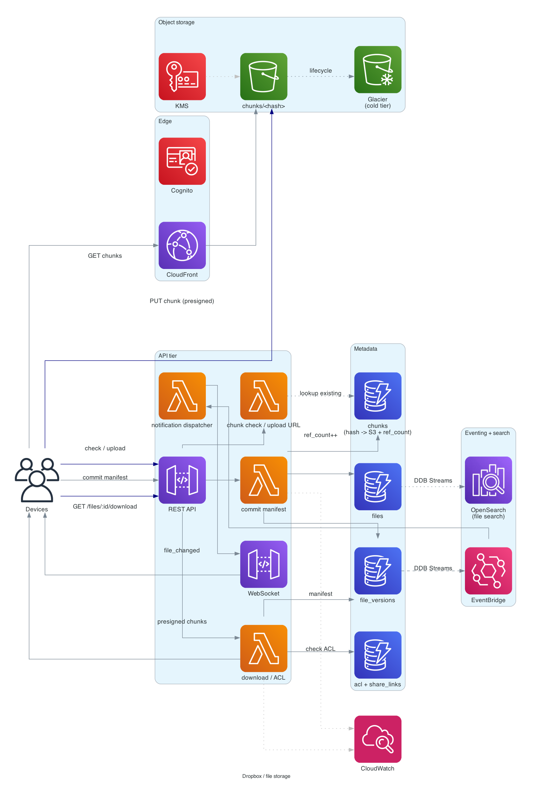

# Dropbox / file storage and sync

> **One-line summary.** Sync files across a user's devices and share them with others. Chunked upload with content-addressable storage, delta sync to skip unchanged chunks, and an event stream that pushes changes to connected clients in real time.

## TL;DR
- File contents stored as **content-addressable chunks** in S3 (hash → blob). Files = lists of chunk hashes. Identical chunks across users / files dedup to one S3 object.
- **Metadata service** (DynamoDB / RDS) tracks `(user, path) → file → (chunk hashes, version, ACL)`. Source of truth for "what files exist."
- **Sync** = clients diff local manifest against server manifest, upload missing chunks, download missing chunks. Long-poll / WebSocket connection pushes change events.
- **Sharing** = grant ACLs on a file / folder to another user; share links are short-code mapped to a file ID (similar to [url-shortener](url-shortener.md)).
- The hardest parts: **chunking + dedup** (which is also the biggest cost lever), **conflict resolution** (two devices edit same file offline), and **scaling the metadata service** (billions of files).

## Functional Requirements
- Upload a file to a user's namespace at a path.
- Download a file from any of the user's devices.
- Sync: any change on one device propagates to others within seconds.
- Share files / folders with other users (read or read-write).
- Public share links.
- File versioning (last N versions retrievable).
- (Out of scope for v1): collaborative editing — see [`google-docs-collab`](google-docs-collab.md).

## Non-Functional Requirements
- **Latency**: file metadata operations p99 < 200 ms; download via CDN p99 < 500 ms.
- **Throughput**: 500M users, 100M files uploaded / day, 10B chunk downloads / day.
- **Durability**: eleven 9s (S3 default).
- **Availability**: 99.99% on reads.
- **Sync freshness**: client sees change within 5-10 seconds.
- **Cost**: dedup saves real money; design for ~30% dedup on average user data.

## Capacity Estimates
- **Files**: 500M users × ~1000 files = 500B files total. ~50M new files / day.
- **Chunks**: average file = 5 MB, chunk = 4 MB. ~2 chunks per file. After 30% dedup: 1.4 chunks stored per file.
- **Raw storage**: 500B files × 5 MB × 0.7 dedup factor = ~1.7 EB. Massive.
- **Bandwidth**: 10B downloads × 5 MB = 50 PB/day egress. CDN absorbs most.

## High-Level Architecture



A client uploads a file in chunks (4 MB each) directly to **S3** via presigned URLs. Before uploading, the client asks the **metadata service** "do you already have chunks with these hashes?" (dedup check); only missing chunks get uploaded. After upload, the client commits a manifest (file path, chunk-hash list) to DynamoDB. DynamoDB Streams publish a "file changed" event to the **notification service**, which pushes via WebSocket / long-poll to other connected devices for the same user. Download = look up manifest → fetch chunks from S3 via CloudFront.

Sharing: a share link short-code maps `code → file_id`; clicking it goes through ACL check then a download path.

## Data Model

```mermaid
erDiagram
  USER {
    string user_id PK
    string email
    int    storage_used_bytes
    int    storage_quota_bytes
  }
  FILE {
    string file_id PK
    string user_id "owner"
    string path
    int    size_bytes
    string mime_type
    int    version
    timestamp created_at
    timestamp updated_at
    bool   is_deleted
  }
  FILE_VERSION {
    string file_id PK
    int    version SK
    list   chunk_hashes
    int    size_bytes
    timestamp created_at
    string created_by
  }
  CHUNK {
    string chunk_hash PK "SHA-256 of content"
    string s3_key
    int    size_bytes
    int    ref_count
  }
  ACL {
    string file_id PK
    string user_id SK
    string permission "read - write - owner"
    timestamp granted_at
  }
  SHARE_LINK {
    string short_code PK
    string file_id
    timestamp expires_at
    string password_hash "optional"
  }
```

- **`files`** — DynamoDB, PK = `file_id`. Sharded by user ID via GSI for "list my files."
- **`file_versions`** — append-only history; PK = `file_id`, SK = `version`.
- **`chunks`** — DynamoDB, PK = `chunk_hash` (SHA-256). `ref_count` tracks how many files reference this chunk (for safe deletion).
- **`acl`** — `(file_id, user_id) → permission`.
- **`share_links`** — short-code → file mapping (like the URL shortener).

S3 object key = chunk hash; bucket layout `chunks/<first-2-chars>/<hash>` for prefix balancing.

## API Design

```
GET /v1/chunks/check
  body: { "hashes": ["h1", "h2", ...] }
  → 200 OK { "missing": ["h1"] }

POST /v1/chunks/upload
  body: { "hash": "h1" }
  → 200 OK { "presigned_url": "...", "expires_at": "..." }

POST /v1/files
  body: { "path": "/work/report.pdf", "chunk_hashes": [...], "size_bytes": ... }
  → 201 Created { "file_id": "f_abc", "version": 1 }

GET /v1/files/:id/download
  → 200 OK { "chunks": [{ "hash": "h1", "url": "https://cf.../h1" }, ...] }

POST /v1/files/:id/share
  body: { "user_id": "u_jane", "permission": "read" }
  → 200 OK

POST /v1/files/:id/share-link
  body: { "expires_in": "30d", "password": "?" }
  → 200 OK { "short_code": "aB3xK9q", "url": "https://share.example.com/aB3xK9q" }

WebSocket events to client:
  { "type": "file_changed", "file_id": "...", "version": 2 }
  { "type": "file_deleted", "file_id": "..." }
```

## Deep Dives

### 1. Chunking and content-addressable storage
- **Chunk size**: 4 MB is the classic Dropbox default. Trade-off: smaller chunks → more dedup, more metadata overhead. Larger → less dedup, fewer per-file chunks.
- **Hash**: SHA-256 of chunk content. Probability of collision is astronomically low; treat as unique.
- **Dedup**: before upload, client computes hashes, asks server "missing?", uploads only what's missing. Typical 20-40% dedup ratio across a user's account; far higher cross-user (every Mac install of Adobe Reader has identical chunks).
- **S3 layout**: bucket `chunks/`; key = hash. Multi-prefix layout to spread S3 partitioning (`chunks/<first-2-chars>/<hash>`).
- **Reference counting**: each chunk has a ref-count; decrement when a file referencing it is deleted; physical S3 delete when count reaches 0 (or via a periodic GC).

### 2. Delta sync
A client edits a 100 MB file by changing one paragraph. Don't re-upload 100 MB — only the chunks containing the change.

Client-side:
1. Compute hashes of all chunks of the new file content.
2. Diff against previous manifest's hashes; identify new chunks.
3. Ask server which of the new chunks are *globally missing* (some new chunks may dedup against other users).
4. Upload only the chunks the server doesn't have.
5. Commit new manifest (`file_versions` table) with the full chunk list.

This is **content-defined chunking** when boundaries shift (Rabin fingerprinting); fixed-size chunks are simpler but less efficient for insertions in the middle of a file. Dropbox uses fixed-size; production systems vary.

### 3. Conflict resolution
Two devices edit the file offline. Both come online and try to commit a new version.

Approaches:
- **Last writer wins** (timestamp-based) — loses data.
- **Both versions kept** — a "conflicted copy" file appears in the user's directory (`report.pdf` + `report (Alice's conflicted copy).pdf`). Dropbox's choice. Simple, user-visible.
- **CRDT / collaborative editing** — for documents that should merge cleanly (text). Out of scope for file storage; see [`google-docs-collab`](google-docs-collab.md).

Implementation: when client commits a new version, conditional write on `version = current + 1`. On conflict (someone else incremented first), the client saves locally as `(conflicted copy)` and creates *that* as a new file.

### 4. Sync notifications
Clients hold a long-lived WebSocket / long-poll connection. On any change to one of their files:
1. `file_versions` write → DynamoDB Streams → Lambda.
2. Lambda determines affected users (owner + shared-with).
3. For each user's active connections, push `file_changed` event via API Gateway WebSocket.

Clients react: pull the new manifest, diff against local, download missing chunks.

For mobile / battery-conscious devices, push via APNs / FCM instead of WebSocket — wakes the device only on important changes.

### 5. Sharing and ACLs
- Per-file ACL: `(file_id, user_id) → permission`. Folder sharing inherits to children (logically; per-file ACL still enforced on read).
- Public share links: short-code → file ID (see [url-shortener](url-shortener.md)). Optionally password-protected.
- Permission checks on every download — even for cached CloudFront URLs, the URL is presigned with limited TTL.

For folder sharing at scale (a team folder with 10K files), expanding to per-file ACLs is expensive. Use a separate **folder_acl** table keyed by folder; on access, check both file-ACL and folder-ACL hierarchy.

### 6. Cold storage and tiering
Most files are accessed for a few weeks then never touched. S3 lifecycle:
- Hot: S3 Standard for first 30 days.
- Warm: S3 Standard-IA / Intelligent-Tiering for 30 days - 1 year.
- Cold: Glacier Instant Retrieval for files not accessed in 1+ year.
- Frozen: Glacier Deep Archive for backup / compliance.

Chunks are content-addressable, so tiering is per-chunk (not per-file). A chunk referenced by *any* recently-accessed file stays warm; chunks referenced only by cold files migrate.

## AWS Services Used
- **CloudFront** — edge CDN for chunk downloads.
- **API Gateway (REST + WebSocket)** — REST for metadata APIs, WebSocket for change notifications.
- **Lambda** — metadata handlers, chunk-check, notification dispatchers.
- **DynamoDB** — files, file_versions, chunks (ref counts), ACLs.
- **S3** — chunk storage; lifecycle policies for tiering.
- **KMS** — encryption keys.
- **Cognito** — user authentication.
- **EventBridge** — internal event routing for sharing notifications.
- **OpenSearch** — file content / name search.
- **SageMaker / Bedrock** (optional) — AI features (smart folders, content classification).

## Cost Notes
At 500M users / 1.7 EB total:
- **S3 Standard** for hot chunks: enormous; tiering is essential.
- **CloudFront** egress: massive; CDN caching helps but is still the dominant variable cost.
- **DynamoDB** for billions of files / chunks: significant; per-table partitioning + read replicas where needed.

Levers:
- **Dedup** — the biggest single lever. A higher dedup ratio = lower storage cost.
- **Tiering** — aggressive lifecycle to Glacier.
- **Reserved capacity** on DynamoDB for steady writes.
- **Per-region edge cache** — CloudFront does this implicitly.

## Failure Modes & DR
- **AZ failure**: S3 + DynamoDB multi-AZ.
- **Region failure**: S3 Cross-Region Replication; DynamoDB Global Tables. Client reconnects to a healthy Region.
- **Chunk delete race**: ref-count decrement + physical delete must be atomic. Use DynamoDB conditional update and TTL'd "delete intent" rather than immediate delete (gives time for in-flight reads to complete).
- **Sync notification missed**: client falls back to periodic polling (every N minutes) as a safety net.
- **Conflicted write**: explicit conflicted-copy creation; no silent data loss.

## Trade-offs & Alternatives
- **Content-addressable vs path-keyed storage**: CAS enables dedup; path-keyed is simpler but no dedup.
- **Fixed-size vs variable-size chunks**: fixed = simple, less dedup on insertions. Variable (Rabin) = more dedup, more complex.
- **DynamoDB vs Aurora for metadata**: DynamoDB scales better at billions of files; Aurora gives SQL for complex queries (e.g., admin reports). DynamoDB + separate analytics export to Redshift is the typical compromise.
- **WebSocket push vs polling**: WebSocket is real-time but expensive; polling is cheaper but laggy. Hybrid is common (WebSocket for active sessions, polling for background sync).
- **Server-side chunking vs client-side**: client-side dramatically reduces upload bandwidth on dedup; server-side is simpler but bandwidth-heavy.

## Further Reading
- ["Scaling to exabytes (and beyond)", Dropbox engineering blog](https://dropbox.tech/infrastructure/scaling-to-exabytes-and-beyond).
- ["Designing Dropbox", System Design Primer](https://github.com/donnemartin/system-design-primer).
- [Content-defined chunking, Wikipedia](https://en.wikipedia.org/wiki/Rolling_hash#Content-based_slicing_using_a_rolling_hash).
- Related: [pastebin](pastebin.md) (S3 blob storage shape), [url-shortener](url-shortener.md) (share-link mapping), [google-docs-collab](google-docs-collab.md) (collaborative editing on top of file storage).
