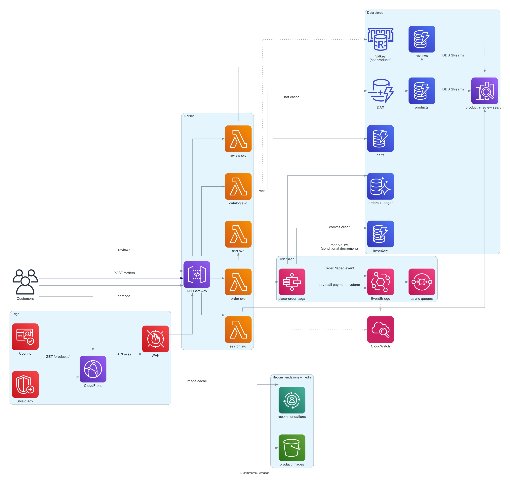

# E-commerce (Amazon-style)

> **One-line summary.** A full e-commerce platform: catalog of millions of products, search + recommendations, cart, checkout, payment, inventory, fulfillment, and order tracking. Multiple sub-systems tied together.

## TL;DR
- Many of the components are their own interview designs — borrow heavily from [search-autocomplete](search-autocomplete.md), [recommendation-system](recommendation-system.md), [payment-system](payment-system.md), [ticketmaster](ticketmaster.md) (inventory consistency).
- The unique parts are **catalog scale** (1B products), **cart durability**, **order workflow** (place → pay → reserve inventory → fulfill → ship → deliver), and **inventory** (don't oversell, especially during flash sales).
- **Service decomposition** matters more than any one component — Amazon famously runs hundreds of services. Architect as a system-of-systems with clear contracts.
- **Aurora / DynamoDB** for transactional data; **OpenSearch** for product search; **ElastiCache** for hot data; **EventBridge** for service-to-service events.
- The hardest parts: **inventory under flash-sale concurrency**, **order saga reliability** (a failed payment must release inventory), **catalog freshness vs cost** (1B products × frequent updates), and **multi-Region active-active for revenue continuity**.

## Functional Requirements
- Browse / search catalog.
- Product detail page (price, inventory, reviews, recommendations).
- Add to cart.
- Checkout (address, payment method).
- Place order → payment → reserve inventory → confirm.
- Order tracking (placed → shipped → delivered).
- Returns / refunds.
- Reviews and ratings.

## Non-Functional Requirements
- **Latency**: product detail page p99 < 500 ms; checkout end-to-end < 5 sec.
- **Throughput**: 100M+ DAU; 10K+ orders/sec at peak (Prime Day).
- **Availability**: 99.99%; downtime during peak = millions in lost revenue.
- **Consistency**: inventory exact (don't oversell); cart can be eventually consistent.
- **Scale**: 1B products, 1B orders/year, billions of page views/day.

## Capacity Estimates
- **Catalog**: 1B products × ~5 KB metadata = 5 TB. Stored in DynamoDB; cached in CloudFront + ElastiCache.
- **Orders**: 1B/year = ~30/sec average, ~10K/sec peak.
- **Cart**: 100M active carts × ~20 items × ~200 bytes = ~400 GB hot.
- **Reviews**: 10B reviews × ~500 bytes = ~5 TB.
- **Page views**: ~10B/day; ~120K/sec average, ~1M/sec peak.

## High-Level Architecture



The system decomposes into independent services, each with its own data store:

- **Catalog service** — product info (DynamoDB / Aurora + S3 for images, CloudFront in front).
- **Search service** — OpenSearch index of products.
- **Recommendation service** — see [recommendation-system](recommendation-system.md).
- **Cart service** — DynamoDB; per-user cart, durable.
- **Inventory service** — DynamoDB with conditional writes; per-(product, fulfillment center).
- **Order service** — Aurora; orders + line items.
- **Payment service** — see [payment-system](payment-system.md).
- **Fulfillment service** — interfaces with warehouses + carriers.
- **Notification service** — see [notification-system](notification-system.md).

Services communicate via **API Gateway / NLB** for sync calls, **EventBridge / SQS** for async events. **Step Functions** orchestrates the place-order saga.

## Data Model

```mermaid
erDiagram
  PRODUCT {
    string product_id PK
    string title
    string description
    decimal price
    list   images
    map    attributes
    list   categories
    int    review_count
    float  avg_rating
    timestamp updated_at
  }
  INVENTORY {
    string product_id PK
    string fulfillment_center_id SK
    int    available_qty
    int    reserved_qty
    int    threshold
  }
  CART {
    string user_id PK
    list   items "(product_id, qty, added_at)"
    timestamp updated_at
  }
  ORDER {
    string order_id PK
    string user_id
    list   line_items
    decimal total
    string shipping_address
    string status "pending - paid - allocated - shipped - delivered - cancelled - refunded"
    timestamp created_at
  }
  ORDER_EVENT {
    string order_id
    timestamp ts
    string event_type
    map    payload
  }
  REVIEW {
    string product_id PK
    string review_id SK
    string user_id
    int    rating
    string text
    timestamp ts
  }
```

- **`products`** — DynamoDB (read-heavy, scalable) or Aurora (joinable). Most e-commerce platforms have a hybrid: DynamoDB for the hot read path + Aurora for admin reporting.
- **`inventory`** — DynamoDB with conditional writes; per-product per-warehouse.
- **`carts`** — DynamoDB; per-user.
- **`orders`** — Aurora PostgreSQL (transactional integrity for line items, ledger linkage).
- **`reviews`** — DynamoDB; OpenSearch indexed for review text search.

## API Design

```
GET /v1/products/:id
  → 200 OK { "title": "...", "price": ..., "inventory": "in_stock" }

GET /v1/search?q=...
  → 200 OK { "results": [...] }

POST /v1/cart/items
  body: { "product_id": "...", "qty": 1 }
  → 200 OK { "cart": [...] }

POST /v1/orders
  body: { "items": [...], "address_id": "...", "payment_method_id": "..." }
  → 202 Accepted { "order_id": "...", "status": "processing" }

GET /v1/orders/:id
  → 200 OK { "status": "shipped", "tracking_number": "..." }

POST /v1/products/:id/reviews
  body: { "rating": 5, "text": "..." }
  → 201 Created
```

## Deep Dives

### 1. Catalog at scale
1B products × frequent updates = a hard read/write workload. Patterns:

- **DynamoDB** with single-table design for product metadata. PK = `product_id`.
- **Hot product cache**: ElastiCache Valkey + CloudFront in front for popular products (Top-10K products see >90% of reads).
- **Search index in OpenSearch** synced from DynamoDB Streams.
- **Image / video assets in S3 + CloudFront**, with multiple resized variants for different surfaces (search thumbnail, product detail, zoom).
- **Catalog updates** can be eventually consistent; a 30-second propagation delay is fine.

Aurora is used for admin / reporting workloads where joins matter (sales by category by month).

### 2. Inventory consistency
A flash sale: 1000 units, 100K buyers click "buy" simultaneously.

Same problem as [ticketmaster](ticketmaster.md):
- **DynamoDB conditional update**: `UPDATE inventory SET available_qty = available_qty - 1 WHERE available_qty >= 1`.
- **Multiple fulfillment centers**: try each in proximity order; first match wins.
- **Soft reserve** when added to cart? Usually no for e-commerce (cart abandonment too high — would lock unfulfilled inventory). Reserve at "place order" time, not at "add to cart."

For high-contention SKUs:
- **Per-warehouse partitioning** spreads contention.
- **Approximate-then-confirm**: cart shows "in stock" if any warehouse has > threshold; at order time, do the conditional update.

### 3. Place-order saga
Multi-step distributed transaction. Use [saga pattern](../02-patterns/saga.md) with Step Functions:

```
created
  -> validate_cart (prices haven't changed)
  -> charge_payment (call payment service)
     -> on success
  -> reserve_inventory (conditional decrement per item)
     -> on success
  -> create_order (Aurora write)
  -> emit OrderPlaced event
  -> done

Compensations:
  reserve_inventory fails (out of stock):
    -> refund_payment
  charge_payment fails:
    -> notify customer
```

Each step is idempotent (see [idempotency](../02-patterns/idempotency.md)). Compensations handle failures in reverse order.

### 4. Cart service
Durable, fast, per-user.
- DynamoDB PK = `user_id`. Cart is a list; updates are full-replace or per-item.
- Anonymous users (no `user_id`) — use a browser cookie ID; merge on login.
- TTL: 90 days inactivity → cart auto-deleted.
- Cross-device sync: cart is server-side; any device shows the same cart on login.

For very large carts (B2B with 100s of items), paginate the API and use cursor-based fetches.

### 5. Search and discovery
**OpenSearch** indexes products:
- Title, description, attributes, categories.
- Synonyms, multilingual support.
- Faceted search (filter by brand / price range / rating).
- Sort options (relevance, price, rating, newness).

Indexed from DynamoDB Streams (product updates → OpenSearch upserts).

For trending searches and search recommendations, see [search-autocomplete](search-autocomplete.md).

### 6. Personalization
**Recommendations** integrated throughout:
- Homepage: "recommended for you."
- Product detail: "frequently bought together," "customers who viewed this also viewed."
- Cart: "complete the look."
- Post-purchase: "you may also like."

See [recommendation-system](recommendation-system.md) for the deep-dive.

### 7. Reviews
- Write-heavy at product launch + sale spikes; read-heavy on the product detail page.
- DynamoDB for storage (PK = `product_id`, SK = `review_id`).
- Pre-aggregated `(avg_rating, review_count)` in the product table; updated via DynamoDB Streams + Lambda counter (see [distributed-counter](distributed-counter.md)).
- Spam / inappropriate review detection via SageMaker or Bedrock.
- Reviewer authenticity (verified purchase badge): cross-reference orders table.

### 8. Multi-Region active-active for revenue continuity
Amazon doesn't have downtime during Prime Day. Multi-Region active-active:
- DynamoDB Global Tables for cart, inventory, orders.
- Aurora Global Database for billing-grade order data.
- Route 53 latency-based routing.
- Each Region runs the full stack.
- Inventory consistency cross-Region is the hardest part — DynamoDB MRSC Global Tables (3-Region synchronous) for hot SKUs, or eventual + reconciliation for the rest.

See [multi-region-active-active pattern](../02-patterns/multi-region-active-active.md).

### 9. Pricing and promotions
- **Price** changes constantly (sales, dynamic pricing). Cached in Valkey with short TTL (~1 minute).
- **Promotion rules engine** evaluates discounts at checkout (BOGO, percentage off, coupons).
- **Price freeze** at "add to cart" — but display the current price; validate at checkout.
- Audit log: every price seen by a user at each step (for dispute resolution).

## AWS Services Used
Almost the entire AWS catalog at production scale. Selected highlights:
- **CloudFront** — every page, every image, every API.
- **API Gateway / ALB** — public endpoints.
- **Lambda + ECS + EKS** — compute (microservices fleet).
- **DynamoDB** — catalog, cart, inventory, reviews, orders summary.
- **Aurora PostgreSQL** — orders detailed, ledger, admin reports.
- **OpenSearch** — product search, review search.
- **ElastiCache for Valkey** — hot product cache, session data.
- **DAX** — DynamoDB cache.
- **S3** — images, logs.
- **Step Functions** — order saga.
- **EventBridge** — service events.
- **SQS** — async work.
- **SageMaker / Personalize** — recommendations.
- **Bedrock** — review / content generation, chatbot.
- **WAF + Shield** — security.
- **Cognito** — user auth.

## Cost Notes
At Amazon scale, costs are dominated by:
- **CloudFront egress** (massive).
- **DynamoDB + Aurora** for the OLTP layer.
- **OpenSearch** for search.
- **Compute** (Lambda + EKS + Fargate).

Levers:
- **Reserved capacity / Savings Plans** for steady-state baseline.
- **Tier old data to Glacier**.
- **Cache hit ratio** at every layer (CloudFront, DAX, ElastiCache).
- **Per-Region cost optimization** — different traffic shapes per Region get different sizing.

## Failure Modes & DR
- **Inventory hot SKU during flash sale**: pre-partition per warehouse; rate-limit per SKU; "in stock" displays may briefly lie before being corrected.
- **Payment processor outage**: queue retries; multi-processor for redundancy.
- **Service A down**: services degrade gracefully (e.g., recommendations down → show generic popular items, not error).
- **Region failure**: multi-Region active-active for the revenue path. Search / recommendation can fail over with brief degradation.
- **DDoS during Prime Day**: WAF + Shield Advanced.

## Trade-offs & Alternatives
- **Microservices vs monolith**: at Amazon scale, microservices. For small e-commerce (Shopify-scale), a well-organized monolith on Aurora + good caching is way simpler.
- **DynamoDB vs Aurora for orders**: Aurora wins for transactional integrity (the order + ledger relationship). DynamoDB for the high-throughput summary.
- **Per-warehouse inventory partitioning vs global SKU**: per-warehouse parallelism better for flash sales; global SKU simpler for low-contention.
- **Synchronous order saga vs async**: async (return 202 immediately, push events) scales better; sync simpler UX. Hybrid: optimistic UI ("placing order...") with eventual confirmation.
- **CDN-cached product pages vs server-rendered**: CDN is dramatically cheaper / faster for popular products. Server-rendered for personalized / authenticated views.

## Further Reading
- ["Designing Amazon", System Design Primer-style](https://github.com/donnemartin/system-design-primer).
- ["A Decade of Dynamo: Powering the next wave of high-performance, internet-scale applications" (Amazon paper)](https://www.allthingsdistributed.com/2017/10/a-decade-of-dynamo.html).
- ["Amazon's Distributed Computing Manifesto"](https://www.allthingsdistributed.com/2022/11/amazon-1998-distributed-computing-manifesto.html).
- Related: [payment-system](payment-system.md), [recommendation-system](recommendation-system.md), [ticketmaster](ticketmaster.md) (inventory), [search-autocomplete](search-autocomplete.md), [saga pattern](../02-patterns/saga.md).
