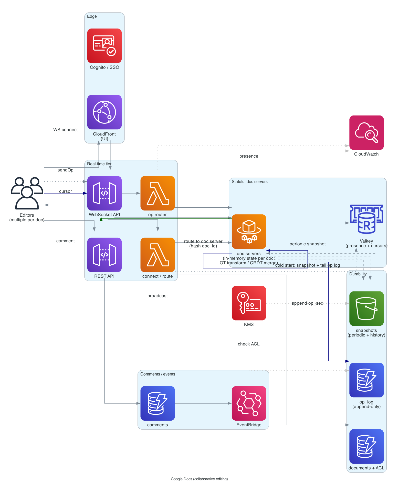
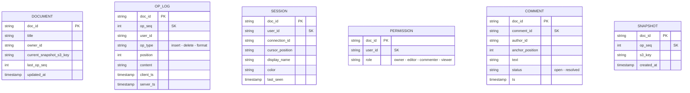

# Google Docs (collaborative editing)

> **One-line summary.** Many users editing the same document at the same time, seeing each other's changes in real time, with consistent eventual state. The defining problem is **conflict-free concurrent editing** — solved with **Operational Transformation (OT)** or **CRDTs**.

## TL;DR

- The whole problem reduces to: two users insert different text at the same position simultaneously — what's the final document?
- **Operational Transformation (OT)**: each edit (op) is transformed against other concurrent ops before being applied. Requires a central server to serialize. Used by Google Docs.
- **CRDT (Conflict-free Replicated Data Type)**: each character / position has a unique ID; concurrent edits merge deterministically without coordination. Used by Apple Notes, Figma, many newer systems.
- **WebSocket** for real-time bidirectional sync; **DynamoDB** for op log; **S3** for document snapshots.
- **Presence + cursors** show other users' positions in the doc.
- The hardest parts: **correctness under all concurrency interleavings** (OT/CRDT math is non-trivial), **offline editing + sync on reconnect**, **scaling the document server** (one server per doc traditionally), and **history / undo / rich formatting**.

## Functional Requirements

- Multi-user real-time editing of a document.
- Cursor visibility (see where collaborators are typing).
- Comments and suggestions.
- Revision history (browse past versions, restore).
- Offline edits → sync on reconnect.
- Sharing / permissions (view, comment, edit).
- Rich formatting (text styles, images, tables).
- (Out of scope for v1): real-time presence chat, slides, spreadsheets (similar shape, different data model).

## Non-Functional Requirements

- **Latency**: keystroke → other users see it within 200 ms (sub-second feels real-time).
- **Throughput**: thousands of concurrent edits per active doc; millions of active docs.
- **Consistency**: all collaborators converge to the same final document.
- **Availability**: 99.99%; doc downtime = work disrupted.
- **Durability**: every keystroke must survive crash. No data loss ever.
- **History**: undo / redo + browse-and-restore arbitrary past version.

## Capacity Estimates

- 100M active users, 1M concurrent editors at peak across all docs.
- Average doc: ~5K characters, ~100 ops/min during active editing.
- Total ops/sec: ~10K-100K (writers are far fewer than readers).
- Storage: snapshots are MB-scale per doc; op log is unbounded but compactable.

## High-Level Architecture



Each open document is served by a **document server** (one or a small replica set per active doc). Editors connect via **WebSocket** to API Gateway → routed to the doc's server (consistent hashing on `doc_id`). Server holds the document state in memory + applies / transforms incoming ops. Each op is appended to an **op log** (DynamoDB) for durability; periodic **snapshots** to S3 for fast load on cold doc.

For OT, the server is the single serializer — clients send ops, server transforms against concurrent ops, broadcasts to all clients. CRDTs allow peer-to-peer in principle; in practice still routed through a server for persistence + presence.

## Data Model



- **`documents`** — DynamoDB.
- **`op_log`** — DynamoDB, PK = `doc_id`, SK = `op_seq`. Append-only log of every edit.
- **`sessions`** — Valkey / DynamoDB; per-active-editor presence + cursor.
- **`snapshots`** — S3 (file per snapshot) + DynamoDB index.

## API Design

```
WebSocket routes:
$connect            — open doc; subscribe to doc events
$disconnect
sendOp              — { doc_id, op: { type, position, content }, base_version }
cursor              — { doc_id, position }
comment             — { doc_id, anchor, text }

REST:
GET /v1/docs/:id
POST /v1/docs
PUT /v1/docs/:id/permissions
GET /v1/docs/:id/history
GET /v1/docs/:id/versions/:op_seq    (download a past snapshot)
```

## Deep Dives

### 1. Operational Transformation (OT)

The classic Google Docs approach.

Each edit is an **operation** (op):

- `insert(position, text)`.
- `delete(position, length)`.
- `format(position, length, attrs)`.

When two ops happen concurrently, the server **transforms** the later one against the earlier one before applying.

Example:

- Doc: `"hello"`.
- User A inserts `"X"` at position 5: `insert(5, "X")` → `"helloX"`.
- User B (concurrently) deletes "ello" at position 1: `delete(1, 4)` → `"h"`.

If B's op arrives at the server before A's:

- B applied: `"h"`.
- A arrives as `insert(5, "X")` — but position 5 no longer exists!
- Server **transforms** A's op against B: A's position 5 in the original is now position 1 in the new doc. So A becomes `insert(1, "X")` → `"hX"`.

Both clients converge to `"hX"`. The transform rules are the heart of OT and surprisingly tricky to get right (TP1, TP2 properties for correctness).

Google Docs uses OT with a **single server per doc** as the serialization point.

### 2. CRDTs (Conflict-free Replicated Data Types)

Alternative approach: each character has a unique ID that includes (replica_id, sequence_number). Concurrent inserts get different IDs; the merge is deterministic by ID ordering.

Examples: **YATA**, **RGA**, **Treedoc**, **Y.js** (popular library).

Pros:

- Peer-to-peer merge possible (no central server required for correctness).
- Simpler reasoning about correctness — math guarantees convergence.
- Better for offline editing (long disconnects).

Cons:

- Metadata overhead (every character has an ID).
- Garbage collection of deleted characters is hard.

In practice, most production systems use a central server even with CRDTs (for persistence, presence, permissions).

### 3. WebSocket routing and per-doc server

Per-doc state lives in memory on a server. Routing rule: all editors of doc X connect to server N where `N = hash(doc_id) % cluster_size`.

API Gateway WebSocket can route via Lambda; Lambda doesn't hold state — so the doc state lives in a **stateful tier** (ECS / EKS / EC2) behind the Lambda.

Failover: doc server fails → replicas pick up; clients reconnect to a different server; state restored from snapshot + recent op log.

For very hot docs (1000+ concurrent editors), shard the doc state across multiple servers (each owns a section); or accept that op throughput is bounded by one server's CPU.

### 4. Op log and snapshots

**Op log** in DynamoDB:

- PK = `doc_id`, SK = `op_seq`.
- Every op appended atomically.
- `op_seq` monotonic per doc (server assigns).

**Snapshot**:

- Periodic (every N ops or M minutes): full doc state to S3.
- On doc load: read latest snapshot + replay ops since.
- Bounds replay cost.

**History / undo**:

- Per-user undo stack: stack of ops the user did; undo pops the latest and applies the inverse.
- History browse: render the doc at any `op_seq` by replaying from a snapshot.

### 5. Offline editing

User edits offline → reconnects → syncs.

OT approach:

- Client buffers ops with `base_version = last known op_seq`.
- On reconnect, server transforms buffered ops against ops it received in the meantime.
- Conflicts: rare; usually deterministic transform.

CRDT approach:

- Client applies ops locally with CRDT IDs.
- On reconnect, exchange ops; merge by CRDT rules.
- Conflicts: by construction, deterministic merge.

For long offline windows (days), some divergence is unavoidable; clients may need to display "you have offline changes from N hours ago" before syncing.

### 6. Permissions

Per-doc ACL: `(doc_id, user_id, role)`.

- Owner can edit permissions + delete.
- Editor can edit.
- Commenter can add comments but not edit text.
- Viewer is read-only.

Permissions checked on:

- WebSocket connect (can user open this doc?).
- Each op (can user write?).
- Periodic re-check (in case permissions changed mid-session).

For "anyone with the link" sharing, generate a short-code link (see [url-shortener](url-shortener.md)) that grants a specific role.

### 7. Presence and cursors

Show "Alice is editing here" with a colored cursor.

- Each connected user updates their cursor on every keystroke / click.
- Cursors broadcast to other connected users via the same WebSocket.
- Stored ephemerally in Valkey (`sessions:<doc_id>` set).

High-RPS but transient — no DB write per cursor move.

### 8. Comments and suggestions

- **Comments**: anchored to a text position; show in a side panel; resolved / unresolved.
- **Suggestions** (track changes): proposed edits that author can accept/reject.

Stored separately from the main op log. Comments have their own state machine (open → resolved → unresolved).

Anchor positions are tricky — as the doc changes, the anchor needs to shift. Use the CRDT/OT position primitive for the anchor (a stable position ID), not raw character index.

## AWS Services Used

- **API Gateway WebSocket API** — client connections.
- **Lambda** — connection handlers (stateless layer).
- **ECS Fargate / EKS** — stateful doc servers (per-doc in-memory state).
- **DynamoDB** — documents, op log, permissions, comments. Multi-AZ.
- **S3** — snapshots.
- **ElastiCache for Valkey** — session presence, cursors.
- **Cognito** — auth.
- **CloudFront + S3** — static assets (UI, fonts).
- **Bedrock** — AI features (summarize, suggest edits).
- **KMS** — encryption.
- **EventBridge** — internal events (perm change, comment added).

## Cost Notes

- **Fargate / EKS** for per-doc servers — many small instances; cost scales with concurrent active docs.
- **DynamoDB** writes for op log are the major fixed cost — every keystroke writes.
- **WebSocket per-connection-minute** also adds up.
- **S3** snapshots are cheap.

Levers:

- **Bin-pack docs onto servers** (one server handles many low-traffic docs; one server per hot doc).
- **Compact the op log** periodically (snapshot + truncate).
- **CDN cache the public-doc view path**.

## Failure Modes & DR

- **Doc server failure**: replica takes over; state restored from snapshot + op log; clients reconnect transparently.
- **DynamoDB throttle on op log**: hot doc; rate-limit ops per user or shard the op log per doc segment.
- **WebSocket disconnect**: client buffers ops locally; sync on reconnect.
- **Region failure**: per-Region DynamoDB Global Tables + S3 CRR; doc serving fails over to standby Region.
- **OT transform bug**: rare but catastrophic (docs diverge across clients). Extensive testing + invariant checks.

## Trade-offs & Alternatives

- **OT vs CRDT**: OT requires central server + careful transform math. CRDT is more decentralization-friendly but has metadata overhead and complex GC. Both work; pick by team familiarity.
- **One server per doc vs distributed**: per-doc server is simple; bottlenecks at very high concurrency. Distributed (sharded by section) is complex but scales.
- **Append-only op log vs differential snapshots**: op log gives full history; snapshots alone lose granular history. Most production systems do both.
- **WebSocket-only vs HTTP fallback**: WS is standard; HTTP long-poll fallback for restricted networks.
- **Permission checks on every op vs cached**: cache for performance; periodic refresh + force-refresh on perm change.

## Further Reading

- ["Designing Google Docs", System Design Primer](https://github.com/donnemartin/system-design-primer).
- ["Differential Synchronization", Neil Fraser (Google)](https://research.google/pubs/differential-synchronization/).
- ["CRDTs: Building Blocks for Eventually Consistent Distributed Systems"](https://crdt.tech/).
- [Y.js (popular CRDT library)](https://yjs.dev/).
- [Figma's CRDT walkthrough](https://www.figma.com/blog/how-figmas-multiplayer-technology-works/).
- Related: [whatsapp-chat](whatsapp-chat.md) (WebSocket model), [dropbox-file-storage](dropbox-file-storage.md) (file sync without collab).
