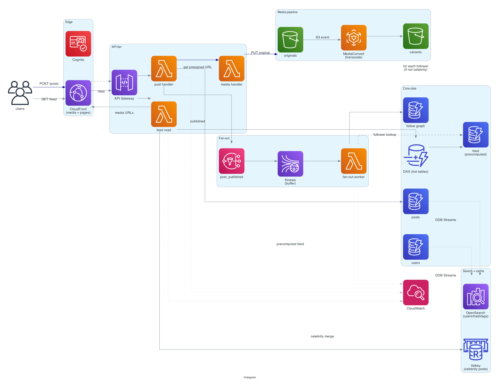
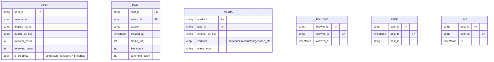

# Instagram

> **One-line summary.** Photo / video sharing with a follower-based news feed. Read-heavy, fan-out-on-write feed generation, hot accounts that break naive designs, and a media pipeline that handles billions of images per day.

## TL;DR

- Three distinct concerns: **media storage / delivery** (S3 + CloudFront), **social graph** (DynamoDB), and **news feed** (precomputed fan-out via Kinesis + DynamoDB).
- **Hybrid fan-out**: regular accounts use fan-out-on-write (push posts to followers' feed lists). Celebrities (millions of followers) use fan-out-on-read (their posts merged into followers' feeds at read time). The threshold is the system-defining knob.
- Media pipeline: client uploads to S3 via presigned URL → **Lambda / MediaConvert** generates resized + transcoded variants → variants written to S3 + indexed in DynamoDB → CloudFront serves all variants.
- Search and discovery via **OpenSearch**; user / hashtag / location indexed.
- The hardest parts: **hot accounts** (Kim Kardashian effect), **feed freshness vs cost** trade-offs, and **eventual consistency** of the feed (users can tolerate a few seconds of staleness).

## Functional Requirements

- Post a photo / video with caption, location, hashtags.
- Follow / unfollow other users.
- View own profile + others' profiles.
- View **news feed** (chronological or ranked, posts from followed accounts).
- Like / comment on posts.
- Search users, hashtags, locations.
- Direct messaging (out of scope here — see [`whatsapp-chat`](whatsapp-chat.md)).
- Stories / reels (out of scope for v1).

## Non-Functional Requirements

- **Latency**: feed load p99 < 500 ms; media load p99 < 200 ms via CDN.
- **Availability**: 99.99% on read paths.
- **Durability**: posts and media never lost.
- **Scale**: 2B users, 500M DAU, 100M posts/day, 100B feed reads/day.
- **Eventual consistency**: 2-10 seconds for feed propagation is acceptable.

## Capacity Estimates

- **Posts**: 100M/day = ~1,200/sec average, ~10K/sec peak.
- **Media**: each post averages ~2 MB (after transcoding to multiple variants). 100M posts × 2 MB = ~200 TB/day raw; with all variants ~500 TB/day stored.
- **Feed reads**: 500M DAU × 200 reads/day = 100B reads/day = ~1.2M reads/sec average, ~10M reads/sec peak.
- **Likes / comments**: 1B/day = ~10K/sec average.
- **Follow graph**: 2B users × 200 follows average = 400B edges → ~10 TB.

The dominant volume is **read traffic** (orders of magnitude more than writes). Architecture optimizes for read latency and cost.

## High-Level Architecture



Three pipelines:

1. **Post pipeline**: client → API Gateway → Lambda (post handler) → S3 (raw media) + DynamoDB (post metadata). Triggers MediaConvert / Lambda for variant generation.
2. **Fan-out pipeline**: post creation → SNS → Lambda fan-out worker → for each follower (under threshold), append post-ID to follower's feed list in DynamoDB. Celebrities skip fan-out.
3. **Read pipeline**: feed read → Lambda → DynamoDB (precomputed feed list) + merge celebrity posts at read time → CloudFront-cached media URLs.

OpenSearch handles search; ElastiCache caches hot data (top posts, user profiles).

## Data Model



- **`users`**, **`posts`**, **`media`** in DynamoDB. PKs as shown.
- **`follow`** uses composite `(follower_id, followee_id)` for fast "who do I follow" queries. GSI on `followee_id` for "who follows me" (used by fan-out workers).
- **`feed`** is the precomputed timeline — DynamoDB, sorted by `post_ts` descending. TTL'd to bound size (last 1000 posts per user).
- **`likes`** — partition by post; another GSI for "what has user X liked."

Counts (`follower_count`, `like_count`) are denormalized; updated via DynamoDB Streams + a [distributed counter](distributed-counter.md) per post.

## API Design

```
POST /v1/posts
  body: { "caption": "...", "media_upload_ids": ["m_1", "m_2"] }
  → 201 Created { "post_id": "p_abc" }

POST /v1/media/uploads
  → 200 OK { "upload_id": "m_1", "presigned_url": "..." }    # client PUTs to S3

GET /v1/users/:id/feed
  ?cursor=<post_ts>&limit=20
  → 200 OK { "posts": [...], "next_cursor": "..." }

POST /v1/posts/:id/like
  → 200 OK
```

Feeds are paginated via cursor (timestamp + post_id for tie-breaking).

## Deep Dives

### 1. Fan-out: write vs read vs hybrid

The central design decision.

**Fan-out-on-write (push)**:

1. User posts.
2. Worker reads followers list (via `follow` GSI).
3. For each follower, append `(post_ts, post_id)` to follower's `feed` row.
4. Read = single DynamoDB query against the user's feed.

Pros: feed reads are O(1), fast. Cons: a celebrity's post explodes into millions of writes — 100M followers × one write each = 100M writes for one post. DynamoDB can absorb this asynchronously, but it costs real money and saturates the worker pool.

**Fan-out-on-read (pull)**:

1. User posts. Only the post itself is written.
2. Read = for each followee, query their posts; merge.

Pros: writes are O(1). Cons: reads cost O(followees × recent posts) → slow for active users following many people.

**Hybrid (the production answer)**:

- Compute a per-user **celebrity threshold** (e.g., 100K followers).
- Regular accounts: fan-out-on-write (push to follower feed lists).
- Celebrities: fan-out-on-read (read their posts at feed query time and merge).

Feed read becomes:

```
feed = [latest 1000 from FEED table]   # contains regular posts pushed at write
     + [latest from each celebrity they follow]   # merged in
     sorted by post_ts desc, limit N
```

The celebrity merge keeps per-read cost bounded (most users follow few celebrities). Threshold tuned so the celebrity set is small enough to merge cheaply.

### 2. Media pipeline

Upload flow:

1. Client requests presigned URL → `POST /media/uploads`.
2. Client uploads original to S3 via presigned URL.
3. S3 PUT event triggers **Lambda** (small images) or **MediaConvert** (videos).
4. Generate variants: thumbnail, medium (web), large (full), and for video: HLS streaming variants.
5. Write variant S3 keys back to `media` table.
6. Post is "ready" when variants exist.

**CloudFront** serves all variants at the edge. **Origin Access Control** locks S3 buckets — direct S3 access only via signed URLs.

For very large video, **MediaPackage / MediaTailor** for adaptive bitrate streaming.

### 3. Feed ranking

Chronological feed is simple; ranked feed (relevance, engagement) is harder:

- **Online ranking**: score each post on read using a model (recency, author-affinity, content-affinity, engagement velocity).
- **Offline-precomputed scores**: a background job (SageMaker / Lambda) writes per-post scores; read uses precomputed.
- **Hybrid**: offline base score + online recency / personalization tweaks.

For interview purposes, chronological is the safe answer; mention ranking as a follow-on.

### 4. Hot accounts and read traffic

A celebrity post can drive 10M+ feed-read events in minutes. Mitigations:

- **CloudFront** caches the post + media; one origin hit serves millions of users.
- **DAX** in front of DynamoDB caches the post / user metadata.
- **ElastiCache** caches the celebrity's recent posts list (used by the merge-on-read for celebrity).
- The follower fan-out is async + parallelized; per-message Lambda concurrency tuned.

### 5. Search and discovery

- **OpenSearch** indexed on:
  - Usernames + display names (for user search).
  - Hashtags (for hashtag search).
  - Locations (geospatial).
  - Captions (text search).
- Posts and users sync from DynamoDB to OpenSearch via **DynamoDB Streams → Lambda → OpenSearch**.
- Trending hashtags / locations computed in a background job over the last hour's posts.

### 6. Likes and counters

Like counts are hot — viral post can get 1M likes in an hour. Use [distributed counter](distributed-counter.md) pattern: 16 shards per post; periodic aggregation to a `like_count` field for display.

Like / unlike is idempotent (one row per (post, user); upserts).

## AWS Services Used

- **CloudFront** — media + page CDN.
- **API Gateway** — public APIs.
- **Lambda** — API handlers, fan-out workers, stream processors.
- **DynamoDB** — users, posts, feeds, follow graph. Global Tables for cross-Region.
- **S3** — original + transcoded media.
- **MediaConvert** — video transcoding.
- **OpenSearch** — search index.
- **ElastiCache for Valkey** — hot-data cache (celebrity posts, user profiles).
- **DAX** — DynamoDB cache for hot tables.
- **Kinesis Data Streams** — fan-out pipeline backbone.
- **SNS** — post-published event topic.
- **CloudWatch + X-Ray** — observability.
- **Cognito** — user authentication.

## Cost Notes

At 500M DAU scale:

- **S3** dominates storage cost: ~500 TB/day × 365 days × IA tiering = tens of $M/year.
- **CloudFront** egress: massive, but cheaper than direct S3 egress; CDN cache hit ratio is the key cost lever.
- **DynamoDB** for feeds + posts: ~$M/month at this scale.
- **Lambda** fan-out: ~$M/month.

Levers:

- **Tier old media to Glacier** — most photos are accessed in the first week.
- **Smaller variants by default** — serve thumbnails initially, large only on tap.
- **CloudFront** cache TTL longer for stable content (avatar, old posts).
- **Celebrity threshold tuning** — push fewer writes if the celebrity threshold is lower.

## Failure Modes & DR

- **DynamoDB hot partition**: feed reads concentrate on top users → DAX absorbs.
- **Lambda fan-out lag**: post took 30 seconds to propagate. Acceptable; monitor lag.
- **MediaConvert backlog**: videos take longer than expected to be available. Show "processing" state to users.
- **Region failure**: DynamoDB Global Tables + S3 CRR for cross-Region. Route 53 latency-based routing fails over.
- **Cascading failure on viral post**: caches absorb; if cache cluster fails, the celebrity merge falls back to direct DynamoDB reads with DAX.

## Trade-offs & Alternatives

- **Fan-out-on-write vs read vs hybrid**: hybrid is the production answer; the threshold is the key tunable.
- **Chronological vs ranked feed**: ranked is the modern default; harder to implement; ranking changes are a UX consideration.
- **Precomputed feed list vs computed-on-read**: precomputed wins on read latency at the cost of write fan-out.
- **Single table for posts + media vs separate**: separate tables let each scale independently; single-table is awkward for the mixed access patterns.
- **Aurora vs DynamoDB for relational queries**: DynamoDB wins on raw throughput and cost. Aurora would help if you needed analytical SQL — but that's better in Redshift downstream.

## Further Reading

- ["Designing Instagram", System Design Primer](https://github.com/donnemartin/system-design-primer).
- ["Building a feed system", Instagram engineering blog](https://instagram-engineering.com/).
- [DynamoDB single-table design (Alex DeBrie)](https://www.dynamodbbook.com/).
- Related: [twitter-feed](twitter-feed.md) (same fan-out problem at higher write rate), [whatsapp-chat](whatsapp-chat.md) (different shape — real-time messaging).
