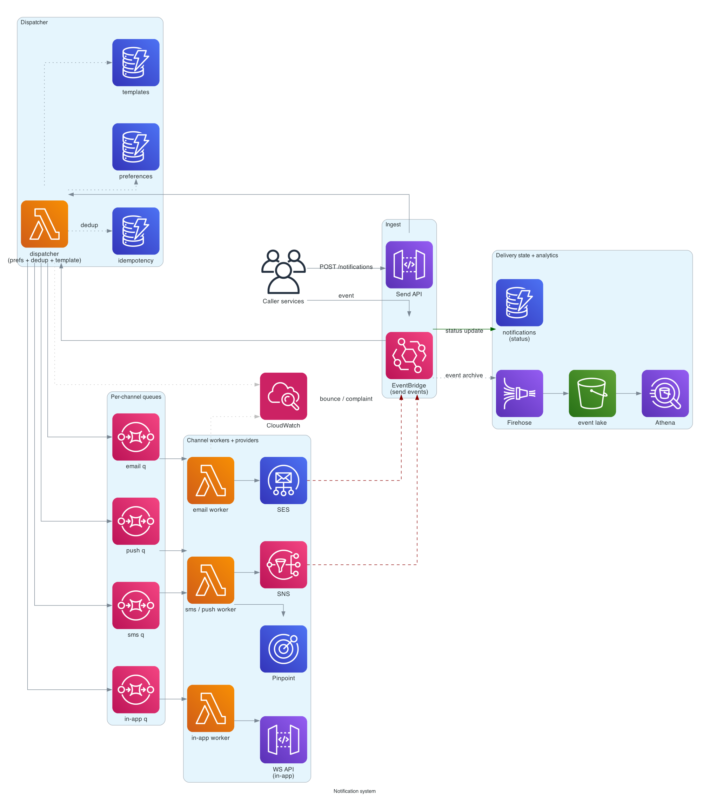
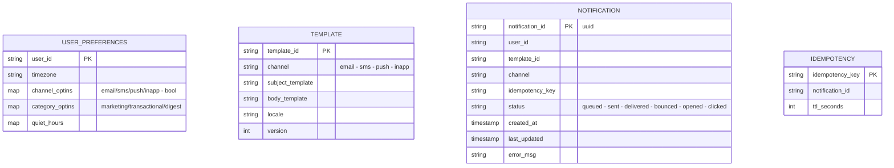

# Notification system

> **One-line summary.** Deliver email, SMS, mobile push, and in-app notifications at scale, with per-user preferences, templating, deduplication, throttling, and delivery analytics.

## TL;DR

- A fan-in/fan-out service: services publish "send X notification to user Y"; the notification system resolves user preferences, picks channels, renders templates, and dispatches via the right delivery provider.
- AWS-native dispatch: **SES** (email), **SNS** (SMS, mobile push), **Pinpoint** (richer mobile + campaign features), in-app via your own WebSocket / push pipeline.
- Backed by **DynamoDB** (preferences, templates, idempotency) and **SQS / EventBridge / Step Functions** for queuing and orchestration.
- Hard parts: **respecting user preferences** (don't notify at 3 AM in their timezone), **deduplication** (don't double-notify on retries), **rate limiting per provider** (carrier rate caps on SMS), and **delivery analytics** (open / click / bounce / unsubscribe).
- Most production incidents are about **template bugs**, **provider rate limits**, and **opt-out compliance** — far more than throughput.

## Functional Requirements

- Send a notification by user-ID + template-ID + variables.
- Multi-channel: email, SMS, mobile push (iOS / Android), web push, in-app.
- User preferences (per channel, per category) — opt-in/out, quiet hours, frequency caps.
- Templates with variables (Jinja-like).
- Idempotent send (caller-supplied idempotency key).
- Track delivery status (sent, delivered, bounced, opened, clicked, unsubscribed).
- Compliance: GDPR opt-out, CAN-SPAM unsubscribe, carrier short-code regulations.

## Non-Functional Requirements

- **Latency**: transactional notifications (password reset, OTP) delivered within 30 seconds. Marketing notifications can lag (minutes).
- **Throughput**: 100M notifications / day at peak (10K / sec sustained, 50K / sec burst).
- **Availability**: 99.9% on the send API (rejection is OK during outage, double-delivery is not).
- **Deliverability**: bounce rate < 5%, complaint rate < 0.1%, otherwise providers (SES) throttle you.
- **Durability**: a successful `send` call must result in a delivery attempt — no silent drops.

## Capacity Estimates

- 100M notifications/day = ~1,200/sec average, ~10K/sec daily peak, ~50K/sec marketing-burst peak.
- Channel mix typical: 60% email, 20% mobile push, 10% SMS, 10% in-app.
- Templates ~1 KB each; rendered payloads 5-50 KB. Negligible storage.
- Preferences: 100M users × ~500 B = 50 GB. DynamoDB.
- Delivery events: 100M × 4 events (sent / delivered / opened / clicked) = 400M events/day → archive to S3.

## High-Level Architecture



A caller (any service) publishes to the **EventBridge / SNS Send** topic. **Lambda dispatchers** resolve the user's preferences in **DynamoDB**, render templates, dedup via an idempotency table, and enqueue to per-channel **SQS** queues. Channel workers pull from the queues and hand off to the provider: **SES** for email, **SNS / Pinpoint** for SMS and mobile push, **API Gateway WebSocket** for in-app. Provider callbacks (bounces, complaints, deliveries) flow back via **SNS / EventBridge** into a **Kinesis Firehose → S3** event lake for analytics and into DynamoDB for real-time delivery-state lookups.

## Data Model



- **`user_preferences`** — DynamoDB, on-demand. Hot read on every send.
- **`templates`** — DynamoDB; rarely changes; aggressively cached.
- **`notifications`** — DynamoDB; per-notification status. TTL'd at e.g. 30 days.
- **`idempotency`** — DynamoDB; key is the caller-supplied idempotency key + user ID; TTL ~24 hours.
- **Delivery events** archived to S3 (Firehose); long-term analytics via Athena.

## API Design

```
POST /v1/notifications
  body: {
    "user_id": "u_123",
    "template_id": "password_reset_email",
    "variables": { "name": "Alice", "reset_url": "..." },
    "idempotency_key": "u_123:reset:1747621234",
    "category": "transactional",
    "channel_override": null  // optional; default = template's channel
  }
  → 202 Accepted { "notification_id": "n_abc..." }
```

`202` because the actual send is async. Status queryable via:

```
GET /v1/notifications/:id
  → 200 OK { "status": "delivered", "events": [{ts: ..., event: "sent"}, ...] }
```

Webhook for delivery-event push:

```
POST <your-callback-url>
  body: { "notification_id": "...", "event": "bounced", "reason": "mailbox full" }
```

## Deep Dives

### 1. Per-user preferences and quiet hours

On every send:

1. Look up `user_preferences[user_id]` (DynamoDB, cached locally in Lambda).
2. Check `channel_optin[channel]` — drop if opted out.
3. Check `category_optin[category]` — drop transactional always-allowed; marketing respects opt-out.
4. Check `quiet_hours` in user's timezone — defer (re-enqueue with a delay) if inside quiet hours, unless transactional.
5. Check **frequency caps** ("max 1 marketing email per day") — DynamoDB conditional update on a daily counter.

**Quiet hours** typically apply to push and SMS (which interrupt the user), not email.

### 2. Idempotency

At-least-once delivery from the caller + at-least-once message processing = duplicates if you don't dedup.

Pattern (see [idempotency](../02-patterns/idempotency.md)):

1. Caller supplies `idempotency_key` (e.g., `user_id:event_type:event_id`).
2. Dispatcher does a conditional `PutItem` on the `idempotency` table.
3. On collision: return the previously-stored `notification_id` (the call is a replay; don't re-send).
4. On success: proceed; the row TTL'd 24h prevents long-term storage.

This protects against caller retries, Lambda retries on async failure, and provider-callback retries (a separate dedup on the inbox side handles those).

### 3. Per-channel rate limiting

Each provider has its own caps:

- **SES**: account-level send rate (start at 14/s, grows with reputation; raisable into the thousands).
- **SNS SMS**: per-destination-country caps; some require pre-registration (US 10DLC, UK / India sender IDs).
- **APNs / FCM**: per-app rate limits; bursts handled, sustained rate matters.

Implement **per-channel SQS queues** sized to the provider's capacity, with consumer Lambda concurrency tuned to match. A burst of 100K marketing emails doesn't exceed SES rate; it sits in the queue for minutes.

For **prioritization** (transactional > marketing), use separate queues per priority within a channel; consumers prefer the transactional queue.

### 4. Bounce and complaint handling

Providers send callbacks via SNS topics:

- **Bounces** (hard / soft): update notification status; for **hard bounces**, mark the email address as bad (skip future sends).
- **Complaints**: spam-reports. Mark user as unsubscribed from that category.
- **Suppression list**: SES suppression list (account-level) + your own list (per-template) prevent re-sending to known-bad addresses.

Hard bounce rate > 5% or complaint rate > 0.1% triggers SES throttling. The notification system must respect bounces *aggressively*.

### 5. Template management and versioning

Templates evolve. Two needs:

- **Atomic deploys** — a template change applies to new sends only; in-flight sends use the version they were enqueued with.
- **A/B testing** — split traffic between template versions.

Store templates with `(template_id, version)`. Dispatcher resolves "active version" at enqueue time; locks the version on the queued message. Roll forward by promoting a new version; roll back by promoting the previous.

For A/B, the dispatcher picks a version per user based on a hash bucket; the locked version on the message ensures the user sees a consistent variant across retries.

### 6. In-app notifications

Different from outbound channels — the user is connected to your app.

- WebSocket via **API Gateway WebSocket API** for browser / native clients.
- Persisted in DynamoDB (`(user_id, notification_id)`) so reconnecting clients can fetch unread.
- Read-state synced via the WebSocket.

## AWS Services Used

- **EventBridge** — caller send-event ingest (one bus for all notification events).
- **SNS** — fanout + SMS / mobile push delivery (or Pinpoint).
- **SES** — email delivery.
- **Pinpoint** — campaign / segment management for marketing (alternative to SNS for mobile push with richer analytics).
- **SQS** — per-channel queues with priority sub-queues.
- **Lambda** — dispatchers, channel workers, provider-callback handlers.
- **Step Functions** — for orchestrated multi-step flows (digest emails, retry-after-N-failures patterns).
- **DynamoDB** — preferences, templates, notifications, idempotency.
- **API Gateway WebSocket API** — in-app delivery.
- **Kinesis Firehose + S3** — delivery event lake.
- **Athena + QuickSight** — delivery analytics.
- **CloudWatch** — operational metrics.
- **Secrets Manager** — provider credentials (SMTP creds, third-party API keys).

## Cost Notes

At 100M notifications/day:

- **SES**: ~$0.10 per 1000 → ~$3000/month for email.
- **SNS SMS**: dominant cost (carrier-billed; ~$0.005-$0.05 per SMS depending on country) → could be tens of thousands monthly.
- **Lambda + SQS + DynamoDB**: a few hundred dollars combined.
- **Firehose + S3 + Athena**: tens to low hundreds.

The dominant cost is **SMS** by a wide margin. Cost-control levers:

- Default to email / push wherever possible; reserve SMS for OTP and similar critical use cases.
- Use mobile push instead of SMS for users with the app installed.
- Country-by-country rate caps to avoid runaway costs.

## Failure Modes & DR

- **SES throttled** due to high bounce rate: queues back up; new sends rejected at the dispatcher with `503`. Operational alarm; investigate bounce sources.
- **DynamoDB hot partition** (one user gets millions of notifications somehow): conditional-write idempotency dedupes; rate-limit per user.
- **Provider outage** (SNS / SES Region-wide): fail over to a secondary provider (Twilio, SendGrid) if one is configured; or pause the channel and alert.
- **AZ failure**: all components multi-AZ; no impact.
- **Region failure**: cross-Region SES + Route 53 latency-based for the API; SQS / DynamoDB don't replicate cross-Region natively (use Global Tables for DynamoDB; SQS messages are lost during a Region outage but the EventBridge events that triggered them can be replayed from the archive).
- **Quiet-hours miscalculation** (DST changes, wrong timezone): users get 3 AM pages. Always test timezone code thoroughly.

## Trade-offs & Alternatives

- **SES vs third-party (SendGrid / Postmark / Mailgun)**: SES is dramatically cheaper at scale, less feature-rich for deliverability tooling. Many production setups use SES for transactional, third-party for marketing.
- **SNS vs Pinpoint for mobile push**: SNS is simpler, lower-cost, less analytics. Pinpoint is richer (segmentation, campaigns, A/B), more expensive, more operational complexity.
- **EventBridge vs SQS as the entry point**: EventBridge for content-based routing (different templates for different event types), SQS for direct queue with simpler semantics. EventBridge is the modern default.
- **Per-channel queues vs single queue**: per-channel allows independent throttling and prioritization. Single queue is simpler at low scale.
- **Inline render vs render-on-dispatch**: rendering on dispatch (just before send) is more accurate (latest user data, latest template). Inline at create-time is faster but stale.
- **Server-side opt-out vs client-side**: server-side enforcement is the safety net (always check); client-side preference UI is the user experience. Both.

## Further Reading

- ["Designing a notification system", System Design Primer](https://github.com/donnemartin/system-design-primer).
- [SES sending best practices](https://docs.aws.amazon.com/ses/latest/dg/best-practices.html).
- [SNS SMS country support](https://docs.aws.amazon.com/sns/latest/dg/sns-supported-regions-countries.html).
- [Pinpoint vs SNS](https://docs.aws.amazon.com/pinpoint/latest/userguide/welcome.html).
- Related: [pub-sub pattern](../02-patterns/pub-sub.md), [idempotency pattern](../02-patterns/idempotency.md), [SNS service page](../01-services/integration-messaging/sns.md), [SQS service page](../01-services/integration-messaging/sqs.md).
