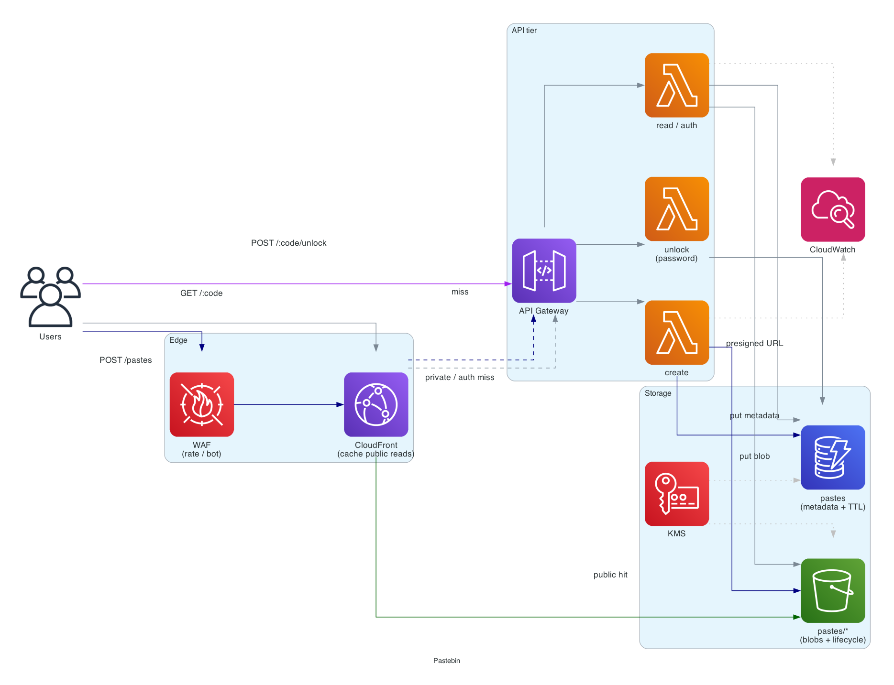
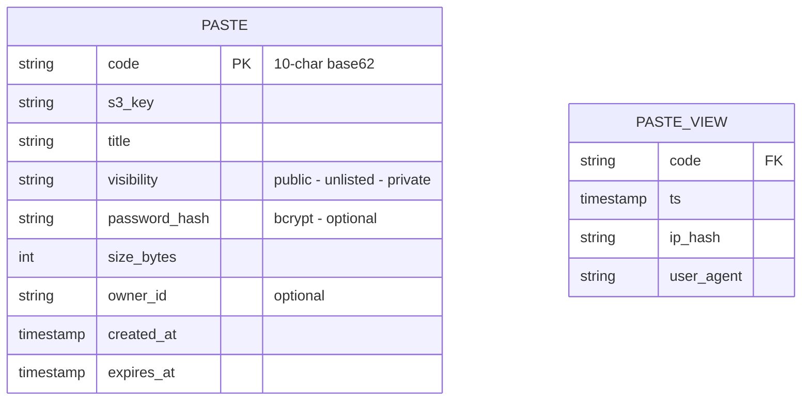

# Pastebin

> **One-line summary.** Users paste text; we return a short URL that anyone can use to view the paste. Same shape as URL shortener but with larger payloads and richer expiration / privacy semantics.

## TL;DR
- Similar shape to [URL shortener](url-shortener.md) — short code → blob — but the blob can be megabytes, lives in S3, and pastes have access controls and expiration.
- **S3** for paste content (cheap, durable, scales effortlessly). **DynamoDB** for `(code → S3 key, metadata, ACL)`. **CloudFront** for read caching.
- **Syntax highlighting** is a client-side concern; the server stores plain text.
- **Privacy**: short code is the access token. Long enough codes (10-12 chars base62) are effectively unguessable. Add an optional password layer for paranoid pastes.
- **Expiration** via DynamoDB TTL + S3 lifecycle policies — both delete in the background.

## Functional Requirements
- Create paste → return short URL.
- Optional **expiration** (10 min, 1 hour, 1 day, 1 week, 1 month, never).
- Optional **visibility**: public (anyone with the link), unlisted (link required), private (password-protected or owner-only).
- View paste — render plain text + optional syntax highlighting (client-side).
- (Out of scope for v1): editing existing pastes, user accounts beyond optional ownership.

## Non-Functional Requirements
- **Latency**: p99 read < 200 ms globally (most reads are cached); writes < 500 ms.
- **Availability**: 99.99% on reads.
- **Durability**: pastes survive until expiry (eleven 9s — S3 default).
- **Scale**: 10M pastes created per year; 100M reads per year.
- **Paste size**: 1 KB to 10 MB (configurable max).
- **Cost**: per-paste cost trivial; cache aggressively.

## Capacity Estimates
- **Writes**: 10M / year ≈ 0.3 / sec average, ~3 / sec peak. Trivial.
- **Reads**: 100M / year ≈ 3 / sec average, ~30 / sec peak. Modest.
- **Storage**: 10M pastes × 50 KB average = ~500 GB/year. (Add headroom for some 1-10 MB pastes.)
- **Read bandwidth**: 30 / sec × 50 KB = 1.5 MB/s peak. CDN handles it.

This problem fits in a single Region with no sharding.

## High-Level Architecture



User creates: **CloudFront → API Gateway → Lambda (create)** generates a code, writes the blob to **S3** (`pastes/<code>`), writes metadata to **DynamoDB** (`pastes` table). Read: **CloudFront → API Gateway → Lambda (read)** looks up the metadata in DynamoDB (cached in DAX), checks access, then redirects (or proxies) to the **S3** object via a **presigned URL** or **CloudFront origin access**. **DynamoDB TTL** auto-deletes expired metadata; **S3 lifecycle policy** auto-deletes the object after TTL + grace.

For private / password-protected pastes, the read path passes through Lambda for the password check; for public pastes, CloudFront caches and serves directly from S3.

## Data Model



**Paste** in DynamoDB:
- PK: `code` (string).
- TTL attribute: `expires_at` — DynamoDB removes rows automatically.

**Object** in S3:
- Key: `pastes/<code>`.
- Server-side encryption with SSE-KMS.
- S3 lifecycle policy expires objects matching prefix after N days (mirrors DynamoDB TTL).

**Views** (analytics, optional) — same as URL shortener; Firehose → S3 → Athena.

## API Design

```
POST /api/pastes
  body: { "content": "...", "title": "?", "expires_in": "1h",
          "visibility": "public|unlisted|private", "password": "?" }
  → 201 Created { "code": "aB3xK9qZ", "url": "https://paste.example.com/aB3xK9qZ", "expires_at": "..." }

GET /:code
  → 200 OK (HTML page with embedded content; or 302 to raw view)

GET /raw/:code
  → 200 OK
    Content-Type: text/plain
    <paste content>

POST /:code/unlock
  body: { "password": "..." }
  → 200 OK { "view_token": "..." }    (short-lived JWT)
```

Public pastes are CloudFront-cacheable. Private / password-protected pastes bypass cache.

## Deep Dives

### 1. Large payloads and S3 offload
Storing 10 MB pastes inline in DynamoDB doesn't work (DynamoDB max item size: 400 KB). Two-tier storage:
- **DynamoDB**: metadata only (`code`, `s3_key`, `visibility`, `password_hash`, `expires_at`).
- **S3**: the paste content itself.

For small pastes (< 100 KB), inlining in DynamoDB would save a hop, but it complicates the read path (sometimes from DynamoDB, sometimes from S3). Always-S3 is simpler.

For very large pastes (multi-MB), use **multipart upload** on the client side; the create endpoint returns a presigned multipart URL.

### 2. Access control and presigned URLs
Three visibility modes; each needs a different read path:

- **Public**: cacheable. CloudFront serves the S3 object directly via **Origin Access Control (OAC)**. No backend invocation per read.
- **Unlisted**: not cacheable globally (or cache with the code as the cache key — same as public effectively, since the code is the token).
- **Private (password)**:
  1. User submits password to `POST /:code/unlock`.
  2. Lambda verifies (bcrypt against `password_hash`); issues a short-lived signed JWT.
  3. User requests `GET /raw/:code` with the JWT; Lambda validates and returns a **presigned S3 URL** with a short TTL (e.g., 60 s) and a single use.
  4. Client follows the presigned URL.

The S3 object itself is never directly public for private pastes; access is gated by per-request presigned URLs.

### 3. Expiration: TTL + lifecycle
DynamoDB TTL deletes metadata in the background (up to 48 hours after expiry, typically minutes). S3 lifecycle policy deletes objects matching the prefix on a daily schedule.

**Mismatch risk**: a user reads a paste whose metadata expired but the S3 object hasn't yet. Two mitigations:
- The Lambda always checks `expires_at` (set even when reading from cache); reject if past.
- Lifecycle policy set to `expires_at + 7 days` so the object always outlives the metadata (the safer direction).

For **"never" expiration**, store with no TTL attribute. Be careful not to accidentally let users create infinite-retention pastes that accumulate.

### 4. Abuse and content moderation
Open paste services attract spam, phishing, and malware-distribution pastes. Mitigations:
- **Rate limit** per IP / per account (see [rate-limiter](rate-limiter.md)).
- **CAPTCHA** for anonymous creates (above a threshold).
- **Content scanning** on create — link extraction, regex for known patterns, optional **Macie** for PII / credentials in the paste body.
- **Takedown API** for moderators + an audit log.
- **Auto-expire** anonymous pastes (max 1 month for anonymous; logged-in users get longer).

### 5. Syntax highlighting
Server-side syntax highlighting is expensive and language-specific. Client-side (Prism.js, highlight.js) is the standard:
- Server stores plain text + an optional `language` hint.
- Client renders with the appropriate highlighter.
- Bonus: makes the response easily CDN-cacheable.

For server-rendered HTML (no JS support), keep a Lambda function with a tree-sitter / pygments-based highlighter; route only `Accept: text/html` requests without JS to it.

## AWS Services Used
- **CloudFront** — read cache + TLS.
- **API Gateway (HTTP API)** — public endpoints.
- **Lambda** — create / read / unlock handlers.
- **DynamoDB** — metadata + TTL.
- **S3** — paste content storage with SSE-KMS.
- **KMS** — encryption key.
- **WAF** — IP-based rate limiting, bot protection.
- **Macie** (optional) — scan public pastes for sensitive data.
- **CloudWatch** — observability.

## Cost Notes
At our scale (10M pastes/year, 100M reads/year):
- **S3**: 500 GB stored → ~$12/month. Reads: trivial via CloudFront cache.
- **DynamoDB on-demand**: 10M writes + 100M reads → ~$30-50/month.
- **Lambda**: maybe 10M invocations/month after CDN caching → ~$5-20.
- **CloudFront**: depends on read volume served (cache hit ratio dominates) → ~$50-100.
- **API Gateway**: a few dollars.

Levers:
- **CloudFront hit ratio** — biggest cost-and-latency lever for the read path.
- **Compress paste content** before S3 storage (gzip / zstd) — halves storage cost; transparent to clients.
- **Lifecycle to S3 Intelligent-Tiering** for long-lived pastes — auto-migrates to cheaper tiers based on access.

## Failure Modes & DR
- **AZ failure**: S3 (11 9s, multi-AZ) and DynamoDB (multi-AZ) tolerate transparently.
- **Region failure**: paste creates and reads fail in the affected Region.
  - **DynamoDB Global Tables** for metadata replication.
  - **S3 Cross-Region Replication** for paste content.
  - **Route 53 latency-based + failover** routing.
  - Active-active multi-Region is possible but probably overkill for pastebin economics.
- **S3 object deleted prematurely**: lifecycle policy bug. Mitigation: S3 Object Lock on critical pastes (if the product offered "permanent" tier).
- **Lambda cold start** on read: hits p99 budget if cache misses. Use SnapStart or provisioned concurrency for the read handler.
- **Hot link / viral paste**: CloudFront caches; no DynamoDB hits after first read.

## Trade-offs & Alternatives
- **S3 + DynamoDB vs single store**: simplest for "small metadata + arbitrary blob". DynamoDB-only would force inlining or per-chunk splitting; S3-only would need a separate index for metadata queries.
- **Code length (7 vs 10 vs 12 chars)**: longer codes are unguessable but uglier URLs. 10 chars base62 gives 62^10 ≈ 8×10^17 — enough to prevent enumeration.
- **Public via CloudFront-OAC vs Lambda-fronted**: OAC is faster and cheaper for public reads; Lambda is needed for private / password / per-read decisions.
- **Password storage**: bcrypt is the standard; argon2 is stronger. Either works; never plain SHA-256.
- **Anonymous vs logged-in**: anonymous is simpler; logged-in unlocks features (longer TTL, dashboard of pastes, edit). Optional addition.

## Further Reading
- ["Designing Pastebin or Bit.ly", System Design Primer](https://github.com/donnemartin/system-design-primer#design-pastebincom-or-bitly).
- [S3 Object Lock](https://docs.aws.amazon.com/AmazonS3/latest/userguide/object-lock-overview.html).
- [CloudFront Origin Access Control](https://docs.aws.amazon.com/AmazonCloudFront/latest/DeveloperGuide/private-content-restricting-access-to-s3.html).
- [DynamoDB TTL](https://docs.aws.amazon.com/amazondynamodb/latest/developerguide/TTL.html).
- Related: [url-shortener](url-shortener.md) (same shape, smaller blobs).
