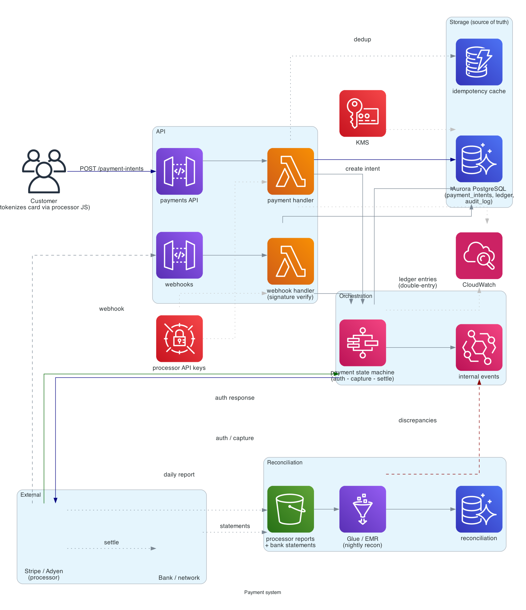
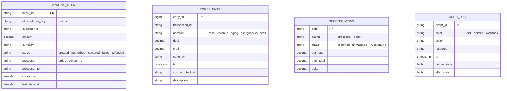

# Payment system

> **One-line summary.** Charge cards (or other instruments), settle funds, reconcile against bank reports, handle refunds and disputes. Money flows make every property — consistency, idempotency, durability, audit — non-negotiable.

## TL;DR
- Money never disappears. Every state transition logged immutably; every action idempotent; every total reconciled against external sources of truth (bank, payment processor).
- **Don't actually move money yourself** unless you have to. Integrate with **Stripe / Adyen / Braintree / Square** for card processing; build the orchestration, ledger, and reconciliation around them.
- **Double-entry ledger** as the source of truth — every transaction debits one account, credits another; the ledger always sums to zero. Built on **Aurora PostgreSQL** with strict transactional guarantees.
- **Step Functions** for the multi-step charge flow (auth → capture → settle → reconcile) with explicit compensations.
- **PCI DSS scope minimization**: card data goes directly from client to the payment processor; your servers never touch it.
- The hardest parts: **exactly-once payment** (don't double-charge), **reconciliation discrepancies** ("the bank says $X, we say $Y — find the gap"), **fraud / chargebacks**, and **regulatory compliance** (PCI, AML, KYC).

## Functional Requirements
- Charge a card / wallet / bank account for an order.
- Authorize-now / capture-later flow.
- Refund (full / partial).
- Handle disputes / chargebacks.
- Recurring / subscription billing.
- Payout to merchants (in marketplace contexts).
- Currency conversion (FX).
- Provide receipt / invoice.
- (Out of scope for v1): direct bank-to-bank rails (ACH / SEPA — usually via processor).

## Non-Functional Requirements
- **Consistency**: ledger always balances; no money lost.
- **Idempotency**: every charge request idempotent on a client-supplied key.
- **Durability**: every transaction persisted before user sees confirmation.
- **Availability**: 99.99%; downtime = lost revenue + customer trust.
- **Latency**: end-to-end charge p99 < 3 seconds (third-party processor latency dominates).
- **Audit**: every state change logged immutably for years.
- **Compliance**: PCI DSS Level 1, SOC 2, regional regulations (PSD2, etc.).

## Capacity Estimates
- 1M charges/day = ~12/sec avg, ~100/sec peak (holiday).
- Average ledger entry: ~500 bytes; 1M charges × ~5 ledger entries each = 5M entries/day = ~2.5 GB/day.
- 7-year retention for compliance = ~6 TB. Manageable.

## High-Level Architecture



A client tokenizes the card via the **payment processor's** JS SDK (so card data never touches our servers). The token is submitted to our **payment API** (API Gateway + Lambda) which writes a **payment intent** to **Aurora PostgreSQL** (idempotency-key dedup), triggers a **Step Functions** state machine: call processor for **authorization** → on success, log to **ledger** in Aurora (double-entry) → on **capture**, log another ledger entry → emit **EventBridge** events for downstream (order fulfillment, accounting).

**Reconciliation**: nightly batch jobs (**Glue / EMR**) compare our ledger to processor reports (S3) and bank statements (S3). Discrepancies → alert.

**Webhooks** from processor (settle, refund, chargeback) → API Gateway → state machine continues.

## Data Model



- **`payment_intents`** — Aurora PostgreSQL. Idempotency-key unique constraint enforces dedup.
- **`ledger_entries`** — Aurora PostgreSQL, append-only. Every transaction is N entries that sum to zero (double-entry).
- **`reconciliation`** — daily reconciliation results.
- **`audit_log`** — every state change; immutable.

Aurora PostgreSQL (not DynamoDB) for the strong-transaction guarantee. Cross-row constraints (the ledger must balance) need SQL transactions.

## API Design

```
POST /v1/payment-intents
  headers:
    Idempotency-Key: <client-uuid>
  body: { "amount_cents": 12500, "currency": "USD", "customer_id": "...", "payment_method_token": "tok_..." }
  → 201 Created { "intent_id": "pi_abc", "status": "requires_capture" }

POST /v1/payment-intents/:id/capture
  → 200 OK { "intent_id": "pi_abc", "status": "captured" }

POST /v1/payment-intents/:id/refund
  body: { "amount_cents": 5000 }
  → 200 OK { "refund_id": "re_abc" }

# Webhook from processor
POST /v1/webhooks/stripe
  body: { "type": "payment_intent.succeeded", ... }
  → 200 OK
```

## Deep Dives

### 1. Idempotency
A customer clicks "Pay" twice. The browser retries on a network blip. The mobile app reconnects and resends. Without idempotency, you double-charge.

Pattern (see [idempotency](../02-patterns/idempotency.md)):
- Client generates an `Idempotency-Key` per logical attempt (UUID per checkout session).
- Server stores the key in the `payment_intents` table with a UNIQUE constraint.
- Duplicate request: returns the stored result without calling the processor.
- TTL: 24 hours (long enough to cover retries; short enough that the same key isn't reused later).

The key is **client-supplied** — server-generated wouldn't dedup across retries from the same client.

### 2. Double-entry ledger
Every transaction is multiple entries that sum to zero. Example: customer pays $100:
```
Transaction t_abc:
  account=customer_pending  debit=100  credit=0
  account=cash              debit=0    credit=100
  account=processor_fee     debit=3    credit=0
  account=revenue           debit=0    credit=3
```
(Customer owes us $100, we got $100 cash; processor takes $3 fee, that's revenue.)

The ledger invariant: `SUM(debit) = SUM(credit)` for every transaction.

Implementation:
- All ledger writes in a single SQL transaction with a `CHECK` constraint enforcing the sum-zero rule.
- Periodic invariant checks: `SUM(debit) - SUM(credit) = 0` across all entries (whole ledger).
- An "out of balance" alert is a P0.

This is a centuries-old pattern from accounting; software shouldn't reinvent it.

### 3. State machine
Every payment has a clear state lifecycle. **Step Functions** is the right host:

```
created
  -> requires_authorization
  -> authorization_in_progress (call processor)
       -> authorized
       -> failed (processor rejected)
  -> capture_in_progress
       -> captured
       -> failed
  -> settled (after processor settles to bank)
  -> reconciled (after our nightly job confirms)

side branches:
  authorized -> voided (auth never captured; processor releases hold)
  captured -> refunded (full or partial)
  any -> disputed (chargeback initiated by customer's bank)
```

Each state transition writes to the audit log + ledger.

Step Functions handles retries, timeouts, compensations (e.g., on "captured" failure, void the auth).

### 4. Processor integration and PCI scope
PCI DSS requires anyone handling raw card data to comply with a long list of controls. Minimize scope by **never touching raw card data**:
- Client uses the processor's JS SDK (Stripe.js, Braintree, etc.) to tokenize the card directly with the processor.
- Server receives only the token (`tok_abc...`), never the PAN.
- Server uses the token in API calls to the processor.

This drops our PCI scope to SAQ-A (the lightest level) instead of SAQ-D (the heaviest). Massive compliance saving.

### 5. Webhooks and async settlement
Card payments are async — the processor authorizes immediately, but settlement (money actually moving) takes 1-3 days. The processor sends webhooks at each step.

Inbound webhook flow:
- Processor → API Gateway → Lambda.
- Verify webhook signature (HMAC of body with shared secret).
- Look up `payment_intent` by `processor_ref`.
- Append state to audit log.
- Trigger Step Functions transition.
- Idempotency: dedup webhook events by event ID.

Outbound: emit our own events (via EventBridge) so internal services (order fulfillment, finance, customer notification) get notified.

### 6. Reconciliation
"The processor says we collected $1,000,234 today; our ledger says $1,000,247. Find the $13."

Nightly job:
- Pull processor's daily settlement report (S3).
- Pull our ledger entries for the day.
- Match by `processor_ref` → `payment_intent_id`.
- Surface mismatches: missing on one side, amount differs, timezone boundary issues.
- Alert finance team for investigation.

For bank reconciliation: same shape, but pull bank statements (often via Plaid / Yodlee or direct bank feed).

Discrepancies are normal at small scales (currency rounding, FX fluctuations, fees not yet booked). Investigate, document, periodically clean up.

### 7. Fraud and risk
Card fraud is unavoidable. Mitigations:
- **Processor's fraud tools** (Stripe Radar, Adyen RevenueProtect) — they have global data we don't.
- **3-D Secure (3DS)** — pushes liability for fraudulent transactions to the issuing bank.
- **Velocity checks**: many transactions from one IP / card / device in short window → flag.
- **Bin-country mismatch**: card issued in country A, IP from country B → flag.
- **Manual review queue**: high-value or flagged transactions wait for human approval.

### 8. Multi-currency and FX
- Store every ledger entry with its `currency`. Don't convert at write time.
- For reporting in a single currency, convert at read time using a snapshot of FX rates per day.
- For settlement to a different currency than the payment, the processor usually does the FX; record the FX rate in the audit log.

## AWS Services Used
- **API Gateway** — payment APIs + webhook endpoints.
- **Lambda** — handlers, webhook processors, state machine tasks.
- **Step Functions** — payment state machine.
- **Aurora PostgreSQL** — `payment_intents`, `ledger_entries`, `audit_log`. Multi-AZ; consider Aurora Global for DR.
- **DynamoDB** — high-cardinality lookups (token → intent), idempotency cache.
- **EventBridge** — internal events.
- **SQS** — async work (notifications, reconciliation queueing).
- **S3** — processor reports, bank statements, archived audit logs.
- **Glue / EMR** — reconciliation jobs.
- **CloudWatch + X-Ray** — observability.
- **Secrets Manager** — processor API keys, webhook signing secrets.
- **KMS** — encryption everywhere.
- **AWS Backup** — vault-locked retention for compliance.
- **GuardDuty + Security Hub** — monitoring.

## Cost Notes
- Payment volume isn't the cost driver — the processor fees are (1-3% per transaction).
- AWS costs for the orchestration are modest: Aurora cluster, Step Functions executions, Lambda.
- The expensive line item is the **engineering team** required to build and maintain compliance.

## Failure Modes & DR
- **Processor outage**: queue retries with backoff. Some processors have failover endpoints; multi-processor strategy for revenue protection.
- **Aurora primary failure**: Multi-AZ failover; transactions in-flight at failover rollback (idempotency handles retries).
- **Webhook delivery failure**: processor retries. Our side dedupes on event ID.
- **Reconciliation discrepancy**: alert; humans investigate. Block automated payouts until resolved if necessary.
- **Region failure**: Aurora Global Database for cross-Region. Processor integrations are typically multi-Region-aware.
- **Stale idempotency cache**: low impact; duplicate requests would hit the unique constraint and return the stored result.

## Trade-offs & Alternatives
- **Aurora vs DynamoDB for ledger**: Aurora wins on cross-row transactions (the "sum to zero" constraint). DynamoDB transactions cap at 100 items per transaction — workable but constraining for complex multi-account entries.
- **Build vs buy processor**: building card processing is a 7-figure compliance investment. Buy.
- **Single processor vs multi-processor**: single is simpler. Multi-processor (Stripe + Adyen) gives redundancy and bargaining power on rates.
- **Synchronous vs async charge flow**: sync (block on processor) gives instant feedback but ties up resources. Async (return 202, push via webhook) scales better but requires UX to handle pending states.
- **At-least-once vs exactly-once webhook processing**: webhooks are at-least-once. Dedup on event ID.

## Further Reading
- ["Designing a payment system", System Design Primer-style](https://github.com/donnemartin/system-design-primer).
- ["Designing robust and predictable APIs with idempotency keys", Stripe blog](https://stripe.com/blog/idempotency).
- ["How to design a double-entry ledger", Modern Treasury](https://www.moderntreasury.com/journal/the-anatomy-of-a-ledger).
- [PCI DSS overview](https://www.pcisecuritystandards.org/).
- [AWS Payment Cryptography](https://docs.aws.amazon.com/payment-cryptography/) — for the few cases where you do need direct card-data handling.
- Related: [idempotency pattern](../02-patterns/idempotency.md), [saga pattern](../02-patterns/saga.md), [outbox pattern](../02-patterns/outbox.md).
