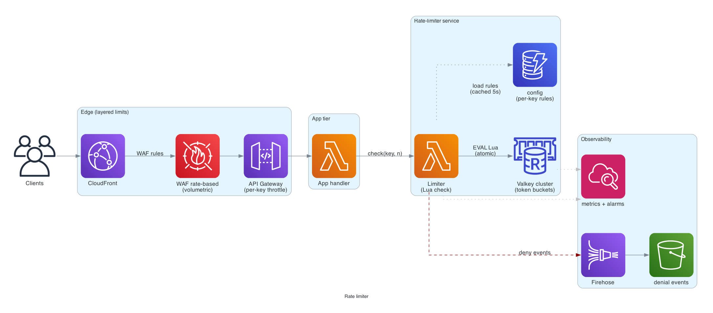
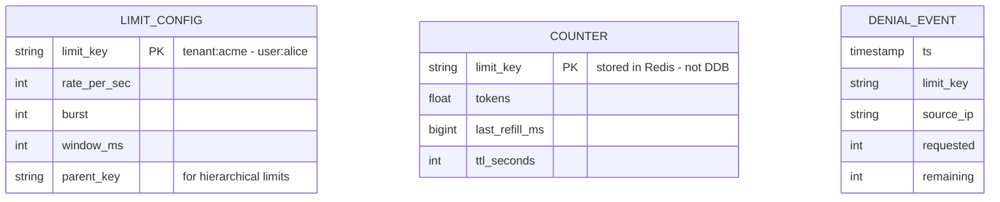

# Rate limiter

> **One-line summary.** Cap the request rate per client / endpoint / tenant. Distributed, low-latency, fair across keys, and observable.

## TL;DR

- A standalone rate-limiter service: API consumers (gateways, app services) call it with `(key, n=1)`; it returns `allow` or `deny`.
- **Token bucket** algorithm with **Redis / ElastiCache for Valkey** as the shared counter store. Atomic Lua scripts handle the increment-and-check in one round-trip.
- Sub-millisecond p99 inside one Region; deny early to protect downstream.
- Return clear signals: HTTP `429 Too Many Requests` + `Retry-After` + standard `RateLimit-*` headers.
- For "the limiter exists at the API edge," **WAF rate-based rules** + **API Gateway throttling** cover the common cases without building this from scratch.

## Functional Requirements

- `Allow(key, n)` returns `(allowed, remaining, retry_after)`.
- Per-key configuration: rate (req/sec), burst size, window.
- Multi-dimensional keys: per-API-key, per-user, per-IP, per-tenant.
- Hierarchical limits (per-tenant cap + per-user cap within tenant).
- Real-time observability (denials, near-limit alerts).

## Non-Functional Requirements

- **Latency**: p99 < 5 ms (this is on the critical path of every request).
- **Availability**: 99.99% (a broken limiter denies everything — fail open or fail closed; *decide explicitly*).
- **Accuracy**: bounded inaccuracy is acceptable. ±10% is fine for abuse mitigation; ±1% may be needed for paid quotas.
- **Throughput**: hundreds of thousands of `Allow` calls per second.
- **Cost**: must be much cheaper than the work it protects.

## Capacity Estimates

- 1M API consumers, 100 req/s peak each → 100M req/s total.
- That's the *protected* throughput; the limiter sees the same load.
- Each `Allow` call ~150 bytes payload. At 100M req/s, ~15 GB/s of limiter-traffic. We *won't* see this at a single deployment — geographically distributed traffic shards across Regions / clusters.
- Per-Region: maybe 100K req/s sustained, 1M req/s peak. Manageable on a Valkey cluster.

## High-Level Architecture



API consumers (API Gateway, app services, EKS workloads) call the **Rate Limiter** Lambda (or sidecar / library) which checks a key against the shared **ElastiCache for Valkey** cluster via atomic Lua. The result is returned to the caller, who either proceeds or returns `429`. Configuration (per-key rate / burst / hierarchy) lives in **DynamoDB**, cached locally on each Lambda for ~5 seconds. Denial events fire to **CloudWatch Metrics** for alarming and to **Kinesis Firehose → S3** for forensic analysis.

For the **edge-level** cut, **WAF rate-based rules** front the public CloudFront / ALB — catches volumetric abuse before it reaches the application. WAF and the custom limiter are layered, not alternatives.

## Data Model



**Configuration**: DynamoDB `(limit_key, rate, burst, window)` — read-heavy, near-cached in Lambda.

**Counter state**: Redis / Valkey `(token_count, last_refill_ms)` per key. TTL on each entry so cold keys drop out automatically.

**Denials**: streamed to S3 via Firehose for offline analysis (top-denied keys, per-tenant abuse reports).

## API Design

```
POST /v1/check
  body: { "key": "tenant:acme:user:alice", "cost": 1 }
  → 200 OK { "allowed": true, "remaining": 99, "retry_after_ms": 0 }
  → 200 OK { "allowed": false, "remaining": 0, "retry_after_ms": 250 }
```

(Note: the *limiter* returns 200 with `allowed=false`; the *caller* converts that to HTTP `429` for its own client.)

Client-facing rate-limit headers (when denied):

```
HTTP/1.1 429 Too Many Requests
RateLimit-Limit: 100
RateLimit-Remaining: 0
RateLimit-Reset: 1747621234
Retry-After: 1
```

## Deep Dives

### 1. Algorithm choice and atomicity

**Token bucket** (the default):

- `tokens` refilled at `rate` per second up to `burst`.
- Each request consumes `cost` tokens.
- Allowed if `tokens ≥ cost`.

The increment-and-check has to be atomic across distributed callers. Two paths:

**A. Redis / Valkey Lua script** (single round-trip):

```lua
local key = KEYS[1]
local rate = tonumber(ARGV[1])
local burst = tonumber(ARGV[2])
local cost = tonumber(ARGV[3])
local now = tonumber(ARGV[4])

local state = redis.call('HMGET', key, 'tokens', 'last')
local tokens = tonumber(state[1]) or burst
local last   = tonumber(state[2]) or now

tokens = math.min(burst, tokens + (now - last) / 1000.0 * rate)

if tokens >= cost then
  tokens = tokens - cost
  redis.call('HMSET', key, 'tokens', tokens, 'last', now)
  redis.call('EXPIRE', key, 3600)
  return {1, math.floor(tokens)}
else
  redis.call('HMSET', key, 'tokens', tokens, 'last', now)
  redis.call('EXPIRE', key, 3600)
  return {0, math.floor(tokens)}
end
```

One round-trip; atomic; ~0.5-1 ms inside an AZ.

**B. DynamoDB conditional writes**:

- `UpdateItem` with conditional expressions; ~5-10 ms.
- More durable (DynamoDB is multi-AZ persistent), slower.
- Use when memory loss on Valkey would matter.

For pure abuse mitigation, Valkey is the right call.

### 2. Hierarchical limits

A tenant has a global cap (1000 req/s); each user under it has a per-user cap (100 req/s). Two checks per request:

```python
allowed_user, _   = check("tenant:acme:user:alice", cost=1)
allowed_tenant, _ = check("tenant:acme",            cost=1)
if not (allowed_user and allowed_tenant):
    return 429
```

For performance, pipeline both in one Redis MULTI / EVAL call.

Care: if a user is denied, **don't decrement the tenant's bucket** — only decrement when both will succeed. Practically that means the Lua script atomically checks both buckets and only deducts if both have capacity.

### 3. Fail open vs fail closed

The Valkey cluster is down (Region-wide blip). What does `check` do?

- **Fail open** (allow all) — preserves availability; allows abuse traffic through.
- **Fail closed** (deny all) — protects downstream; denies legitimate traffic.

**Recommendation**: fail **open with a degraded mode** — switch to per-instance local rate limiters (less accurate but always available) as a fallback. CloudWatch alarms fire so on-call knows the limiter degraded.

Choosing one or the other is a real design decision, not a default. Document it.

### 4. Hot keys and cluster scaling

A single API key generating 100K req/s lands all on one Redis slot. Mitigations:

- **Shard a single hot key** — append a random suffix (`tenant:acme:1`, `tenant:acme:2`, ...) and combine. Trades exact accuracy for throughput.
- **Per-Region clusters** — keys are scoped by Region; cross-Region aggregation happens offline.
- **Pre-allocate a chunk of tokens per Lambda instance** — Lambda asks for 100 tokens at a time; uses them locally; refills from the shared cluster. Trades latency for accuracy (you may over-allow by ~chunk size).

For the limiter's own scaling: Redis Cluster mode + add nodes; auto-scaling group for the Lambda tier.

### 5. Edge limiting vs app limiting

At AWS scale, layer them:

1. **WAF rate-based rules** on CloudFront / ALB — catches volumetric / IP-level abuse before it reaches origin.
2. **API Gateway throttling** — per-stage / per-method / per-API-key throttle.
3. **Custom limiter** (this design) — application-aware (per-tenant, hierarchical, custom rules).

Each layer catches what the others can't. Putting everything in the custom limiter wastes money on traffic that WAF would have dropped for free.

## AWS Services Used

- **WAF** — first-line edge rate limiting.
- **API Gateway** — second-line per-API throttling.
- **CloudFront** / **ALB** — public ingress.
- **Lambda** — limiter logic (or a Fargate sidecar, depending on the deployment shape).
- **ElastiCache for Valkey** — counter state, cluster mode for sharding.
- **DynamoDB** — configuration store.
- **Kinesis Data Firehose + S3** — denial event log.
- **CloudWatch** — denial metrics, alarms, dashboards.
- **AppConfig** — runtime tweaks to per-key limits without redeploying.

## Cost Notes

- **Valkey cluster** at 100K ops/s sustained: ~$300-800/month (a few `cache.r7g.large` nodes).
- **Lambda** at 100M invocations/month: ~$200-500.
- **DynamoDB** config: pennies (low read volume after caching).
- **Firehose + S3**: a few dollars / month.

The dominant cost is the Valkey cluster. Levers:

- **Reserved nodes** for steady traffic.
- **Cluster mode** + smaller nodes vs one giant node.
- **Drop hot-key sharding** when the workload isn't dominated by one key.

## Failure Modes & DR

- **Valkey node failure**: cluster fails over within seconds; limiter sees a few ms of failed checks → fail-open during the window.
- **Cluster outage**: degrade to per-instance local rate limiters (described above).
- **AZ failure**: Multi-AZ Valkey cluster recovers.
- **Region failure**: per-Region limiters mean the affected Region's traffic is gone anyway. The limiter doesn't need cross-Region replication.
- **Misconfigured key (rate = 0)**: blocks all traffic for that key. Use AppConfig + canary deploys + alarm on sudden denial spikes per key.

## Trade-offs & Alternatives

- **Token bucket vs sliding window log vs sliding window counter.** Token bucket is the production default (low memory, allows controlled burst). Sliding window log is more accurate, more memory. Counter is a middle ground.
- **Centralized vs per-instance.** Centralized = accurate, adds latency + a dependency. Per-instance = no extra deps, allows N× the configured rate. Hybrid (local + periodic sync) is sometimes the answer at extreme scale.
- **Synchronous vs async check.** Sync = block until the limiter responds (correctness). Async = call limiter and let request proceed (fast, less accurate). Sync is almost always right.
- **Valkey vs DynamoDB.** Valkey for hot, low-latency counters. DynamoDB for durable / longer-window quotas (per-month quotas where counter loss would matter).
- **Build vs buy.** **WAF + API Gateway** + their built-in throttling cover 80% of needs. The custom limiter is for the 20% where hierarchical / per-tenant business rules matter.

## Further Reading

- ["System Design — Rate Limiting", System Design Primer](https://github.com/donnemartin/system-design-primer).
- [Cloudflare's rate-limiting blog post on sliding window](https://blog.cloudflare.com/counting-things-a-lot-of-different-things/).
- [Resilience4j RateLimiter](https://resilience4j.readme.io/docs/ratelimiter).
- [RateLimit headers RFC](https://datatracker.ietf.org/doc/draft-ietf-httpapi-ratelimit-headers/).
- Related: [rate-limiting pattern](../02-patterns/rate-limiting.md), [WAF service page](../01-services/security-identity/waf.md), [API Gateway](../01-services/networking/api-gateway.md), [ElastiCache](../01-services/database/elasticache.md).
