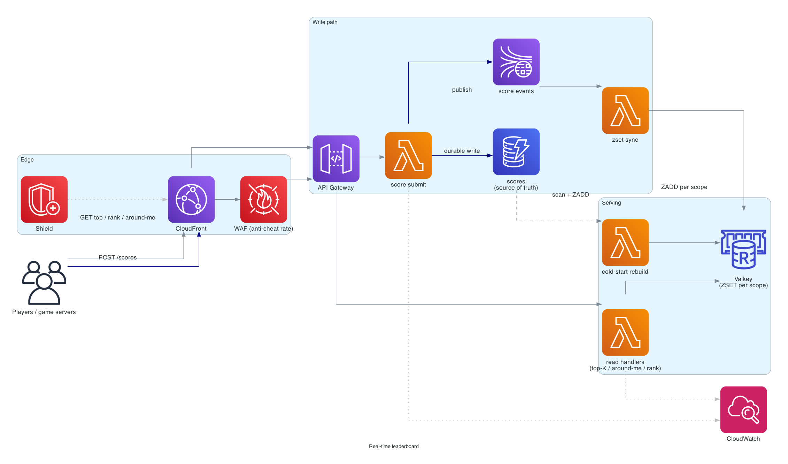
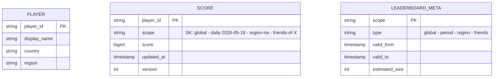

# Real-time leaderboard

> **One-line summary.** Track scores of millions of players in real time; serve top-N, around-me views, and percentile rank with single-digit-millisecond latency. The textbook use case for Redis sorted sets at scale.

## TL;DR

- The right primitive is the **sorted set** (`ZSET`): `O(log N)` insert, `O(log N + K)` top-K read, `O(log N)` rank lookup.
- **ElastiCache for Valkey** (or **MemoryDB** if durability matters) holds the leaderboard. One ZSET per scope (global, daily, by-region, per-friends).
- For massive scale (>50M players in one leaderboard): **shard the ZSET** across nodes (top-K is an approximate merge across shards) or **MemoryDB** with cluster-mode.
- Durability via **DynamoDB** as the source-of-truth score store; Valkey is the serving layer (rebuilt from DDB on cold start).
- The hardest parts: **rank queries at scale** (rank of a single player across 100M = expensive in a vanilla ZSET), **friends-only leaderboards** (small ZSETs computed on-demand), and **score-update fairness** (anti-cheat throttling).

## Functional Requirements

- Submit / update a player's score.
- Top-K leaderboard (top 10, top 100).
- "Around me" — player's rank ± N neighbors.
- Player's absolute rank.
- Per-scope leaderboards: global, regional, daily, weekly, all-time, friends-only.
- Tie-breaking by submission time (earlier wins ties).

## Non-Functional Requirements

- **Latency**: score submit p99 < 50 ms; top-K p99 < 30 ms; rank p99 < 50 ms.
- **Throughput**: 100K score updates/sec at peak (live tournament).
- **Availability**: 99.99%; if the leaderboard is down during a tournament, the product is broken.
- **Scale**: 100M players per leaderboard; thousands of concurrent leaderboards.
- **Durability**: never lose a player's high score (writes go to DDB before Valkey).

## Capacity Estimates

- 100M players × ~50 bytes/entry = ~5 GB per global ZSET. Fits on one Valkey node.
- 100K writes/sec → handled by a single Valkey primary; replicate to two replicas for HA.
- Reads: 1M ops/sec across all leaderboards. Scales by reading from replicas + caching top-K results.

## High-Level Architecture



Game / app servers POST score updates to **API Gateway** → **Lambda** → writes to **DynamoDB** (durable source-of-truth) → publishes to **Kinesis** → **Lambda** writes to **ElastiCache for Valkey ZSETs** (one per leaderboard scope). Read APIs hit Valkey directly (top-K, around-me, rank). On cold start or rebuild, a Lambda streams from DynamoDB and rebuilds the Valkey ZSETs.

## Data Model



- **`players`** — DynamoDB.
- **`scores`** — DynamoDB, `(player_id, scope) → score`. Source of truth.
- **Valkey ZSETs** — `leaderboard:<scope>` with members = player_id, score = score.
- **`leaderboard_meta`** — DynamoDB, describes each leaderboard scope.

## API Design

```
POST /v1/scores
  body: { "player_id": "...", "scopes": ["global", "daily", "region-na"], "score": 12345 }
  → 200 OK

GET /v1/leaderboards/:scope/top
  ?n=10
  → 200 OK { "entries": [{"rank":1,"player":"...","score":...}, ...] }

GET /v1/leaderboards/:scope/around-me
  ?player_id=...&radius=5
  → 200 OK { "entries": [...], "me_rank": 1234 }

GET /v1/leaderboards/:scope/rank
  ?player_id=...
  → 200 OK { "rank": 1234, "percentile": 87.5 }
```

## Deep Dives

### 1. The sorted-set primitive

A Redis / Valkey ZSET is a sorted set keyed by member with a score. Operations:

- `ZADD <key> <score> <member>` — insert / update (O(log N)).
- `ZRANGE <key> 0 9 WITHSCORES` — top-K (O(log N + K)).
- `ZREVRANGE` — descending (highest scores first).
- `ZRANK <key> <member>` — rank of a member (O(log N)).
- `ZREVRANGEBYSCORE` — score-range queries.
- `ZINCRBY` — atomic score increment.

These map exactly onto the leaderboard API. Sub-millisecond on modest hardware.

### 2. Tie-breaking

Ties on score → earlier submission wins. Two approaches:

- **Float score with tie-breaker bits**: `score = real_score - timestamp / 1e10`. Combines into a single sortable number.
- **Composite member key**: `member = "<player_id>:<timestamp>"`. Same player updates become different members → wrong (you'd see the player twice).

The first approach is cleaner. Just be careful with the precision (Valkey ZSETs use float64; combining two values needs careful bit allocation).

### 3. Per-scope leaderboards

Each scope is its own ZSET:

- `leaderboard:global`
- `leaderboard:daily:2026-05-18`
- `leaderboard:region:na`
- `leaderboard:friends:<user_id>`

Per-day / per-period leaderboards have natural expiry — old daily ZSETs auto-deleted via Valkey TTL.

Friends-only leaderboards are a separate problem (see below).

### 4. Friends-only leaderboards

Per-user "leaderboard of my friends" — a user has ~200 friends; the leaderboard is small.

Options:

- **On-the-fly**: at read time, fetch friends' scores from the global ZSET via `ZMSCORE leaderboard:global friend_a friend_b ...`. Sort in app code. O(F log F) for F friends. Fine for F < 1000.
- **Per-user precomputed ZSET**: `leaderboard:friends:user_X` updated when X's friends update. Faster reads, much higher write fan-out (each score update writes to every friend's per-user ZSET).
- **Hybrid**: precompute for power users; on-the-fly for everyone else.

On-the-fly is the production default; precomputed only for users with very many friends and very heavy reads.

### 5. Rank queries at scale

For a single player's absolute rank in a 100M-player leaderboard: `ZRANK` is O(log N), so ~27 ops at N=100M. Sub-millisecond.

For "rank-among-friends of friend X": `ZRANK` is single-ZSET. Use the friends-only leaderboard (small ZSET, fast rank).

For percentile: `percentile = rank / total_count * 100`. `ZCARD` gives total; cheap.

### 6. Sharded leaderboards (very large scale)

For leaderboards > 500M players or > 5 GB ZSETs: shard.

Approach:

- Hash player_id to one of N shards: `leaderboard:global:shard_3`.
- Score writes go to one shard (the player's).
- Top-K = read top-K from each shard + merge in app code (N × K candidates → top K).
- Rank = harder; need to count "how many players in other shards score higher than mine" → approximate by sampling.

For exact ranks across shards, the design needs reworking (or accept approximate rank for the largest leaderboards). Most products are OK with approximate ranks above some position threshold.

### 7. Durability and rebuild

Valkey is in-memory. Node failure loses unreplicated state.

- Use **MemoryDB** (durable Redis with multi-AZ transaction log) for the system-of-record leaderboard. No data loss on failover.
- Or use **ElastiCache** + **DynamoDB**: every score write goes to DDB first; Valkey is the cache. Rebuild Valkey from DDB on cold start (Lambda scans DDB by scope and ZADDs in bulk; takes seconds to minutes per ZSET).

The DDB+Valkey pattern is common — DDB is the durable layer, Valkey is the serving layer.

### 8. Anti-cheat / score validation

Naive: anyone can POST any score. Cheaters submit 1B scores.

Mitigations:

- **Server-side score computation**: the client doesn't post the score; it posts the game-event log; the server computes the score. Cheating requires beating the server-side validation (much harder).
- **Plausibility checks**: a score 100x the previous one for the same player in a 1-minute window is suspicious.
- **ML classifier**: detect cheaters via behavioral pattern analysis.
- **Per-player rate limit**: max N submits/sec per player.
- **Shadow ban**: keep cheater's local score on display, hide it from the global ZSET.

## AWS Services Used

- **API Gateway** — public APIs.
- **Lambda** — score handlers, leaderboard readers, rebuilders.
- **DynamoDB** — durable score store.
- **ElastiCache for Valkey** — leaderboard serving (ZSETs).
- **MemoryDB** — alternative for durable leaderboard.
- **Kinesis Data Streams** — score event backbone.
- **EventBridge Scheduler** — daily / weekly leaderboard rotation.
- **CloudWatch** — metrics.
- **WAF + Shield** — anti-DDoS.

## Cost Notes

- **ElastiCache cluster** for the hot leaderboards is the main fixed cost; small ($300-1000/month for typical workloads).
- **DynamoDB** at score-update rate; small for typical games.
- **Lambda** invocations on score updates; cheap.

At Olympics-scale (1B users), costs scale but the architecture doesn't fundamentally change.

## Failure Modes & DR

- **Valkey primary failure**: replica promoted in seconds. Brief read fail-over.
- **Cold Valkey start**: rebuild from DDB. Top-K reads return empty briefly; better than returning wrong data.
- **DDB throttle**: per-(player, scope) is unique so partition hot spots are unlikely; if a tournament has one mega-popular leaderboard, pre-partition.
- **Region failure**: DDB Global Tables; per-Region leaderboard with periodic global merge (or accept eventual cross-Region consistency).
- **Cheater pollution**: shadow ban + recompute scopes excluding flagged scores.

## Trade-offs & Alternatives

- **Valkey vs MemoryDB**: Valkey is cheaper, less durable. MemoryDB is durable but ~3x cost.
- **DynamoDB-only (no Valkey)**: works for small leaderboards (< 1M players) with on-demand sorting via a GSI. ZSETs are dramatically faster at scale.
- **Approximate top-K (count-min sketch + heavy hitter)**: only top entries are accurate. Sub-MB memory for any leaderboard size. For pure leaderboards, exact ZSET is better; for "top trending hashtags," sketches are the right answer.
- **Sharded ZSETs**: only needed for very large leaderboards (>500M players); adds approximate-rank complexity.
- **Friends-only precomputed vs on-the-fly**: on-the-fly is simpler; precomputed is for hot power users.

## Further Reading

- ["Designing a leaderboard system", System Design Primer-style](https://github.com/donnemartin/system-design-primer).
- [Redis sorted sets reference](https://redis.io/docs/data-types/sorted-sets/).
- [Building leaderboards on Redis, Redis Labs](https://redis.io/learn/howtos/leaderboard).
- Related: [distributed-counter](distributed-counter.md), [caching-strategies pattern](../02-patterns/caching-strategies.md), [ElastiCache](../01-services/database/elasticache.md), [MemoryDB](../01-services/database/memorydb.md).
