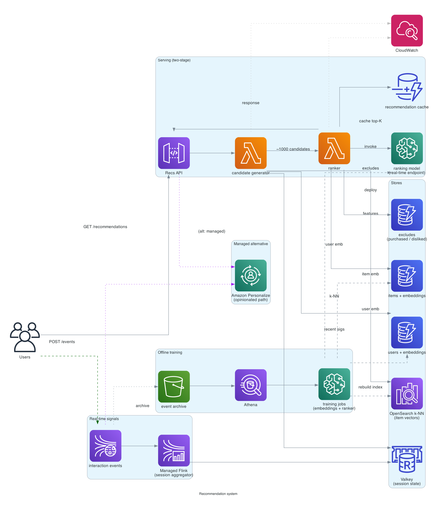
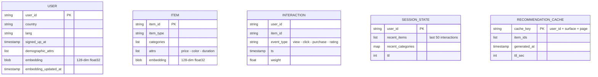

# Recommendation system

> **One-line summary.** Recommend items (products, videos, songs, users) personalized per user, at scale, with sub-100ms latency on the serving path. Two-stage architecture: candidate generation (recall) + ranking (precision).

## TL;DR
- **Two-stage pipeline**: a fast **candidate generator** narrows millions of items to a few thousand; a slower **ranker** scores those candidates with a model that uses richer features.
- Offline pipelines compute **embeddings** (user × item) via training jobs; embeddings stored in DynamoDB / OpenSearch / vector store; nearest-neighbor lookup is the candidate-generation primitive.
- AWS-native: **Amazon Personalize** (fully managed, pre-built recipes — see [`personalize`](../01-services/ml-ai/personalize.md)) is the path of least resistance. For custom needs: **SageMaker** for model training, **OpenSearch k-NN** / **Aurora pgvector** / **Pinecone** for vector retrieval, **Lambda + DynamoDB** for serving.
- Two failure modes that matter: **cold start** (new users / new items have no signal) and **filter bubbles** (over-personalization hides diversity).
- The hardest parts: **feature store consistency** (training-serving skew), **real-time signals** (a click should affect the next recommendation), and **explainability** ("why was this recommended?").

## Functional Requirements
- Recommend top-K items for a user (per surface: homepage feed, "you may like," post-purchase, post-watch).
- Recommend related items for a viewed item.
- Real-time: recent actions influence next recommendations within seconds.
- Cold-start: meaningful recommendations for new users / items.
- A/B testing of models / candidate strategies.
- Filtering: don't recommend already-purchased / disliked / out-of-stock items.

## Non-Functional Requirements
- **Latency**: end-to-end recommendation p99 < 100 ms.
- **Throughput**: 100K req/sec at peak.
- **Freshness**: real-time signals reflected in seconds; model retraining hourly/daily.
- **Coverage**: every user gets a recommendation (no empty results).
- **Diversity**: avoid filter bubbles; balance personalization with exploration.

## Capacity Estimates
- 500M users, 100M items.
- Embedding dim 128, float32 = 512 bytes per embedding.
- 500M users × 512 = ~250 GB user embeddings.
- 100M items × 512 = ~50 GB item embeddings.
- Per-request: 1 user embedding lookup + k-NN over 100M items → must be fast.
- 100K req/sec × ~100 candidates fetched × ~10 features each = lots of feature reads.

## High-Level Architecture



Two paths:

**Offline training**: user interaction events (clicks, purchases, watches) stream through Kinesis → S3 → SageMaker training jobs produce embeddings + ranking models. Outputs deployed to serving stores.

**Online serving**: a recommendation request → **candidate generator Lambda** fetches user embedding from DynamoDB / Feature Store → does k-NN against item embeddings in **OpenSearch / pgvector** → returns 1000 candidates → **ranker Lambda** invokes **SageMaker real-time endpoint** with candidates + context features → returns top-K to the caller.

Real-time signals: recent clicks update an **ElastiCache** session state that the ranker reads.

## Data Model



- **`users`** / **`items`** — DynamoDB; embeddings stored as binary attribute or in a separate vector store.
- **`interactions`** — Kinesis stream + S3 archive; the training fuel.
- **`session_state`** — ElastiCache Valkey; recent activity for online personalization.
- **`recommendation_cache`** — DynamoDB / DAX; TTL'd, smooths server load.

## API Design

```
GET /v1/recommendations
  ?user_id=u_123&surface=homepage&n=20
  → 200 OK
    {
      "items": [
        {"item_id": "i_abc", "score": 0.92, "reason": "watched similar"},
        ...
      ],
      "model_version": "ranker_v37",
      "ab_variant": "treatment_B"
    }

GET /v1/recommendations/related-to/:item_id
  ?n=10
  → 200 OK { "items": [...] }

POST /v1/events
  body: { "user_id": "...", "item_id": "...", "event": "click", "ts": "..." }
  → 202 Accepted
```

## Deep Dives

### 1. Two-stage architecture
Why not "score every item for every user"? 100M items × 500M users × time = impossible.

**Stage 1 — Candidate generation (recall)**:
- Cheap, broad. Goal: find ~1000 candidates from 100M items in <20ms.
- Approaches: **collaborative filtering** (similar users' items), **content-based** (items similar to ones the user liked), **k-NN over embeddings**, **rule-based** (trending in user's country).
- Mix multiple candidate sources: e.g., 300 collab-filter + 300 content + 200 trending + 200 personalized.

**Stage 2 — Ranking (precision)**:
- Expensive, narrow. Goal: score 1000 candidates with a precise model in <30ms.
- Features: user features + item features + user-item cross features (has user interacted with this category? what's the gap since last interaction?) + real-time signals.
- Model: gradient-boosted trees (XGBoost), deep neural net, or a transformer-based ranker.
- Returns ranked top-K.

Why split? Recall optimizes for "did we miss something good?"; precision optimizes for "are the top results the best?". Different objectives, different model architectures.

### 2. Embeddings and vector search
Modern recommender systems represent users and items as dense **embeddings** in a shared vector space — similar users / items are close.

Training:
- **Matrix factorization** (classical) — produces user + item factor vectors.
- **Two-tower neural networks** — user encoder + item encoder trained jointly; output dot product is the score.
- **Pretrained foundation models** (CLIP for images, sentence-transformers for text) — produce embeddings from content.

Serving:
- User embedding fetched from DynamoDB / feature store.
- k-NN search against item embeddings in **OpenSearch k-NN** (HNSW index) / **Aurora pgvector** / **Pinecone** / **Neptune Analytics**.
- Returns top-1000 nearest items.

For OpenSearch Serverless, **vector OCUs** (GPU-accelerated HNSW) enable fast index construction at scale (see [OpenSearch service page](../01-services/analytics/opensearch.md)).

### 3. Real-time signals
Offline embeddings update daily. But the user's last 5 minutes of behavior should affect the next recommendation.

Approach:
- Every event published to Kinesis.
- A **stream processor (Flink)** updates a per-user **session state** in Valkey: recent items, recent categories, dwell time.
- The ranker reads session state at request time; uses it as additional features.

For very-fast-changing preferences (live news feed, real-time bidding), the candidate generator itself might use real-time embeddings (computed from session state via a fast online model).

### 4. Cold start
**New user**: no history → no embedding.
- Use demographic / signup-data-based embedding (e.g., country, language, signup source).
- Use a "general popular" fallback (top items by category).
- Encourage the user to provide preferences upfront (Spotify's "what music do you like?" onboarding).

**New item**: no interactions → no embedding.
- Use **content-based embedding** (text description, image features, structured attributes).
- Show to a small exploration cohort to gather initial signal.
- Specialized **cold-start models** trained to embed from content alone.

### 5. Exploration vs exploitation
Pure precision = filter bubble. Need to inject diversity.

- **ε-greedy**: 95% of the time, serve the model's top-K. 5% of the time, swap in a random item from a diverse pool.
- **Multi-armed bandit / Thompson sampling**: pick items based on uncertainty; explore items the model is unsure about.
- **Diversity reranking**: post-rank, ensure the top-K isn't all the same category / author.

### 6. Filtering and constraints
After ranking, filter out:
- Already-purchased items.
- User's disliked / hidden categories.
- Out-of-stock / unavailable.
- Inappropriate content (age-restricted, banned).

This is fast set-difference at request time, against per-user lists in DynamoDB / Valkey.

### 7. Personalize vs custom
**Amazon Personalize** (see [service page](../01-services/ml-ai/personalize.md)) does the whole pipeline as a managed service:
- Domain Dataset Groups for retail / video / etc.
- Pre-built recipes (user-personalization, similar-items, personalized-ranking, trending, next-best-action).
- Real-time event tracker built in.
- Filters built in.

For most teams, Personalize is the right starting point. Build custom only when:
- Specific feature engineering is required.
- Very low-latency budget (Personalize is hundreds of ms; custom can be tens of ms).
- Tight integration with existing ML infra.

### 8. A/B testing
- Each request gets assigned to a variant (control / treatment).
- Variant assignment via a hash of `user_id`, sticky.
- Each variant calls a different model / candidate strategy.
- Metrics (CTR, conversion, watch time) tracked per variant in real-time dashboards.
- Statistical significance evaluated offline.

## AWS Services Used
- **API Gateway** — recommendation API.
- **Lambda** — candidate generator + ranker handlers (or **SageMaker real-time endpoint** for ranker).
- **SageMaker** — training (HyperPod for large models), inference (real-time / serverless).
- **Amazon Personalize** — fully managed alternative.
- **DynamoDB** — users, items, recommendation cache.
- **OpenSearch (k-NN)** — vector store for similarity search.
- **Aurora PostgreSQL (pgvector)** — alternative vector store.
- **Bedrock** — for LLM-based content embeddings.
- **ElastiCache for Valkey** — session state, candidate cache.
- **Kinesis Data Streams** — event stream backbone.
- **Managed Apache Flink** — real-time session state aggregation.
- **S3 + Athena + EMR** — offline analytics + training data.
- **CloudWatch + Application Signals** — observability.

## Cost Notes
- **Vector search** at 100K req/sec is expensive — OpenSearch / pgvector / Pinecone all cost real money at this scale.
- **SageMaker real-time endpoint** for the ranker: per-hour per-instance; right-size carefully.
- **Lambda + DynamoDB** for the rest is cheap by comparison.

Levers:
- **Recommendation cache** (TTL ~5 min per user) absorbs most repeat reads.
- **Smaller embeddings** (64-dim instead of 128) halves the cost of vector search.
- **Personalize** is sometimes cheaper than rolling your own (managed pricing model).
- **Spot for batch training**; reserved capacity for serving endpoints.

## Failure Modes & DR
- **Model serving outage**: fall back to a simpler model (popularity-based) or cached recommendations.
- **Vector store outage**: fall back to rule-based candidates (trending + category).
- **Empty recommendations**: never; always have a fallback chain ending in "popular items globally."
- **Training pipeline lag**: serving uses last-known-good embeddings; alarm on staleness.
- **Region failure**: per-Region serving + cross-Region model sync.

## Trade-offs & Alternatives
- **Personalize vs SageMaker custom**: Personalize is faster to ship; SageMaker is more flexible.
- **Online inference vs batch precompute**: online (per-request) is fresher but more expensive. Batch (daily top-K per user precomputed to DynamoDB) is cheaper but staler. Hybrid: precompute the candidate pool nightly; rerank online with session state.
- **Two-tower vs collaborative filtering**: collab filtering needs interaction data; two-tower can leverage content. Hybrid is common.
- **Vector search latency**: HNSW (OpenSearch / pgvector) for sub-10ms; brute-force / IVF for cheaper batch.
- **Per-surface separate models vs unified ranker**: separate is more specialized; unified is simpler. Most production systems mix (one ranker, multiple per-surface candidate generators).

## Further Reading
- ["Designing a recommendation system", System Design Primer-style](https://github.com/donnemartin/system-design-primer).
- [Netflix Recommendations: Beyond the 5 stars](https://netflixtechblog.com/netflix-recommendations-beyond-the-5-stars-part-1-55838468f429).
- [YouTube's deep learning recommendations paper (Covington et al., 2016)](https://research.google/pubs/pub45530/).
- [Amazon Personalize docs](https://docs.aws.amazon.com/personalize/).
- Related: [SageMaker service page](../01-services/ml-ai/sagemaker.md), [Bedrock](../01-services/ml-ai/bedrock.md), [Personalize](../01-services/ml-ai/personalize.md), [OpenSearch vector search](../01-services/analytics/opensearch.md).
