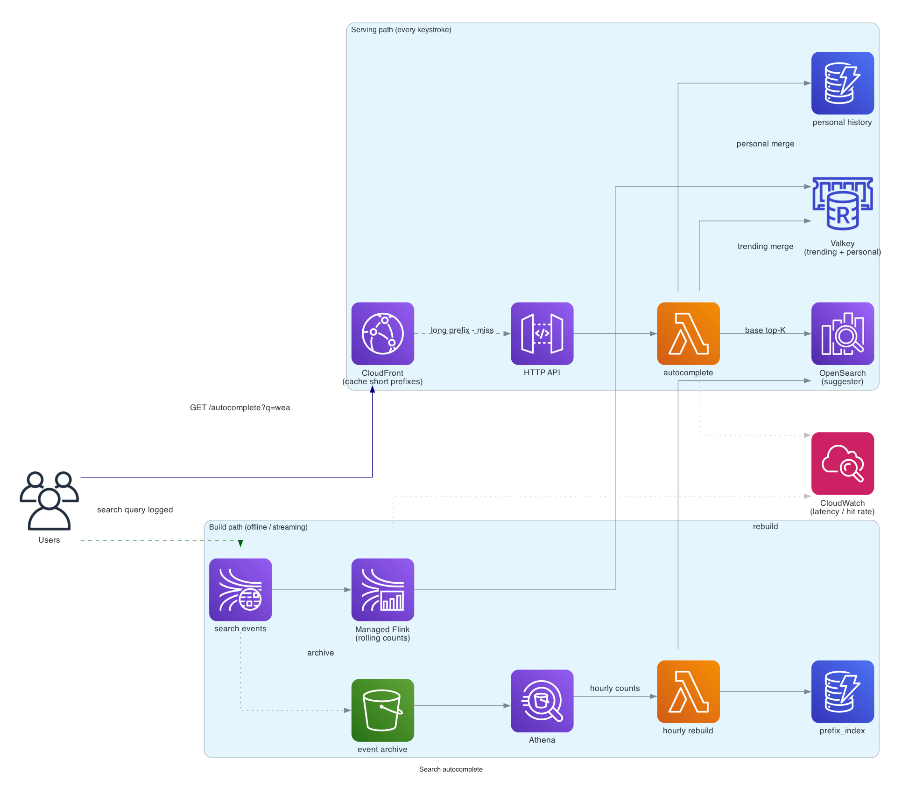

# Search autocomplete (typeahead)

> **One-line summary.** As the user types in a search box, suggest top completions in single-digit milliseconds. Trie-backed index, personalized + global rankings, debounced client calls.

## TL;DR
- The core is a **prefix index** that maps `prefix → top-K completions`. Implementation: in-memory trie (or radix tree) on a fleet of stateless services, or **OpenSearch** with `completion suggester`, or a **DynamoDB** table keyed by prefix + sorted by score.
- Latency budget is brutal — every keystroke fires a request; p99 must be < 100 ms (50 ms desirable). The architecture is designed around this number.
- **Two ranking inputs**: global popularity (everyone searches "weather") and personalized signals (recent searches, location, language).
- **Build pipeline**: search-log stream → aggregation → ranked completions written to the serving store. Updated every ~1 hour for popularity; real-time for personal.
- AWS-native: **OpenSearch completion suggester** for the standard answer; **Lambda + ElastiCache Valkey** for very tight latency budgets; **Kinesis → S3 → Athena → DynamoDB** for the offline build.

## Functional Requirements
- Given prefix `p`, return top-K (typically 10) completions ranked by relevance.
- Update completions as new queries flow in (recent + popular = ranked higher).
- Personalize per user (recent personal searches, location, locale).
- Multi-language support.
- Spelling correction (suggest "weather" when user types "weathr").
- (Out of scope for v1): query understanding, entity recognition.

## Non-Functional Requirements
- **Latency**: p50 < 30 ms, p99 < 100 ms — measured at the API boundary.
- **Throughput**: 100K QPS sustained, 1M QPS peak (every keystroke fires).
- **Freshness**: trending queries appear within ~1 hour for popularity; recent personal queries within seconds.
- **Availability**: 99.99%.

## Capacity Estimates
- **QPS**: 1M peak, 100K average. Most queries are 2-15 chars.
- **Index size**: 10M distinct queries × ~30 bytes avg = 300 MB raw. Trie-encoded with shared prefixes: ~150 MB. Easily in-memory on one host.
- **Build throughput**: 10B search events/day → ~115K events/sec → fits in a single Kinesis stream or MSK topic.
- **Storage**: serving index (per Region) ~150 MB hot. Offline analytics (S3) ~PB scale.

## High-Level Architecture



Two paths:

**Serving path** (every keystroke): client → **CloudFront** → **API Gateway** → **Lambda** → **OpenSearch (completion suggester)** or **ElastiCache (sorted set)** → return top-K. Cached at CloudFront for popular short prefixes (`"a"` cache hit ratio is ~100% globally).

**Build path** (offline): every search event → **Kinesis Data Streams** → real-time aggregation in **Managed Apache Flink** computes per-window query counts → periodic rebuild in **Lambda** writes top-K-per-prefix into the serving store. Long-term log archived to S3 for analytics.

## Data Model

```mermaid
erDiagram
  PREFIX_INDEX {
    string prefix PK "1-15 chars"
    list   top_completions "ranked, max 10"
    timestamp last_updated
    int    version
  }
  SEARCH_EVENT {
    timestamp ts
    string user_id
    string query
    string locale
    string country
  }
  PERSONAL_HISTORY {
    string user_id PK
    timestamp ts SK
    string query
    int    ttl
  }
```

**Serving store options:**
- **OpenSearch completion suggester** — built for this. Per-document `suggest` field with weights. Sub-ms suggest queries.
- **ElastiCache Valkey sorted set** — per prefix, a `ZSET` of `query → score`. `ZREVRANGE` returns top-K. Sub-ms.
- **DynamoDB** — `(prefix → JSON list of completions)`. Slightly higher latency than Redis; durable; simpler ops.

For very tight latency budgets, Valkey wins; OpenSearch is the most operationally friendly.

## API Design

```
GET /v1/autocomplete?q=wea&n=10&user_id=u_123
  → 200 OK
    {
      "prefix": "wea",
      "completions": [
        {"text": "weather", "score": 9876},
        {"text": "weather today", "score": 4321},
        {"text": "weather tomorrow", "score": 3210},
        ...
      ]
    }
```

Cache-Control: `public, max-age=60` for short prefixes (`< 4 chars`) — CDN absorbs.
Cache-Control: `private, max-age=10` for longer / personalized prefixes.

## Deep Dives

### 1. The trie / prefix index
Conceptually: a trie where each node has a list of "top-K completions starting from here." Lookup = walk down the trie to the prefix node, return its top-K.

```
root
├── "w"
│   ├── top_k: [weather, what, where, ...]
│   ├── "e"
│   │   ├── top_k: [weather, weed, weekend, ...]
│   │   ├── "a"
│   │   │   ├── top_k: [weather, weather today, ...]
│   │   │   ├── "t"
│   │   │   │   ├── top_k: [weather, weather today, ...]
│   │   │   │   └── ...
```

**Per-node top-K** (instead of "all queries with this prefix") keeps lookup O(prefix length), not O(prefix length × matches).

Implementation choices:
- **In-memory trie** in a stateless service — fastest, requires a build pipeline to update.
- **OpenSearch completion suggester** — managed, the standard answer.
- **Redis sorted set per prefix** — simple, fast, requires upfront materialization of `(prefix, query, score)` triples (memory cost: O(distinct queries × avg prefix length)).
- **DynamoDB `(prefix → top_k)`** — straightforward; sub-10 ms.

### 2. Ranking
Score = `λ₁ * popularity + λ₂ * recency + λ₃ * personal_affinity + λ₄ * locale_match - λ₅ * spam_signal`

- **Popularity**: rolling 7-day query count.
- **Recency**: exponential decay, half-life ~1 day.
- **Personal**: user has typed this before? Higher score.
- **Locale**: matches user's country / language? Boost.

Tunable weights; A/B testable.

Re-ranking on the serving path is fast (just sort 10-100 candidates). Heavy ranking is offline.

### 3. Build pipeline
Every search event published to Kinesis. Two consumers:
1. **Stream aggregator (Flink)** — maintains per-window counts (5-min, 1-hour, 1-day windows).
2. **Index rebuild (Lambda, hourly)** — reads the aggregator's output, computes top-K per prefix, writes to the serving store.

For real-time trending, a faster path: Flink directly writes `(prefix, query, count)` to a Redis "trending" sorted set; the serving Lambda merges trending + base ranking.

### 4. Personalization
Per-user query history in DynamoDB / Valkey (last 100 queries, TTL'd 90 days).

Serving:
1. Look up base top-K from the global serving store.
2. Look up user's recent queries matching the prefix.
3. Merge: bump scores for personal matches; return top-K.

Cost: 2 lookups per request instead of 1. The personalization lookup is local (one DynamoDB GetItem with cache).

For "incognito" / non-logged-in users, skip the personal step.

### 5. Cache the cache
For very short prefixes (`"a"`, `"w"`, `"th"`), the result is the same globally — CloudFront caches with high TTL. Maybe 90%+ of all autocomplete requests are short prefixes.

For longer prefixes, cache hit rate drops; serving falls back to OpenSearch / Valkey.

For *personalized* requests, no global cache — each user gets their own result. CloudFront passes through; the serving store handles them.

### 6. Spelling correction
Two approaches:
- **Edit-distance based** — suggest queries within edit distance 1-2 (Levenshtein). OpenSearch `fuzziness: AUTO` handles this.
- **Frequency-weighted** — only suggest corrections that are themselves popular (`weathr` → `weather`, not `weatther`).

Combine: spelling correction on the *full query* (after user pauses); regular autocomplete on the *prefix* (every keystroke).

### 7. Throttling and client-side debounce
Naive: every keystroke fires a request. 100 char/s typists × 1M users = serious load.

Mitigations:
- **Client debounce**: wait 150 ms after last keystroke before firing.
- **Cancel in-flight requests** when new keystroke arrives.
- **Min prefix length**: don't autocomplete on 1-char prefix (results are useless and load is huge).
- **Server-side per-user rate limit**: cap at e.g. 20 requests / second / user.

Realistic load with these: ~1 request per word typed, not per keystroke.

## AWS Services Used
- **CloudFront** — caches short-prefix results globally.
- **API Gateway HTTP API** — public endpoint; HTTP API is the right choice (low overhead).
- **Lambda** — serving handler.
- **OpenSearch** with completion suggester — primary serving store.
- **ElastiCache for Valkey** — alternative serving store; user personal history.
- **DynamoDB** — config, per-user history (durable).
- **Kinesis Data Streams** — search-event ingest.
- **Managed Apache Flink** (Kinesis Data Analytics) — real-time aggregation.
- **S3** — log archive.
- **Athena** — analytics on the archive.
- **CloudWatch** — latency / hit-rate metrics.

## Cost Notes
- **CloudFront** cache hit ratio is the biggest cost lever — for a high-hit-rate workload, edge serves most of the traffic.
- **OpenSearch** cluster size scales with QPS — at 1M QPS, this is a meaningful cost (~$M/year for the cluster).
- **Lambda** at high invocation rate adds up — Compute Savings Plans help.
- **Kinesis** per-shard cost is modest.

Levers:
- **Aggressive caching** at CloudFront for short prefixes.
- **Minimum prefix length** (don't even consider serving 1-char).
- **Per-Region clusters** vs global — most queries are per-Region; Region-local serving is cheaper.

## Failure Modes & DR
- **OpenSearch cluster issue**: fall back to Valkey serving (replica index).
- **Build pipeline lag**: trending queries stale; old top-K still served. Acceptable.
- **Region failure**: per-Region clusters; Route 53 latency-based failover.
- **Hot user generates 10K req/sec**: rate limiter (see [rate-limiter](rate-limiter.md)) drops to baseline.

## Trade-offs & Alternatives
- **OpenSearch completion suggester vs Valkey sorted set vs DynamoDB**: OpenSearch is the right default for managed; Valkey is faster but more ops; DynamoDB is the easiest, slowest.
- **Per-prefix top-K materialization vs query-time computation**: materialization is fast at read, expensive at write / storage. Query-time is the inverse. At scale, materialization always wins.
- **Trie vs flat hash map**: trie shares prefixes (memory efficient); hash map (`prefix → list`) is simpler but uses more memory.
- **Real-time updates vs hourly rebuild**: real-time gives trending immediately; hourly is cheaper. Hybrid is the production answer.
- **Build with map-reduce on a batch every hour** (Athena → DynamoDB) — simpler than streaming Flink, slightly staler. Fine for many workloads.

## Further Reading
- ["Building autocomplete at scale", Elasticsearch blog](https://www.elastic.co/guide/en/elasticsearch/reference/current/search-suggesters.html).
- ["Designing Typeahead Suggestion", System Design Primer](https://github.com/donnemartin/system-design-primer).
- [OpenSearch completion suggester docs](https://opensearch.org/docs/latest/search-plugins/searching-data/autocomplete/).
- Related: [twitter-feed](twitter-feed.md) (trending hashtags is similar shape), [rate-limiter](rate-limiter.md), [caching-strategies](../02-patterns/caching-strategies.md).
