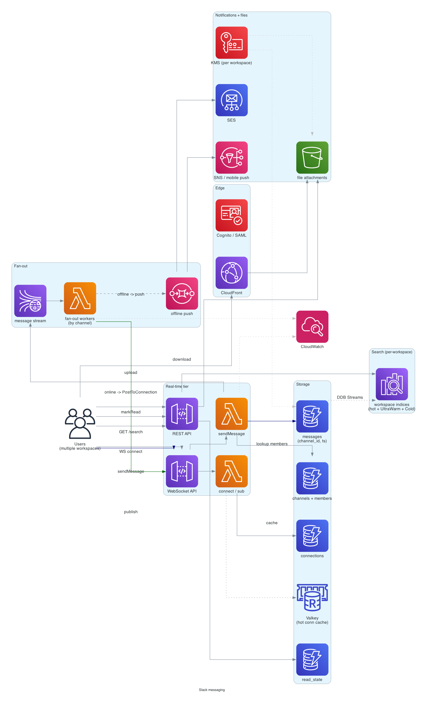

# Slack messaging (workplace chat)

> **One-line summary.** Workplace messaging at workspace × channel granularity. WhatsApp shape with channels instead of 1:1 chats, multi-workspace isolation, threads, presence, search across years of history, and rich integrations (apps, bots, webhooks).

## TL;DR
- Shape is similar to [whatsapp-chat](whatsapp-chat.md) but with **channels** as the unit of conversation, **workspaces** as the multi-tenant boundary, and much heavier read patterns (everyone reads every message in their channel).
- **WebSocket** for real-time push (API Gateway WebSocket / AppSync). **DynamoDB** for messages + threads, **OpenSearch** for full-text search.
- **Presence** (who's online / typing / active in this channel) is a high-RPS background channel; doesn't go through the durable path.
- **Threads** are first-class — replies attached to a parent message, can scroll independently.
- The hardest parts: **search across years of history per workspace**, **per-workspace data isolation** (security and tenancy), **integrations** (apps push messages, slash commands, OAuth scopes), and **read-state tracking** ("show unread count in channel X").

## Functional Requirements
- Send / receive messages in channels (public, private, DM).
- Multi-workspace (one user can be in many).
- Threads (replies to a specific message).
- Presence (online / away / typing).
- Read-state tracking (unread per channel / per thread).
- Full-text search across messages, files, channels.
- File / image attachments.
- Reactions (emoji on messages).
- Mentions (@user, @channel) with notifications.
- Apps / bots / integrations (Slack apps with OAuth scopes).
- (Out of scope for v1): voice / video calls (Slack huddles).

## Non-Functional Requirements
- **Latency**: message delivery to online recipients p99 < 500 ms; channel-load p99 < 500 ms.
- **Throughput**: 20M DAU across all workspaces; ~5K messages/sec average, 50K/sec burst.
- **Availability**: 99.99%.
- **Search freshness**: new message searchable within 10 sec.
- **History**: years of message retention (per workspace plan).
- **Tenancy**: strict workspace isolation — workspace A never sees workspace B's data.

## Capacity Estimates
- 20M DAU × ~50 messages read per day = 1B reads/day.
- ~500M messages/day written.
- Workspace count: 1M active workspaces; per-workspace channels: 10-10K.
- Message size avg ~200 bytes; ~100 GB/day raw + media.
- Search index: 10B messages × full-text indexing → significant OpenSearch cluster.

## High-Level Architecture



Clients open WebSocket via **API Gateway WebSocket API**. **Connection state** (which channels each user is in) cached in **ElastiCache Valkey**. Send message → API → Lambda → write to **DynamoDB messages table** keyed by `(channel_id, message_ts)` → publish to **Kinesis** → fan-out workers push to all online channel members via API Gateway `PostToConnection`. Offline members get pushed via web / mobile push (SES / SNS).

Search: messages stream from DynamoDB Streams → Lambda → **OpenSearch** (per-workspace indices for isolation).

Files in S3 + CloudFront. Per-workspace metadata in DynamoDB; reactions / read-state in DynamoDB.

## Data Model

```mermaid
erDiagram
  WORKSPACE {
    string workspace_id PK
    string name
    string url_slug
    map    settings
    string plan "free - pro - business - enterprise"
  }
  USER {
    string user_id PK
    list   workspace_ids
    string display_name
    string avatar
  }
  CHANNEL {
    string workspace_id PK
    string channel_id SK
    string name
    string type "public - private - dm - group_dm"
    list   member_ids
    timestamp created_at
  }
  MESSAGE {
    string channel_id PK
    timestamp message_ts SK
    string message_id "ulid"
    string sender_id
    string text
    list   blocks "rich formatting"
    string parent_message_id "for thread replies"
    int    reply_count
    map    reactions "emoji - user_ids"
    list   attachments
  }
  CONNECTION {
    string user_id PK
    string connection_id SK
    list   subscribed_channels
    timestamp last_seen
  }
  READ_STATE {
    string user_id PK
    string channel_id SK
    timestamp last_read_ts
    int    unread_count
  }
  THREAD {
    string parent_message_id PK
    string channel_id
    int    reply_count
    timestamp last_reply_ts
  }
```

- **`messages`** — DynamoDB, sharded by `channel_id`; sort by `message_ts` descending for "load latest N."
- **`channels`** — DynamoDB; PK = `workspace_id`, SK = `channel_id`.
- **`connections`** — DynamoDB; TTL'd entries for active connections.
- **`read_state`** — per-user per-channel; updated when user views a channel.

## API Design

```
WebSocket routes:
$connect            — subscribe to user's channels
$disconnect
sendMessage         — { channel_id, text, parent_message_id?, attachments? }
markRead            — { channel_id, message_ts }
typing              — { channel_id, is_typing }
react               — { channel_id, message_id, emoji }

REST:
GET /v1/workspaces/:id/channels
GET /v1/channels/:id/messages?before=<ts>&limit=50
POST /v1/channels/:id/messages   (alternative to WebSocket sendMessage)
GET /v1/search?workspace_id=...&q=...
POST /v1/files/uploads
```

## Deep Dives

### 1. Channels and fan-out
A channel can have 1 to 50K+ members. Sending a message:
1. Write to `messages` table.
2. Look up channel members from `channels`.
3. For each online member (in `connections`), `PostToConnection`.
4. For offline members, push notification + update unread count.

For large channels (#general at a big company), this can fan out to 10K+ pushes. Use **Kinesis** for the fan-out backbone (similar to [whatsapp-chat](whatsapp-chat.md) group fan-out):
- Sender Lambda writes message + publishes `(channel_id, message_id)` to Kinesis.
- Worker Lambdas read the stream, lookup online members for the channel, push.
- Async; sender returns immediately.

### 2. Multi-workspace isolation
Strict tenancy:
- Every record keyed by `workspace_id` (partition key or as a prefix).
- IAM policies + application-level checks enforce that user A in workspace W1 can never query workspace W2's data.
- **OpenSearch** uses per-workspace indices: `messages-w1`, `messages-w2`. Query auth wraps every search with the workspace filter.
- Encryption keys per-workspace (Enterprise plans) — workspace's data encrypted with a unique KMS key.

For very large workspaces (Salesforce-scale, 100K+ users in one workspace), the per-workspace DynamoDB partition becomes hot; consider sharding the workspace internally.

### 3. Threads
Threads attach to a parent message. A thread is logically a sub-channel within a channel.

- Replies stored in the same `messages` table with `parent_message_id` set.
- GSI on `parent_message_id` for "load all replies to message X."
- Parent message has a `reply_count` counter (denormalized; updated via stream + counter).
- Real-time push: thread replies push only to users who have the thread open + the author of the parent + anyone who's posted in the thread (subscriber model).

This is a key UX divergence from WhatsApp — threads are first-class, and not pushed to everyone in the channel by default.

### 4. Read-state tracking
"Show 3 unread messages in #general."

Per-user per-channel `read_state`:
- `last_read_ts` updated when user views the channel.
- `unread_count = messages_in_channel WHERE ts > last_read_ts`. Computed at read time, or maintained as a counter.

For accuracy without expensive recomputation:
- Update `last_read_ts` on `markRead` event.
- Unread count = `channel.message_count - count_of_messages_before_last_read_ts`. Approximated.
- For exact, query messages > `last_read_ts` (small, recent).

For mentions: separate `mention_count` per user per channel; only decrements when user sees the message that mentions them.

### 5. Search at scale
Messages searchable per workspace, full-text + filters (by user, date range, channel, has attachment).

OpenSearch index per workspace (for isolation + manageability):
- Each workspace's messages indexed into its own index.
- Cluster has many indices; rolling over (yearly indices for big workspaces) to keep shard size manageable.
- UltraWarm tier for messages > 90 days old (cheaper, slower).
- Cold tier for years-old (still queryable, slower).

Pre-built common queries cached.

For very large workspaces, dedicate an OpenSearch cluster per workspace (Enterprise plan).

### 6. Presence
"Alice is online." "Bob is typing in #general."

Presence is high-RPS background traffic, transient:
- Don't persist beyond `connections` table TTL.
- Don't write to DynamoDB for every event.
- Push directly through the WebSocket fan-out.
- Per-channel: only subscribers of an active conversation see typing indicators.

Mobile apps: presence updated on app foreground; goes "away" after inactivity timer.

### 7. Apps and integrations
Slack's app ecosystem is huge — webhooks, slash commands, bots, OAuth.

- **Incoming webhooks**: third-party services POST messages into a channel via a webhook URL.
- **Slash commands**: `/giphy hello` → user types → message dispatched to the app's URL → app responds with content.
- **Bot users**: apps can be "bot users" in a channel, post / react like a human.
- **OAuth scopes**: granular permissions ("read channel X," "post as bot," etc.).

Implementation: same message-send pipeline + app-specific identity at the sender.

### 8. Notification policies
Per-user per-channel preferences:
- All messages.
- Direct mentions only.
- Nothing.
- Per-day "do not disturb" hours.

Notification dispatcher checks these before pushing to web / mobile (separate from in-Slack-app push). See [notification-system](notification-system.md).

## AWS Services Used
- **API Gateway WebSocket API** — persistent connections.
- **Lambda** — handlers, fan-out, search ingest.
- **DynamoDB** — messages, channels, connections, read_state. Multi-AZ; Global Tables for cross-Region.
- **Kinesis Data Streams** — fan-out backbone.
- **SQS** — async work (offline push queues).
- **OpenSearch** — per-workspace search; UltraWarm + Cold for history.
- **S3 + CloudFront** — file attachments.
- **ElastiCache for Valkey** — connection cache, presence, hot channel cache.
- **Cognito** — auth (or SAML for enterprise).
- **SES + SNS + Pinpoint** — notifications.
- **KMS** — per-workspace encryption keys (Enterprise).
- **Bedrock** — AI features (search summarization, smart compose).

## Cost Notes
- **API Gateway WebSocket** per-connection-minute dominates at scale. Slack-scale companies often run custom WebSocket on EKS for cost.
- **DynamoDB** for messages: significant; reserved capacity.
- **OpenSearch** clusters per workspace at Enterprise scale add up.
- **S3 + CloudFront** for files: significant for image / video sharing.

Levers:
- **Long-poll fallback** for clients on slow networks (reduces WebSocket persistent cost).
- **UltraWarm / Cold OpenSearch tiers** for old messages.
- **Cross-channel deduplication** of identical bot-posted messages.

## Failure Modes & DR
- **WebSocket Region outage**: clients reconnect to alternate Region; messages queue.
- **DynamoDB throttle on huge #general channel**: pre-shard the channel internally (`channel_id = "general"` → `channel_id = "general:shard_1"`); read-merge in app.
- **OpenSearch lag**: search results stale; messages still delivered; alarm on indexing lag.
- **Workspace data leak**: P0; investigate IAM / query authorization immediately.
- **Hot channel typing storm**: drop typing events server-side; only deliver to actively-viewing users.

## Trade-offs & Alternatives
- **DynamoDB vs Cassandra for messages**: both work at scale; DynamoDB is managed.
- **WebSocket vs long-poll**: WebSocket is the default; long-poll fallback for restricted networks.
- **Per-workspace OpenSearch index vs single big index**: per-workspace gives isolation at the cost of many small indices; single big index is simpler but harder to isolate.
- **Slack vs Microsoft Teams style**: Teams is more email-like (heavy threading defaults); Slack channel-first. Same shape, different UX.
- **Mention notifications inline vs via notification system**: inline is faster, notification system gives better per-user routing.

## Further Reading
- ["Designing Slack", System Design Primer-style](https://github.com/donnemartin/system-design-primer).
- [Slack engineering blog — many posts on architecture](https://slack.engineering/).
- ["Real-time messaging architecture at scale" (general)](https://aws.amazon.com/blogs/architecture/).
- Related: [whatsapp-chat](whatsapp-chat.md) (similar shape, 1:1 + small groups), [notification-system](notification-system.md), [twitter-feed](twitter-feed.md) (high-RPS feed shape).
