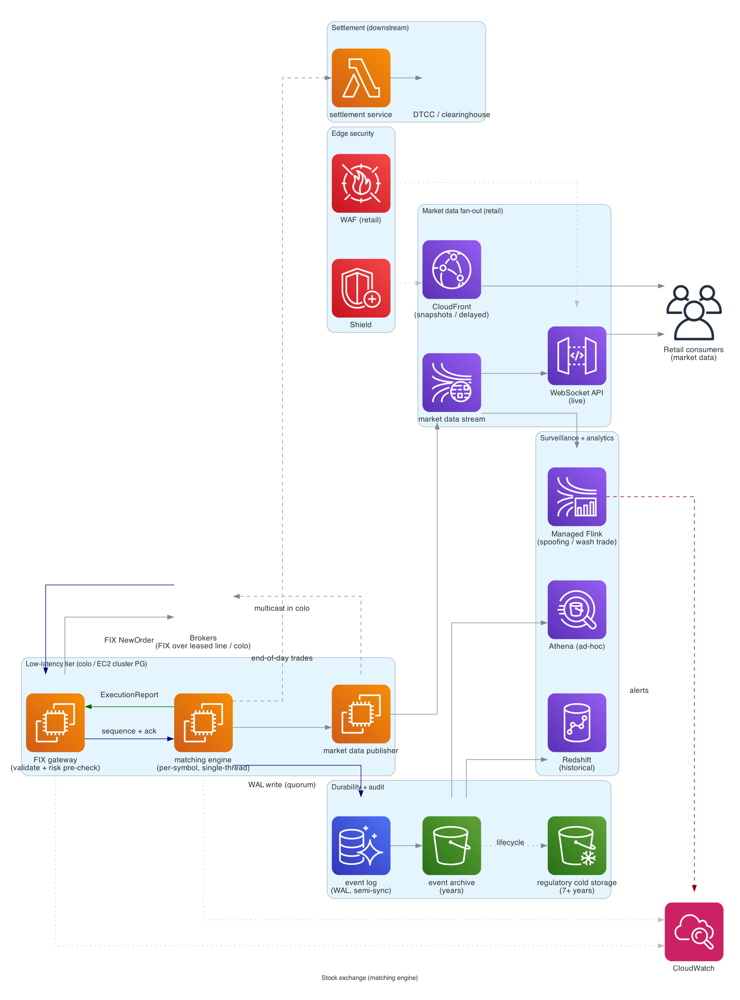
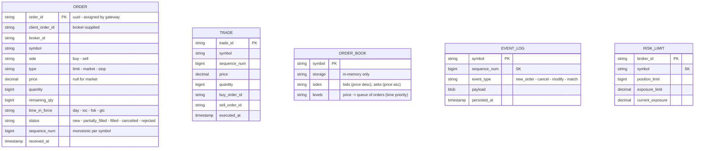

# Stock exchange (matching engine)

> **One-line summary.** Match buy and sell orders for securities with microsecond latency, strict ordering, perfect auditability, and regulatory compliance. The latency / consistency / durability bar is the highest in this repo.

## TL;DR

- The core is a **matching engine** — for each symbol, two priority-ordered order books (bids descending, asks ascending). New order tries to match against the opposite book; remainder rests in its own book.
- **Single-threaded per symbol** (or per matching shard) for deterministic ordering. Microsecond latency means in-memory only; no DB on the hot path.
- **Persistence via write-ahead log** to a redundant store; replicas re-derive state by replaying the log.
- **Market data feeds** broadcast best bid / ask + trade ticks via multicast (in colocation) or WebSocket (retail).
- AWS is **not the natural home for the matching engine** — production exchanges use bare-metal in colocated data centers for nanosecond-scale latency. AWS shines for the surrounding systems (order management, risk, market data fan-out, surveillance, settlement).
- The hardest parts: **deterministic ordering** (every replica must agree on order arrival sequence), **risk checks** (pre-trade limits, post-trade exposure), **regulatory** (MiFID II, Reg NMS), **circuit breakers**, and **disaster recovery without data loss**.

## Functional Requirements

- Submit limit orders (buy/sell at specific price).
- Submit market orders (buy/sell at best available).
- Cancel / modify orders.
- Match orders by price-time priority.
- Publish trade ticks (executed trades).
- Publish market data (best bid / ask, depth of book).
- Surveillance: detect spoofing, layering, wash trades.
- Settlement (T+2 / T+1 / T+0 depending on regime).
- (Out of scope for v1): options / derivatives / complex order types.

## Non-Functional Requirements

- **Latency**: order ack p99 < 100 microseconds (μs); end-to-end (order → matched → ack) < 1 ms.
- **Throughput**: 1M+ orders/sec per symbol at peak.
- **Determinism**: every replica processes orders in identical sequence.
- **Durability**: no order loss; every event persisted before ack.
- **Auditability**: every event preserved with timestamps for years.
- **Availability**: 99.999% during market hours.

## Capacity Estimates

- **Orders / day**: 10B across all symbols at a large exchange.
- **Peak rate**: 1M orders/sec for hot symbols (NVDA on FOMC day).
- **Market data**: each price change → broadcast; ~10× the order rate in messages out.
- **Storage**: 100 TB / year of order + trade logs; multi-year retention required by regulators.

## High-Level Architecture



**Order entry**: brokers send orders via **FIX protocol** (or proprietary binary) over leased lines / colo cross-connects → **gateway** (validates, applies risk checks, sequences) → **matching engine** (per-symbol, in-memory order book) → publishes execution reports back to brokers and trade ticks to the market data system.

**Persistence**: every event written to a redundant **write-ahead log** (multi-AZ on AWS, or local quorum disk in colo) before ack.

**Market data fan-out**: trade ticks → multicast in colo / WebSocket via API Gateway for retail → consumers.

**Surveillance / risk**: shadow tap on the order + trade stream → real-time pattern detection (spoofing, etc.) and post-trade risk aggregation.

On AWS, the matching-engine tier runs on **EC2 with placement groups** (cluster placement for nanosecond inter-instance latency); persistence via **Aurora** or self-managed Postgres + S3; market data fan-out via **CloudFront / API Gateway**.

## Data Model



- **Order book**: per symbol, in memory on the matching engine.
- **Event log**: every operation persisted in strict order before ack.
- **Trades + orders**: derived from the event log for downstream consumers.

## API Design

### FIX protocol (broker-facing)

FIX is the industry-standard wire protocol. Simplified messages:

```
NewOrderSingle:
  ClOrdID=abc123 Symbol=NVDA Side=BUY OrderQty=100 Price=500.00 OrdType=LIMIT TimeInForce=DAY

ExecutionReport:
  ClOrdID=abc123 OrderID=server_id ExecType=NEW OrdStatus=NEW
ExecutionReport:
  ClOrdID=abc123 ExecType=TRADE OrdStatus=PARTIALLY_FILLED LastQty=50 LastPx=499.95 LeavesQty=50

OrderCancelRequest:
  ClOrdID=abc123_cancel OrigClOrdID=abc123

OrderCancelReplaceRequest:
  ...
```

### Market data feeds

- **Best Bid / Offer (BBO)**: top of book per symbol.
- **Level 2 / depth of book**: all open orders at all prices.
- **Trade ticks**: every execution.

Multicast in colo; **CloudFront / API Gateway WebSocket** for retail.

## Deep Dives

### 1. Matching engine

For each symbol, two sorted data structures:

- **Bids** (buy orders) — descending price; within same price, ascending time.
- **Asks** (sell orders) — ascending price; within same price, ascending time.

Matching algorithm (limit order arrival):

```
on new_limit_buy(price, qty):
    while qty > 0 and asks.top.price <= price:
        match qty against asks.top
        emit trade(buy_id, ask_id, match_qty, match_price)
        if asks.top.qty == 0: pop asks.top
    if qty > 0:
        insert remaining qty into bids
```

Price-time priority: at each price level, oldest order matches first.

**Single-threaded per symbol** (or per shard of symbols) to maintain determinism. Throughput: ~1M ops/sec per thread; horizontal scaling = partition symbols across cores / machines.

**Memory layout matters**: cache-line-aligned data structures; minimize pointer chasing; avoid GC pauses (Java with ZGC or no-GC languages).

### 2. Sequencing

Every event must have a strictly-monotonic `sequence_num` per symbol. The gateway / matching engine assigns sequence at the moment of acceptance.

Why critical:

- Replicas must process events in the same order to derive the same state.
- Surveillance / audit needs total order.

Implementation: matching engine is the source of sequence; gateway batches incoming orders and submits to the engine in FIFO order; engine assigns `seq = ++counter` per symbol.

For multi-machine fault tolerance: leader-follower with hot standby (Raft-like consensus or shared journal device).

### 3. Persistence and replay

Every event persisted before ack. Two patterns:

- **Synchronous write to durable store** (Aurora, journal device): adds latency. Mitigated by:
  - Group commit (batch many events into one write).
  - Replicate to N nodes; ack on quorum.
- **In-memory + asynchronous persistence**: lower latency, accepts brief loss on crash.

Production exchanges use **journal devices** (NVMe, NVRAM) for microsecond-class durable writes.

On AWS: Aurora Multi-AZ DB cluster with semi-sync replication; or EBS io2 Block Express on cluster placement group.

**Replay**: on cold start / crash recovery, replicas read the event log from the last snapshot to current; reconstruct the order book.

### 4. Risk checks (pre-trade)

Before matching, validate:

- Broker has sufficient buying power.
- Order doesn't exceed per-broker position limit.
- Symbol isn't halted / restricted.
- Price isn't outside the limit-up / limit-down band.
- Order doesn't trigger a circuit breaker (10% / 20% / 30% drops).

These checks must complete in microseconds → in-memory lookup tables, updated continuously from the slow path.

Failed checks → reject the order; broker gets `ExecutionReport: REJECTED` with reason.

### 5. Market data fan-out

Every match → publish trade tick. Every order add/cancel → potentially update BBO → publish BBO update.

Fan-out scales with subscriber count. In colo: multicast (1-to-many on network layer, free). On retail (AWS):

- WebSocket connections (API Gateway / custom EKS) for live data.
- CloudFront cache for snapshot views (delayed by N minutes).
- Kinesis / MSK for downstream processors.

For real-time retail at scale, **dedicated WebSocket fleet on EC2/EKS** (lower per-connection cost than API Gateway).

### 6. Surveillance

Real-time + post-hoc pattern detection:

- **Spoofing**: placing large orders with no intent to execute, then cancelling.
- **Layering**: stacking orders to manipulate perceived demand.
- **Wash trading**: buying and selling to oneself.
- **Front-running**: trading ahead of a known customer order.

Implementation: **Managed Apache Flink** consumes the order + trade stream; pattern-detection rules + ML models flag suspicious activity → alert + audit trail.

### 7. Circuit breakers

Halt trading on extreme moves to prevent crashes:

- **Stock-level**: halt symbol for N minutes if price moves > X% in Y seconds.
- **Market-wide**: halt the whole market on extreme index moves (S&P drops 7% / 13% / 20%).
- **LULD bands**: each stock has dynamic upper/lower limits; orders outside bounce.

Implementation: matching engine checks per-symbol bands before each match; if breached, halt the symbol and notify regulators.

### 8. Settlement

T+2 / T+1 settlement: trades on day T settle on day T+1 or T+2 (cash + securities exchange).

- Out-of-band batch process (after market close).
- Net positions per broker per symbol.
- Communicate to clearinghouse (DTCC, etc.).

Not the matching engine's job — separate clearing system.

## AWS Services Used

For the surrounding systems (matching engine itself is often colo bare-metal):

- **EC2 with cluster placement group** — for low-latency tier (gateway, matching engine, market data).
- **Aurora PostgreSQL / Multi-AZ DB cluster** — durable event log alternative.
- **EBS io2 Block Express** — high-IOPS, low-latency durable storage.
- **API Gateway WebSocket / EKS** — retail market data fan-out.
- **Kinesis Data Streams** — downstream feeds (surveillance, analytics).
- **Managed Apache Flink** — real-time surveillance.
- **S3** — multi-year event log archive.
- **Redshift / Athena** — historical analytics.
- **CloudWatch** — operational metrics.
- **GuardDuty + Security Hub** — security monitoring (regulatory expectation).
- **AWS Backup** — vault-locked retention for compliance (7 years typical).

## Cost Notes

- Latency requirements push toward dedicated capacity, reserved instances.
- Event log retention at TB/PB scale → S3 + Glacier for older data.
- Network egress for market data fan-out can be massive.

Levers:

- **Place colo bare-metal for hot path**; AWS for ancillary.
- **Multicast in colo** vs unicast on cloud — massive bandwidth saving in colo.
- **Tiered storage** for archives.

## Failure Modes & DR

- **Matching engine crash**: hot standby in another AZ promoted; clients reconnect; resume from event log.
- **Network partition** between gateway and engine: order accepted/rejected at gateway based on quorum; cannot ack without majority confirmation.
- **Data loss is unacceptable**: replicate every event to N nodes before ack.
- **Region failure**: cross-Region warm standby; failover within RTO (typically <30 sec for exchanges).
- **Cyber attack / DDoS**: WAF + Shield + private FIX connectivity (no public ingress for orders).

## Trade-offs & Alternatives

- **Single-threaded matching vs lock-free concurrent**: single-threaded is simpler, deterministic. Concurrent is faster but order-correctness is hard.
- **In-memory only vs persistent**: in-memory is faster; persistent is required for durability. Most exchanges use in-memory + write-ahead log.
- **AWS for matching vs colo**: AWS adds ms of latency vs colo nanoseconds. For HFT-class exchanges, colo wins. For smaller exchanges / crypto exchanges, AWS is acceptable.
- **FIX vs proprietary protocol**: FIX is the industry standard; proprietary (binary, slimmer) is used for hot connections. Most exchanges support both.
- **Synchronous risk checks vs post-trade**: synchronous is safer (block bad orders); post-trade is faster but lets bad orders through briefly.

## Further Reading

- ["Designing a stock exchange / matching engine", System Design Primer-style](https://github.com/donnemartin/system-design-primer).
- [Nasdaq matching-engine technology](https://www.nasdaq.com/solutions/fintech/marketplace-technology/about-matching-engines).
- [LMAX Disruptor pattern (high-perf single-thread)](https://lmax-exchange.github.io/disruptor/).
- [FIX protocol](https://www.fixtrading.org/).
- Related: [payment-system](payment-system.md) (settlement parallels), [real-time-leaderboard](real-time-leaderboard.md) (ZSET-style data structures), [idempotency pattern](../02-patterns/idempotency.md).
