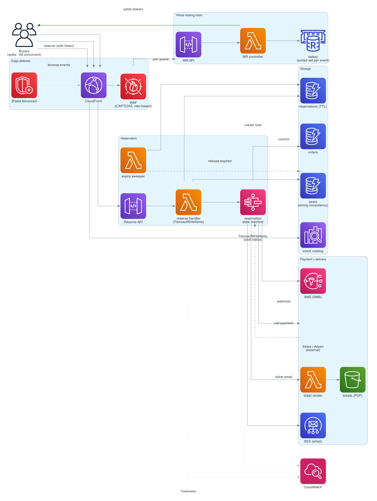

# Ticketmaster (event ticket booking)

> **One-line summary.** Sell tickets to events with a fixed seat inventory under massive concurrent demand. Hard real consistency requirement (don't oversell), brutal traffic spikes (Taylor Swift on-sale), seat-reservation state machines, anti-bot defenses, and queue-based fairness.

## TL;DR
- The defining problem is **don't oversell** — strong consistency on seat inventory under thousands of concurrent buyers, while keeping per-request latency reasonable.
- Two-phase reservation: **soft hold** (5-15 min, user is in checkout) → **payment** → **confirmed**. Soft holds prevent two users from buying the same seat simultaneously.
- **Virtual waiting room** for high-demand on-sales — a separate queue gates entry to checkout; users see "you are #4,521 in line."
- **Anti-bot** is core, not optional — CAPTCHAs, device fingerprinting, rate limiting, behavioral analysis.
- AWS-native: **DynamoDB** for seat state + conditional writes; **ElastiCache** for the virtual waiting room; **EventBridge / Step Functions** for the reservation state machine; **CloudFront + WAF + Shield** for the spike.
- The hardest parts: **inventory consistency under contention** (10K users all clicking "buy seat A12" at once), **virtual queue fairness**, **payment integration** (Stripe, etc.), and **graceful degradation** on the worst spikes.

## Functional Requirements
- Browse events (search by city, date, artist).
- View an event's seat map (which seats available).
- Reserve seats (5-15 min hold).
- Pay → confirm purchase.
- Receive ticket (PDF / mobile barcode).
- Refund / cancel.
- Resale marketplace (out of scope for v1).

## Non-Functional Requirements
- **Consistency**: every seat sold exactly once. No oversell. Ever.
- **Latency**: seat-map load p99 < 500 ms; reservation submit p99 < 1 sec; checkout flow can be slower (3-5 sec acceptable).
- **Throughput**: 1M users hitting the on-sale at once for a hot event; sustained 10K transactions/sec.
- **Availability**: 99.99% — but the on-sale window is the only thing that matters; outages during it are catastrophic.

## Capacity Estimates
- **Hot event on-sale**: 1M concurrent users; 100K reservation attempts in the first minute; 50K confirmed sales.
- **Steady state**: 10K transactions/sec across all events.
- **Event catalog**: 100K active events × ~10K seats avg = ~1B seat rows.
- **Storage**: ~10 TB hot + history.

## High-Level Architecture



The defining components:

1. **CloudFront + WAF + Shield Advanced** at the edge — bot mitigation, rate limiting, DDoS protection.
2. **Virtual waiting room** (separate service backed by **ElastiCache**) — gates entry to the actual reservation flow during high-demand on-sales.
3. **Seat inventory service** — **DynamoDB** with strongly-consistent reads + conditional writes for the reserve/buy operation.
4. **Reservation state machine** in **Step Functions** — soft hold → payment → confirm, with timeouts and compensating actions.
5. **Payment** integration (Stripe / Adyen / Braintree).
6. **Ticket generation** post-purchase (PDF, mobile barcode).
7. **Catalog** in **OpenSearch** for event search; **CloudFront** caches event metadata.

## Data Model

```mermaid
erDiagram
  EVENT {
    string event_id PK
    string name
    string venue_id
    timestamp start_time
    string status "draft - on_sale - sold_out - past"
    list   ticket_types
  }
  SEAT {
    string event_id PK
    string seat_id SK "section-row-num"
    string status "available - on_hold - sold"
    string hold_id "uuid - null if available"
    timestamp hold_expires_at
    string buyer_id "after sold"
    decimal price
  }
  RESERVATION {
    string hold_id PK
    string user_id
    string event_id
    list   seat_ids
    string status "held - paying - confirmed - failed - expired"
    timestamp held_at
    timestamp expires_at
  }
  WAITING_ROOM_ENTRY {
    string event_id PK
    string user_id SK
    int    position
    timestamp entered_at
  }
  ORDER {
    string order_id PK
    string user_id
    string event_id
    list   seat_ids
    decimal total
    string payment_status
    timestamp confirmed_at
  }
```

- **`seats`** — DynamoDB. PK = `event_id`, SK = `seat_id`. Hot table during on-sales.
- **`reservations`** — short-lived holds; TTL after expiry.
- **`waiting_room`** — ElastiCache sorted set per event; users ranked by entry time.
- **`orders`** — final purchase records.

## API Design

```
GET /v1/events/:id/seats
  → 200 OK { "seats": [{ "id": "A12", "status": "available", "price": 250 }, ...] }

POST /v1/events/:id/reserve
  body: { "seat_ids": ["A12", "A13"] }
  → 200 OK { "hold_id": "h_abc", "expires_at": "..." }
  → 409 Conflict (seats already taken)
  → 429 Too Many Requests (virtual queue: try again)

POST /v1/reservations/:hold_id/pay
  body: { "payment_method": "..." }
  → 200 OK { "order_id": "o_abc", "ticket_urls": [...] }
  → 410 Gone (reservation expired)

DELETE /v1/reservations/:hold_id
  → 200 OK (release the seats)

GET /v1/waiting-room/:event_id
  → 200 OK { "position": 4521, "estimated_wait_min": 12 }
```

## Deep Dives

### 1. Inventory consistency (the defining problem)
Two users click "buy seat A12" at the same millisecond. Only one wins.

**Conditional write** to DynamoDB:
```python
ddb.update_item(
    Key={'event_id': event_id, 'seat_id': 'A12'},
    UpdateExpression='SET #s = :on_hold, hold_id = :hold, hold_expires_at = :exp',
    ConditionExpression='#s = :available',  # only if currently available
    ExpressionAttributeNames={'#s': 'status'},
    ExpressionAttributeValues={
        ':on_hold': 'on_hold', ':available': 'available',
        ':hold': hold_id, ':exp': now + 600,
    },
)
# On ConditionalCheckFailedException -> seat already taken; return 409
```

DynamoDB serializes per-item operations; this is atomic and consistent.

For **multiple seats in one request** (`["A12", "A13"]`), use `TransactWriteItems` — all-or-nothing. If any seat is already taken, the whole transaction fails; client picks again.

### 2. Soft holds and expiry
A user clicks "reserve" → seat is on_hold for 10 minutes while they enter payment. If they don't complete: release.

Two release mechanisms:
- **TTL on the `reservations` table** (DynamoDB TTL) — passive cleanup; up to 48 hours late.
- **Active sweeper** — Lambda runs every minute, finds expired holds, resets seats to `available` via conditional write.

The active sweeper is essential for popular events — TTL is too lazy.

Step Functions wait state could also drive expiry: state machine sleeps 10 min, then issues the release if not confirmed.

### 3. Virtual waiting room
For a Taylor Swift on-sale, letting 1M users hit the reservation API simultaneously would crater the system.

**Virtual waiting room** intercepts users before the API:
1. User loads event page; instead of seat map, gets "you're in line."
2. ElastiCache **sorted set** per event: `ZADD waiting:event_42 <timestamp> <user_id>`.
3. Position = `ZRANK user_id`.
4. **Admission**: a controller pops the front N users every second (`ZPOPMIN waiting:event_42 N`). N = the rate the reservation system can handle (e.g., 200/sec).
5. Admitted users get a short-lived **admission token** (JWT, 5-min TTL); they use it as auth to call the reservation API.
6. The reservation API rejects calls without a valid token.

This bounds the reservation API's traffic to what it can handle; users see fair queueing.

### 4. Anti-bot
Bots are the largest attack surface. Layers:
- **WAF rate-based rules** at CloudFront.
- **CAPTCHA challenges** before joining the waiting room (Cloudflare Turnstile, hCAPTCHA, native CloudFront-fronted challenge).
- **Device fingerprinting** (browser features, behavior patterns) — flag suspicious clients.
- **Account age + verification** — block brand-new accounts from on-sales.
- **Per-account purchase limits** — max 4 tickets / event.
- **ML-based scoring** — Lambda evaluates each request; score above threshold → admit; below → CAPTCHA or block.

This is constantly evolving — bot operators evolve too.

### 5. Payment flow
Reservation → payment is the riskiest moment. Step Functions state machine:
```
hold_created (10 min TTL)
  -> user_initiates_payment
  -> call_payment_gateway (Stripe / Adyen)
     -> success -> confirm_order -> generate_tickets -> done
     -> failure -> release_seats -> notify_user
     -> timeout (15 sec) -> release_seats -> notify_user
```

Payment is async — the gateway may webhook back with confirmation. Step Functions waits on the webhook. Compensating action (release_seats) if no webhook within timeout.

Idempotency on payment: each payment attempt has a key; retries don't double-charge.

### 6. Seat map UI
Showing 10K seats with real-time status is heavy. Solutions:
- **Periodic snapshot** of seat status to S3 (every 5 sec) for browse-mode.
- **WebSocket** for live updates during user interaction (status of seats they're considering).
- **Optimistic UI** — user clicks a seat; UI shows "reserving..." → server confirms or rejects.

### 7. Graceful degradation
For the worst on-sales (1M+ concurrent), some degradation is unavoidable:
- **Reduce seat-map resolution** — show "section X has Y seats available" instead of per-seat map.
- **Disable certain features** (re-selecting, browsing other events) during peak.
- **Static error page** at WAF that explains the wait — better than timeouts.

## AWS Services Used
- **CloudFront** — global edge.
- **WAF + Shield Advanced** — bot and DDoS protection.
- **API Gateway** — public endpoints.
- **Lambda** — handlers, sweeper.
- **DynamoDB** — seats, reservations, orders. Strong consistency mode for reservations.
- **ElastiCache for Valkey** — virtual waiting room sorted sets.
- **Step Functions** — reservation state machine.
- **SQS / EventBridge** — async event flow (payment webhook → confirmation).
- **OpenSearch** — event search catalog.
- **SES / SNS** — ticket delivery (email / SMS).
- **S3** — generated PDFs / barcodes.
- **CloudWatch** — operational metrics + alarms for the on-sale.

## Cost Notes
- **DynamoDB on-demand** during on-sales is the major cost — millions of conditional writes in minutes.
- **WAF + Shield Advanced** are flat monthly fees (Shield Advanced ~$3K/month) — worth it for the on-sale protection.
- **ElastiCache** waiting-room cluster needs headroom for the queue size (1M entries × ~200 bytes = 200 MB — small).

Levers:
- **Reserved capacity** isn't applicable to on-demand spike loads; use on-demand and accept the cost.
- **Most events are not Taylor Swift** — typical events are cheap; reserved capacity for the steady load + on-demand for spikes.

## Failure Modes & DR
- **DynamoDB throttle on hot event**: per-event-id partition can be a hotspot. Mitigation: pre-split the event into sub-event-ids (`event_42:section_A`, `event_42:section_B`) so different sections are different partitions.
- **Payment gateway down**: Step Functions retries; holds extended; users notified.
- **Region failure during on-sale**: catastrophic; multi-Region active-active for the hottest events (rare).
- **Bot manages to fake admission tokens**: server-side validation of token signature + per-token rate limit.
- **Cascading degradation under extreme load**: explicit degradation modes (described above) prevent total outage.

## Trade-offs & Alternatives
- **Strong consistency vs eventual**: strong is non-negotiable for inventory. Eventual is OK for ancillary data (reviews, recommendations).
- **DynamoDB vs relational**: DynamoDB conditional writes give consistency at scale without locking; relational (Postgres with `SELECT ... FOR UPDATE`) works for smaller scale but locks badly at high concurrency.
- **Virtual queue vs let the system burn**: virtual queue is the only humane answer at high demand.
- **Bots are an arms race**: combine CloudFront + WAF + CAPTCHA + behavioral; accept that some bots get through.

## Further Reading
- ["Designing Ticketmaster", System Design Primer-style writeups](https://github.com/donnemartin/system-design-primer).
- [Queue-It (virtual waiting room SaaS)](https://queue-it.com/) — productized version of this pattern.
- [DynamoDB transactions](https://docs.aws.amazon.com/amazondynamodb/latest/developerguide/transaction-apis.html).
- Related: [distributed-counter](distributed-counter.md), [rate-limiter](rate-limiter.md), [payment-system](payment-system.md), [idempotency pattern](../02-patterns/idempotency.md).
