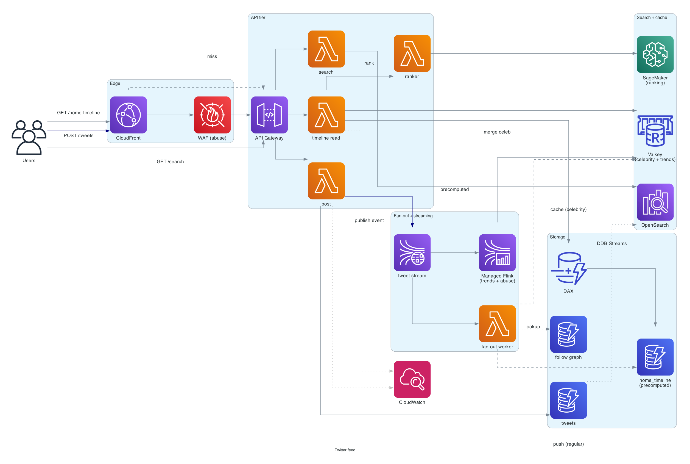
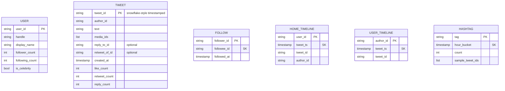

# Twitter feed (X timeline)

> **One-line summary.** Real-time text-first social feed. Like Instagram with smaller posts, much higher post rates, denser celebrity / hot-account problem, and a stronger emphasis on the "ranked feed" + search.

## TL;DR

- Same fan-out problem as [Instagram](instagram.md) at higher write rate. Tweets are tiny (a few KB); reads dominate writes ~1000:1.
- **Hybrid fan-out** (push for regular accounts, pull / merge for celebrities) is mandatory — a single celebrity tweet can fan out to 100M followers, which a naive push can't sustain.
- **DynamoDB** for users / tweets / follow graph; **Kinesis** for the event backbone; **OpenSearch** for search; **ElastiCache** for celebrity-post cache; **Redshift / Athena** for trends and analytics.
- **Search and trending** are first-class — much more so than on Instagram. Real-time hashtag aggregation, trending topics, advanced search.
- The hardest parts: **fan-out at burst** (a celebrity tweets during a live event → 10M+ followers all reading and engaging in seconds), **rate limiting** (API abuse, spam), and **timeline ranking** (relevance + recency + author affinity).

## Functional Requirements

- Post tweet (text + optional media + reply / quote / retweet).
- Follow / unfollow.
- View **home timeline** (followed accounts; ranked or chronological).
- View **user timeline** (specific user's tweets).
- Search tweets / users / hashtags.
- Like, retweet, reply.
- Direct messaging (out of scope — see [`whatsapp-chat`](whatsapp-chat.md)).
- (Out of scope for v1): video, spaces, monetization features.

## Non-Functional Requirements

- **Latency**: home timeline p99 < 500 ms; tweet post p99 < 200 ms; search p99 < 500 ms.
- **Availability**: 99.99% on reads, 99.9% on writes.
- **Scale**: 400M DAU, 500M tweets/day, 100B timeline reads/day.
- **Freshness**: tweet visible to followers within 2-5 seconds.
- **Search freshness**: tweet appears in search within 10 seconds.

## Capacity Estimates

- **Writes (tweets)**: 500M / day = ~5,800 / sec average, ~50K / sec peak (events, breaking news).
- **Reads (timeline)**: 100B / day = ~1.2M / sec average, ~10M / sec peak.
- **Storage**: 500M tweets × ~1 KB metadata + ~500 B text = ~750 GB/day raw. Plus media.
- **Bandwidth**: tens of GB/s globally; CDN absorbs most.

## High-Level Architecture



Tweet creation: API Gateway → Lambda (post handler) → DynamoDB (tweets) + publish to Kinesis (event backbone). Fan-out workers consume from Kinesis → for regular authors, push to follower timelines (DynamoDB). For celebrity authors, skip push (followers will merge at read).

Timeline read: API Gateway → Lambda (timeline handler) → DynamoDB precomputed timeline + merge celebrity tweets from ElastiCache → return.

Search: tweets stream from DynamoDB Streams → Lambda → OpenSearch. Trending: Kinesis Data Analytics (Managed Flink) computes top hashtags over rolling windows → Redis.

## Data Model



- **`tweets`** — DynamoDB, PK = tweet ID. Tweet IDs use a **Snowflake-like** scheme: 64 bits = timestamp + worker ID + sequence — globally unique, sortable by time, no central counter.
- **`home_timeline`** — precomputed (push), one row per (user, tweet_ts). TTL bounds size.
- **`user_timeline`** — by author. Used for "celebrity merge" path and for user-profile views.
- **`hashtag` (hourly counts)** — for trending; computed by streaming aggregator.

## API Design

```
POST /v1/tweets
  body: { "text": "...", "media_ids": [], "reply_to_id": "?", "retweet_of_id": "?" }
  → 201 Created { "tweet_id": "t_19xx..." }

GET /v1/users/:id/home-timeline
  ?cursor=<tweet_ts>&limit=50
  → 200 OK { "tweets": [...], "next_cursor": "..." }

GET /v1/users/:handle/timeline
  ?cursor=<tweet_ts>&limit=50
  → 200 OK { "tweets": [...], "next_cursor": "..." }

POST /v1/tweets/:id/like
  → 200 OK

GET /v1/search?q=...&type=tweets|users
  → 200 OK { "results": [...] }

GET /v1/trends?location=worldwide
  → 200 OK { "trends": [{"tag": "#worldcup", "count": 1234567}, ...] }
```

## Deep Dives

### 1. Tweet ID generation (Snowflake)

Need globally unique, monotonically increasing, sortable IDs at write rates up to 50K/sec.

**Snowflake** scheme:

- 41 bits: milliseconds since custom epoch.
- 10 bits: worker ID (combination of datacenter + machine).
- 12 bits: per-millisecond sequence.

Each worker can generate ~4K IDs per ms (4M/sec) — far exceeds need. IDs sort by time without a central counter.

AWS implementation: each Lambda instance has a `worker_id` (from instance metadata + Lambda execution environment ID hash). Local in-process sequence. No DB contention.

### 2. Fan-out: deeper than Instagram

Twitter has the worst fan-out problem of any social network — celebrities have 100M+ followers, and follower lists update in seconds.

**Hybrid approach**:

- **Regular accounts** (< 1K followers): push to followers' home timelines synchronously.
- **Medium accounts** (1K - 100K): push asynchronously via Kinesis worker (~5 sec lag).
- **Celebrity accounts** (> 100K): pull at read time. Their tweets cached aggressively in ElastiCache; followers merge celebrity-recent into their precomputed timeline on read.

Why a tiered threshold (not binary)? A medium account's push is cheap but not instant; using async is fine. Celebrities can't be pushed at all without breaking the cost / latency budget.

### 3. Ranking

Chronological is the baseline; ranked is the modern default. A ranked timeline scores each candidate tweet by:

- **Recency** (decay over time).
- **Author affinity** (do you usually engage with this author?).
- **Engagement velocity** (how fast is this tweet accumulating likes / retweets right now?).
- **Content similarity** (matches user interests).
- **Negative signals** (muted accounts, blocked words).

Implementation:

- **Candidate generation**: pull last N tweets from each followed account + recently engaged tweets.
- **Scoring**: lightweight model in Lambda or a SageMaker real-time endpoint.
- **Re-ranking**: bias for diversity (don't show 5 tweets from one author in a row).

Score offline → cache the per-(user, tweet) score → re-rank on read with recency / live signals.

### 4. Search

- Sync from DynamoDB Streams → Lambda → OpenSearch.
- Index: `(tweet_id, text, hashtags, mentions, location, lang, author_id, ts)`.
- Search latency p99 < 500 ms via OpenSearch sharded by time (recent shards smaller, queried first).
- Old tweets in cold storage; user-facing search prioritizes recent.

### 5. Trends

Trending hashtags / topics computed over rolling windows (5 min, 1 hour, 24 hours).

- **Streaming pipeline**: tweets → Kinesis Data Streams → Managed Apache Flink → per-window counts in DynamoDB / Redis.
- **Normalization**: trends are *velocity*, not *absolute count* (so `#weather` doesn't trend just because everyone tweets about weather). Compute `(this hour's count) / (typical hour's count)`.
- **Localization**: per-country / per-city trends require geo-tagging on tweets and aggregation per geo.
- **Spam suppression**: bot detection filters out coordinated inauthentic behavior (cluster of accounts retweeting the same content).

### 6. Hot tweets and viral moments

A breaking-news tweet can be read by 50M users in minutes. Mitigations:

- **CloudFront** caches the tweet payload + author info (~5-second TTL keeps freshness, absorbs most reads).
- **ElastiCache** caches the rendered tweet detail.
- **DAX** in front of DynamoDB for backstop.
- **Read replicas at the search layer** (OpenSearch with many readers) for the trends-related search burst.

### 7. Anti-abuse: rate limiting and spam

Twitter is a high-abuse environment. Layers:

- **WAF rate-based rules** at CloudFront for volumetric / IP-based.
- **API Gateway throttling** for per-user / per-app rates.
- **Application-level limits**: tweets per hour, follows per day, etc.
- **ML-based abuse classifier** invoked on tweet write — flags spam / toxicity for review or auto-rejection.
- **Account graph signals**: bot detection looks at follower graph patterns.

See [rate-limiter](rate-limiter.md) for the limiter design.

## AWS Services Used

- **CloudFront** — global edge, caches static + popular tweet content.
- **API Gateway** — public APIs.
- **Lambda** — handlers + fan-out workers + scorers.
- **DynamoDB** — tweets, timelines, follow graph, hashtag aggregates. Global Tables for cross-Region.
- **Kinesis Data Streams** — event backbone for tweet stream + fan-out + trends.
- **Managed Service for Apache Flink** — stream processing for trends + abuse detection.
- **OpenSearch** — tweet + user search.
- **ElastiCache for Valkey** — hot data, celebrity post cache, trending cache.
- **DAX** — backstop for DynamoDB hot tables.
- **S3** — media originals + analytics archive.
- **Redshift** — analytics warehouse.
- **SageMaker** — ranking + abuse models.
- **Cognito** — user authentication.
- **WAF + Shield** — abuse + DDoS protection.

## Cost Notes

At 400M DAU, the cost is dominated by:

- **DynamoDB** for timelines (precomputed + reads).
- **Kinesis** for the fan-out backbone.
- **CloudFront** egress.
- **OpenSearch** for search at scale.

Levers:

- **CloudFront caching** of celebrity tweet content (huge hit ratio).
- **Timeline TTL** (keep last 800 tweets per user, not unbounded).
- **OpenSearch hot/warm/cold tiering** (UltraWarm for old tweets).
- **Reserved capacity / Savings Plans** for steady-load workloads.

## Failure Modes & DR

- **DynamoDB throttle on hot author**: ElastiCache + DAX absorb; backoff at Lambda.
- **Fan-out lag**: tweets take >5s to appear for followers. Acceptable; monitor.
- **OpenSearch cluster down**: search degrades to "no results;" tweets still post / read.
- **Region failure**: DynamoDB Global Tables; Route 53 ARC for failover.
- **Cascading failure from viral event**: degrade ranking → chronological; degrade search → recent only; degrade media → text-only. Define explicit degradation modes.

## Trade-offs & Alternatives

- **Push vs pull**: hybrid is the only answer at Twitter scale.
- **Snowflake IDs vs DB-generated**: Snowflake gives time-ordered, distributed, no-contention IDs.
- **OpenSearch vs other search**: OpenSearch is AWS-native, scales horizontally. Alternative: Algolia / managed search-as-a-service for higher-level UX.
- **Streaming vs batch trends**: streaming is critical for "what's trending now" — batch lags by minutes.
- **Synchronous vs asynchronous fan-out for medium users**: async with bounded lag is the pragmatic compromise.

## Further Reading

- ["Designing Twitter", System Design Primer](https://github.com/donnemartin/system-design-primer).
- ["Real-time Delivery Architecture at Twitter", Twitter engineering blog (historical)](https://blog.twitter.com/engineering).
- [Snowflake ID generation](https://blog.twitter.com/engineering/en_us/a/2010/announcing-snowflake).
- Related: [instagram](instagram.md) (same shape with photos), [distributed-counter](distributed-counter.md) (like/retweet counts), [search-autocomplete](search-autocomplete.md) (search prefix completion).
