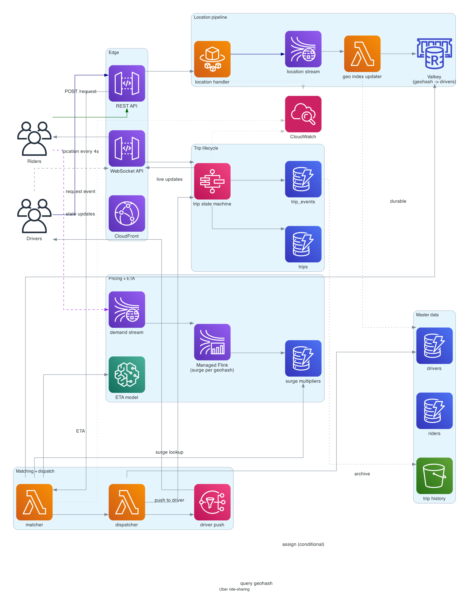
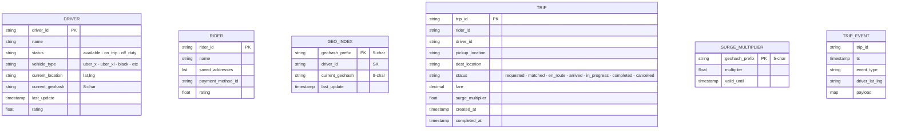

# Uber (ride-sharing / dispatch)

> **One-line summary.** Match riders to nearby drivers in real time. The defining problems are geospatial indexing (drivers' moving locations), low-latency matching, surge pricing, trip lifecycle state, and payment.

## TL;DR

- Drivers' locations stream in every ~4 seconds → indexed by **geohash** in a hot store (**ElastiCache / DynamoDB**). Rider requests a ride → server queries nearby drivers by geohash → ranks them → dispatches.
- Trip is a multi-stage **state machine** in **Step Functions** (or app-orchestrated equivalent): requested → matched → driver-en-route → arrived → in-progress → completed → paid.
- **Surge pricing** computed per-geohash per-time-window based on demand:supply ratio; sticky for a short window so users see consistent prices.
- AWS-native: **DynamoDB** for trip state + driver/rider data; **ElastiCache for Valkey** + DynamoDB GSI for geospatial indexing; **Kinesis** for location streams; **Step Functions** for the trip state machine; **SageMaker** for ETA / surge models.
- The hardest parts: **geo-index update rate** (millions of drivers, every 4 seconds = millions of writes/sec), **matching latency** (rider should see a driver assigned in under 5 seconds), **surge transparency / fairness**, and **trip-state consistency across rider + driver + dispatch**.

## Functional Requirements

- Rider requests a ride from A to B.
- System finds nearby available drivers; matches one.
- Driver accepts (or skips); next driver tried if skipped.
- Driver navigates to rider; both see real-time location.
- Driver picks up rider; navigates to destination.
- Trip completes; payment charged; receipt + driver pay computed.
- Surge pricing during high demand.
- Driver and rider rate each other.
- (Out of scope for v1): pool rides (multi-rider), food delivery, courier.

## Non-Functional Requirements

- **Latency**: match within 5 seconds; ETA update every few seconds; location push p99 < 200 ms.
- **Throughput**: 10M concurrent drivers worldwide; ~2M concurrent trips at peak.
- **Availability**: 99.99%; outages = drivers can't earn, riders stranded.
- **Geo accuracy**: drivers' location accurate to ~10 meters; ETA within 30 sec.

## Capacity Estimates

- **Location updates**: 10M drivers × 1 update / 4 sec = 2.5M writes/sec sustained.
- **Match queries**: 100K ride requests/min average, ~1M/min peak (rush hour).
- **Trip state writes**: trip has ~20 state events × 50M trips/day = 1B writes/day = ~12K/sec.
- **Storage**: hot driver index ~10M × ~100 bytes = 1 GB (fits in memory). Trip history multi-TB; tiered.

## High-Level Architecture



**Location pipeline**: drivers' apps stream location updates over WebSocket / HTTP/2 → API Gateway → Lambda / Fargate → **Kinesis Data Streams** → **Geo Index Updater** writes to **ElastiCache Valkey** (geohash → list of `(driver_id, lat, lng, last_update)`) and updates DynamoDB for durability.

**Matching**: rider requests ride → API → Lambda → query Valkey for drivers within N km of pickup → rank by ETA / rating / vehicle type → dispatch to driver via push notification. Driver accepts → trip state machine in **Step Functions** transitions; ongoing location updates flow to both rider and driver.

**Pricing / surge**: a real-time **Managed Apache Flink** job computes per-geohash demand:supply ratio; **DynamoDB** holds the current surge multiplier per geohash.

**Payment**: trip completion → payment service ([payment-system](payment-system.md)) → driver payout (separate flow).

## Data Model



- **`drivers`** and **`riders`** in DynamoDB.
- **`geo_index`** in Valkey (real-time matching) + DynamoDB GSI (durable backstop).
- **`trips`** in DynamoDB; per-trip log in Kinesis.
- **`surge_multiplier`** in DynamoDB / Valkey; updated every ~30 sec.

## API Design

```
POST /v1/driver/location
  body: { "lat": 37.77, "lng": -122.42, "heading": 90 }
  → 200 OK

POST /v1/rider/request
  body: { "pickup": {"lat":..., "lng":...}, "dest": {...}, "vehicle_type": "uber_x" }
  → 200 OK { "trip_id": "...", "status": "matching", "estimate": { "fare": 12.50, "eta_min": 4 } }

GET /v1/trips/:id
  → 200 OK { "status": "en_route", "driver": {...}, "eta_min": 3 }

WebSocket events to rider:
  { "type": "driver_assigned", "driver": {...} }
  { "type": "driver_location", "lat": ..., "lng": ... }
  { "type": "driver_arrived" }
  { "type": "trip_completed", "fare": ... }
```

## Deep Dives

### 1. Geospatial indexing with geohashes

A **geohash** is a base-32 string that encodes a lat/lng. Each char halves the precision:

- 5-char ≈ 5 km × 5 km cell.
- 6-char ≈ 1 km × 1 km.
- 7-char ≈ 150 m × 150 m.
- 8-char ≈ 19 m × 19 m.

For matching, we typically index by **5- or 6-char prefix** (1-5 km cells). To find drivers near a rider:

1. Compute the rider's 5-char geohash.
2. Look up the cell + 8 neighbors (3x3 grid).
3. Get all drivers in those cells.
4. Filter to within actual distance (haversine).

Valkey storage: `geohash:abcd1` → set of `driver_id`s.

Update path: every driver location update removes the driver from the old geohash set and adds to the new. Most updates stay in the same cell (driver hasn't moved much in 4 sec) — cheap.

**Alternative**: **Redis GEO commands** (`GEOADD`, `GEOSEARCH`) provide native geo-indexing. Simpler API; same performance class.

### 2. Matching algorithm

After narrowing to ~50 candidate drivers in the geohash:

1. Filter by `status = available` + matching `vehicle_type`.
2. Compute ETA for each (driver → pickup) via routing service.
3. Rank by `(ETA, rating, time_since_last_trip)`.
4. Dispatch to top candidate via push notification.
5. Wait for accept (15 sec timeout) → if no accept, try next.

**Concurrent matching**: if two riders both want the same nearby driver, the first to dispatch wins. DynamoDB conditional update on `drivers.status = available` → `assigned`. Loser's matcher picks the next driver.

### 3. Trip state machine

Trip lifecycle in **Step Functions**:

```
requested
  -> matching (try dispatch loop)
     -> matched
  -> driver_en_route (driver location updates flow)
     -> driver_arrived
  -> in_progress
  -> completed
     -> charge payment
     -> compute driver payout
     -> done

side branches:
  cancelled at any state -> refund (if paid)
  driver_no_show -> rematch
```

The state machine handles retries, timeouts, compensations.

For very high trip volume, Standard Step Functions exactly-once semantics matter (no double-charging on retry).

### 4. Surge pricing

Per-geohash demand:supply ratio:

- Demand = rider requests in last ~5 min in geohash.
- Supply = available drivers in geohash.
- Ratio > threshold → apply surge multiplier (1.2x, 1.5x, 2.0x, 3.0x).

Computed by Flink job over rider-request + driver-location streams; published per 5-char geohash to a Valkey hash. Rider request reads multiplier, displays sticky for 5 min (so the user isn't shocked by changes during checkout).

Transparency: explicitly show "1.5x surge" in the UI; never hide the multiplier.

### 5. ETA service

Given (start_lat_lng, dest_lat_lng, current_traffic), return estimated time.

- Routing engine: usually a third-party (Mapbox, HERE, Google Maps) or self-hosted (OSRM, Valhalla).
- Cache common routes in ElastiCache.
- ML-trained adjustments based on observed actual vs predicted times in this geohash at this hour.

### 6. Driver app real-time updates

Driver gets:

- New ride dispatch (push + WS).
- Rider's pickup location.
- Real-time navigation prompts.

Rider gets:

- Driver's location every few seconds (WS).
- ETA updates.

Both via WebSocket; same connection management as [whatsapp-chat](whatsapp-chat.md) (connection table in DynamoDB, per-user routing).

### 7. Handling many vehicle types and tiers

Uber has UberX, UberXL, Pool, Comfort, Black, etc. Each has different matching pools, surge multipliers, pricing.

Approach: tag drivers with `vehicle_type`; matching filter on `vehicle_type`. Per-vehicle-type geohash indices reduce the per-query candidate set.

### 8. Geographic isolation

For per-Region operation (Uber operates in 70+ countries, each with regulations):

- Per-Region deployment of dispatch, matching, surge.
- Cross-Region only for global services (account, payment).
- Compliance: data residency (driver location stays in Region).

## AWS Services Used

- **API Gateway (HTTP + WebSocket)** — REST + real-time push.
- **Lambda + Fargate** — handlers (Fargate for sustained connection / heavy compute).
- **DynamoDB** — drivers, riders, trips, geo_index (backstop).
- **ElastiCache for Valkey** — hot geo index, surge cache, ETA cache.
- **Kinesis Data Streams** — location + request streams.
- **Managed Apache Flink** — surge computation, demand aggregation.
- **Step Functions** — trip state machine.
- **SageMaker** — ETA models, demand forecasting.
- **Bedrock** — driver / rider support chatbot.
- **S3** — trip history archive; analytics.
- **Cognito** — user auth.
- **SNS / Pinpoint** — push notifications.
- **CloudFront** — public web / app delivery.

## Cost Notes

- **DynamoDB** writes for location updates (2.5M/sec) are the major fixed cost — reserved capacity essential.
- **Kinesis** shards for the location stream: meaningful monthly cost.
- **Valkey cluster** for hot geo index: significant for HA + memory.
- **SageMaker** for real-time ETA model: per-endpoint-hour.

Levers:

- **Drop write rate** on driver location: 4 sec is the default; 6-8 sec in low-traffic areas.
- **Tier old trip data** to S3 Glacier.
- **Per-Region clusters** with independent sizing.

## Failure Modes & DR

- **Geo index Valkey failure**: fall back to DynamoDB GSI (slower); auto-recover when Valkey is back.
- **Kinesis throttle on location stream**: backpressure to driver apps; reduce update frequency client-side.
- **Step Functions failure mid-trip**: persistent state recovers; trip continues from last state.
- **Region failure**: per-Region operation; no cross-Region failover for an in-flight trip (trips don't cross Regions).
- **Hot geohash (concert venue, airport at peak)**: shard the geohash internally; rate-limit dispatch attempts per cell.

## Trade-offs & Alternatives

- **Geohash vs S2 cells vs quadtrees**: geohash is simple; S2 (Google) handles polar regions better; quadtrees are flexible but more code. Uber actually uses **H3** (their own hexagonal grid).
- **Valkey GEO vs custom geohash sets**: Valkey GEO is simpler; custom geohash gives more control over cell size.
- **WebSocket vs HTTP polling for location**: WS for real-time updates; polling for fallback on bad connections.
- **Lambda vs Fargate for the connection tier**: Lambda for spike-friendly stateless; Fargate for sustained WS connections.
- **Per-trip Step Function vs custom state machine**: Step Functions gives durability and audit; custom in DynamoDB is cheaper at extreme scale.

## Further Reading

- [Uber engineering blog — many posts on dispatch, H3, real-time](https://www.uber.com/blog/engineering/).
- ["H3: Uber's Hexagonal Hierarchical Spatial Index"](https://www.uber.com/blog/h3/).
- ["Designing Uber", System Design Primer](https://github.com/donnemartin/system-design-primer).
- ["Scaling Uber's Real-time Market Platform"](https://www.infoq.com/presentations/uber-market-platform/).
- Related: [whatsapp-chat](whatsapp-chat.md) (WebSocket connection model), [airbnb-booking](airbnb-booking.md) (different matching shape), [payment-system](payment-system.md), [real-time-leaderboard](real-time-leaderboard.md) (Valkey hot-data pattern).
