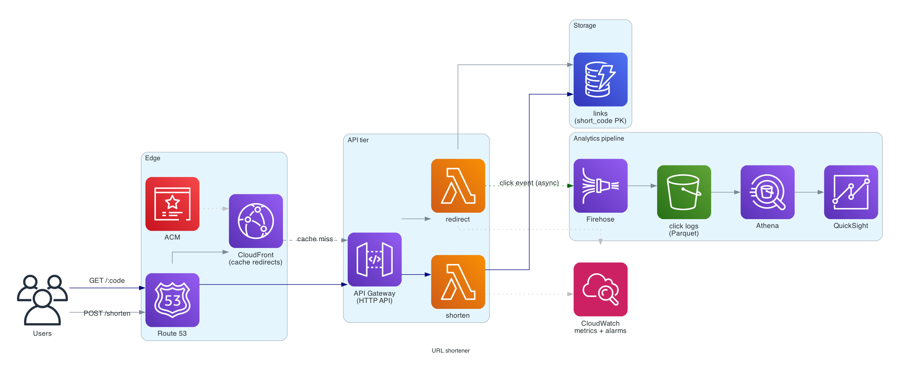
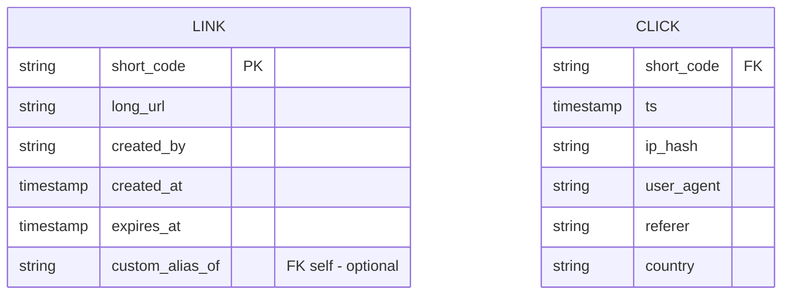

# URL shortener (TinyURL / bit.ly)

> **One-line summary.** Map a long URL to a short code; redirect on lookup. The canonical "easy" system design question — easy to start, full of depth on hot keys, ID generation, and analytics.

## TL;DR
- A short-code → long-URL map. Writes are tiny; reads dominate (100:1+ read/write).
- Storage: **DynamoDB** keyed on the short code. Reads fit comfortably in single-digit-ms latency.
- Edge: **CloudFront** caches redirects so most requests don't touch the backend.
- Code generation: **base62 counter** (sequential, predictable) or **hash-and-truncate** (random, collision-handled). Both work; counter wins on simplicity and density.
- Hot-link bursts (viral content) handled by edge cache + DAX in front of DynamoDB.
- Analytics: write click events to **Kinesis Firehose → S3** for offline processing; never write counters inline on the redirect path.

## Functional Requirements
- Shorten a long URL → return a short URL.
- Redirect short URL → original URL (HTTP 301 / 302).
- Optional **custom alias** (`/jane-portfolio`).
- Optional **expiration** (TTL on the mapping).
- Per-link **click analytics** (count, geo, referrer) — can be eventually consistent.
- (Out of scope for the simplest version): user accounts, link editing, branded domains.

## Non-Functional Requirements
- **Latency**: p99 redirect < 100 ms globally.
- **Availability**: 99.99% on reads (redirect path); 99.9% on writes (shorten).
- **Durability**: a shortened URL never silently disappears (within its TTL).
- **Scale**: 100M URLs created per year; 10B redirects per year.
- **Cost**: cheap per request; the redirect path must be sub-cent per 1000.

## Capacity Estimates
- **Writes**: 100M / year = ~3 / second average, ~30 / second peak. Trivial.
- **Reads**: 10B / year = ~320 / second average, ~3,200 / second peak. Modest.
- **Storage**: 100M URLs × ~500 B/row = ~50 GB. Tiny.
- **Bandwidth**: redirect response is small (~500 B headers). ~1.6 MB/s peak.

The whole workload fits comfortably in a single-Region setup with a CDN. No sharding needed at this scale.

## High-Level Architecture



A redirect request goes: **user → CloudFront** (cached for popular codes) → **on miss, to API Gateway → Lambda → DynamoDB**. A write goes: user → API Gateway → Lambda → DynamoDB (code-generation logic in Lambda). Clicks are emitted asynchronously to **Kinesis Data Firehose → S3** and processed by **Athena** for analytics dashboards (via **QuickSight**).

CloudFront does the heavy lifting on the read path — popular links served at edge with no backend hit. DAX would be added if we expected sustained millions of QPS, but at our scale CloudFront alone is plenty.

## Data Model



**Link** table (DynamoDB):
- **Partition key**: `short_code` (string, 7 chars base62).
- TTL attribute: `expires_at` (DynamoDB auto-deletes after this timestamp).
- No GSI needed for the redirect path; the partition key *is* the lookup.

**Click** stream (S3 via Firehose):
- Schema as above; written by Firehose into partitioned Parquet (`year=/month=/day=/`).
- Queryable from Athena / QuickSight; never queried inline.

## API Design

```
POST /shorten
  body: { "url": "https://very/long/url", "alias": "optional", "ttl_days": 30 }
  → 201 Created { "short_url": "https://sho.rt/aB3xK9q" }

GET /:short_code
  → 301 Moved Permanently
    Location: <long_url>

GET /api/links/:short_code/stats   (auth required)
  → 200 OK { "clicks": 1234, "by_country": {...}, "by_referer": {...} }
```

Status codes:
- **301** if we want browser-permanent caching (note: hides click analytics from the browser-cached path).
- **302** if we want every click to hit our backend (better analytics, more traffic).
- Most systems pick **302** for the click-tracking value; some pick 301 with edge logs (CloudFront access logs) feeding analytics.

## Deep Dives

### 1. Short-code generation
Two approaches; each has gotchas.

**A. Base62 counter.** Maintain a monotonically increasing 64-bit counter; encode it base62 (`0-9 a-z A-Z`). 7 chars handles 62^7 ≈ 3.5 trillion codes.

- *Counter location*: DynamoDB atomic counter, Redis `INCR`, or a sharded counter (split into N counters, pick one randomly and combine — see [`distributed-counter`](distributed-counter.md)).
- *Property*: dense (no wasted codes), predictable (URL enumeration possible — a problem if links should be private).
- *Hot key*: single-counter writes serialize. Use a sharded counter or pre-allocate ranges per Lambda instance.

**B. Hash-and-truncate.** Hash the long URL (e.g., SHA-256), take first 7 base62 chars.

- *Property*: deterministic (same URL → same code; nice for dedup), but **collision-prone** at scale. Need a conditional write that retries with the next 7 chars on conflict.
- *Privacy*: still enumerable if attackers know the hash function and have any seed.

**C. Random with conditional write.** Generate 7 random base62 chars; DynamoDB `PutItem` with `ConditionExpression: attribute_not_exists(short_code)`; retry on collision.

- *Property*: unpredictable (good for privacy), collision rate trivial at 62^7 keyspace.
- *Cost*: a few extra writes per conflict at scale (negligible until you've used billions of codes).

**Recommendation**: random + conditional write for the privacy-preserving default; switch to counter for ultra-dense / public deployments (like an internal tracking URL).

### 2. Hot links and edge caching
A single viral link can be hit 100K+ QPS. DynamoDB partition throughput cap is ~3K reads/s per partition; sustained hot reads will throttle.

Layered mitigations:
1. **CloudFront** caches redirects by short code (TTL ~5 min, shorter for click-tracked 302s).
2. **DAX** (DynamoDB Accelerator) in front of the table — microsecond reads at million QPS.
3. **Read sharding the hot key** — if a single code is uncacheable for some reason, replicate the entry across multiple keys and route randomly.

The CloudFront layer alone handles 99%+ of the load for typical viral patterns.

### 3. Click analytics without slowing the redirect
The naive approach — `INCR clicks` on every request — turns the read path into a write path (slow + serializing on the hot link).

Right pattern:
1. Redirect responds with 302 in <50 ms.
2. Lambda fires a `PutRecord` to **Kinesis Data Firehose** (async, fire-and-forget).
3. Firehose batches records and writes to S3 as Parquet partitioned by date.
4. **Athena** aggregates click counts on demand (or scheduled into a "counts" table).
5. **QuickSight** dashboards on top.

For real-time-ish dashboards, replace the Firehose-to-S3 path with **Kinesis Data Streams → Lambda → DynamoDB counters** (still async, never inline on the redirect).

### 4. Custom aliases and dedup
Custom alias (`/jane-portfolio`) is a write that collides with auto-generated codes if you don't reserve a namespace. Two options:
- **Reserve a prefix** — `/c/jane-portfolio` for custom; `/aB3xK9q` for auto.
- **Shared namespace with collision check** — custom alias writes use the same table; conditional write fails if taken; client gets `409 Conflict`.

Shared namespace is simpler for users; the prefix approach is simpler for the system.

## AWS Services Used
- **CloudFront** — edge cache for redirects; absorbs the read traffic.
- **API Gateway (HTTP API)** — public-facing redirect + write endpoint; 71% cheaper than REST API at this shape.
- **Lambda** — redirect handler and shortener handler.
- **DynamoDB** — `links` table, on-demand mode (variable traffic). DAX optional at scale.
- **Kinesis Data Firehose** — click event delivery to S3.
- **S3** — click logs in Parquet, partitioned by date.
- **Athena** + **Glue Data Catalog** — query click logs.
- **QuickSight** — analytics dashboard.
- **Route 53** + **ACM** — custom domain + TLS.

## Cost Notes
At our 10B reads/year scale (~320 RPS avg, ~3K peak):
- **CloudFront**: dominant if cache hit ratio is high (cheap per-GB for cacheable content) — maybe ~$30-50/month.
- **DynamoDB on-demand**: ~10B reads × $0.25 / 1M = $2,500/year for reads + tiny write cost.
- **Lambda**: 10B invocations is the cost killer if cache hit ratio is low. At 90% cache hit, ~1B invocations/year × small duration ≈ $200-500/year.
- **Firehose**: pennies for click delivery.

Levers:
- **Cache aggressively** — high CloudFront hit ratio is the single biggest cost lever.
- **Reserved capacity on DynamoDB** if traffic shape becomes steady (>50% reduction vs on-demand).
- **Drop DAX** unless DynamoDB-direct throughput becomes a problem.

## Failure Modes & DR
- **AZ failure**: DynamoDB and CloudFront are multi-AZ by default; Lambda runs across AZs. No impact.
- **Region failure**: redirect stops working for users routed to that Region. Mitigations:
  - **DynamoDB Global Tables** for cross-Region replication.
  - **Route 53 latency-based routing** with health checks.
  - At our cost profile, full multi-Region is probably overkill — backup + Route 53 failover to a standby Region is plenty.
- **DynamoDB throttle on hot link**: CloudFront absorbs; DAX fallback; sharded-key as the nuclear option.
- **Firehose lag / failure**: click analytics fall behind, but the redirect path is unaffected (fire-and-forget).
- **Lambda cold start tail**: hits the p99 budget for uncached redirects. Use SnapStart (Python/Java/.NET) or provisioned concurrency.

## Trade-offs & Alternatives
- **Counter vs random codes**: counter is dense and predictable; random is unguessable. Pick by privacy requirement.
- **301 vs 302**: 301 enables browser caching (less backend load) but skips click analytics. 302 is the analytics-friendly default.
- **DynamoDB vs Redis vs RDBMS**: DynamoDB wins on cost / latency / scaling at this access pattern. Redis would work but loses durability without MemoryDB. RDBMS is overkill — no joins, no relations.
- **DAX vs CloudFront**: CloudFront fronts the HTTP path (cheaper, broader). DAX fronts the DynamoDB layer (lower-latency, more expensive). CloudFront usually first.
- **Inline analytics counters vs async stream**: inline writes serialize on hot links; stream-based scales unboundedly. Stream wins.
- **Self-hosted vs managed**: at this scale, managed is dramatically cheaper end-to-end (no DBA, no patching).

## Further Reading
- [Building a serverless URL shortener (AWS blog)](https://aws.amazon.com/blogs/compute/build-a-serverless-multi-region-active-active-backend-solution-in-an-hour/).
- ["Designing TinyURL", System Design Primer](https://github.com/donnemartin/system-design-primer#design-pastebincom-or-bitly).
- [DynamoDB on-demand vs provisioned](https://docs.aws.amazon.com/amazondynamodb/latest/developerguide/HowItWorks.ReadWriteCapacityMode.html).
- [CloudFront caching behavior](https://docs.aws.amazon.com/AmazonCloudFront/latest/DeveloperGuide/cache-hit-ratio.html).
- Related repo: [pastebin](pastebin.md) (similar shape with larger payloads), [distributed-counter](distributed-counter.md) (for click counters), [rate-limiter](rate-limiter.md), [tinyurl](tinyurl.md) (same problem).
