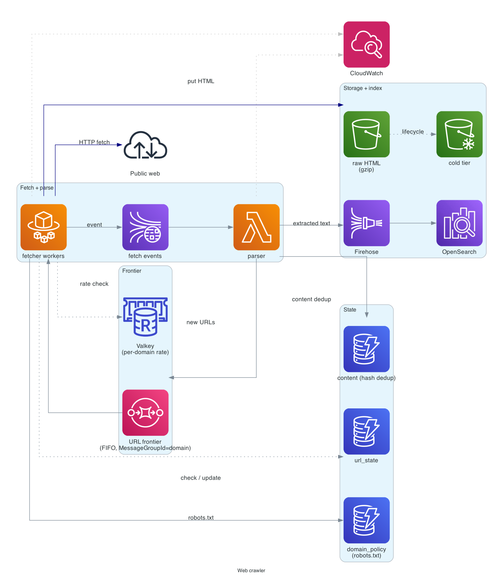
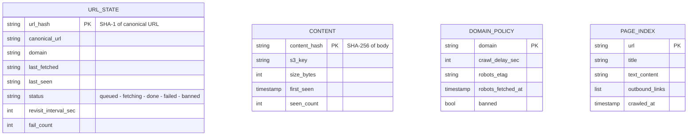

# Web crawler

> **One-line summary.** Fetch the web at scale — discover pages, fetch politely, extract content + links, dedup, and feed an index. The hard parts are politeness (don't DOS targets), dedup (don't waste bandwidth on identical content), and distributed coordination of a billion-URL frontier.

## TL;DR
- A pipeline: **URL frontier** → **fetcher workers** → **parser** → **content store** + **link extractor** → back into the frontier. Each stage is an SQS queue with workers.
- **Politeness** = per-domain crawl-rate limits, respect `robots.txt`, configurable user agent, per-domain delays.
- **Dedup** at two levels: URL canonicalization (no `?utm=` noise) and content hashing (same body served at multiple URLs).
- AWS-native: **SQS** for the frontier, **Lambda / Fargate** for workers, **S3** for raw pages, **DynamoDB** for URL state, **OpenSearch / S3+Athena** for the index.
- The hardest parts: **distributed politeness** (workers don't have global view), **trap detection** (calendar pages with infinite `?date=+1day` links), and **revisit scheduling** (how often to re-fetch).

## Functional Requirements
- Seed with a starting set of URLs.
- Fetch each URL respecting `robots.txt` and per-domain rate limits.
- Extract text + outbound links.
- Dedup URLs and dedup content (same body).
- Store raw fetched pages.
- Build a search index from extracted content.
- Re-crawl on a schedule based on observed change frequency.

## Non-Functional Requirements
- **Throughput**: 10K pages/sec sustained, 100K pages/sec burst.
- **Politeness**: never exceed configured per-domain rate (typically 1 req/sec per domain).
- **Coverage**: discover and fetch most of the public web within bounded time.
- **Storage**: PB-scale; cold-tier for old pages.
- **Cost**: bandwidth is the dominant cost lever; design for compression and dedup.

## Capacity Estimates
- 10K pages/sec × 86400 sec/day = ~860M pages/day fetched.
- ~200 KB average page size → 170 TB/day raw HTML.
- After dedup + compression (gzip, then dedup): ~50 TB/day net storage.
- URL frontier: ~10B distinct URLs known; ~100M pending at any time.

## High-Level Architecture



URL frontier in **SQS** (sharded by domain for politeness). **Fargate fetcher** workers poll SQS, check **DynamoDB URL state** (already crawled? when?), fetch the page (with per-domain throttle from **Valkey**), store raw HTML in **S3**, and publish (URL, S3 key, content hash) to a **Kinesis stream**. **Parser Lambda** reads the stream, extracts text + outbound links, dedups via content-hash DynamoDB lookup, and enqueues new URLs back to the frontier. Extracted content lands in **OpenSearch** for search; metadata in DynamoDB.

## Data Model



- **`url_state`** — every known URL has a row. Status drives the workflow.
- **`content`** — by body hash; dedup across URLs.
- **`domain_policy`** — per-domain `robots.txt` cached; `crawl_delay`.
- **`page_index`** — extracted text shipped to OpenSearch.

## API Design

(Internal pipeline; no external API surface. Admin / observability APIs sketched.)

```
POST /admin/seeds
  body: { "urls": [...] }
  → 200 OK { "enqueued": 1234 }

GET /admin/stats
  → 200 OK { "frontier_size": ..., "fetch_rate": ..., "per_domain": {...} }

POST /admin/domain-config
  body: { "domain": "example.com", "crawl_delay_sec": 10 }
  → 200 OK
```

## Deep Dives

### 1. URL frontier and per-domain politeness
A naive single queue would have workers polling and fetching whatever comes up — easily violating per-domain rate limits.

**Per-domain SQS queues:**
- One FIFO queue per domain (or a small number, sharded by domain hash).
- `MessageGroupId = domain` ensures per-domain ordering and per-domain serialization.
- Fetcher workers compete across many domain queues but a single worker holds one domain's lock at a time.

**Per-domain delay (Valkey)**:
- Before fetching `example.com/X`, worker checks `Valkey: last_fetch_ts[example.com]`.
- If `< now - crawl_delay_sec`, sleep / push the URL back to its queue with delay.
- Else update `last_fetch_ts` and fetch.

For very large queue cardinality (10M domains), don't create 10M SQS queues — use a single FIFO queue with `MessageGroupId = domain` (SQS FIFO guarantees per-group order). Or use one queue per domain shard (`hash(domain) % 256`).

### 2. robots.txt and politeness
On first encounter of a domain:
1. Fetch `https://<domain>/robots.txt`.
2. Parse `Crawl-delay`, `Disallow`, `Sitemap` directives.
3. Cache `(domain, parsed_rules, etag, fetched_at)` in `domain_policy` table.
4. Refresh every 24 hours or on `Cache-Control` expiry.

Before fetching any URL: check `domain_policy[domain].robots_rules` — skip if disallowed.

User-agent identification: clear, identifiable user-agent string (`Mozilla/5.0 (compatible; MyCrawler/1.0; +https://example.com/bot)`).

### 3. Content dedup
The same article can be fetched from canonical URL + RSS feed + mobile URL + AMP URL. Same body, different URLs.

Two layers:
1. **URL canonicalization** — strip tracking params (`utm_*`, `fbclid`), normalize protocol (https), normalize trailing slash, lowercase host.
2. **Content hash** — SHA-256 of body. On insert: check `content` table; if hash exists, point new `url_state` row at the same `content_hash`; don't store the body again.

Saves storage proportional to dedup ratio (typically 30-50% across the web).

### 4. URL state machine and revisit scheduling
Each URL goes through states:
```
discovered -> queued -> fetching -> done | failed -> queued (retry)
                                  \-> done -> queued (revisit)
```

**Revisit scheduling**: pages change at different rates. Strategy:
- Default `revisit_interval = 7 days`.
- Track observed change frequency (compare content hash on each fetch).
- If content rarely changes: extend interval (up to 90 days).
- If content changes every fetch: shrink interval (down to 1 day, with a per-domain politeness floor).

Scheduling: `revisit_due_at = last_fetched + revisit_interval`. A daily Lambda scans for `revisit_due_at < now` and enqueues.

### 5. Crawler traps and infinite spaces
Some sites generate infinite URL spaces (calendar pages `/event?date=+1day`, faceted search). Mitigations:
- **Per-domain page-count cap** (e.g., max 1M pages per domain).
- **URL-pattern detection** — if all URLs from a path differ only by a date parameter, flag for review.
- **Trap heuristics** — pages that produce many outbound links to themselves, or where parameters seem to enumerate.
- **Bloom filter / DynamoDB** — quickly reject "we've seen this URL pattern N times."

### 6. Distributed coordination at scale
The dedup and rate-limit checks are themselves at scale. Two patterns:
- **Per-Region partitioning** — each Region crawls a hash partition of the URL space; no cross-Region coordination needed.
- **Sharded state** — DynamoDB `url_state` table sharded by `hash(url) % N`; Valkey rate-limiter sharded by `hash(domain) % N`.

Cross-domain dedup needs the full URL key space available; per-Region partitioning works because the domain → partition mapping is stable.

### 7. Indexing pipeline
Extracted content → OpenSearch. For very large indices, batch ingest:
- Parser Lambda writes batches of `(url, title, text)` to Kinesis Firehose.
- Firehose buffers and bulk-loads OpenSearch.
- Alternative: write to S3 in Parquet, then Athena queries directly (for analytical workloads, not interactive search).

## AWS Services Used
- **SQS (FIFO)** — URL frontier with per-domain MessageGroupId.
- **Fargate** — fetcher workers (long-running, network-heavy, more cost-effective than Lambda at this load).
- **Lambda** — parser, scheduler, admin tasks.
- **DynamoDB** — URL state, content dedup, domain policy. On-demand initially; provisioned at steady scale.
- **ElastiCache for Valkey** — per-domain rate limiter, recent URL bloom filter.
- **S3** — raw HTML storage (compressed); lifecycle to Glacier for old pages.
- **Kinesis Data Streams** — fetch-completion event backbone.
- **Kinesis Data Firehose** — bulk index ingest.
- **OpenSearch** — page-content index.
- **EventBridge Scheduler** — revisit scheduler.
- **CloudWatch** — frontier size, fetch rate, error rate per domain.

## Cost Notes
At 860M pages/day:
- **Bandwidth (NAT egress / direct internet)** — huge; dominates the bill at typical AWS rates. Crawlers often run in colocation facilities for cheaper transit.
- **S3 storage** — PB-scale; aggressive tiering (Standard → IA → Glacier).
- **DynamoDB** — 10B URL state rows; per-fetch read+write. Reserved capacity essential.
- **OpenSearch** — depends on index size; UltraWarm + Cold tiers for old pages.

Levers:
- **Compress before S3 storage** (gzip / brotli).
- **Dedup aggressively** — both URL and content.
- **Per-page bandwidth cap** — skip enormous binaries (video, big files) unless explicitly desired.

## Failure Modes & DR
- **Domain banned us**: detect 429 / 503 patterns; back off; reduce per-domain rate; possibly mark `banned: true`.
- **Worker failure mid-fetch**: SQS visibility timeout returns the message; another worker retries.
- **Trap detected**: pause crawling that domain; alert.
- **Cold start of new Region**: per-Region partition starts empty; long ramp-up to steady state.
- **OpenSearch lag**: search results stale; crawling continues; backfill from S3 if needed.

## Trade-offs & Alternatives
- **SQS FIFO per domain vs single queue with MessageGroupId**: per-domain queues are clearer but explode at 10M domains. One queue with MessageGroupId scales without queue-count problems.
- **Fargate vs Lambda for fetcher**: Fargate is cheaper and handles long fetches (10s for slow sites) better than Lambda's per-invocation pricing.
- **DynamoDB vs Cassandra for URL state**: both work; DynamoDB managed; Cassandra historically what large crawlers (Google, internal) use.
- **Per-Region partitioning vs global state**: per-Region scales linearly with Regions; global is simpler but bottlenecks.
- **Build vs buy**: Common Crawl exists for "I need a corpus." Build for live crawling at scale.

## Further Reading
- ["Designing a web crawler", System Design Primer](https://github.com/donnemartin/system-design-primer).
- ["The Anatomy of a Large-Scale Hypertextual Web Search Engine", Brin & Page (the original Google paper)](http://infolab.stanford.edu/~backrub/google.html).
- [Common Crawl](https://commoncrawl.org/) — open-data crawl as a reference dataset.
- Related: [rate-limiter](rate-limiter.md), [search-autocomplete](search-autocomplete.md), [pub-sub pattern](../02-patterns/pub-sub.md).
