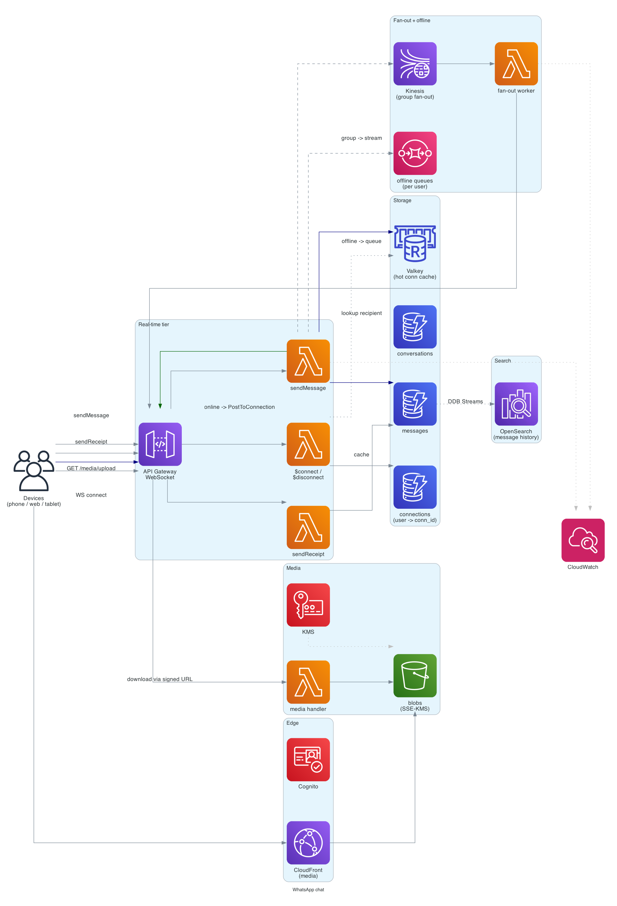

# WhatsApp chat (real-time messaging)

> **One-line summary.** Bidirectional real-time messaging with delivery / read receipts, group chats, end-to-end encryption (optional in design), and offline-message buffering. The canonical "chat" interview problem.

## TL;DR
- **WebSocket** connections (via **API Gateway WebSocket** or **AppSync**) keep clients persistently connected. Messages routed through a dispatcher service that knows which connection-ID each user is on.
- **DynamoDB** as the persistent store for messages, conversations, and connection tracking.
- **SQS / Lambda** handles offline message delivery (queue per recipient; flush on reconnect).
- **Group chats** are the hard part — fanning out a single message to 1000+ members has the same shape as a small celebrity tweet (see [`twitter-feed`](twitter-feed.md)) but with stricter latency requirements.
- **End-to-end encryption** is mostly a client-side concern — the server stores ciphertext blobs; it never sees plaintext.
- Read / delivery receipts and typing indicators add a steady high-RPS background traffic that the design must absorb cheaply.

## Functional Requirements
- Send / receive **direct messages** (1:1 chats).
- **Group chats** (up to 1000 members).
- Delivery receipts (sent → delivered → read).
- Typing indicators.
- Offline message buffering (client gets messages on reconnect).
- Media messages (photo / video / voice / document).
- Message history / search.
- (Optional in v1): voice / video calls, status / stories.

## Non-Functional Requirements
- **Latency**: message delivered to online recipient in < 500 ms (p99).
- **Availability**: 99.99%.
- **Durability**: no message loss; offline messages buffered until delivered.
- **Scale**: 2B users, 500M concurrent connections at peak, 100B messages/day.
- **Connection persistence**: long-lived (hours to days) WebSocket connections.

## Capacity Estimates
- **Writes (messages)**: 100B/day = ~1.2M/sec average, ~5M/sec peak.
- **Concurrent connections**: 500M peak.
- **Connection state**: ~1 KB per connection × 500M = ~500 GB hot state.
- **Message storage**: 100B msgs × 200 bytes average = ~20 TB/day. With media: orders of magnitude more.
- **Read receipts**: similar volume to messages.

## High-Level Architecture



Clients open a WebSocket via **API Gateway WebSocket API** (or **AppSync Subscriptions**). On `$connect`, a Lambda registers `(user_id → connection_id)` in **DynamoDB connections table**. Sending a message: client publishes to `sendMessage` route → Lambda looks up the recipient's connection in DynamoDB → if online, pushes via API Gateway's `PostToConnection` API; if offline, buffers in **SQS** (per-recipient) until the next reconnect.

Messages persist in DynamoDB **messages table** keyed by `(conversation_id, message_ts)`. Conversation metadata (participants, last message, unread count) in **conversations table**. **DynamoDB Streams + Lambda** propagate to **OpenSearch** for full-text history search.

For groups, the dispatcher fans out to each member; large-group fan-out goes through **Kinesis Data Streams** to avoid blocking the sender.

## Data Model

```mermaid
erDiagram
  USER {
    string user_id PK
    string phone_e164
    string display_name
    string avatar_url
    string identity_key "for E2E - opaque"
  }
  CONNECTION {
    string user_id PK
    string connection_id SK
    string device_id
    timestamp connected_at
    timestamp last_seen
    int    ttl
  }
  CONVERSATION {
    string conversation_id PK
    string type "direct - group"
    list   participant_ids
    string name "group only"
    timestamp last_message_ts
    string last_message_preview
  }
  MESSAGE {
    string conversation_id PK
    timestamp message_ts SK
    string message_id "ulid"
    string sender_id
    string ciphertext
    string mime_type "text - image - video - voice"
    string s3_key "for media"
    map    delivery "user_id - sent | delivered | read"
  }
  OFFLINE_QUEUE {
    string user_id "SQS queue per user"
  }
```

- **`connections`** — DynamoDB; PK = `user_id`, SK = `connection_id` (one user can have multiple devices / sessions). TTL = inactivity expiry.
- **`messages`** — DynamoDB; sharded by `conversation_id`. Sort by `message_ts` descending for "load latest N."
- **`conversations`** — DynamoDB; PK = `conversation_id`; GSI on `participant_id` for "list my conversations."
- **`offline_queue`** — one SQS queue per recipient (or a single queue with `MessageGroupId = user_id` for FIFO ordering).

## API Design

### WebSocket routes
```
$connect           — register connection
$disconnect        — cleanup
sendMessage        — { conversation_id, ciphertext, mime_type, ... }
sendReceipt        — { conversation_id, message_id, event: "delivered"|"read" }
typing             — { conversation_id, is_typing: true|false }
```

### REST (history, metadata)
```
GET /v1/conversations
  → [{ conversation_id, ... }, ...]

GET /v1/conversations/:id/messages?before=<ts>&limit=50
  → [{ message_id, ts, sender, ciphertext, ... }, ...]

POST /v1/media/uploads
  → { upload_id, presigned_url }
```

## Deep Dives

### 1. Connection tracking
A user opens the app on phone + web + tablet — each has a separate WebSocket. The system needs to know, given `user_id`, all active `connection_id`s.

`connections` table:
- PK: `user_id`. SK: `connection_id`.
- TTL: 1 hour (refreshed on heartbeat).
- On `$connect`: `PutItem`.
- On `$disconnect`: `DeleteItem`.
- On heartbeat: refresh TTL via `UpdateItem`.

Sender path:
1. Lambda reads `connections WHERE user_id = recipient`.
2. For each active `connection_id`: `apigateway.PostToConnection(connection_id, message)`.
3. If no active connections: enqueue to SQS.

### 2. Delivery semantics and receipts
Three states per recipient per message:
1. **Sent** (acknowledged by server).
2. **Delivered** (recipient's device acknowledged receipt).
3. **Read** (recipient's app marked as read).

Implementation:
- Message row in `messages` has a `delivery` map: `{user_a: "read", user_b: "delivered"}`.
- Recipient sends `sendReceipt` → Lambda updates the map.
- Updates published back to the *sender* (so the sender's UI shows "delivered" / "read").

For 1:1 chat, the receipt map has one entry. For groups, one per recipient — but groups typically don't show per-recipient read state (only "read by N members").

### 3. Group chat fan-out
A 1000-member group sends a message → server must push to all online members.

Pattern:
- Sender Lambda doesn't loop over 1000 connections inline (latency). Instead, publishes to a Kinesis stream.
- Worker Lambdas (sharded by recipient) read from the stream and push to their assigned connections.
- For each member: look up connections, push via API Gateway, update offline queue if offline.

For huge groups (10K+ — "broadcast lists"), use SNS or per-recipient SQS queues with a worker fleet — closer to Twitter's celebrity fan-out.

### 4. Offline messaging
User's WebSocket disconnects (closed app, lost network). New messages queued.

Per-recipient SQS queue:
- Each message Lambda enqueues to `offline-queue-<user_id>` (or one queue with FIFO MessageGroupId).
- On reconnect, Lambda flushes the queue: drains messages, pushes through the new WebSocket, deletes from queue.

Retention: 30 days (WhatsApp typically discards undelivered after this window). SQS has 14-day max retention — use S3 backup for longer.

Alternative: don't use SQS at all; just persist all messages to DynamoDB (which is the source of truth anyway), and on reconnect query for "messages since my last seen timestamp." Simpler; loses real-time push for offline windows but uses one less moving part.

### 5. End-to-end encryption (server perspective)
With E2E, the server never sees plaintext.
- Each user has an identity key pair (private on device, public shared).
- Per-conversation, **Signal Protocol** style: ratcheting session keys.
- Server stores ciphertext blobs; relays them blindly.
- Server doesn't need to decrypt to deliver, fan-out, or persist.

The server's job: **key directory** (public keys, prekey bundles for offline-first delivery) + **ciphertext relay**. WhatsApp uses Signal Protocol; the server reads identity keys and prekeys but never message content.

For interview purposes: mention E2E as out of scope for v1, then sketch the key directory + ciphertext relay model for follow-up.

### 6. Typing indicators (high-RPS background traffic)
Every keystroke can fire a `typing: true / false`. At 500M concurrent users, the typing-event rate can dwarf actual messages.

Approach:
- **Don't persist** typing events — purely transient.
- Push directly through the same dispatcher path as messages, but skip DynamoDB write.
- Throttle on the client (send `typing: true` at start; debounce updates; send `typing: false` after 5s of inactivity).
- For groups, only push to currently-open conversation views (clients tell server "I'm viewing conversation X" so typing is only pushed to those who care).

### 7. Media messages
Same shape as Instagram media: client uploads to S3 via presigned URL; server stores the S3 key in the message. Recipients download via CloudFront with signed URLs.

Add server-side encryption (SSE-S3 or SSE-KMS) on the bucket; for E2E, the client encrypts before upload (server sees ciphertext blob).

## AWS Services Used
- **API Gateway WebSocket API** — persistent connections.
- **AppSync** — alternative for richer subscription / GraphQL semantics.
- **Lambda** — connection handlers, message handlers, fan-out workers.
- **DynamoDB** — connections, messages, conversations. Global Tables for cross-Region.
- **SQS** — per-user offline queue (or FIFO with MessageGroupId).
- **Kinesis Data Streams** — group fan-out backbone.
- **S3 + CloudFront** — media.
- **OpenSearch** — message history search.
- **ElastiCache** — connection-state cache (hot user → connection mapping).
- **Cognito** — auth.
- **KMS** — encryption keys for any server-side stored secrets.

## Cost Notes
At 2B users / 500M concurrent connections:
- **API Gateway WebSocket**: per-connection-minute + per-message. At 500M concurrent for hours, this is the dominant cost. ~$0.25 per million connection-minutes + ~$1 per million messages.
- **DynamoDB**: writes for every message + receipt — billions per day. On-demand may not be the cheapest at this scale; reserved capacity + careful key design.
- **SQS**: cheap (~$0.40 per million messages).
- **Lambda**: massive invocation count; Compute Savings Plans help.

Levers:
- **AppSync** (subscription-per-channel rather than connection-per-user) sometimes cheaper.
- **At-scale companies often build custom WebSocket fleets** on EC2 / EKS (cheaper at WhatsApp scale than per-connection-minute API Gateway). Mention as the production reality.
- **Reserved DynamoDB capacity** for steady write load.
- **S3 Intelligent-Tiering** for old media.

## Failure Modes & DR
- **Connection drop**: WebSocket closes; messages queue in offline path; client reconnects and flushes.
- **DynamoDB throttle** on a large group: Kinesis-based fan-out smooths bursts.
- **Region failure**: DynamoDB Global Tables for state; clients reconnect to nearest healthy Region.
- **API Gateway WebSocket Region outage**: clients fail over to standby Region via DNS (loses in-flight messages temporarily; offline queue catches up).
- **Hot group spam**: rate limit per (group, sender) at the dispatcher.

## Trade-offs & Alternatives
- **API Gateway WebSocket vs custom WebSocket on EC2 / EKS**: API Gateway is serverless, expensive at huge scale. Custom is cheaper at huge scale, more operational overhead. WhatsApp-scale companies build custom; smaller companies use managed.
- **DynamoDB vs Cassandra for messages**: both work; DynamoDB is managed. Cassandra is the historical choice (linear-write scale, time-series friendly).
- **Per-user SQS queue vs single DynamoDB-pulled history**: SQS gives push-on-reconnect; DynamoDB-only is simpler with the same eventual effect (poll on reconnect).
- **E2E encryption now vs later**: huge change in design once added (server can't help with content moderation, search of message content, etc.). Decide early.
- **Synchronous group fan-out vs async**: sync (loop in sender Lambda) keeps latency low for small groups; async (Kinesis worker) scales to large groups.

## Further Reading
- ["Designing WhatsApp / Facebook Messenger", System Design Primer](https://github.com/donnemartin/system-design-primer).
- ["Scaling WhatsApp to 200M users", High Scalability blog (historical)](http://highscalability.com/blog/2014/2/26/the-whatsapp-architecture-facebook-bought-for-19-billion.html).
- [Signal Protocol overview](https://signal.org/docs/).
- [API Gateway WebSocket APIs docs](https://docs.aws.amazon.com/apigateway/latest/developerguide/apigateway-websocket-api.html).
- Related: [slack-messaging](slack-messaging.md) (group chat at workplace scale), [notification-system](notification-system.md) (push delivery patterns).
