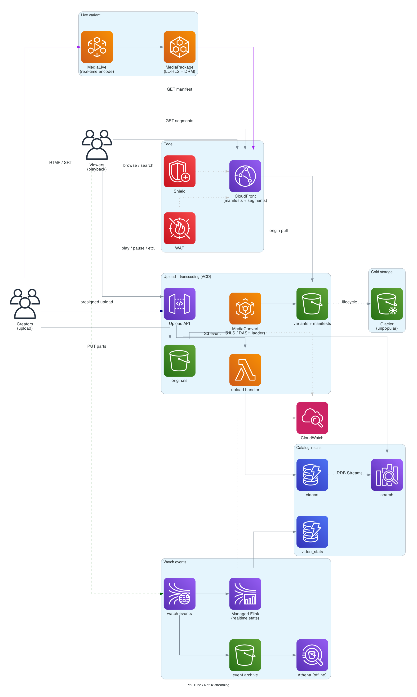
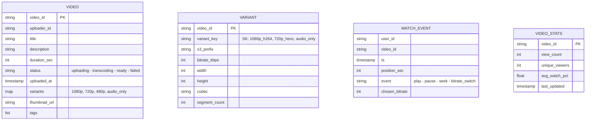

# YouTube / Netflix (video streaming)

> **One-line summary.** Ingest videos at upload time; transcode into many bitrates and codecs; deliver adaptive-bitrate streaming to billions of viewers globally with sub-second startup and no rebuffering. The biggest bandwidth consumer on the internet.

## TL;DR

- **Upload pipeline**: client uploads to S3 → MediaConvert / Elemental transcodes into multiple bitrates (1080p, 720p, 480p, …) + multiple codecs (H.264, HEVC, AV1) → outputs HLS / DASH manifests + segmented files back to S3.
- **Delivery**: CloudFront pulls from S3 origin; viewers fetch the manifest then the segments. Adaptive bitrate (ABR) clients pick the right bitrate per segment based on observed throughput.
- **Recommendations / browse** is a separate problem (see [recommendation-system](recommendation-system.md)).
- **Live streaming** is the harder variant — same components, but with **MediaLive** / **MediaPackage** for real-time transcoding, sub-10-second glass-to-glass latency.
- The hardest parts: **storage cost** at exabyte scale, **transcoding cost** (compute-heavy), **CDN egress cost** (the single largest bill item), and **adaptive bitrate** UX (no rebuffering, fast switching).

## Functional Requirements

- Upload video.
- Transcode to multiple bitrates + codecs.
- Serve adaptive-bitrate streaming (HLS / DASH).
- Browse, search, watch.
- Likes / comments (out of scope for v1 — see [instagram](instagram.md)).
- Recommendations (out of scope — see [recommendation-system](recommendation-system.md)).
- Live streaming (sketched as variant).

## Non-Functional Requirements

- **Startup latency**: time-to-first-byte < 1 sec; time-to-first-frame < 2 sec.
- **Rebuffering**: < 0.5% of watch time.
- **Throughput**: 100M concurrent streams at peak (Netflix-scale).
- **Storage**: exabyte-scale.
- **Upload throughput**: 500 hours of video / minute (YouTube-scale).
- **Bandwidth**: petabits per second globally.

## Capacity Estimates

- **Catalog**: 1B videos × ~10 minutes × ~5 bitrates × ~5 MB/min = ~250 EB. Massive.
- **Daily upload**: 500 hours/min × 1440 min/day = 720K hours/day = ~4 PB/day raw.
- **Concurrent streams**: 100M × ~5 Mbps avg = 500 Tbps egress at peak.

## High-Level Architecture



**Upload pipeline**: client uploads original via **S3 multipart presigned URL** → S3 event triggers **MediaConvert** → transcoded variants written to S3 (`hls/<video_id>/...`) → metadata written to DynamoDB. Manifest files (`.m3u8` for HLS, `.mpd` for DASH) reference the segmented files.

**Playback**: client fetches manifest from **CloudFront** → fetches segments (small `.ts` or `.m4s` files, ~6 seconds each). Adaptive-bitrate logic in the client switches between bitrates based on observed throughput.

**Catalog + search**: DynamoDB for video metadata; OpenSearch for search; CDN-cached browse pages.

**Live variant**: ingest via **MediaLive** → packaged by **MediaPackage** → delivered via CloudFront with low-latency HLS (LL-HLS).

## Data Model



- **`videos`** — DynamoDB, PK = `video_id`. Status tracks upload → transcode → ready.
- **`variants`** — per-video list of available renditions.
- **`watch_events`** — Kinesis stream + S3 archive; raw event log.
- **`video_stats`** — DynamoDB; counters maintained from the event stream (see [distributed-counter](distributed-counter.md)).

## API Design

```
POST /v1/videos
  → 200 OK { "video_id": "...", "upload_url": "<multipart-presigned>" }

PUT <upload_url>     (S3 direct)

POST /v1/videos/:id/complete
  → 202 Accepted (transcoding starts)

GET /v1/videos/:id
  → 200 OK { "title": "...", "manifest_url": "https://cdn.../master.m3u8", ... }

GET <manifest_url>   (HLS / DASH manifest)
GET <segment_url>    (TS / fMP4 segment, 6 sec each)

POST /v1/videos/:id/events
  body: { "event": "play", "position_sec": 0 }
  → 202 Accepted (telemetry, async)
```

## Deep Dives

### 1. Upload + transcoding pipeline

Client → S3 multipart upload (presigned URLs):

1. Client requests an upload URL → server creates `videos` row, returns multipart S3 URL.
2. Client uploads parts directly to S3 (parallel, resumable).
3. On complete, client calls `/complete` → server triggers transcoding.

**MediaConvert job**:

- Input: original.
- Outputs: per-bitrate per-codec variants, segmented into 6-second `.ts` / `.m4s` files.
- Manifests (`.m3u8` for HLS, `.mpd` for DASH) for client to discover variants.
- Output to S3 under `hls/<video_id>/`.

Codec mix (typical):

- H.264 — universal compatibility, larger files.
- HEVC (H.265) — ~50% smaller than H.264, less universal.
- AV1 — even smaller, newest, growing support.

Each codec × bitrate combination is a separate variant; clients pick the best supported.

For very large videos, parallelize transcoding (split-process-recombine) for hours-long content.

### 2. Storage cost optimization

At exabyte scale, storage is the dominant cost.

Levers:

- **S3 Intelligent-Tiering** — auto-tier based on access frequency.
- **Glacier Instant Retrieval / Deep Archive** for old videos with low watch rate.
- **Adaptive transcoding ladder** — don't generate all bitrates for unpopular videos. Start with a base ladder; generate additional bitrates on-demand if a video gains traction.
- **Codec efficiency** — re-encode in AV1 / HEVC as adoption grows (smaller files).
- **Replace originals with high-bitrate variant** — keep one master quality, not the raw upload.

YouTube famously has tiered storage based on per-video view rate; cold videos go to colder tiers.

### 3. Delivery and adaptive bitrate

CloudFront pulls from S3 origin:

- **Manifest files** cached with short TTL (manifest changes when new variants are added).
- **Segment files** cached with long TTL (immutable).
- Edge cache hit ratio is the key cost lever — popular videos hit 99%+.

**Adaptive Bitrate (ABR)**:

- Client picks initial bitrate (often 720p for desktop, 480p for mobile).
- Per segment, client measures download time vs segment duration → bandwidth estimate.
- If bandwidth > variant bitrate + headroom: step up.
- If bandwidth < variant bitrate: step down.
- Goal: maximize quality without rebuffering.

Modern algorithms: BOLA (buffer-occupancy-based), MPC (model-predictive control). Built into HLS.js, dash.js, ExoPlayer, AVPlayer.

### 4. Live streaming variant

For YouTube Live / Netflix Live Events / sports:

- **MediaLive** — real-time transcoding (RTMP / SRT / RTP input → HLS / DASH output).
- **MediaPackage** — packaging + DRM + ad insertion.
- **CloudFront** — distribution to viewers.
- **Low-Latency HLS (LL-HLS)** — sub-3-second glass-to-glass latency (vs traditional 30+ seconds).

For interactive live (gaming, sports betting), latency budget is much tighter; use WebRTC variants.

### 5. Region-aware delivery

Petabits/sec of egress globally requires CDN tiering:

- CloudFront edge POPs (600+) for last-mile.
- Origin Shield for popular content.
- S3 origins in multiple Regions to reduce origin pull latency.
- Geo-aware: serve from the nearest Region.

For mega-popular content (a new movie drop), pre-warm CloudFront edges before launch.

### 6. Stats and watch events

Every play / pause / seek / bitrate-switch event is logged.

Pipeline:

- Client → API Gateway → Kinesis Data Streams → S3 + Managed Flink.
- Flink computes per-video stats (views, completion rate, average watch %).
- Stats land in DynamoDB for display.
- Long-term events in S3 for offline analytics (Athena, Redshift) — feeds recommendations and trending.

### 7. DRM and content protection

Premium content needs DRM (Widevine, FairPlay, PlayReady). Workflow:

- **MediaPackage** integrates with DRM key servers.
- Per-session unique playback keys.
- Client devices need DRM-capable players.

For UGC (YouTube), DRM is often not required — focus is on **Content ID** (matching uploads against copyrighted material to monetize / remove).

## AWS Services Used

- **CloudFront** — global edge.
- **S3** — originals + transcoded variants + manifests.
- **MediaConvert** — VOD transcoding.
- **MediaLive** — live transcoding.
- **MediaPackage** — packaging, DRM, ad insertion.
- **Lambda** — orchestration handlers.
- **DynamoDB** — video metadata, stats.
- **OpenSearch** — search index.
- **Kinesis Data Streams** — watch event backbone.
- **Managed Apache Flink** — real-time stats.
- **Athena / Redshift** — offline analytics on watch events.
- **EventBridge** — internal events.
- **Cognito** — auth (or third-party IdP).

## Cost Notes

The bill is dominated by:

1. **CloudFront egress** (massive — typically 60-80% of the total).
2. **S3 storage** (exabyte-scale).
3. **MediaConvert** (compute-heavy transcoding).

Levers:

- **Higher CloudFront cache hit ratio** — pre-warm popular content, tune TTLs.
- **Cheaper codecs** (HEVC, AV1) over time — smaller files = less egress.
- **Adaptive transcoding** — don't transcode bitrates that no one watches.
- **Cold storage tiering** for old / unpopular content.
- **Regional edge caches** for cross-Region delivery efficiency.

## Failure Modes & DR

- **MediaConvert backlog**: transcoding takes longer than expected; video shows "processing" longer. Acceptable.
- **CloudFront edge issue**: traffic shifts to other edges automatically (DNS-routed).
- **Region S3 outage**: pre-replicate originals + critical variants cross-Region; CloudFront serves from healthy Region.
- **DDoS on origin**: Shield Advanced + Origin Shield.
- **Live event Region failure**: rare but high-stakes; multi-Region MediaLive ingest with failover.

## Trade-offs & Alternatives

- **HLS vs DASH**: HLS is Apple-blessed (mandatory on iOS); DASH is open standard. Most providers ship both.
- **Self-host CDN vs CloudFront**: at YouTube/Netflix scale, custom CDN + ISP deals can be cheaper. Below that scale, CloudFront wins on operations.
- **Transcode all bitrates upfront vs on-demand**: upfront = consistent UX; on-demand = lower storage cost for tail content.
- **Chunked vs streaming MP4**: HLS / DASH uses chunked; legacy progressive MP4 download was the early-internet pattern. Chunked is universally better now.
- **WebRTC vs HLS for live**: WebRTC has lower latency (sub-second) but higher operational complexity. HLS / LL-HLS for broadcast; WebRTC for interactive.

## Further Reading

- ["Designing YouTube / Netflix", System Design Primer](https://github.com/donnemartin/system-design-primer).
- [Netflix Tech Blog](https://netflixtechblog.com/) — many posts on adaptive bitrate, codecs, CDN.
- [AWS Elemental MediaConvert docs](https://docs.aws.amazon.com/mediaconvert/).
- [HTTP Live Streaming (HLS) spec](https://developer.apple.com/streaming/).
- Related: [recommendation-system](recommendation-system.md), [instagram](instagram.md) (media pipeline).
