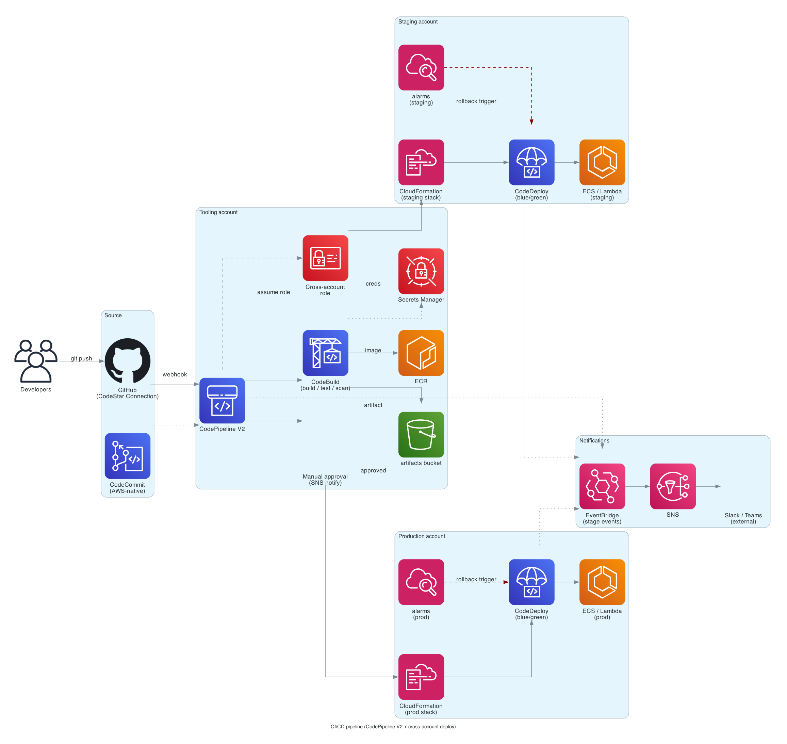

# CI/CD pipeline

> **One-line summary.** GitHub (or CodeCommit) → CodePipeline V2 → CodeBuild → tests → ECR / artifact → CodeDeploy / CloudFormation → staging → manual approval → prod. With OIDC federation, alarm-driven rollback, and notifications via EventBridge.

## TL;DR
- CodePipeline V2 orchestrates the flow; CodeBuild runs builds and tests; CodeDeploy / CloudFormation / SAM deploy.
- **OIDC federation** from GitHub Actions (or other CIs) to AWS — no static AWS keys.
- **CodeDeploy blue/green** for ECS / Lambda with **CloudWatch alarms** wired as automatic rollback triggers.
- **Per-environment promotion** with manual approval before prod.
- **Multi-account** with a central tooling account hosting the pipeline; deploys cross-account into per-env accounts.
- The hardest parts: **cross-account IAM** (least-privilege deploys), **secrets management** (no plaintext in pipelines), **monorepo vs polyrepo strategies**, and **gating on quality** (tests, coverage, security scans, performance smoke tests).

## When to use it
- Any AWS workload with > one engineer / > one environment.
- Greenfield projects standardizing on AWS-native CI/CD.
- Multi-account orgs where CodePipeline's cross-account deploys fit.
- Teams that prefer AWS-native CI to GitHub Actions / CircleCI for the deploy half.

## When NOT to use it
- Teams deeply standardized on GitHub Actions / GitLab CI for build *and* deploy — adding CodePipeline adds friction.
- Tiny projects where `aws s3 sync` from a developer laptop is the whole pipeline (don't pretend it's production then).
- Workloads using **CDK Pipelines** for the self-mutating-pipeline pattern — CDK Pipelines wraps CodePipeline so it's a layer on top.

## Functional Requirements
- On git push: build, test, package.
- Deploy to staging on every successful build.
- Promote to prod with manual approval.
- Roll back automatically on alarm.
- Notify on failure / success.
- Audit trail of every deployment.

## Non-Functional Requirements
- **Pipeline latency**: push → staging deploy in under 15 min for typical projects.
- **Reliability**: pipeline failures alert immediately; flake retries automatic.
- **Security**: no long-lived secrets in CI; cross-account deploys via assumed roles.
- **Auditability**: every deployment recorded in CloudTrail; per-stage approver names captured.

## High-Level Architecture

**Source** (GitHub via CodeStar Connection, or CodeCommit) → **CodePipeline V2** → **CodeBuild** (build / test / lint / security scan) → **ECR** (container) or **S3** (artifact) → **CodeDeploy / CloudFormation** deploys to **staging** → **manual approval action** → **deploy to prod** (with **CloudWatch alarms** as rollback gate). **EventBridge** events on stage transitions → **SNS** / **Slack**. Cross-account deploys use **IAM role assumption** with permission boundaries.

## Detailed components

### Source
- **CodeStar Connections** for GitHub / GitHub Enterprise / Bitbucket / GitLab (OAuth-based, no static tokens).
- **CodeCommit** is reopened to new customers (Nov 2025) — viable AWS-native source.
- **S3 source** for archived artifacts.
- **ECR source** for image-driven pipelines.

### Pipeline (CodePipeline V2)
- V2 adds **triggers** (Git tags, branches with filters), **parameters** (per-execution inputs), **variables** (across stages), **execution modes** (QUEUED / SUPERSEDED / PARALLEL).
- Stages: `Source` → `Build` → `Deploy_Staging` → `Approve` → `Deploy_Prod`.
- Per-stage actions: CodeBuild, CodeDeploy, CloudFormation, ECS, Lambda, S3, Step Functions, Lambda invoke, manual approval.

### Build (CodeBuild)
- `buildspec.yml` in the repo root.
- Compute types: small / medium / large / X-large / 2X-large, ARM (Graviton) / x86, GPU.
- **Lambda compute mode** for sub-second startup on small builds.
- **Reserved capacity** for high-volume CI (cheaper than on-demand at scale).
- **Cache** (S3 + Docker layer cache) to speed repeat builds.
- **VPC mode** when builds need private resources (test DB).
- **Reports** for test results (JUnit / TestNG / etc.) — surfaces pass/fail trends.

### Deploy (per environment)
- **CloudFormation** / **CDK** / **SAM** stack create-or-update with change sets.
- **CodeDeploy blue/green** for ECS / Lambda with traffic shift (Canary / Linear / AllAtOnce).
- **Alarms** attached to the deployment group → automatic rollback on alarm.

### Cross-account deploys
- Tooling account hosts the pipeline.
- Per-environment accounts (dev / staging / prod) host the workloads.
- Pipeline assumes a cross-account role in the target account (least-privileged).
- **Permission boundaries** on the deploy role cap what can be deployed.
- **SCPs** in AWS Organizations enforce account-wide guardrails (no public buckets, etc.).

### Secrets
- **Secrets Manager** for any secret the pipeline needs (DB passwords for integration tests, third-party tokens).
- **OIDC federation** from external CI (GitHub Actions) to AWS — short-lived STS credentials, no static AWS keys.
- For CodePipeline-hosted: use IAM roles + Secrets Manager refs in CodeBuild env vars.

### Notifications
- **EventBridge** rules on pipeline state changes → **SNS** → **Slack / Teams / email**.
- **CloudWatch dashboards** for pipeline duration, success rate, MTTR.

### Multi-environment promotion
- One pipeline, multiple stages — staging → approve → prod is the common shape.
- Or **per-environment pipelines** with manual trigger from a "promotion" pipeline.
- **Environment-specific config** via Parameter Store / Secrets Manager / per-account.

### GitHub Actions alternative (or supplement)
- Many teams use **GitHub Actions** for build + test (faster iteration, richer ecosystem) and **CodePipeline** for AWS deploys.
- Hybrid: GHA pushes container to ECR + manifest to S3; CodePipeline picks up S3 event and deploys.
- **OIDC** from GHA to AWS (no static keys).

### CDK Pipelines
- **CDK Pipelines** is a CDK construct that generates a self-mutating CodePipeline — the pipeline updates itself when its definition changes.
- Right pattern for "the pipeline that deploys the pipeline" — eliminates manual bootstrap drift.

## Cost Notes
For a typical project (1-5 deploys/day, ~10-min builds):
- **CodePipeline V2**: ~$1-5/month (per-action-minute billing).
- **CodeBuild**: ~$20-100/month depending on build duration + frequency.
- **CodeDeploy**: free for EC2 / Lambda / ECS deploys.
- **ECR**: ~$1/month for image storage.
- **CodeStar Connections**: free.
- **EventBridge / SNS / Slack**: pennies.

Levers:
- **Smaller compute types** for builds that don't need them.
- **Cache** aggressively (build cache, Docker layer cache).
- **Lambda compute mode** for fast small builds.
- **Reserved capacity** for high-volume.
- **GHA build, CodePipeline deploy** — GitHub Actions includes generous free build minutes.

## Failure modes
- **Build flake**: configure CodeBuild retry on failure.
- **Deploy fails**: CodeDeploy rolls back if alarms fire; CloudFormation rolls back automatically.
- **Cross-account permission missing**: pipeline fails with `AccessDenied`. Fix the deploy role; re-run.
- **Source rate-limit (GitHub)**: CodeStar Connections handles tokens; rate-limit issues rare. For GHA, use OIDC + cached credentials.

## Alternatives & trade-offs
- **CodePipeline vs GitHub Actions vs GitLab CI**: GHA has the broader build ecosystem; CodePipeline has tighter AWS integration. Many teams use both layered.
- **CodeBuild vs Jenkins / CircleCI**: CodeBuild is fully managed; Jenkins is more configurable but you operate it.
- **CodeDeploy vs Spinnaker / Argo Rollouts**: CodeDeploy is simpler / AWS-native; Spinnaker is multi-cloud; Argo Rollouts is K8s-native canary tooling.
- **One pipeline per service vs monorepo single pipeline**: monorepo single pipeline is simpler for small fleets; per-service pipelines scale better.

## Further reading
- [CodePipeline V2 docs](https://docs.aws.amazon.com/codepipeline/latest/userguide/pipeline-types-planning.html).
- [CDK Pipelines](https://docs.aws.amazon.com/cdk/v2/guide/cdk_pipeline.html).
- [OIDC federation for GitHub Actions](https://docs.aws.amazon.com/IAM/latest/UserGuide/id_roles_providers_create_oidc.html).
- [CodeDeploy blue/green](https://docs.aws.amazon.com/codedeploy/latest/userguide/deployment-configurations.html).
- Related: [CodePipeline](../01-services/devops/codepipeline.md), [CodeBuild](../01-services/devops/codebuild.md), [CodeDeploy](../01-services/devops/codedeploy.md), [CDK](../01-services/devops/cdk.md), [SAM](../01-services/devops/sam.md).
