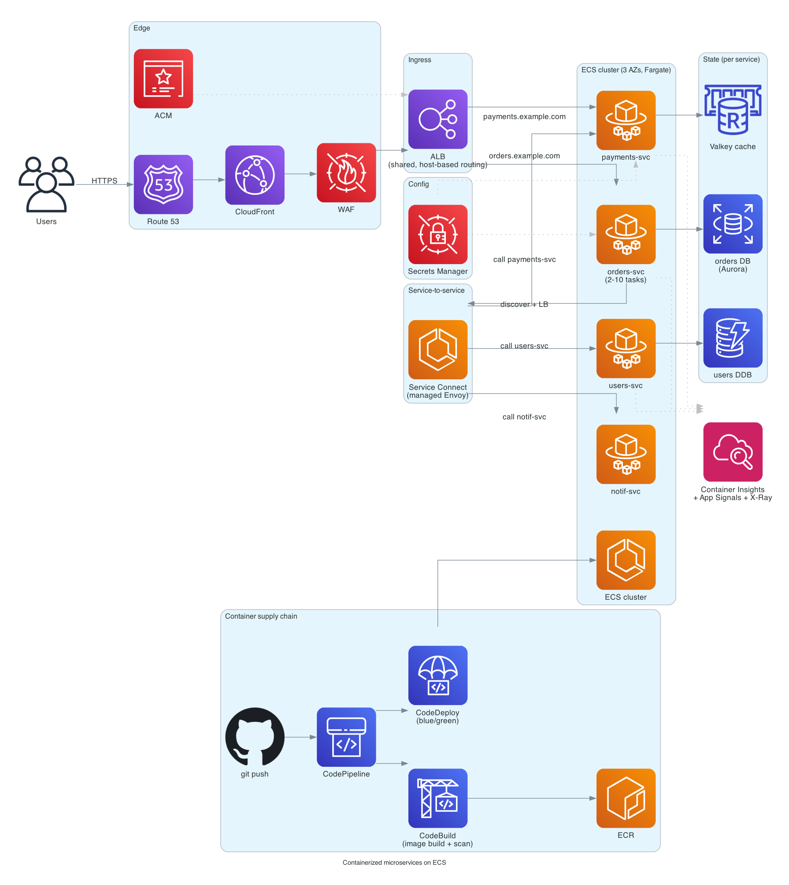

# Containerized microservices on ECS

> **One-line summary.** Many small ECS services on Fargate, fronted by ALBs (one shared, host-based routing), discovered via ECS Service Connect, deployed via CodeDeploy blue/green — the AWS-native answer to "we want microservices without operating Kubernetes."

## TL;DR
- **ECS** is the lower-friction container orchestrator on AWS. **Fargate** removes node management. **ECS Service Connect** is the modern service-mesh-style discovery + traffic-shifting layer.
- **ECS Express Mode** (launched 2025-11) is the single-command path for greenfield services — auto-provisions ALB, Fargate service, autoscaling, security groups, generated URL. Shares the ALB across up to 25 services (cost win).
- **CodeDeploy blue/green** for ECS gives alarm-driven automatic rollback. **CodePipeline** orchestrates the source → build → deploy flow.
- **ECR + image scanning** (Inspector) for the container supply chain.
- The hardest parts at scale: **cross-AZ data transfer** (chatty services with no topology hints), **per-service ALB sprawl** (each ALB has hourly cost), **IAM for cross-service calls** (task roles per service, scoped), and **observability across the fleet** (Container Insights + Application Signals).

## When to use it
- Microservices on AWS where the team doesn't want Kubernetes' operational tax.
- Greenfield apps where speed-to-production matters more than ecosystem portability.
- Workloads with mixed Lambda + container services (ECS integrates more cleanly with the rest of AWS than EKS does).
- Teams already invested in CDK / CloudFormation IaC.

## When NOT to use it
- Workloads with hard portability requirements (multi-cloud, on-prem) — use **EKS**.
- Teams already deeply invested in Kubernetes / Helm / Argo / etc. — use **EKS**.
- Single-service workloads — **App Runner** (closed to new customers), **ECS Express Mode**, or **Lambda** is simpler.
- Long-running batch — **AWS Batch** is purpose-built.

## Functional Requirements
- Many independent services, each deployable / scalable on its own.
- Service discovery (service A calls service B by name).
- HTTP / gRPC ingress from public.
- mTLS / authorization between services (optional).
- Per-service auto-scaling on CPU / memory / queue depth.
- Blue/green or canary deploys with rollback.
- Centralized logging / tracing.

## Non-Functional Requirements
- **Latency**: per-service p99 < 200 ms.
- **Availability**: 99.95%+ per service.
- **Throughput**: each service scales to 10K+ RPS.
- **Recovery**: failed tasks replaced within ~30 s.

## High-Level Architecture

**Edge**: CloudFront + WAF → **ALB** (shared, with host-based routing per service). **App tier**: many **ECS services** on **Fargate** (or Fargate Spot for non-critical), each with its own task definition. **Service-to-service** via **ECS Service Connect** (Envoy-based, managed by ECS). **State**: per-service data stores (DynamoDB / RDS / ElastiCache). **Observability**: Container Insights + Application Signals + X-Ray. **CI/CD**: CodePipeline → CodeBuild → ECR → CodeDeploy blue/green.

## Detailed components

### Compute (ECS + Fargate)
- One **ECS cluster** per environment (dev / staging / prod), often per Region.
- One **ECS service** per microservice (`orders-service`, `payments-service`, etc.).
- **Task definition** per service: container image, CPU / memory, env vars, IAM task role, secrets refs.
- **Capacity providers**: `FARGATE` (on-demand) + `FARGATE_SPOT` (with weights and base counts) for cost.
- **Auto-scaling**: target-tracking on CPU, memory, ALB request count per target, or custom CloudWatch metrics.

### Networking
- VPC across 3 AZs, private subnets for tasks (Fargate gets ENIs in `awsvpc` mode).
- **NAT Gateway per AZ** for outbound (or VPC Endpoints for AWS-service traffic to skip NAT).
- **Security groups**: per-service SG references the previous-hop SG (no CIDRs in production).

### Ingress
- **ALB shared across services** with host- or path-based listener rules (`orders.example.com` → orders target group, `payments.example.com` → payments). Cap is 100 rules per listener (raisable); split across listeners for more.
- For internal services: separate **internal ALB** in private subnets.
- **CloudFront** in front of public ALB(s) for global edge + Shield + caching.

### Service discovery
- **ECS Service Connect** (recommended) — managed Envoy sidecar, DNS service discovery, health-aware client-side load balancing, automatic retries, native CloudWatch metrics.
- For non-Service-Connect-friendly cases: **AWS Cloud Map** (which Service Connect uses under the hood).
- **Don't reach for App Mesh** — it's being discontinued 2026-09-30. New work uses Service Connect or VPC Lattice.

### Container registry
- **ECR** private registries per service.
- **Inspector** scans images on push for CVEs.
- **ECR pull-through cache** mirrors public images (Docker Hub, GHCR, public ECR) to avoid rate limits.
- **Lifecycle policies** delete old images to control storage cost.

### Secrets + config
- **Secrets Manager** for credentials (DB passwords, third-party API keys), referenced from task definitions (`secrets` field).
- **Parameter Store** for non-secret config.
- **AppConfig** for runtime feature flags with alarm-gated rollback.

### State stores per service
- Different services pick different stores:
  - Transactional service → **RDS / Aurora**.
  - High-cardinality KV → **DynamoDB**.
  - Cache → **ElastiCache / DAX**.
  - Search → **OpenSearch**.
- **Database-per-service** is the microservices best-practice; avoid shared DBs.

### Observability
- **CloudWatch Container Insights** for cluster / service / task metrics.
- **CloudWatch Logs** for stdout/stderr (`awslogs` driver in task def).
- **Application Signals** for auto-USE/RED + SLOs.
- **X-Ray** for distributed traces (via ADOT collector sidecar or SDK).

### CI/CD
- **CodePipeline** triggered on git push.
- **CodeBuild** builds the image, pushes to ECR, optionally runs Inspector scan.
- **CodeDeploy** deploys to ECS using blue/green:
  - Two target groups (green = current, blue = new).
  - Traffic shift per chosen pattern (Linear / Canary / AllAtOnce).
  - CloudWatch alarms for rollback gating.
- **Per-environment promotion** with manual approval before prod.

### Deploy strategies
- **Rolling** (ECS default) — replace tasks one batch at a time. Fast, brief mixed-version window.
- **Blue/green** (CodeDeploy) — full new task set; cutover; rollback by switching target group back. Cleaner, higher cost during deploy (2× tasks briefly).
- **Canary** (CodeDeploy with traffic-shift config) — 10% for 5 min, then 100%; rollback on alarm.

## Cost Notes
For ~10 small Fargate services (each 2 tasks, ~0.5 vCPU / 1 GB):
- **Fargate**: ~$200-400/month (steady-state).
- **ALB**: ~$25/month per ALB. **One shared ALB** vs many is a meaningful saving — Express Mode shares automatically.
- **NAT Gateway** × 3 AZs: ~$100/month base + per-GB.
- **CodePipeline + CodeBuild**: low ($10-30 with frequent deploys).
- **ECR**: pennies for image storage.
- **CloudWatch Logs**: dependent on log volume.

Levers:
- **Fargate Spot** for non-critical services (~70% cheaper).
- **ARM (Graviton) Fargate** — 20% cheaper.
- **Shared ALB** with host-based routing.
- **VPC Endpoints** to skip NAT for AWS-service traffic.
- **Reserved Fargate capacity** (Compute Savings Plans) for steady workloads.

## Failure modes
- **Single task failure**: ECS replaces; ALB removes from target group briefly.
- **AZ failure**: tasks in other AZs absorb; ECS schedules replacements.
- **Bad deploy**: alarm-driven CodeDeploy rollback.
- **ECR push fails**: blocks the pipeline; alert.
- **Region failure**: rare; for multi-Region active-active see [multi-region-active-active pattern](../02-patterns/multi-region-active-active.md).

## Alternatives & trade-offs
- **ECS vs EKS**: ECS is simpler / AWS-native; EKS is portable / has ecosystem. For AWS-only teams, ECS is usually the right default — see [kubernetes-on-eks](kubernetes-on-eks.md).
- **Fargate vs EC2**: Fargate has zero node ops; EC2 (with Spot + Savings Plans) is cheaper at high steady-state utilization.
- **ALB vs ECS Service Connect for internal traffic**: Service Connect is cheaper and richer for pure service-to-service. ALB for HTTP ingress.
- **Service Connect vs VPC Lattice vs App Mesh**: Service Connect is the AWS-native ECS-native answer. VPC Lattice is the cross-account / cross-VPC option. App Mesh is closing 2026-09-30 — don't start there.

## Further reading
- [ECS Express Mode](https://docs.aws.amazon.com/AmazonECS/latest/developerguide/express-service-overview.html).
- [ECS Service Connect](https://docs.aws.amazon.com/AmazonECS/latest/developerguide/service-connect.html).
- [CodeDeploy blue/green for ECS](https://docs.aws.amazon.com/AmazonECS/latest/developerguide/deployment-type-bluegreen.html).
- Related: [ECS](../01-services/compute/ecs.md), [Fargate](../01-services/compute/fargate.md), [ECR](../01-services/compute/ecs.md), [CodePipeline](../01-services/devops/codepipeline.md), [kubernetes-on-eks](kubernetes-on-eks.md).
