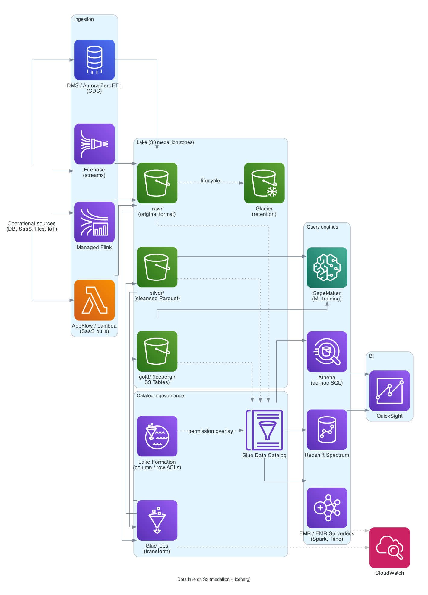

# Data lake on S3

> **One-line summary.** S3 as the single durable substrate for analytical data; Glue Data Catalog as the metadata; Athena / Redshift Spectrum / EMR / Spark / Trino as the query engines. Add Apache Iceberg or S3 Tables for ACID + time travel.

## TL;DR

- The modern data-lake pattern on AWS: **raw / clean / curated** zones in S3 (Parquet preferred), **Glue Data Catalog** as the metastore, **Lake Formation** for governance, **Athena** for serverless SQL, **Redshift Spectrum / EMR / SageMaker** for heavier work, **QuickSight** for BI.
- **Apache Iceberg** (or **S3 Tables** — managed Iceberg) on top of the lake gives ACID transactions, schema evolution, time-travel queries — turning the lake into a "lakehouse."
- **Ingestion**: batch (DMS / AppFlow / Glue jobs) + streaming (Kinesis Firehose / MSK / Managed Flink) — both land in S3.
- **Cost levers** dominate the design: tier old data to Glacier; partition by date for partition pruning; Parquet/ORC for compression and column pruning.
- The hardest parts in production: **data quality** (without governance, the lake becomes a swamp), **partition design** (wrong choice = slow queries forever), **schema evolution**, and **per-consumer permissions** (Lake Formation).

## When to use it

- Analytical workloads where the data outgrows a single warehouse.
- ML training data at scale.
- Aggregating data from many sources (operational DBs, SaaS, IoT, logs).
- Multi-engine querying (Athena for ad-hoc, EMR for heavy, Redshift for curated marts).
- Cheap long-term retention with occasional query.

## When NOT to use it

- Transactional workloads (use RDS / Aurora / DynamoDB).
- Sub-second analytical queries on small data (use a warehouse with caching).
- Workloads where one engine fits perfectly — e.g., pure Snowflake / BigQuery / Databricks shop without AWS-native lock-in concerns.

## Functional Requirements

- Ingest data from many sources (DBs, SaaS, files, streams).
- Store raw, transformed, and curated zones.
- Discover datasets via a catalog.
- Query via SQL / Spark / ML notebooks.
- Govern access per-table / per-column / per-row.
- Track lineage and quality.
- Tier hot to cold for cost.

## Non-Functional Requirements

- **Scale**: petabytes; thousands of tables; hundreds of consumers.
- **Query latency**: seconds (Athena) to minutes (EMR) — not interactive.
- **Cost**: dominant lever is storage class + scan reduction.
- **Durability**: eleven 9s (S3 default).
- **Governance**: fine-grained per-column access, audit trail.

## High-Level Architecture

**Ingestion**: DMS for DB CDC, Kinesis Firehose for streams, AppFlow for SaaS, Glue jobs for batch transforms. Land raw data in S3 `raw/` zone (often per-source).

**Catalog**: Glue Crawlers discover schemas; Glue Data Catalog tables map S3 prefixes to query-able tables. Lake Formation overlays fine-grained permissions.

**Transformation**: Glue / EMR / Athena CTAS / Spark jobs read raw → write curated zones (`silver`, `gold`) in Parquet (or Iceberg / S3 Tables for ACID).

**Consumption**: Athena (serverless SQL), Redshift Spectrum (warehouse + lake), EMR (Spark / Trino / Hive), SageMaker (ML), QuickSight (BI), partner tools (Snowflake, Databricks via federated catalogs).

## Detailed components

### S3 zones

Common pattern (medallion architecture):

- **`s3://lake/raw/`** — landed exactly as received. Original format (JSON, CSV, Avro).
- **`s3://lake/silver/`** — cleaned, normalized, conformed schemas. Parquet.
- **`s3://lake/gold/`** — business-ready aggregates / models. Parquet or Iceberg.

Partition by date (`year=/month=/day=/`) at minimum; per-source where access patterns dictate.

### Glue Data Catalog

The shared metastore — Athena, EMR, Redshift Spectrum, Lake Formation, even Snowflake (via external catalogs) all read from here.

- **Database** per domain / team.
- **Tables** map S3 prefixes to schemas.
- **Partitions** registered via crawlers or partition projection.

### Lake Formation

- Centralizes permissions on the Catalog (column / row / cell-level grants).
- LF-Tags for tag-based access control.
- Cross-account sharing via Resource Links + AWS RAM.
- Required for any lake with > one team.

### Apache Iceberg / S3 Tables

- **Iceberg** = table format on top of Parquet. ACID transactions, schema evolution, time travel.
- **S3 Tables** = AWS-managed Iceberg with automatic maintenance (compaction, snapshot expiration). The path of least resistance for new lakes.
- Solves the "small files problem," makes mutable data tractable.

### Ingestion paths

- **CDC from operational DBs**: DMS replicates → S3 (Parquet output). Or Aurora Zero-ETL → Redshift (skipping the lake).
- **Streams**: Kinesis Data Firehose → S3 (Parquet conversion with Glue schema).
- **SaaS**: AppFlow connectors (Salesforce, ServiceNow, etc.) → S3.
- **Batch files**: SFTP via Transfer Family → S3, or DataSync from on-prem.
- **APIs**: Lambda scrapes / pulls → S3.

### Transformation

- **Glue jobs** (Spark) for batch ETL.
- **Glue Studio** for visual job authoring.
- **Athena CTAS / INSERT** for SQL-based transforms (results written back to the lake).
- **EMR** for heavier Spark / Hive / Trino workloads (or **EMR Serverless** for pay-per-job).
- **Managed Flink** for streaming-to-lake.

### Query engines

- **Athena**: serverless SQL; pay per TB scanned. Default for ad-hoc.
- **Redshift Spectrum**: query S3 from Redshift with `EXTERNAL TABLE` definitions.
- **EMR**: Spark / Trino / Hive for heavy / custom workloads.
- **SageMaker**: notebooks reading S3 directly for ML.
- **QuickSight**: dashboards on top of Athena / Redshift.

### Governance

- **Lake Formation** for permissions.
- **Glue Data Quality** for SLA-grade quality rules per table.
- **DataZone** for catalog discovery + business glossary across teams.
- **CloudTrail data events on S3** for audit.

## Cost Notes

Storage is the biggest line item:

- **S3 Standard** for hot tier (frequent query).
- **S3 Intelligent-Tiering** for unknown access patterns (auto-tier).
- **S3 Glacier Instant Retrieval** for cold-but-queryable.
- **Glacier Deep Archive** for compliance retention.

Lifecycle policies:

- Raw zone: 90 days Standard → IA → Glacier Instant → Deep Archive after a year.
- Silver/gold: hot for the query window your BI needs; cold beyond.

Query costs:

- **Athena**: $5 per TB scanned. **Parquet + partition pruning** brings this down 10-100×.
- **Redshift Spectrum**: similar per-TB-scanned + cluster cost.
- **EMR Serverless**: per worker-vCPU-hour.

Compute levers:

- **Convert raw JSON / CSV to Parquet** (the single biggest cost win).
- **Partition by query predicates** (date is the universal first pick).
- **Compact small files** (Iceberg / S3 Tables do this automatically).

## Failure modes

- **Schema drift**: a source DB adds a column; downstream queries break. Use Glue Schema Registry + automated quality checks.
- **Partition explosion**: too many small partitions = slow query planning. Use partition projection (Athena) or coarser granularity.
- **Small-files problem**: many small Parquet files = slow scans. Iceberg / S3 Tables compaction or Glue compaction jobs.
- **Permission sprawl**: per-resource Lake Formation grants in a lake with 10K tables = unmaintainable. Use LF-Tags.

## Operating model

- **Data engineering team** owns the ingestion + transformation pipelines.
- **Data producers** (operational service teams) own raw data quality + schema.
- **Data consumers** (analytics, ML, BI) own curated zones + downstream SLAs.
- **Lake Formation admins** govern access.

Many orgs adopt **data mesh** principles (domain-oriented ownership) on top of this stack.

## Alternatives & trade-offs

- **Lake vs warehouse**: lake is cheaper to store, harder to query. Warehouse (Redshift / Snowflake) is faster to query, more expensive to scale storage. Modern lakehouses (Iceberg / S3 Tables + Redshift Spectrum) close the gap.
- **Glue vs EMR**: Glue is serverless, simpler; EMR is more powerful for heavy / customized Spark.
- **Iceberg vs Hudi vs Delta Lake**: Iceberg is the most widely adopted; Delta is Databricks-centric; Hudi is mature but less common on AWS-native. AWS picked Iceberg (S3 Tables = managed Iceberg).
- **Snowflake / Databricks on AWS**: complete alternative platforms. Lower operational burden, higher software cost. AWS-native is more flexible but more pieces to assemble.

## Further reading

- [Lake Formation documentation](https://docs.aws.amazon.com/lake-formation/).
- [Apache Iceberg in AWS](https://docs.aws.amazon.com/prescriptive-guidance/latest/apache-iceberg-on-aws/welcome.html).
- [S3 Tables](https://aws.amazon.com/s3/features/tables/).
- [DataZone](https://docs.aws.amazon.com/datazone/).
- Related: [S3](../01-services/storage/s3.md), [Glue](../01-services/analytics/glue.md), [Athena](../01-services/analytics/athena.md), [Lake Formation](../01-services/analytics/lake-formation.md), [Redshift](../01-services/database/redshift.md), [data-warehouse-redshift](data-warehouse-redshift.md).
