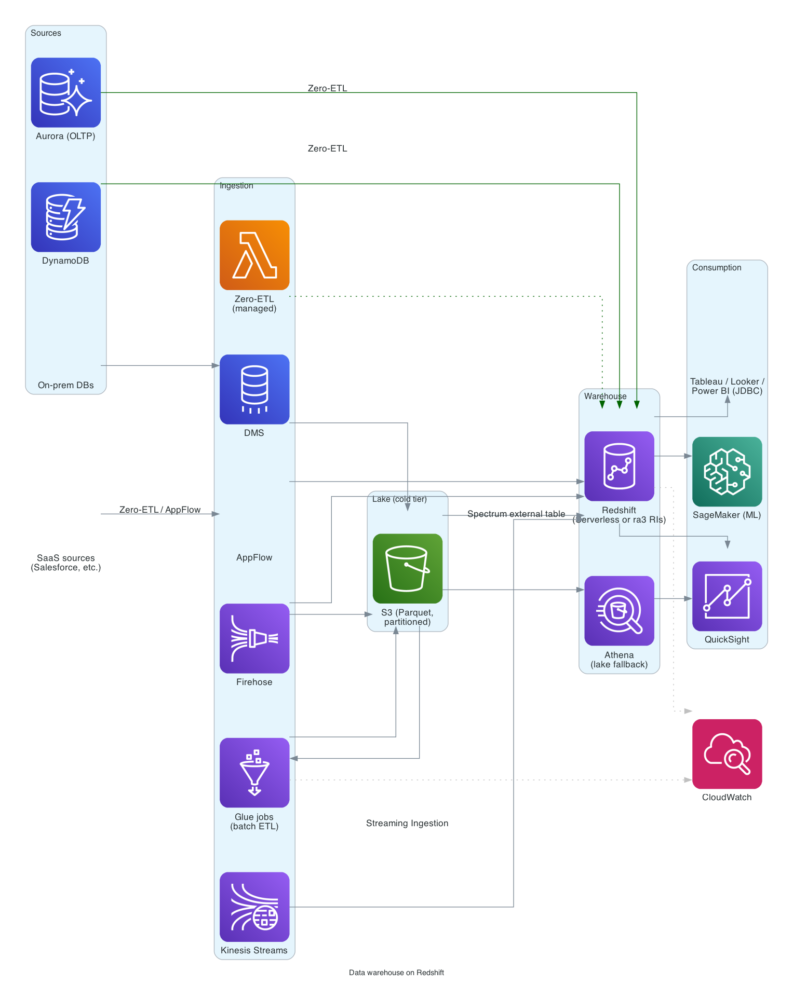

# Data warehouse on Redshift

> **One-line summary.** Centralized columnar warehouse for SQL analytics + BI. Redshift Serverless or provisioned `ra3` clusters; Spectrum for the lake; Zero-ETL from operational DBs; QuickSight for dashboards.

## TL;DR
- **Redshift** is the right choice when you want a real warehouse with SQL semantics: dim/fact star schemas, materialized views, complex joins, BI tools (QuickSight / Tableau / Looker / Power BI).
- **Redshift Serverless** for variable / unknown workloads (pay per RPU-second when queries run); **provisioned `ra3`** for sustained heavy workloads (cheaper with Reserved Instances).
- **Zero-ETL** from Aurora MySQL / PostgreSQL / RDS MySQL / DynamoDB / Salesforce / SAP / ServiceNow / Zendesk skips the explicit ETL pipeline — managed continuous replication.
- **Spectrum** queries S3 directly (lake + warehouse hybrid). **Athena** is the lake-first alternative.
- Pairs with [data-lake-on-s3](data-lake-on-s3.md) — most production setups have both.
- The hardest parts: **distribution + sort key design** (wrong choice = slow queries forever), **concurrency** under BI bursts, **cost control** with Spectrum scans, and **data freshness vs query latency** trade-offs.

## When to use it
- BI dashboards and reports with sub-second query expectations on aggregated data.
- Multi-source data integration where SQL is the lingua franca.
- Workloads where the data fits in a warehouse-shaped schema (star / snowflake).
- Federation across warehouse + lake (Spectrum).
- Migrating from on-prem Teradata / Oracle DW / Netezza.

## When NOT to use it
- Pure event analytics on petabytes — lake + Athena / EMR may be cheaper.
- Real-time streaming analytics — use streaming-first tools (Flink, Pinot, Druid).
- Transactional workloads — RDS / Aurora / DynamoDB.
- Workloads dominated by ad-hoc queries on unpartitioned raw data — lake is cheaper.

## Functional Requirements
- Load data from operational sources (DBs, SaaS, files).
- Transform via SQL (dbt-style) or pre-staged ETL.
- Serve BI dashboards.
- Ad-hoc analytical SQL.
- Share data with consumer accounts (data sharing).

## Non-Functional Requirements
- **Query latency**: dashboard queries p95 < 5 s; ad-hoc up to minutes.
- **Concurrency**: dozens to hundreds of concurrent users.
- **Freshness**: minutes (Zero-ETL) to hours (batch ETL).
- **Cost**: dependent on tier; reserved capacity for steady state.

## High-Level Architecture

**Sources**: operational Aurora / RDS / DynamoDB via **Zero-ETL** → Redshift. SaaS via **AppFlow** / Zero-ETL partner connectors. Batch / streaming via **Glue** / **Firehose** → S3 → Redshift COPY (or Spectrum direct query).

**Warehouse**: **Redshift Serverless** or **provisioned cluster** with **Reserved Instances**. **Spectrum** queries S3 directly for the cold tier. **Materialized views** + **auto-refresh** for common aggregates. **Result caching** for repeat dashboard hits.

**Consumption**: **QuickSight** for dashboards; **Athena** for cross-engine ad-hoc; **SageMaker** for ML on warehouse data; partners (Tableau / Looker / Power BI) via JDBC/ODBC.

**Data sharing**: producer cluster shares specific tables to consumer accounts via read-only data shares.

## Detailed components

### Cluster shape
- **Provisioned `ra3` cluster** — `ra3.xlplus`, `ra3.4xlarge`, `ra3.16xlarge`. Managed Storage (RMS) decouples compute from storage. Right default for steady-state workloads.
- **Redshift Serverless** — RPU-based; auto-scales; pay only when queries run. Right for variable / unknown / dev-test workloads.
- **Multi-AZ** for HA on provisioned clusters.

### Schema design
- **Star schema** (one fact table + many dimensions) or **snowflake** for typical BI.
- **Distribution key (`DISTKEY`)**: column used to colocate rows for joins. Get this wrong and you'll re-distribute terabytes per query.
- **Sort key (`SORTKEY`)**: physical ordering on disk. Compound for range queries.
- **`AUTO`** distribution and sort keys are the right default in 2026 — let Redshift's auto-design handle most cases; explicit only when you know better.

### Loading
- **COPY from S3** (bulk loads).
- **Zero-ETL** from Aurora / RDS / DynamoDB / SaaS — continuous, managed.
- **Redshift Streaming Ingestion** from Kinesis Data Streams / MSK — direct, low-latency.
- **DMS** for on-prem / legacy sources.
- **Glue jobs** for arbitrary ETL into staging tables.

### Spectrum
- Query data in S3 without loading.
- External tables in Glue Data Catalog.
- Pay per TB scanned + small per-query.
- Great for the cold tier ("query historical data sometimes") + lakehouse setups.

### Concurrency
- **Workload Management (WLM)**: queue management for concurrent queries. Auto WLM is the default; manual WLM for guaranteed concurrency per queue.
- **Concurrency Scaling**: auto-spin transient clusters to absorb concurrent-query bursts. First hour / day / cluster is free; per-second beyond.

### Materialized views
- Pre-compute joins + aggregates.
- **Auto-refresh** on base-table changes.
- Massive performance lever for repeated dashboard queries.

### Result caching
- Identical query + unchanged data → cached result in ms.
- Free; on by default.

### Data sharing
- **Datashares**: producer cluster grants read-only access to specific schemas/tables.
- Consumer cluster reads without copying.
- Cross-account + cross-Region supported.
- Standard pattern for multi-team data platforms.

### Security
- **VPC**-deployed; private endpoints.
- **IAM authentication** for users (federated via SSO).
- **Lake Formation** governs Spectrum access.
- **KMS encryption** at rest; TLS in transit.
- **Audit logs** to S3.

## Cost Notes
Indicative for a small production cluster:
- **`ra3.xlplus` Multi-AZ** (4 nodes): ~$3K/month base.
- **Reserved 1-year**: ~$2K/month (~33% savings).
- **Reserved 3-year**: ~$1.5K/month (~50% savings).
- **RMS storage**: ~$0.024 / GB-month (cheap; storage decoupled).
- **Spectrum**: ~$5 / TB scanned.
- **Concurrency Scaling**: first hour/day/cluster free.

Levers:
- **Reserved Instances** for steady workloads (huge savings).
- **Right-size the cluster** — start small, scale up.
- **Redshift Serverless** for non-steady workloads.
- **Materialized views** to skip recomputing common aggregates.
- **Spectrum for cold data** instead of loading everything.
- **Partition pruning + Parquet** for Spectrum cost.

## Failure modes
- **Cluster node failure**: auto-replaced; cluster pauses briefly.
- **Hot query saturates**: Concurrency Scaling absorbs; investigate slow query plan.
- **Bad ETL load**: re-run from staging table; transactional COPY semantics protect mid-load failures.
- **Region failure**: cross-Region snapshot copy + standby cluster restoration (manual or scripted).

## Operating model
- **Data engineering** owns ingestion / transformation.
- **Analytics engineering** (dbt-style) owns warehouse models (curated marts).
- **Analysts** consume via SQL / BI.
- **dbt** is the canonical SQL-as-code transformation tool on top.

## Alternatives & trade-offs
- **Redshift vs Snowflake**: Snowflake is multi-cloud, more "set it and forget it." Redshift is AWS-native, deep AWS integration, sometimes cheaper at scale.
- **Redshift vs BigQuery**: BigQuery is fully serverless, GCP-native. Redshift Serverless closes the gap.
- **Redshift vs Athena**: Athena is fully serverless on S3; Redshift is dedicated cluster + faster joins / concurrency. Most large orgs use both.
- **Provisioned vs Serverless**: Serverless wins for variable workloads; Provisioned + RIs for steady-high.
- **Zero-ETL vs DMS**: Zero-ETL is managed and continuous; DMS is more flexible (cross-engine, transformations). Use Zero-ETL when it covers the source.

## Further reading
- [Redshift best practices](https://docs.aws.amazon.com/redshift/latest/dg/best-practices.html).
- [Redshift Zero-ETL integrations](https://docs.aws.amazon.com/redshift/latest/mgmt/zero-etl-using.html).
- [Redshift Spectrum](https://docs.aws.amazon.com/redshift/latest/dg/c-using-spectrum.html).
- [dbt on Redshift](https://docs.getdbt.com/reference/warehouse-setups/redshift-setup).
- Related: [Redshift](../01-services/database/redshift.md), [data-lake-on-s3](data-lake-on-s3.md), [streaming-etl-kinesis](streaming-etl-kinesis.md), [batch-etl-glue](batch-etl-glue.md).
