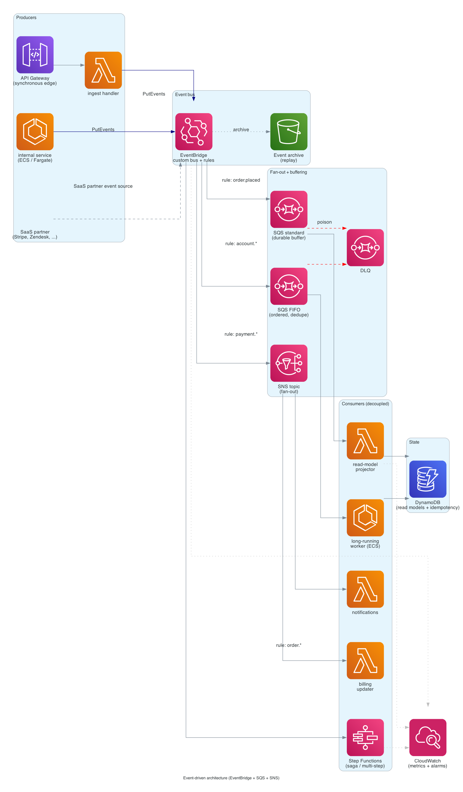

# Event-driven architecture

> **One-line summary.** EventBridge as the durable event bus, SNS for fan-out, SQS for buffering, Lambda / ECS / Step Functions as decoupled consumers. The default shape for SaaS backends and microservices on AWS.

## TL;DR

- **EventBridge** is the central nervous system: producers `PutEvents` to a custom event bus, rules route events to targets by attribute matching.
- **SNS** is for fan-out to many sync subscribers (mobile push, email, HTTP webhooks). **SQS** is for queue-based decoupling and backpressure.
- **Step Functions** orchestrates multi-step flows (sagas, retries, human approval). **Lambda** handles per-event compute; **ECS / Fargate** handles long-running consumers.
- Idempotency, exactly-once semantics, and ordering are explicit design decisions — AWS gives you the primitives but doesn't decide for you.
- Picks event-driven choreography over RPC choreography for loose coupling, retries, replay, and observable event flow.

## When to use it

- SaaS backends with many "if X happens, do Y" rules.
- Microservices that need to evolve independently (no shared DB, no synchronous fanout).
- Workflows with retries, compensation, or human approval steps.
- Multi-tenant systems that need per-tenant filtering / rate-shaping.
- Integrations with SaaS partners (Stripe, Zendesk, GitHub) where partner events should drop into the same bus as internal events.

## When NOT to use it

- Strict request/response latency budgets where the producer needs the consumer's answer in-line — use direct invocation.
- Tiny apps where everything can live in one Lambda + one table — adding a bus is over-engineered.
- Workloads needing strong global ordering across all events — EventBridge does not guarantee order; FIFO SQS gives per-message-group ordering only.

## Functional Requirements

- Producers emit domain events (`OrderPlaced`, `PaymentSucceeded`, `UserSignedUp`) without knowing who consumes them.
- Multiple consumers can react to the same event independently.
- Failed event handling retries automatically; poison events land in a DLQ.
- Events can be replayed for backfills / new consumers.
- SaaS partner events route into the same bus as internal events.

## Non-Functional Requirements

- **Throughput**: EventBridge default 10,000 `PutEvents` / second per Region (raise via quota request).
- **Latency**: producer → consumer typically 100–500 ms end-to-end (not for sub-100 ms RPC).
- **Durability**: EventBridge replicates events across AZs; archived events retained up to indefinitely.
- **Reliability**: at-least-once delivery; consumers must be idempotent.

## High-Level Architecture

Producers (**API Gateway** + Lambda, internal services, **SaaS partner event sources**) call `PutEvents` against a **custom EventBridge bus**. **Rules** filter events by JSON attribute match and forward to targets: **SNS topics** for fan-out to many subscribers, **SQS** queues for durable buffering, **Step Functions** for multi-step orchestration, **Lambda** for per-event compute. The bus optionally **archives** all events to S3 for replay. **DLQs** on every consumer catch poison messages.

## Detailed components

### EventBridge bus

- **Custom event bus** per bounded context (e.g., `orders-bus`, `billing-bus`). Avoid using the default bus for app events — it's a noisy junk drawer.
- **Schema Registry** (optional) discovers event shapes and generates code bindings.
- **Rules** match on event attributes (`detail-type`, `source`, JSON content) — keep them narrow so adding consumers doesn't accidentally trigger old rules.
- **Cross-account / cross-Region targets** are first-class — share events between accounts via resource policies.
- **Archive + replay** retains events for backfills; turn it on from day one.
- **PutEvents quota**: 10K/sec default per Region. Use `PutEvents` batches of up to 10 entries to amortize API calls.

### SNS topics (fan-out)

- One topic per event class with many subscribers (`OrderPlaced` → email, push, internal services, partner webhooks).
- **Message filtering** at the subscription level so each subscriber only sees what it cares about.
- **FIFO topics** when ordering matters; standard topics for everything else.
- **HTTPS subscriptions** for external webhooks; SNS handles retries with exponential backoff.

### SQS queues (buffering)

- **Standard queues** for high throughput, at-least-once delivery, no ordering guarantee.
- **FIFO queues** for per-`MessageGroupId` ordering and deduplication.
- **Visibility timeout** ≥ consumer's longest expected processing time × 2.
- **Long polling** (`WaitTimeSeconds=20`) cuts empty-receive cost.
- **DLQs** on every queue with `maxReceiveCount` ~ 5; a CloudWatch alarm on DLQ depth pages on-call.
- **Server-side encryption** on by default.

### Lambda consumers

- One Lambda per consumer concern (one for projections, one for notifications, etc.).
- **Idempotency** is mandatory — use **Lambda Powertools** idempotency module backed by DynamoDB.
- **Batch size** + **partial batch response** (`reportBatchItemFailures`) tunes throughput vs blast radius of a poison message.
- **Reserved concurrency** to protect downstream services (e.g., RDS) from overload.

### Step Functions (orchestration)

- For multi-step workflows: **saga** (compensating actions on failure), **human approval**, retries with exponential backoff, parallel branches.
- **Express workflows** (sub-second, high throughput) for synchronous event handling; **standard workflows** for long-running (up to 1 year).
- **`.waitForTaskToken`** to wait on async callbacks.

### Long-running consumers (ECS)

- Workloads exceeding Lambda's 15-min ceiling, needing big memory, or holding open connections (databases, MQTT, ftp) — run on **ECS Fargate** consuming SQS via [service auto scaling on queue depth](https://docs.aws.amazon.com/AmazonECS/latest/developerguide/service-auto-scaling.html).
- ECS target tracking on **`ApproximateNumberOfMessagesVisible`** scales the worker count up/down with queue depth.

### State (DynamoDB)

- **Read models / projections** materialized from events.
- **Idempotency table** with TTL (1-7 days) backing Powertools.
- **Streams** can re-emit changes back to EventBridge via **EventBridge Pipes** for CDC patterns.

### Observability

- **CloudWatch metrics** on EventBridge rule invocations, SQS depth, DLQ depth, Lambda errors / throttles, Step Functions execution outcomes.
- **CloudWatch alarms** on DLQ depth, rule failure rate, and consumer lag.
- **X-Ray** distributed tracing across producers and consumers — EventBridge propagates the trace header.
- **CloudWatch Application Signals** for auto-USE/RED metrics across services.

## Cost Notes

Indicative cost for ~100M events/month, average 1 KB:

- **EventBridge**: $1/million events → ~$100/month.
- **SNS**: $0.50/million publishes + delivery → tens of $/month depending on subscribers.
- **SQS**: $0.40/million requests → ~$40/month at 100M.
- **Lambda**: depends on duration; typically $100-500/month at this scale.
- **DynamoDB on-demand**: $1.25/million writes; tune for projection write rate.

**Typical cost: $300-1000/month at 100M events/month**, dominated by Lambda + EventBridge + DynamoDB writes.

Levers:

- **Batch `PutEvents`** (up to 10 entries) to cut API calls.
- **Lambda ARM64 / Graviton** — 20% cheaper.
- **EventBridge schema-discovery off** in non-prod.
- **Sample archived events** instead of archiving 100% if replay is rare.

## Failure modes

- **Consumer down**: SQS buffers; queue depth alarms; DLQ catches what fails too many times.
- **Poison event**: DLQ + redrive after fix; without a DLQ, blocks the queue.
- **EventBridge rule misconfigured**: events silently dropped — alarm on `FailedInvocations` and `Invocations==0` for critical rules.
- **Schema drift**: producer changes event shape, consumers break. Mitigation: versioned schemas (`order.placed.v1`, `.v2`); add new fields, never remove.
- **Out-of-order delivery**: standard SNS/SQS/EventBridge don't preserve order. If order matters, use **FIFO SQS** with a `MessageGroupId` (e.g., per `customerId`).
- **Duplicate delivery**: at-least-once means consumers must dedupe by **idempotency key** (event ID or business key).
- **Region-wide EventBridge outage**: rare; for multi-Region, replicate events with EventBridge → cross-Region rule, or write events to two buses from the producer.

## Migration / adoption

1. Start with one bounded context and one custom bus.
2. Producer publishes events alongside existing synchronous calls (dual-write to bus + RPC) — verify event shape and consumer reliability.
3. Move consumers off RPC onto the bus, one at a time.
4. Retire synchronous calls.
5. Add archive + replay before adding a second bounded context.

## Alternatives & trade-offs

- **Direct Lambda async invoke** is simpler than a bus but couples producer to consumer.
- **MSK / Kafka** for high-throughput streaming (millions/sec, log compaction, long retention, ordered partitions). EventBridge is simpler and cheaper at < 100K events/sec.
- **MQ (RabbitMQ / ActiveMQ)** when migrating from on-prem JMS / AMQP apps — but for greenfield, prefer EventBridge + SQS + SNS.
- **AppSync events** for GraphQL subscriptions in front of an event-driven backend.
- **Choreography (this pattern)** vs **orchestration (Step Functions)** — most large systems are a hybrid: services choreograph via events, complex multi-step flows orchestrate.

## Further reading

- [Amazon EventBridge developer guide](https://docs.aws.amazon.com/eventbridge/latest/userguide/).
- [Asynchronous messaging patterns (AWS Architecture Center)](https://aws.amazon.com/architecture/messaging-architecture/).
- [Lambda Powertools idempotency](https://docs.powertools.aws.dev/lambda/python/latest/utilities/idempotency/).
- Related patterns: [pub-sub](../02-patterns/pub-sub.md), [event-sourcing](../02-patterns/event-sourcing.md), [outbox](../02-patterns/outbox.md), [saga](../02-patterns/saga.md), [idempotency](../02-patterns/idempotency.md).
- Related services: [EventBridge](../01-services/integration-messaging/eventbridge.md), [SNS](../01-services/integration-messaging/sns.md), [SQS](../01-services/integration-messaging/sqs.md), [Step Functions](../01-services/integration-messaging/step-functions.md), [EventBridge Pipes](../01-services/integration-messaging/pipes.md).
