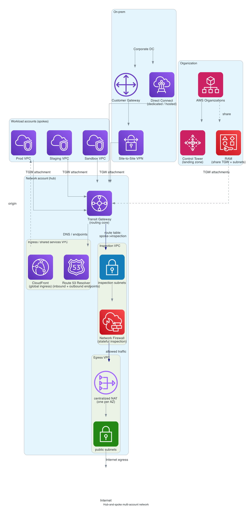

# Hub-and-spoke multi-account network

> **One-line summary.** AWS Organizations + Control Tower for the landing zone, Transit Gateway as the routing hub, dedicated network account hosting centralized egress / ingress / inspection / DNS VPCs, workload VPCs as spokes. The standard enterprise topology on AWS.

## TL;DR
- **Transit Gateway (TGW)** is the routing core. Spoke VPCs attach to it; TGW route tables segment which spokes can talk to which.
- **One network account** owns the TGW, the inspection VPC, the egress VPC, and the shared services VPC. **Workload accounts** own only their spoke VPCs.
- **Centralized egress** through a single VPC with NAT Gateways (one per AZ) — cuts NAT cost and gives one chokepoint for egress filtering.
- **Centralized inspection** with **AWS Network Firewall** (or Gateway Load Balancer + third-party firewall appliances) between spokes and the Internet / between trust zones.
- **AWS RAM** shares the TGW (and optionally subnets) across accounts.
- **Direct Connect / Site-to-Site VPN** terminates at TGW for hybrid connectivity.
- Cleanly partitions blast radius, cost, and governance across many AWS accounts.

## When to use it
- Any AWS organization with **more than ~10 accounts** or **more than ~5 VPCs** — point-to-point peering does not scale.
- Compliance / governance requirements that mandate one chokepoint for east-west and north-south traffic.
- Hybrid environments connecting AWS to a corporate data center.
- Multi-team orgs where workload accounts should not own NAT, IGW, firewall, or DNS infrastructure.

## When NOT to use it
- Single-account startups (≤ 3 VPCs) — **VPC peering** is sufficient and cheaper. Graduate to TGW when sprawl appears.
- Workloads whose data plane can't tolerate the small extra latency of TGW hops + inspection (sub-100 µs HFT, etc.).
- Pure SaaS workloads that don't need on-prem connectivity and have no compliance push — many AWS-only orgs run flat with peering for a long time.

## Functional Requirements
- Many workload VPCs in many accounts, all reachable from corporate / each other / Internet as policy allows.
- Centralized Internet egress with one chokepoint for filtering and one set of NAT Gateways.
- Centralized DNS resolution between AWS and on-prem (`.corp` resolves both ways).
- Hybrid: corporate data center reaches AWS over Direct Connect with VPN backup.
- Account-creation produces a new spoke wired into the topology without manual ticketing.

## Non-Functional Requirements
- **Throughput**: TGW supports 50 Gbps per attachment baseline (100 Gbps with multiple attachments); Direct Connect Gateway scales to multiple 100 Gbps trunks.
- **Latency**: TGW adds < 1 ms between attached VPCs.
- **Availability**: TGW is regional, AZ-redundant. Direct Connect needs > 1 connection (or VPN failover) for high availability.
- **Segmentation**: spokes only talk to what their TGW route table says they can.

## High-Level Architecture

**AWS Organizations** with **Control Tower** provides the landing zone (accounts, guardrails, baseline). The **network account** owns the **Transit Gateway**, an **inspection VPC** running **AWS Network Firewall**, an **egress VPC** with **NAT Gateways**, and a **shared services VPC** with **Route 53 Resolver endpoints** (inbound + outbound). Workload **spoke VPCs** in separate accounts attach to TGW via **RAM-shared attachments**. **Direct Connect** and **Site-to-Site VPN** terminate at the TGW for on-prem connectivity. TGW route tables enforce that spoke-to-Internet traffic flows through the inspection VPC and then the egress VPC.

## Detailed components

### Accounts (AWS Organizations + Control Tower)
- **Management account**: billing + Organizations only. No workloads.
- **Log archive account**: centralized CloudTrail / Config logs (immutable bucket, restricted access).
- **Audit / security account**: GuardDuty admin, Security Hub admin, IAM Access Analyzer admin, read-only across the org.
- **Network account**: TGW, inspection VPC, egress VPC, shared services VPC.
- **Shared services account**: AD, Identity Center, Artifact Registry, internal package mirror.
- **Workload accounts**: per app / per team / per environment (`prod-payments`, `prod-billing`, `staging-payments`, ...).

### Transit Gateway (TGW)
- **One TGW per Region** in the network account.
- **Multiple route tables** to segment traffic: `prod`, `nonprod`, `inspection`, `shared`.
- **Spoke attachments** routed only to allowed peers (e.g., `staging-payments` cannot reach `prod-payments`).
- **Inter-Region peering** for multi-Region topologies (TGW peering across Regions).
- **TGW Flow Logs** to S3 for inspection.

### Inspection VPC
- Spoke-to-Internet and spoke-to-spoke (when crossing trust zones) traffic is **hairpinned** through this VPC.
- **AWS Network Firewall** (managed Suricata-compatible engine) for stateful packet inspection, domain allow-listing, IPS rules.
- Alternative: **Gateway Load Balancer (GWLB)** fronting third-party firewall appliances (Palo Alto, Fortinet, Check Point) for orgs standardized on a vendor.
- Inspection VPC has TGW attachments with **appliance mode** so flows stay symmetric across AZs.

### Egress VPC
- **NAT Gateways** — one per AZ for HA.
- Centralizing NAT here (rather than per spoke) saves on NAT charges and gives a single egress IP set for vendor allow-listing.
- **VPC endpoints** (Gateway endpoints for S3 / DynamoDB; Interface endpoints for everything else) are shared from this VPC via Route 53 Resolver rules, so spoke traffic to AWS APIs doesn't pay NAT.
- Trade-off: centralized egress sends private traffic across TGW + NAT — adds a hop, adds inter-AZ data transfer cost if egress VPC AZ ≠ spoke AZ. **Use TGW appliance mode** to pin AZ affinity.

### Shared services VPC
- **Route 53 Resolver inbound endpoint** so on-prem DNS can query private hosted zones.
- **Route 53 Resolver outbound endpoint** with forwarding rules so AWS DNS resolves `.corp` against on-prem.
- **Private hosted zones** associated with multiple spoke VPCs.
- **Directory Service** (AWS Managed AD) if the org needs joined EC2.
- **Internal package mirrors** (Artifactory / Nexus / S3-backed mirrors).

### Ingress
- **CloudFront** in front of public APIs / sites — terminate TLS at the edge.
- **AWS WAF** attached to CloudFront and ALBs.
- **Global Accelerator** for non-HTTP workloads needing anycast IPs.
- **Spoke-local ALBs / NLBs** behind CloudFront for app traffic.

### Hybrid connectivity
- **Direct Connect** dedicated (1 / 10 / 100 Gbps) or hosted connection (1-10 Gbps from a partner) with a **Direct Connect Gateway** attached to TGW.
- **Site-to-Site VPN** as a backup path (BGP failover).
- **Two Direct Connect connections in different DX locations** for the recommended HA topology.
- **MACsec** on supported DX ports for layer-2 encryption.

### Sharing (AWS RAM)
- Network account shares the TGW with workload accounts → workload accounts can create attachments.
- Optionally share **VPC subnets** so workload accounts don't manage their own subnets (the "shared VPC" model — useful when many small apps live in one VPC, but loses some autonomy).

### IP planning
- **No overlap, ever.** Plan the org-wide IPv4 supernet up front.
- Typical layout: `10.0.0.0/8` for the org, `/16` per Region, `/20` per VPC, `/24` per subnet.
- **IPAM** (AWS Network Manager / VPC IPAM) to allocate ranges as accounts are vended.
- **IPv6** dual-stack in greenfield deployments — exhaustion of RFC-1918 is real at scale.

### Provisioning
- **Account Factory for Terraform (AFT)** or **Control Tower Account Factory** to vend new accounts with TGW attachment + baseline guardrails wired up.
- Each new account ships with: TGW attachment, default route to inspection VPC, CloudTrail to log archive, GuardDuty enabled, baseline IAM roles.

## Cost Notes
Indicative monthly cost for a 10-account org with ~30 spoke VPCs:
- **Transit Gateway** attachments: $0.05/hour each + $0.02/GB data processed.
  - 30 attachments × 730 h × $0.05 ≈ **$1100/month**.
  - Data: 100 TB/month × $0.02 ≈ **$2000/month**.
- **NAT Gateway** × 3 AZs in egress VPC: ~$100/month per AZ + $0.045/GB processed.
  - $300/month + data costs.
- **Network Firewall**: $0.395/hour per endpoint + $0.065/GB processed.
  - 3 AZs × $0.395 × 730 h ≈ **$850/month** + data.
- **Direct Connect** 10 Gbps dedicated: ~$1800/month + $0.02-0.04/GB egress.
- **Route 53 Resolver endpoints**: $0.125/hour per endpoint IP.

**Total network-account-only cost: ~$5,000-15,000/month** for a moderate enterprise. Dominated by **TGW data processing + Network Firewall + Direct Connect**.

Levers:
- **VPC endpoints** for S3 / DynamoDB / Secrets Manager — avoids NAT and TGW data costs entirely for AWS-API traffic.
- **PrivateLink** for service-to-service rather than full VPC peering when only one service is needed.
- **CloudWAN** (AWS-managed core network) instead of self-managed TGW topology if you have many Regions and want managed routing — different cost shape.
- **Right-size Network Firewall**: not every spoke needs deep inspection; route only Internet egress through it.

## Failure modes
- **TGW Region failure**: extremely rare (TGW is regional, AZ-redundant). DR plan = peer TGWs across Regions and have on-prem routes failing over via BGP.
- **NAT Gateway failure (single AZ)**: spoke traffic from that AZ stalls until route table fails over. Mitigation: one NAT per AZ + appliance-mode TGW attachment to the egress VPC, with cross-AZ failover.
- **Network Firewall capacity exhaustion**: connection table / throughput limits per endpoint. Mitigation: enable across more AZs, watch `BytesProcessed` and connection metrics, raise via support.
- **Direct Connect outage**: VPN failover kicks in (assuming BGP is configured); throughput drops to VPN limits.
- **Asymmetric routing**: flows that enter via one AZ and leave via another get dropped by stateful inspection. **Enable TGW appliance mode** on the inspection VPC attachment to pin flow affinity.
- **Account vending failure**: new account doesn't get attached to TGW. Mitigation: AFT pipelines with smoke tests; alarm on attachments that don't propagate to the expected route tables.

## Migration / adoption
1. **Start in the management account with peered VPCs**; add a payer + log archive + audit.
2. Adopt **Control Tower** to formalize the landing zone.
3. Stand up the **network account** with a TGW; migrate VPCs one at a time from peering to TGW attachments.
4. Add the **egress VPC** and route Internet-bound traffic through it; remove per-spoke NAT.
5. Add the **inspection VPC** with Network Firewall once the egress flow is stable.
6. Add **Direct Connect** when hybrid traffic grows past VPN economics.

## Alternatives & trade-offs
- **VPC peering**: O(n²) connections, no transit, no central inspection — fine at small scale.
- **AWS Cloud WAN**: managed alternative to self-managed TGW topology. Less control, faster setup, single global policy.
- **PrivateLink-only**: when accounts only need to consume a small set of services, expose them via VPC endpoint services rather than full peering.
- **Shared VPC (one VPC, many accounts via RAM)**: less account autonomy, simpler routing. Works well when many small apps live in one trust boundary.
- **Multi-account vs single-account**: single-account is much simpler, but blast radius (one IAM mistake, one quota, one CloudTrail) is the whole org.

## Further reading
- [AWS multi-account strategy whitepaper](https://docs.aws.amazon.com/whitepapers/latest/organizing-your-aws-environment/organizing-your-aws-environment.html).
- [Building a scalable and secure multi-VPC AWS network infrastructure](https://docs.aws.amazon.com/whitepapers/latest/building-scalable-secure-multi-vpc-network-infrastructure/welcome.html).
- [AWS Network Firewall deployment models](https://docs.aws.amazon.com/network-firewall/latest/developerguide/architectures.html).
- [Centralized egress to the Internet](https://aws.amazon.com/blogs/networking-and-content-delivery/creating-a-single-internet-exit-point-from-multiple-vpcs-using-aws-transit-gateway/).
- Related services: [Transit Gateway](../01-services/networking/transit-gateway.md), [VPC](../01-services/networking/vpc.md), [VPC Endpoints](../01-services/networking/vpc-endpoints.md), [Direct Connect](../01-services/networking/direct-connect.md), [VPN](../01-services/networking/vpn.md), [Route 53](../01-services/networking/route53.md), [NAT](../01-services/networking/nat.md).
