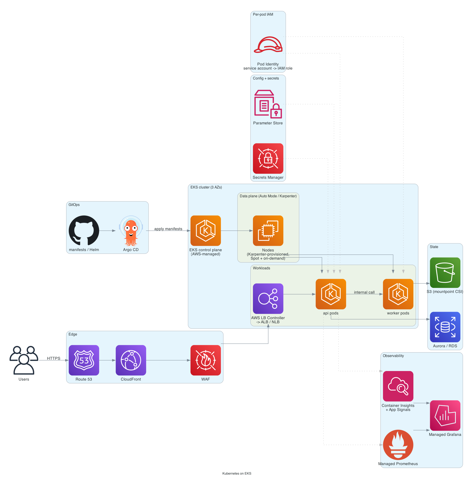

# Kubernetes on EKS

> **One-line summary.** A production EKS cluster: EKS Auto Mode (or self-managed nodes + Karpenter) for the data plane, Pod Identity for IAM, AWS Load Balancer Controller for Ingress, Argo CD / Flux for GitOps deploys. Kubernetes APIs and ecosystem, AWS-managed control plane.

## TL;DR
- Use **EKS** when you want **Kubernetes APIs** (portability, ecosystem, GitOps, Helm) — not as a default for AWS-only workloads where [ECS](containerized-microservices-ecs.md) is simpler.
- **EKS Auto Mode** (GA throughout 2025) is the easiest path in 2026 — AWS manages the node lifecycle, autoscaling (Karpenter-style), core add-ons. ~12% surcharge on top of EC2.
- **Pod Identity** > IRSA for new clusters — simpler setup, no OIDC provider per cluster.
- **AWS Load Balancer Controller** provisions ALBs and NLBs from Kubernetes Ingress / Service resources.
- **GitOps via Argo CD / Flux** is the standard deploy model on EKS — declarative manifests in git, controller reconciles cluster state.
- The hardest parts: **per-pod IAM**, **cross-AZ data transfer cost** (topology-aware routing), **CoreDNS scaling** on large clusters, and **Kubernetes version upgrades** (every 14 months minimum).

## When to use it
- Multi-cloud / on-prem portability needed.
- Existing Kubernetes investment (manifests, charts, GitOps).
- Ecosystem dependencies (Argo CD/Workflows, Tekton, Knative, Crossplane, Istio, KEDA, custom operators).
- ML platforms (Kubeflow, Ray, Argo) that target Kubernetes first.
- Multi-team platform engineering with rich RBAC and namespace isolation.

## When NOT to use it
- AWS-only workloads with no portability requirements — [ECS](containerized-microservices-ecs.md) is dramatically simpler.
- Single-service workloads — Lambda / App Runner-style is overkill for K8s.
- Workloads with sporadic traffic that benefit from scale-to-zero — Lambda fits better.
- Tiny teams without Kubernetes expertise — operational tax is real.

## Functional Requirements
- Deploy and manage containerized workloads.
- Service discovery, scaling, rolling updates.
- Ingress (HTTP / gRPC / TCP).
- Persistent volumes for stateful apps.
- Per-pod IAM access to AWS services.
- Multi-team RBAC + namespace isolation.

## Non-Functional Requirements
- **Availability**: 99.95%+ per service; control plane SLA is 99.95%.
- **Throughput**: per-service scales by replica count + node pool.
- **Recovery**: pod / node failures recovered within ~minute.
- **Cost**: per-cluster fixed (~$72/month for control plane) + data plane.

## High-Level Architecture

**Control plane** managed by AWS (across 3 AZs). **Data plane** = **EKS Auto Mode** (or **managed node groups** with **Karpenter** for self-managed). **Pods** in workload namespaces, with **Pod Identity** for AWS-resource access. **Ingress** via **AWS Load Balancer Controller** → ALB (HTTP) or NLB (TCP). **Storage**: EBS CSI driver for block, EFS CSI driver for shared file, Mountpoint for S3 CSI driver for object. **GitOps**: Argo CD watches a git repo and reconciles. **Observability**: Container Insights, Managed Prometheus, Managed Grafana, X-Ray.

## Detailed components

### Control plane
- EKS-managed, multi-AZ, version-pinned by you.
- Standard support: ~14 months per minor version.
- Extended support: significantly more expensive ($0.60/hour vs $0.10/hour); use it as a bridge during upgrades, not as a long-term plan.
- ~$72/month per cluster baseline.

### Data plane (compute)
**Option A: EKS Auto Mode (recommended)**
- AWS manages node provisioning, scaling, patching, OS lifecycle.
- Built-in Karpenter for autoscaling — provisions right-sized nodes per pending pods.
- Built-in core add-ons (VPC CNI, CoreDNS, kube-proxy, EBS / EFS CSI).
- ~12% surcharge on top of underlying EC2.
- Right default for new clusters.

**Option B: Managed node groups**
- ASGs managed by EKS; you choose instance types + sizes.
- Self-managed Karpenter for autoscaling.
- Slightly cheaper, more knobs.

**Option C: Fargate profiles**
- Serverless pods, no nodes.
- Constraints: no DaemonSets, no GPU, slower scaling, no node-level customization.
- Right for some workloads (background jobs, low-traffic services) — not general-purpose.

### Networking
- **VPC CNI**: each pod gets a routable VPC IP (no overlay).
- **Pod density** bounded by per-instance ENI / IP-per-ENI count. **Prefix delegation** (default on newer setups) packs 4× more pods per node.
- **Security groups for pods** (`pod-eni-security-groups`) for fine-grained pod-level network policy.
- **Network policies** via Cilium / Calico for east-west security.

### IAM and secrets
- **Pod Identity** (newer, recommended) — bind a Kubernetes service account to an IAM role without OIDC provider setup. Simpler than IRSA.
- **IRSA** (legacy) — still works for existing clusters; OIDC-based federation from K8s SA to IAM role.
- **Secrets via External Secrets Operator** or **Secrets Store CSI Driver** — fetch from Secrets Manager / Parameter Store at pod startup.

### Ingress
- **AWS Load Balancer Controller**:
  - `Ingress` resource → provisions an **ALB** with target groups per service.
  - `Service: LoadBalancer` → provisions an **NLB**.
- **IngressGroup** annotation shares one ALB across multiple Ingress objects (cost win).
- **CloudFront** in front of public ALBs for global edge + Shield + WAF.

### Storage
- **EBS CSI driver** for block PersistentVolumes (StatefulSets).
- **EFS CSI driver** for shared file PVs.
- **Mountpoint for S3 CSI driver** for S3-as-filesystem (read-heavy, append-only).
- **FSx CSI drivers** for FSx flavors (Lustre for HPC).

### GitOps deploys
- **Argo CD** or **Flux** watches a git repo (Helm charts / Kustomize / raw manifests).
- Pull-based: cluster reconciles itself to match git state.
- Per-environment branches / overlays.
- **Argo Rollouts** for canary / blue/green with metric-driven analysis.

### Cluster autoscaling
- **Karpenter** (built into Auto Mode, or installed separately):
  - Sees pending pods → provisions right-sized nodes.
  - Drains underutilized nodes.
  - Spot integration with diversification across instance types.

### Observability
- **CloudWatch Container Insights** for cluster / pod / container metrics.
- **Amazon Managed Service for Prometheus** for richer metrics (PromQL).
- **Amazon Managed Grafana** for dashboards on top of Prometheus + CloudWatch + X-Ray.
- **CloudWatch Application Signals** for auto-USE/RED + SLOs (Kubernetes-aware).
- **X-Ray** via ADOT collector DaemonSet for distributed tracing.
- **Fluent Bit** DaemonSet for log shipping to CloudWatch Logs / OpenSearch.

### Upgrade strategy
- Track new K8s minor versions; AWS supports current + 3 prior under standard support.
- Upgrade flow: control plane → core add-ons → data plane.
- Test in dev / staging before prod.
- **Blue/green at the cluster level** for major upgrades: stand up new cluster, shift traffic, decommission old.

## Cost Notes
For a modest production cluster (3 AZ, ~10 nodes, mixed workloads):
- **Control plane**: $72/month.
- **EKS Auto Mode surcharge** (~12% on EC2): ~$50-100/month depending on data plane.
- **Data plane** (EC2 / Fargate): the main variable cost.
- **NAT Gateway** × 3 AZs.
- **ALB(s)** per shared ingress.
- **CloudWatch Logs / Container Insights**: dependent on log volume.

For each additional cluster: another $72/month + data plane.

Levers:
- **Karpenter + Spot** for fault-tolerant workloads (~70% cheaper for spot-eligible).
- **Graviton (ARM) instances** (~20% cheaper).
- **Shared ALBs** via IngressGroup.
- **Cluster consolidation** — 3 clusters cost more than 1; combine where it makes sense.
- **VPC Endpoints** to skip NAT for AWS-service traffic.

## Failure modes
- **Pod crash**: ReplicaSet replaces.
- **Node failure**: pods rescheduled by scheduler; Karpenter / cluster autoscaler may provision a new node.
- **AZ failure**: pods in other AZs absorb (assuming multi-AZ deployment).
- **Control plane issue**: rare (AWS-managed); workloads keep running; new deploys may pause.
- **Cluster upgrade gone bad**: blue/green cluster strategy provides clean rollback.

## Alternatives & trade-offs
- **EKS vs ECS**: ECS for AWS-only simplicity; EKS for portability + ecosystem.
- **EKS Auto Mode vs self-managed nodes**: Auto Mode is dramatically simpler; pay the 12% premium unless you have specific reasons not to.
- **Pod Identity vs IRSA**: Pod Identity for new clusters. Migrate IRSA when convenient.
- **Argo CD vs Flux**: Argo has a richer UI; Flux is leaner and more "configure once, forget." Either works.
- **Per-team cluster vs shared cluster + namespaces**: shared is cheaper, per-team gives blast-radius isolation. Most teams converge on shared at smaller scale, per-team at platform-engineering scale.

## Further reading
- [EKS Best Practices Guides](https://aws.github.io/aws-eks-best-practices/).
- [EKS Auto Mode docs](https://docs.aws.amazon.com/eks/latest/userguide/automode.html).
- [Karpenter](https://karpenter.sh/).
- [AWS Load Balancer Controller](https://kubernetes-sigs.github.io/aws-load-balancer-controller/).
- [Pod Identity vs IRSA](https://docs.aws.amazon.com/eks/latest/userguide/pod-identities.html).
- Related: [EKS](../01-services/compute/eks.md), [containerized-microservices-ecs](containerized-microservices-ecs.md), [ci-cd-pipeline](ci-cd-pipeline.md).
