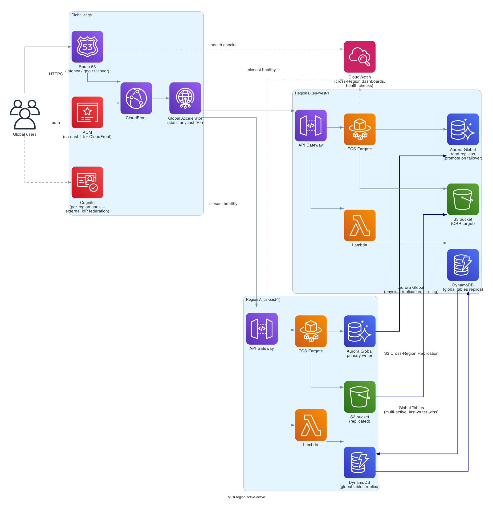

# Multi-Region active-active

> **One-line summary.** Route 53 / Global Accelerator routes users to the closest healthy Region; DynamoDB Global Tables and S3 Cross-Region Replication carry state; Aurora Global Database provides fast cross-Region failover for relational workloads. Survives a Region outage with seconds-to-minutes of impact and offers global latency wins as a bonus.

## TL;DR

- **Active-active** = both Regions handle live traffic. **Active-passive** = one stands by warm (see [multi-region-active-passive pattern](../02-patterns/multi-region-active-passive.md)).
- **Route 53** for DNS-level routing (latency, geo, failover policies). **Global Accelerator** for static anycast IPs and faster failover (TCP/UDP, ~30 s).
- **DynamoDB Global Tables** = multi-active replication, last-writer-wins. **Aurora Global Database** = physical replication with a single writer (planned switchover ≤ 1 min; unplanned failover ≤ ~1 min RTO with Aurora Global). **S3 Cross-Region Replication** for object data.
- **Conflict resolution** is the hardest part. Picking DynamoDB GT is opting into LWW; picking Aurora Global is opting into one-writer-at-a-time. There is no silver bullet.
- Cost roughly **2×** the single-Region footprint plus inter-Region data transfer.

## When to use it

- Compliance / regulatory data-locality requirements (per-Region data residency).
- Global low-latency reads for users across continents.
- RTO < 5 min and RPO < 30 s — too strict for active-passive failover drills.
- Workloads that justify the complexity: payments, identity, ride-share, real-time gaming, ad bidding.

## When NOT to use it

- Pre-product-market-fit single-Region apps — start active-passive (or single-Region) and graduate later.
- Workloads dominated by a single relational DB with strong consistency where there's no way to partition writes — multi-write conflicts will eat the team.
- Anywhere the ops team isn't already comfortable running one Region in production.

## Functional Requirements

- Serve reads from the closest Region.
- Accept writes in any active Region.
- Replicate state across Regions with bounded staleness.
- Survive an AZ failure and a full-Region failure with no manual steps for users.
- Surface per-Region health and a kill switch for "drain Region X."

## Non-Functional Requirements

- **Availability target**: 99.99%+ overall (3-AZ Multi-AZ in a single Region is ~99.95%).
- **RTO** (Region failover): 30 s – 5 min depending on routing layer (Global Accelerator faster, DNS slower).
- **RPO** (data loss on Region failure): seconds for DynamoDB Global Tables, ~1 s for Aurora Global, near-zero for synchronous designs (rare; usually too costly).
- **Inter-Region replication lag**: ~1 s p50, low single-digit seconds p99.
- **Latency**: users routed to closest Region; reads sub-100 ms within Region.

## High-Level Architecture

Two (or more) active Regions, mirrored stacks: **CloudFront** in front, **Route 53** + **Global Accelerator** routing traffic to the closest healthy Region, **API Gateway** + **Lambda / ECS** in each, **DynamoDB Global Tables** replicating multi-active, **Aurora Global Database** with a primary writer in Region A and read replicas in Region B (promoted on failover), **S3 buckets** replicated via **Cross-Region Replication**. **Cognito** federates auth (since native Cognito multi-Region replication is limited).

## Detailed components

### Traffic routing

**Route 53** with **latency-based routing** + **health-check failover**:

- Each Region has a regional endpoint (e.g., `api.us-east-1.example.com`).
- Route 53 picks the lowest-latency healthy Region.
- Health checks probe per-Region; unhealthy Regions are evicted from the answer set.
- TTL kept low (10–30 s) — but clients/recursive resolvers may hold longer; DNS failover RTO is "minutes, not seconds."

**Global Accelerator** when DNS-level failover isn't fast enough:

- **Two static anycast IPs** owned by AWS, advertised from many edge POPs.
- Client traffic enters at the nearest POP and rides the AWS backbone to the closest healthy endpoint.
- **Health checks** drain a Region in ~30 s.
- Works for **non-HTTP** workloads (TCP / UDP) and reduces tail latency.

**CloudFront** is in front of the API for cacheable content and TLS termination. CloudFront origin failover provides an extra layer for HTTP origins.

### Per-Region application stack

- **API Gateway HTTP API** → **Lambda** for serverless, or **ALB** → **ECS Fargate** for containerized. Identical stack in each Region, deployed by the same pipeline.
- **Stateless** application tier — no Region-affine session state. Session state in DynamoDB Global Tables or in ElastiCache (per-Region with idempotent re-fetch on Region switch).
- **Cognito**: best practice today is federating to an external IdP (Auth0, Okta, your own SAML) so users have one global identity. Cognito user pools are per-Region; cross-Region replication of users is not first-class.
- **API quotas** allocated per Region; rate-limit per user at the edge (CloudFront Functions / WAF rate-based rule) to avoid sharded quota exhaustion.

### State — DynamoDB Global Tables

- **Multi-active**: writes accepted in any Region, replicated to all others.
- **Conflict resolution**: **last writer wins** (timestamp-based). Pair with: per-item version attribute (optimistic concurrency), per-key affinity routing (writes for `userId=42` always go to one home Region), or CRDT-style aggregations in the data model.
- **Replication latency**: typically < 1 s p50.
- **Streams** still work; downstream Lambda consumers run per-Region against the local replica.
- **Costs**: storage 1×, but writes are charged per Region (a write replicated to 3 Regions = 3× write cost).

### State — Aurora Global Database (relational)

- **One primary Region** writer; up to 5 secondary Regions with read replicas.
- **Replication via storage layer**, not logical log shipping; typical lag ~1 s.
- **Planned switchover** (managed, no data loss) in seconds–under-a-minute.
- **Unplanned failover** by promoting a secondary; RPO seconds, RTO < 1 min.
- True multi-writer relational across Regions is **not** offered — designs must route writes to the primary or partition by tenant Region. (Aurora multi-master within one Region exists but is a different thing.)

### State — S3

- **Cross-Region Replication (CRR)** with **Replication Time Control (RTC)** for a 15-min SLA on replication completion.
- **Bi-directional replication** for active-active object stores; conflict resolution is last-writer-wins by object key.
- For strong cross-Region read-your-write semantics, use **S3 Multi-Region Access Points** with active-active replication.

### Caching

- **CloudFront** caches at the edge.
- **ElastiCache** is per-Region; mark cache misses as cheap (always a fallthrough to the durable store), so a Region cutover doesn't depend on cache state.
- **DAX** for DynamoDB is per-Region.

### Observability

- **CloudWatch cross-Region dashboards**.
- **Synthetic canaries** in each Region probing the local stack.
- **Route 53 health checks** per Region; alarms on per-Region health.
- **DynamoDB replication latency metrics**: `ReplicationLatency`, `PendingReplicationCount`.
- **Aurora Global Database** lag metric: `AuroraGlobalDBReplicationLag`.

### Deploy pipeline

- One pipeline that deploys to both Regions; **canary first** to a single Region.
- **CodeDeploy** blue/green per Region with **alarm-based rollback**.
- **Schema migrations** applied to Aurora primary; coordinate with feature flags so the new code can read both old and new shapes during the lag window.
- **Database migration safety**: prefer backwards-compatible schema changes (add nullable column → backfill → enforce NOT NULL in a later release) since the secondary Region runs the old code for the duration of the deploy.

### Region drain runbook (rehearsed quarterly)

1. Set Region B's Route 53 health check to "force unhealthy" and/or set Global Accelerator weight to 0.
2. Watch traffic drain (cap RTT vs Region A capacity ahead of time).
3. Run smoke tests on Region B without traffic.
4. Reverse to drain Region A. Verifies the runbook works in both directions.

## Cost Notes

**Active-active is roughly 2× the single-Region footprint** plus:

- **DynamoDB writes**: replicated to N Regions, charged N×.
- **Aurora Global**: storage 1× per Region + cross-Region replication ($0.20/GB egressed).
- **S3 CRR**: storage 2× + replication PUT cost + inter-Region data transfer.
- **Inter-Region data transfer**: $0.02/GB typical AWS-private rate.

For a 1 TB DynamoDB workload with 1B writes/month and 100 GB/day of replicated S3 data, expect **multi-Region adds 1.0–1.5×** on top of the base bill once you factor in compute mirroring.

Levers:

- **Read-from-local, write-to-home-Region** to keep cross-Region write multiplication low.
- **DynamoDB reserved capacity** in each Region.
- **Aurora Global** is cheaper than dual independent Aurora clusters because of storage-layer replication.
- **VPC Endpoints + S3 Multi-Region Access Points** to avoid hairpinning data transfer.

## Failure modes

- **One AZ down**: ALB / Aurora Multi-AZ / Lambda handle this. No Region failover needed.
- **One Region degraded (API errors)**: Route 53 health check fails → traffic drains to the other Region in 30 s – 2 min.
- **One Region down (complete)**: same as above for routing; for **Aurora primary loss**, promote a secondary (manual or automated runbook).
- **Replication lag spike**: clients may read stale data — design for it, expose `lastUpdated` timestamps on reads, gate critical reads on a freshness threshold.
- **DynamoDB GT conflicting writes**: LWW means one update silently wins. Mitigation: per-item versioning, conflict-detection through application logic, or per-key home-Region routing.
- **Split-brain on Aurora**: only one writer at a time; the design enforces this. If you must accept writes during a Region partition, you have to choose between LWW (data loss risk) and rejecting writes (availability hit).

## Migration / adoption

1. Start in one Region with proper Multi-AZ.
2. Add **active-passive** (warm standby): replicate data, no traffic to standby. Drill the failover. Read [DR strategies](../02-patterns/disaster-recovery-strategies.md).
3. Promote standby to active for read-only traffic; observe replication lag and SLOs.
4. Open writes in both Regions with **per-tenant Region affinity** (avoid global write conflicts).
5. Drop the affinity once the data model supports CRDT-style or LWW writes safely.

## Alternatives & trade-offs

- **Active-passive (pilot light / warm standby / hot standby)** — cheaper, simpler, but RTO 10–60 min depending on warm-up cost. See [multi-region-active-passive pattern](../02-patterns/multi-region-active-passive.md).
- **Single-Region multi-AZ** — much cheaper, simpler, sufficient for most workloads. Push for this until product / compliance / SLA forces the upgrade.
- **Pilot-light** — capacity scaled to zero in DR Region, data replicated. Cheapest active-passive variant.
- **Outposts / Local Zones / Wavelength** — for ultra-low-latency in specific geographies. Different problem class than full multi-Region.

## Further reading

- [AWS Multi-Region Application Architecture (well-architected guide)](https://docs.aws.amazon.com/wellarchitected/latest/reliability-pillar/disaster-recovery-dr-objectives.html).
- [DynamoDB Global Tables docs](https://docs.aws.amazon.com/amazondynamodb/latest/developerguide/GlobalTables.html).
- [Aurora Global Database docs](https://docs.aws.amazon.com/AmazonRDS/latest/AuroraUserGuide/aurora-global-database.html).
- [S3 Multi-Region Access Points](https://docs.aws.amazon.com/AmazonS3/latest/userguide/MultiRegionAccessPoints.html).
- Related patterns: [multi-region-active-active](../02-patterns/multi-region-active-active.md), [multi-region-active-passive](../02-patterns/multi-region-active-passive.md), [disaster-recovery-strategies](../02-patterns/disaster-recovery-strategies.md).
- Related services: [Route 53](../01-services/networking/route53.md), [Global Accelerator](../01-services/networking/global-accelerator.md), [CloudFront](../01-services/networking/cloudfront.md), [DynamoDB](../01-services/database/dynamodb.md), [Aurora](../01-services/database/aurora.md).
