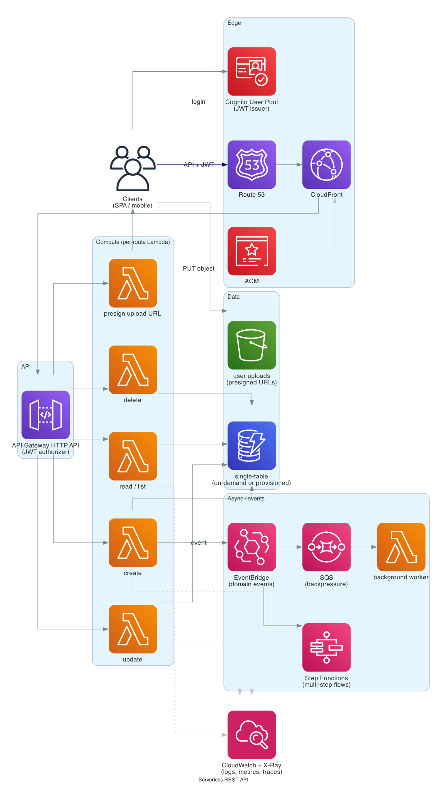

# Serverless REST API

> **One-line summary.** API Gateway HTTP API + Lambda + DynamoDB + Cognito + CloudFront. No servers to manage, scales to any load, single-digit-cent cost at typical startup volume.

## TL;DR

- **API Gateway HTTP API** (not REST API — ~71% cheaper, ~60% lower latency) fronts **Lambda** functions. **DynamoDB** holds state. **Cognito** handles auth via JWT.
- Defined in **AWS SAM** or **CDK** for repeatable deploys.
- Observability via **CloudWatch Logs + Metrics + X-Ray** end-to-end.
- **Lambda Powertools** for idempotency, structured logging, metrics, parameters.
- The most common production AWS architecture for new APIs. Cheap, fast to ship, scales effortlessly.

## When to use it

- Greenfield REST / JSON APIs.
- Mobile / SPA backends.
- Webhook receivers.
- Internal service APIs in a microservices environment.
- Anything fitting Lambda's 15-min ceiling and modest payload limits.

## When NOT to use it

- Long-running compute (>15 min) — use **Fargate** / **Batch**.
- Sub-50 ms p99 with high RPS — Lambda cold starts and per-invocation overhead show up; consider **Fargate** + ALB.
- WebSocket-heavy / persistent connections — see [WhatsApp chat](../03-interview-designs/whatsapp-chat.md) style (API Gateway WebSocket + DynamoDB connection table).
- Stateful workloads — Lambda is stateless.

## Functional Requirements

- Sign up / sign in (email/password, social, SAML).
- CRUD on resources (e.g., `notes`, `tasks`, `posts`).
- Auth-protected endpoints with JWT.
- Async background work (emails, notifications).
- File uploads via presigned S3 URLs.

## Non-Functional Requirements

- **Latency**: p99 < 300 ms warm; cold starts ~500 ms (mitigated below).
- **Throughput**: 1K RPS comfortably; scales to 10K+ with concurrency tuning.
- **Availability**: 99.95%+.
- **Cost**: pennies/day at low volume; predictable at scale.

## High-Level Architecture



Client → **CloudFront** → **API Gateway HTTP API** (JWT auth via **Cognito**) → **Lambda** → **DynamoDB**. Async paths: Lambda emits events to **EventBridge / SQS** → downstream Lambdas (notifications, projections, search index). File uploads go directly to **S3** via **presigned URLs**.

## Detailed components

### API Gateway HTTP API

- HTTP API (not REST API) for ~71% lower cost.
- **JWT authorizer** for Cognito tokens (no Lambda authorizer needed for the common case).
- **Stages**: `$default`, `staging`, `prod`.
- **Custom domain** via Route 53 + ACM.
- **CORS** config per route.
- **Throttling**: per-stage burst + rate; per-route override for sensitive endpoints.
- **CloudWatch access logs** to a Logs group.

### Lambda functions

- **One function per logical handler** (`createNote`, `getNote`, `listNotes`, ...) or **monolithic function** with internal routing (lower cold-start surface but lumpier observability). Per-handler is the modern default.
- Runtime: latest LTS (Python 3.13, Node.js 22, Java 21, .NET 8, Go via `provided.al2023`).
- **SnapStart** enabled for Java / Python 3.12+ / .NET 8 for low cold-start latency.
- **Provisioned concurrency** for latency-critical handlers (a few warm at all times).
- **Memory**: tune with [AWS Lambda Power Tuning](https://github.com/alexcasalboni/aws-lambda-power-tuning) — usually a memory bump pays back in faster execution.

### DynamoDB

- **Single-table design** for most apps (one table, sort keys differentiate entities).
- **On-demand** capacity initially; switch to **provisioned + auto-scaling** at sustained load.
- **TTL** on ephemeral data (sessions, idempotency keys).
- **DynamoDB Streams** trigger downstream Lambdas (CDC, search index sync).

### Cognito

- **User Pool** with email/password + social federation (Google, Apple).
- **Hosted UI** for fast MVP; custom UI later.
- **Triggers**: pre-signup validation, post-confirmation actions.
- For B2B: SAML / OIDC federation from customer IdPs.

### Async + events

- **EventBridge** for domain events (`UserSignedUp`, `OrderPlaced`).
- **SQS** for backpressure-friendly async work.
- **Step Functions** for multi-step workflows.

### File uploads

- Client calls API → handler generates presigned S3 URL → client PUTs directly to S3. Lambda never streams the file.
- S3 PUT event triggers downstream processing (resize, virus scan, indexing).

### Observability

- **CloudWatch Logs** for everything (structured JSON via Powertools).
- **CloudWatch Metrics** + **EMF** for custom metrics from log lines.
- **CloudWatch Application Signals** for auto-instrumented USE/RED + SLOs.
- **X-Ray** for distributed tracing.

### Infrastructure as code

**AWS SAM** for serverless-first projects, or **CDK** for richer programmatic IaC. Both compile to CloudFormation.

Example SAM snippet:

```yaml
Resources:
  GetNoteFunction:
    Type: AWS::Serverless::Function
    Properties:
      Handler: notes.get_handler
      Runtime: python3.13
      MemorySize: 512
      Architectures: [arm64]
      Events:
        Api:
          Type: HttpApi
          Properties:
            Path: /notes/{id}
            Method: GET
            Auth:
              Authorizer: CognitoAuth
      Environment:
        Variables:
          TABLE_NAME: !Ref NotesTable
      Policies:
        - DynamoDBReadPolicy: { TableName: !Ref NotesTable }
```

## Cost Notes

Indicative cost for ~1M API calls/month, ~1 GB DynamoDB:

- **API Gateway HTTP API**: ~$1/month.
- **Lambda**: ~$0.20-2/month (depends on duration).
- **DynamoDB on-demand**: ~$1.50/month.
- **CloudFront**: ~$1-5/month depending on egress.
- **Cognito**: free up to 10K MAU on Lite tier (50K on legacy pre-Nov 2024 pools).

**Typical cost: $5-15/month for a startup-scale API.**

Levers:

- **ARM64 Lambda** (Graviton) — 20% cheaper.
- **Right-size memory** with Power Tuning.
- **DynamoDB reserved capacity** when traffic is steady (>50% reduction vs on-demand).
- **HTTP API vs REST API** — already the major win.

## Failure modes

- **Lambda cold start**: hits p99 on uncached routes; mitigate with SnapStart / provisioned concurrency.
- **DynamoDB hot key**: design partition keys for distribution; DAX for hot reads.
- **Throttling**: scale Lambda concurrency + DynamoDB capacity preemptively.
- **Cognito Region outage**: rare but high-impact; multi-Region Cognito is hard (cross-account replication of user pools isn't first-class). Mitigation: federate to an external IdP that's multi-Region.

## Deploy pipeline

1. `sam build` (or `cdk synth`).
2. `sam deploy --config-env staging` → CloudFormation change set review → deploy.
3. Smoke tests against staging URL.
4. Promote to prod (`sam deploy --config-env prod` or CodePipeline approval gate).
5. Tag git commit with the deploy version.

## Alternatives & trade-offs

- **Containerized API on ECS/Fargate** — for steady-high RPS or workloads that need the 15-min+ duration. Higher floor cost.
- **App Runner** — closed to new customers as of 2026-04-30; **ECS Express Mode** is the modern alternative for single-command container deploys.
- **Amplify** — Gen 2 builds on this stack with more opinionated scaffolding.

## Further reading

- [SAM developer guide](https://docs.aws.amazon.com/serverless-application-model/).
- [Lambda Powertools (Python / Node / Java / .NET)](https://docs.powertools.aws.dev/).
- [Choosing HTTP API vs REST API](https://docs.aws.amazon.com/apigateway/latest/developerguide/http-api-vs-rest.html).
- Related: [Lambda](../01-services/compute/lambda.md), [API Gateway](../01-services/networking/api-gateway.md), [DynamoDB](../01-services/database/dynamodb.md), [Cognito](../01-services/security-identity/cognito.md).
